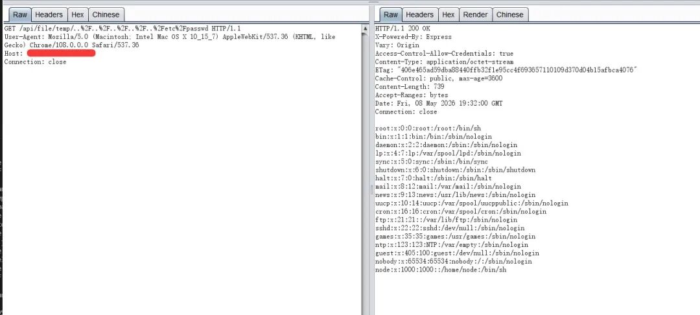
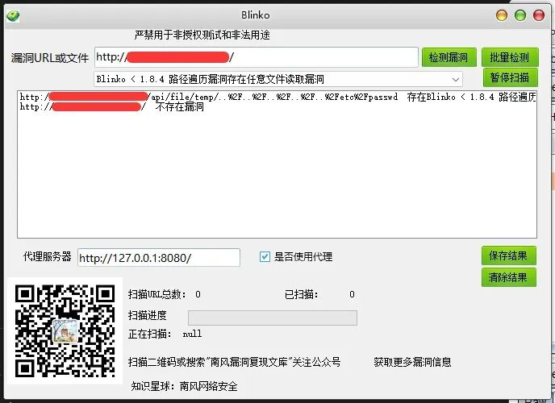
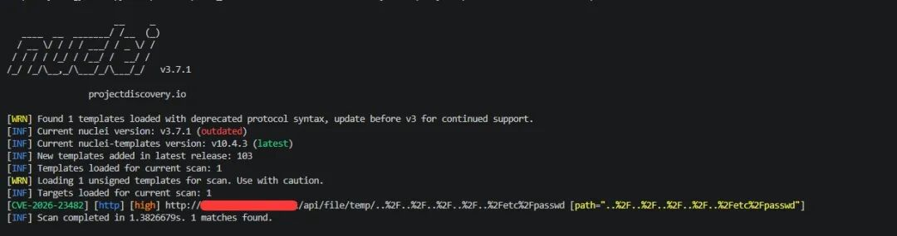

# Blinko temp路径遍历读取

## 条目说明

- 对象与具体问题：Blinko；temp路径遍历读取
- 版本、配置及部署条件：<1.8.4；备份启用才有备份窃取
- 认证与权限前提：未认证声明
- 核验边界：已完成原始 Markdown 的文本审阅；未执行 PoC、未访问目标、未视检截图。来源所述影响与复现结果不等于本库独立验证。

## 证据边界与更正

以下记录原始资料的证据边界。可以由原文确定的产品、编号及格式问题已在本条修订；没有原始证据的版本、响应和补丁信息仍待核实。

- 文件名丢小于号而正文保留，标题规范影响版本
- 附POC实无文本请求，关键步骤全图片未视检
- 保留备份条件，1.8.4修复/CVE需官方证据；去付费圈推广

## 操作风险

现有材料未完整列明副作用；示例不保证只读或无状态变化。保留原示例供静态分析；仅可在明确授权的隔离测试环境验证，事先准备备份与回滚。

## 技术资料与来源记录

2026-5-8更新
                    2026-5-8更新  南风漏洞复现文库   2026-05-08 19:43  
  
   
  
##   
  
免责声明：请勿利用文章内的相关技术从事非法测试，由于传播、利用此文所提供的信息或者工具而造成的任何直接或者间接的后果及损失，均由使用者本人负责，所产生的一切不良后果与文章作者无关。该文章仅供学习用途使用。  
### 1. Blinko简介  
  
微信公众号搜索：南风漏洞复现文库  
该文章 南风漏洞复现文库 公众号首发  
  
本人只有 南风漏洞复现文库 和 南风网络安全  
 这两个公众号，其他公众号有意冒充，请注意甄别，避免上当受骗。  
  
Blinko 是一个开源的 AI 驱动卡片笔记项目  
### 2.漏洞描述  
  
Blinko 是一个开源的 AI 驱动卡片笔记项目，旨在提供私有化的知识管理方案。其文件服务器端点在处理 temp/  
 路径的请求时，既没有进行权限校验，也未对路径遍历序列（如 ../  
）进行有效过滤。未经授权的远程攻击者可以通过构造恶意的路径请求，读取服务器上的任意文件。如果服务器启用了定时备份，攻击者可读取备份文件，从而获取所有用户笔记及用户认证 Token。  
  
CVE编号:CVE-2026-23482  
  
CNNVD编号:  
  
CNVD编号:  
### 3.影响版本  
  
Blinko < 1.8.4  
  
  
Blinko < 1.8.4 路径遍历漏洞存在任意文件读取漏洞  
### 4.fofa查询语句  
  
icon_hash="-1446811182" || icon_hash="-717082057"  
### 5.漏洞复现  
  
  
  
  
### 6.POC&EXP  
  
本期漏洞及往期漏洞的批量扫描POC及POC工具箱已经上传知识星球：南风网络安全  
1: 更新poc批量扫描软件，承诺，一周更新8-14个插件吧，我会优先写使用量比较大程序漏洞。  
2: 免登录，免费fofa查询。  
3: 更新其他实用网络安全工具项目。  
4: 免费指纹识别，持续更新指纹库。  
5: Nuclei脚本。  
  
  
  
  
  
  
  
  
  
  
  
  
  
  
  
  
  
  
### 7.整改意见  
  
将组件 blinko 升级至 1.8.4 及以上版本  
### 8.往期回顾  
  
  
   
  
  
[智互联WMS getsyspdaversionlistbyparams接口存在SQL注入漏洞 附POC](https://mp.weixin.qq.com/s?__biz=MzIxMjEzMDkyMA==&mid=2247490384&idx=1&sn=9cc438869f87a6fee60692ebdccd57a9&scene=21#wechat_redirect)  
  
  

---

> 来源：gelusus/wxvl（微信公众号漏洞文章自动归档，原文见文首链接）
