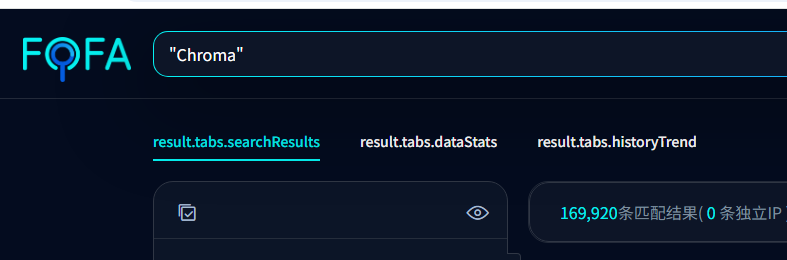
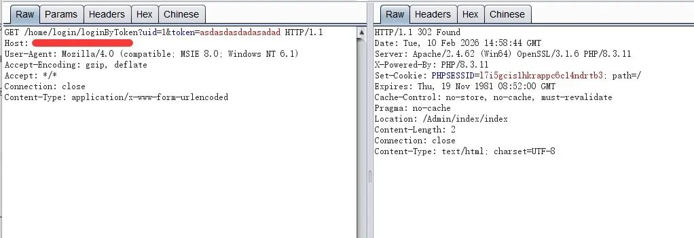
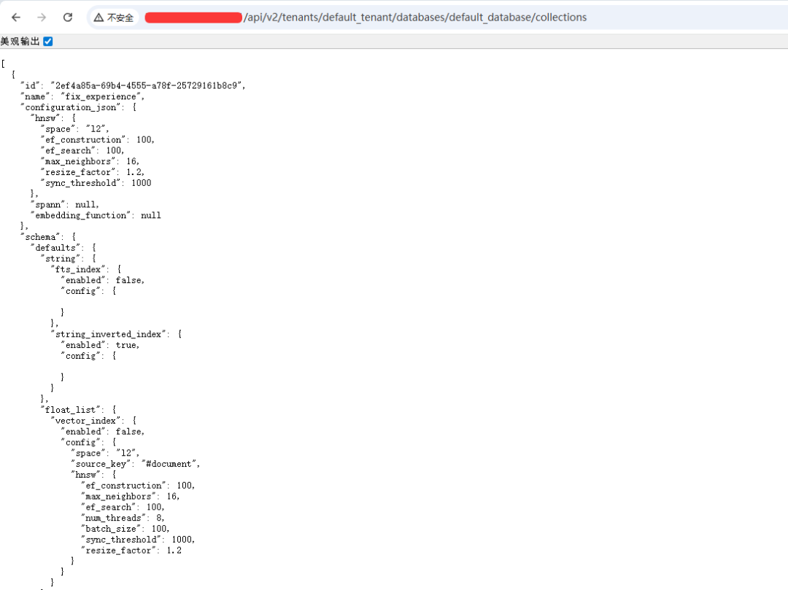
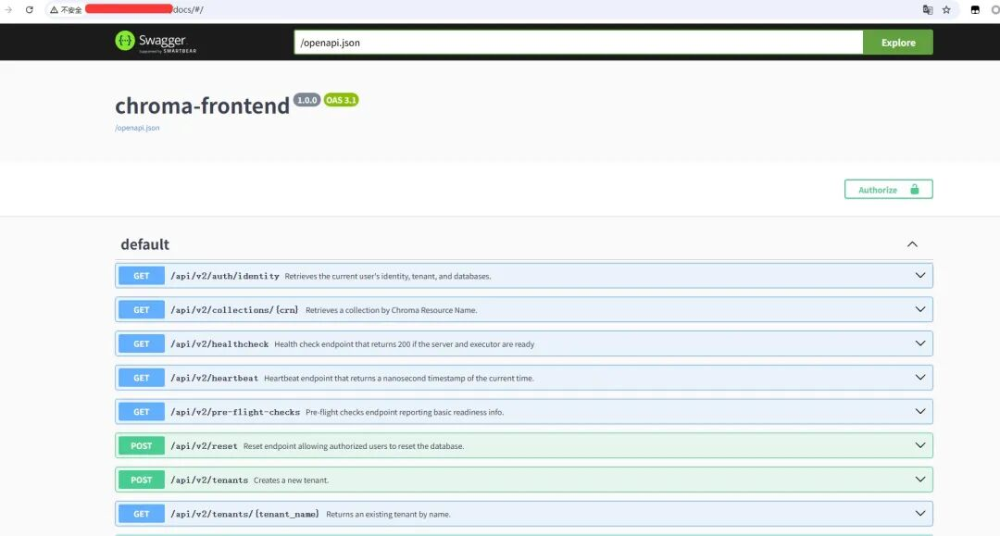
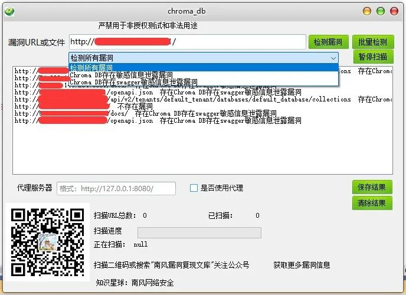

# Chroma DB Swagger/API暴露线索

## 条目说明

- 对象与具体问题：Chroma DB；Swagger/API暴露线索
- 版本、配置及部署条件：版本/鉴权部署未知
- 认证与权限前提：未知
- 核验边界：已完成原始 Markdown 的文本审阅；未执行 PoC、未访问目标、未视检截图。来源所述影响与复现结果不等于本库独立验证。

## 证据边界与更正

以下记录原始资料的证据边界。可以由原文确定的产品、编号及格式问题已在本条修订；没有原始证据的版本、响应和补丁信息仍待核实。

- 公开docs/openapi本身不证明敏感泄露，与collections业务数据未授权必须分开
- 只有四条路径和图片无响应/敏感字段/访问边界，不能笼统当产品漏洞
- 修复打补丁无具体缺陷/版本，Chroma裸搜索不具特异性
- 移数据库/服务配置风险；去付费宣传

## 操作风险

现有材料未完整列明副作用；示例不保证只读或无状态变化。保留原示例供静态分析；仅可在明确授权的隔离测试环境验证，事先准备备份与回滚。

## 技术资料与来源记录

2026-2-16更新
                    2026-2-16更新  南风漏洞复现文库   2026-02-16 11:22  
  
   
  
  
免责声明：请勿利用文章内的相关技术从事非法测试，由于传播、利用此文所提供的信息或者工具而造成的任何直接或者间接的后果及损失，均由使用者本人负责，所产生的一切不良后果与文章作者无关。该文章仅供学习用途使用。  
### 1. Chroma DB简介  
  
微信公众号搜索：南风漏洞复现文库  
  
该文章 南风漏洞复现文库 公众号首发  
  
本人只有 南风漏洞复现文库 和 南风网络安全  
 这两个公众号，其他公众号有意冒充，请注意甄别，避免上当受骗。  
  
Chroma DB  
### 2.漏洞描述  
  
Chroma DB存在swagger敏感信息泄露漏洞  
  
CVE编号:  
  
CNNVD编号:  
  
CNVD编号:  
### 3.影响版本  
  
Chroma DB  
  
  
  
Chroma DB存在swagger敏感信息泄露漏洞  
### 4.fofa查询语句  
  
Chroma  
### 5.漏洞复现  
  
  
漏洞数据包：  
  
api/v2/tenants/default_tenant/databases/default_database/collections  
  
api/v1/collections?tenant=default_tenant&database=default_database  
  
docs/  
  
openapi.json  
  
  
  
  
  
  
  
  
### 6.POC&EXP  
  
  
本期漏洞及往期漏洞的批量扫描POC及POC工具箱已经上传知识星球：南风网络安全  
  
  
1: 更新poc批量扫描软件，承诺，一周更新8-14个插件吧，我会优先写使用量比较大程序漏洞。  
  
  
2: 免登录，免费fofa查询。  
  
  
3: 更新其他实用网络安全工具项目。  
  
  
4: 免费指纹识别，持续更新指纹库。  
  
  
  
  
  
  
  
  
  
  
  
  
  
  
### 7.整改意见  
  
打补丁  
### 8.往期回顾  
  
  
   
  
  
  

---

> 来源：gelusus/wxvl（微信公众号漏洞文章自动归档，原文见文首链接）
