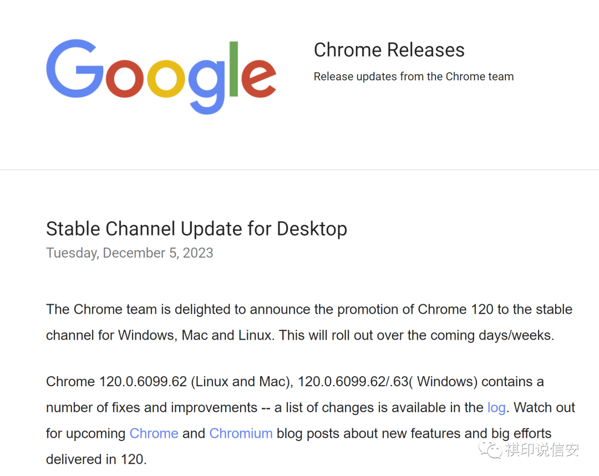

# Google Chrome Chrome120多漏洞更新新闻

## 条目说明

- 对象与具体问题：Google Chrome；Chrome120多漏洞更新新闻
- 版本、配置及部署条件：120.0.6099.62/.63按平台历史修复
- 认证与权限前提：恶意内容交互，缺细节
- 核验边界：已完成原始 Markdown 的文本审阅；未执行 PoC、未访问目标、未视检截图。来源所述影响与复现结果不等于本库独立验证。

## 证据边界与更正

以下记录原始资料的证据边界。可以由原文确定的产品、编号及格式问题已在本条修订；没有原始证据的版本、响应和补丁信息仍待核实。

- 不是单6508条目，6509亦主漏洞，6345是前次更新引用
- 未提在野不等于证实无在野；沙箱逃逸需独立链，奖金不能直接量化严重度
- Google公告名称缺实际链接；尾部大量法律/工控/供应链无关推荐远超正文
- 移浏览器并按批次公告保留，多CVE实体关联

## 操作风险

现有材料未完整列明副作用；示例不保证只读或无状态变化。保留原示例供静态分析；仅可在明确授权的隔离测试环境验证，事先准备备份与回滚。

## 技术资料与来源记录

何威风  祺印说信安   2023-12-11 00:00  
  
**谷歌周二宣布向稳定渠道发布 Chrome 120，并修复了 10 个漏洞。**  
  
根据  
Google 的公告  
，在已解决的问题中，有 5 个是由外部研究人员报告的，他们获得了总计 15,000 美元的错误赏金奖励。  
  
根据所发放的奖励，最严重的缺陷是 CVE-2023-6508，这是 Media Stream 中的一个高严重性的释放后使用问题。  
谷歌表示已为该漏洞支付了 10,000 美元。  
  
接下来是 CVE-2023-6509，这是一个影响 Chrome 侧面板搜索组件的高严重性释放后使用缺陷。  
  
最新的浏览器版本还解决了媒体捕获中的一个中等严重性的释放后使用漏洞，以及自动填充和 Web 浏览器 UI 中的两个低严重性的不当实施缺陷。  
  
  
  
释放内存分配后未清除指针时发生的一种内存损坏错误，释放后使用问题可能导致任意代码执行、数据损坏或拒绝服务。  
  
当与其他漏洞结合使用时，释放后使用缺陷可能会被利用来完全破坏系统。  
  
在 Chrome 中，释放后使用漏洞可被利用来逃离沙箱。  
然而，为此，需要利用底层操作系统或特权进程中的安全缺陷。  
  
谷歌长期以来一直在与内存损坏漏洞作斗争，去年宣布改进了  
对 Chrome 中释放后使用  
漏洞的利用的保护措施。  
  
最新的 Chrome 迭代现已推出，适用于 macOS 和 Linux 的版本为 120.0.6099.62，适用于 Windows 的版本为 120.0.6099.62/.63。  
  
谷歌还宣布已将 Chrome 扩展稳定通道更新至 macOS 版本 120.0.6099.62 和 Windows 版本 120.0.6099.63。  
  
这家互联网巨头没有提及任何已解决的漏洞被用于恶意攻击。  
上周，谷歌推出了 Chrome 安全更新，以解决 CVE-2023-6345，这  
是 2023 年浏览器中记录的   
第七个零日漏洞。  
  
[90个网络和数据安全相关法律法规打包下载](http://mp.weixin.qq.com/s?__biz=MzA5MzU5MzQzMA==&mid=2652099357&idx=1&sn=5c38f6917d6b84e84632bb47344d3714&chksm=8bbcf924bccb7032f6ff66449cc927e65c853c9fc88b03c8569061bcd8048ef8fcefb48eb778&scene=21#wechat_redirect)  
  
  
[2023年10佳免费网络威胁情报来源和工具](http://mp.weixin.qq.com/s?__biz=MzA5MzU5MzQzMA==&mid=2652103402&idx=1&sn=80a1ee98453d96a6f2304272d2a6b33e&chksm=8bbcc8d3bccb41c5fe204b9933fbded47cd14612e3101111b2f806d8a136a61ff27577dfd765&scene=21#wechat_redirect)  
  
  
[数据安全管理从哪里开始](http://mp.weixin.qq.com/s?__biz=MzA5MzU5MzQzMA==&mid=2652103384&idx=1&sn=391073e6109ff105f02be9029e01c697&chksm=8bbcc8e1bccb41f7fe478a3d22757d61f10dcf42548c1c02c0579b8f161277e527ba98ccb542&scene=21#wechat_redirect)  
  
  
[网络安全等级保护：等级保护工作、分级保护工作、密码管理工作三者之间的关系](http://mp.weixin.qq.com/s?__biz=MzA5MzU5MzQzMA==&mid=2652098579&idx=1&sn=56da5aedb263c64196a74c5f148af682&chksm=8bbcfa2abccb733ca8dd898d7c0b06d98244ca76bd7be343482369fa80546554cced706fa74c&scene=21#wechat_redirect)  
  
  
**>>>错与罚<<<**  
  
[公安部重要提醒！“两高一弱”问题](http://mp.weixin.qq.com/s?__biz=MzA5MzU5MzQzMA==&mid=2652103304&idx=2&sn=7e67d715fda9cb08147f0355c69ba6fb&chksm=8bbcc8b1bccb41a767fac68893a7fd3340bbf3ce76b37836097a02bf68867139909c44ab5ee0&scene=21#wechat_redirect)  
  
  
[海淀网警侦破一起“羊毛党”诈骗补贴金案件](http://mp.weixin.qq.com/s?__biz=MzA5MzU5MzQzMA==&mid=2652103450&idx=2&sn=81e7cd9b215f2c710045dc9e955fd846&chksm=8bbcc923bccb4035bf7c7c756b40a038ea9e8cf187e6b05a599586b141e89879ccf7e7209501&scene=21#wechat_redirect)  
  
  
[淫秽链接10余万条，这种传播被切断！](http://mp.weixin.qq.com/s?__biz=MzA5MzU5MzQzMA==&mid=2652103450&idx=3&sn=4ba8ea05790166b161460aca279199fd&chksm=8bbcc923bccb40355dadfc43972365639fd983f3cc3e1b7a09f47e997eb6fe87e94efd1e4235&scene=21#wechat_redirect)  
  
  
[公安部公布打击黑客犯罪10起典型案例](http://mp.weixin.qq.com/s?__biz=MzA5MzU5MzQzMA==&mid=2652103404&idx=2&sn=e1a0bc8ac972c5bd02e498216330f899&chksm=8bbcc8d5bccb41c3ae236aaf782fbadda12e1aaec00c3e428c0e41dcd9138924c4361a487193&scene=21#wechat_redirect)  
  
  
[曝光！街边扫码送礼品的“黑色秘密”！](http://mp.weixin.qq.com/s?__biz=MzA5MzU5MzQzMA==&mid=2652103402&idx=2&sn=2eb4cafb3ff5d1d8e9d600f858d1c163&chksm=8bbcc8d3bccb41c5eb85a2e2afecd46c17b14a1bec7ef07e997f6af94eb146e444aa82a1cc2b&scene=21#wechat_redirect)  
  
  
[“郑强被举报案”，警方通报！](http://mp.weixin.qq.com/s?__biz=MzA5MzU5MzQzMA==&mid=2652103384&idx=2&sn=15c1bc8be62ed7b432e98ae1c502398a&chksm=8bbcc8e1bccb41f7744f182265ea97bc72a08071593002fc941943ab98359c11bce7fde65b45&scene=21#wechat_redirect)  
  
  
[涉案流水超60亿！内蒙古网警破获特大跨境网络赌博案](http://mp.weixin.qq.com/s?__biz=MzA5MzU5MzQzMA==&mid=2652103145&idx=2&sn=b0c205438529f5405a7e2a91866b3f2e&chksm=8bbccbd0bccb42c69456cd8354b6dae11cd73c311f6d5281c5a0c631cdbd151862fd951d5948&scene=21#wechat_redirect)  
  
  
[新生儿信息遭泄露，一案双查！](http://mp.weixin.qq.com/s?__biz=MzA5MzU5MzQzMA==&mid=2652103362&idx=2&sn=5d439710f0ad9d666a7c2a961cbd7c71&chksm=8bbcc8fbbccb41ed52eb3830c3ce076d695886d2c5acc3ae3dedd40829104f959c7bd461cdb9&scene=21#wechat_redirect)  
  
  
[疯狂吸金！普通视频一夜新增300万播放量？](http://mp.weixin.qq.com/s?__biz=MzA5MzU5MzQzMA==&mid=2652103277&idx=2&sn=2a501163fa5e40e0e1c5be34b18ce203&chksm=8bbcc854bccb4142c7200d24f996ce1cfd07ba307eed8f99202692705d6d6138cf1d7aabb50e&scene=21#wechat_redirect)  
  
  
[公安部公布依法惩治网络暴力违法犯罪10起典型案例](http://mp.weixin.qq.com/s?__biz=MzA5MzU5MzQzMA==&mid=2652103269&idx=2&sn=70b56fe5407edadd4ff57c453970630b&chksm=8bbcc85cbccb414abc2c4d347400028354b2ec21bcea4c333f2568587803751ba076a81c6968&scene=21#wechat_redirect)  
  
  
[同城美女相邀约？其实是双簧陷阱！](http://mp.weixin.qq.com/s?__biz=MzA5MzU5MzQzMA==&mid=2652103267&idx=2&sn=3c16696e25afdc4a05ae6c81507608ff&chksm=8bbcc85abccb414cd8910a231b6299f6e0b9edca5b52b05595a4170f7ee19cc63117ed1a53df&scene=21#wechat_redirect)  
  
  
[成都网警破获一起编造传播证券市场网络谣言案](http://mp.weixin.qq.com/s?__biz=MzA5MzU5MzQzMA==&mid=2652103177&idx=2&sn=92883d6952140bc8b72d8b45cda4bdaa&chksm=8bbcc830bccb41260041d8864aa3842095282cb59bb5d87f7b15b2077982daa91df6a2c95188&scene=21#wechat_redirect)  
  
  
[涉黄“小卡片”！扫码后到底有什么“套路”？](http://mp.weixin.qq.com/s?__biz=MzA5MzU5MzQzMA==&mid=2652103137&idx=2&sn=0dc4f2a946b9325a9f02a4003b4304a7&chksm=8bbccbd8bccb42ce7fd1f2ae39e696758195b3685f08679172fe2695ce9b7e0c39fa91be5a13&scene=21#wechat_redirect)  
  
  
[西藏网警查处一起传播淫秽物品牟利案](http://mp.weixin.qq.com/s?__biz=MzA5MzU5MzQzMA==&mid=2652103049&idx=2&sn=fe3a793a2d80e3c11f52ae3ecc83c628&chksm=8bbccbb0bccb42a62a0a234bafdec505531ac8a0542bffb74d4a1e12984a8afac826c5685508&scene=21#wechat_redirect)  
  
  
[生活中要警惕：不要随意蹭免费WIFI！](http://mp.weixin.qq.com/s?__biz=MzA5MzU5MzQzMA==&mid=2652103041&idx=2&sn=a7e1e909083179f54c69a120494533ed&chksm=8bbccbb8bccb42ae1eca69bbd704e3c8a24b213ec901bb9f4ce5053c5f4b682697bfb79bdeaf&scene=21#wechat_redirect)  
  
  
[公安部督办非法机顶盒大案告破：涉案2亿元！](http://mp.weixin.qq.com/s?__biz=MzA5MzU5MzQzMA==&mid=2652102933&idx=2&sn=95940a8f3247612da05588b57ad02efe&chksm=8bbccb2cbccb423a52ea6951510390d975e885b25365a1151470cad6aea6dc001b087c1e9fc1&scene=21#wechat_redirect)  
  
  
[家长必读：这些方法可以有效保护孩子上网安全](http://mp.weixin.qq.com/s?__biz=MzA5MzU5MzQzMA==&mid=2652102932&idx=2&sn=3987f4f4c7f23ff34eb439ef20413671&chksm=8bbccb2dbccb423bd9dbf27fc3f3743353df56adc038da6ddc353afce640dac4a29d15129784&scene=21#wechat_redirect)  
  
  
[“内鬼”盗卖数据，某大药房被罚！](http://mp.weixin.qq.com/s?__biz=MzA5MzU5MzQzMA==&mid=2652102834&idx=1&sn=a3e2daeb44a088e8a20ce4870844b5a3&chksm=8bbcca8bbccb439d62a13b862c909e448b5f9b6234bea20e9e363cdeefab5002ecb9c0e9986f&scene=21#wechat_redirect)  
  
  
[被遗忘的网站，潜藏着网络安全隐患](http://mp.weixin.qq.com/s?__biz=MzA5MzU5MzQzMA==&mid=2652102829&idx=1&sn=8f5a773ec57d4fe4fd71959b17b6a01f&chksm=8bbcca94bccb4382da272c86f566f9f92306ac97e3775604e57d23b43cf661f455f9f0577988&scene=21#wechat_redirect)  
  
  
[紧急提示！“京东白条”诈骗又双叒来了](http://mp.weixin.qq.com/s?__biz=MzA5MzU5MzQzMA==&mid=2652102654&idx=3&sn=7cc77b15b2373ee812845f7b082a100e&chksm=8bbcf5c7bccb7cd123644c0460828b7af359fb288c94e94dfbfc4365923527cc4296b9fcdba4&scene=21#wechat_redirect)  
  
  
[网络安全保护不是儿戏，违法违规必被查处](http://mp.weixin.qq.com/s?__biz=MzA5MzU5MzQzMA==&mid=2652102306&idx=1&sn=3384a298f48048c0e5712f9f4d6cda14&chksm=8bbcf49bbccb7d8dc783404f65545d9184d18900f9f37ceda5aedfdef6f9236f27c041035a6f&scene=21#wechat_redirect)  
  
  
[北京市网信办对三家企业未履行数据安全保护义务作出行政处罚](http://mp.weixin.qq.com/s?__biz=MzA5MzU5MzQzMA==&mid=2652102577&idx=1&sn=e7d32284773977c3039f059e562f198e&chksm=8bbcf588bccb7c9e8d259e4714c93d5ca28611427074854e011884897608380136ed5c92aeb8&scene=21#wechat_redirect)  
  
  
[网安局@各学校，赶快检查一下你们的路由器安全吗?](http://mp.weixin.qq.com/s?__biz=MzA5MzU5MzQzMA==&mid=2652102533&idx=2&sn=234632ce74231957dc3ece70b1e72f31&chksm=8bbcf5bcbccb7caaebe36223ee2420e407466df4c3b736d4827bdad90815a3ac64e6779d25d8&scene=21#wechat_redirect)  
  
  
[倒闭跑路还主动退费？这套路真是防不胜防](http://mp.weixin.qq.com/s?__biz=MzA5MzU5MzQzMA==&mid=2652102484&idx=3&sn=ee44415fd5fb309c69f1f71f7593ac83&chksm=8bbcf56dbccb7c7b56951ed399706e24cf597dd1cd56d9946c9550ae35e49f08f959503efdf3&scene=21#wechat_redirect)  
  
  
[背调时需要的无犯罪记录证明怎么开？](http://mp.weixin.qq.com/s?__biz=MzA5MzU5MzQzMA==&mid=2652102300&idx=2&sn=925880fc1d60f34f82ca01c1d791cb64&chksm=8bbcf4a5bccb7db3326a3ddebdb24f6bed907ee9a97e2c9d9a368b456c15fe1d36f1ee92b999&scene=21#wechat_redirect)  
  
  
[湖南网安适用《数据安全法》对多个单位作出行政处罚](http://mp.weixin.qq.com/s?__biz=MzA5MzU5MzQzMA==&mid=2652098965&idx=1&sn=29d90e8d71f25cd97c5f23f0236abe93&chksm=8bbcfbacbccb72ba34ab9652131fa876c9170a8ca4f147a03a74984f51640114c986a62c62d6&scene=21#wechat_redirect)  
  
  
由上海政务系统数据泄露引发的一点点感慨  
  
个人信息保护不当，宁夏6家物业公司被处罚  
  
网络安全保护不是儿戏，违法违规必被查处  
  
[罚款8万！某科技公司因数据泄漏被依法处罚](http://mp.weixin.qq.com/s?__biz=MzA5MzU5MzQzMA==&mid=2652102153&idx=1&sn=14b24b68f8b7d760438848c2419fbcf6&chksm=8bbcf430bccb7d2683eae3e7645677df494951d0dde894180e95c2b8104a82df1dbd7a976399&scene=21#wechat_redirect)  
  
  
[近2万条学员信息泄露！该抓的抓，该罚的罚！](http://mp.weixin.qq.com/s?__biz=MzA5MzU5MzQzMA==&mid=2652102090&idx=1&sn=a66f49a2580ec8fa3031f3ff4ff97e9c&chksm=8bbcf7f3bccb7ee5e45d9c2f55fb28abff3f9e7f851b3a06eed3930f6fa1042d044ecff63e79&scene=21#wechat_redirect)  
  
  
[信息系统被入侵，单位主体也得担责！](http://mp.weixin.qq.com/s?__biz=MzA5MzU5MzQzMA==&mid=2652101950&idx=2&sn=8600bf304504d387c6b18ba336f1de7b&chksm=8bbcf707bccb7e1180136ed5d3c0513f9346de6675662a774718fe8c84dbd64068c3014e32c0&scene=21#wechat_redirect)  
  
  
[警方打掉通过木马控制超1400万部“老年机”自动扣费的犯罪团伙](http://mp.weixin.qq.com/s?__biz=MzA5MzU5MzQzMA==&mid=2652101888&idx=1&sn=d5fe8351248088882353791086eb0ae1&chksm=8bbcf739bccb7e2fffae8acf4b43bd920d114f4af2e22a98470d9c7d2d14fb069c47cf23b571&scene=21#wechat_redirect)  
  
  
[张家界警方全链条团灭非法侵入1600余台计算机系统终端案！](http://mp.weixin.qq.com/s?__biz=MzA5MzU5MzQzMA==&mid=2652101850&idx=1&sn=8fac1654257f268ed7a6b50634194f94&chksm=8bbcf6e3bccb7ff5c5a81359f7b7db6424cc71afc8aaeadc1eacdea74e4fdea0b3dedfb0e881&scene=21#wechat_redirect)  
  
  
[警方提醒！多名百万网红被抓，54人落网！](http://mp.weixin.qq.com/s?__biz=MzA5MzU5MzQzMA==&mid=2652101807&idx=1&sn=0a72279441ec353194d2b2dcbde381f9&chksm=8bbcf696bccb7f8029707e5a6e40a0f8b1e5e32b202b4a5f78152ee6dff802f1c5fa5958a8c0&scene=21#wechat_redirect)  
  
  
[不履行数据安全保护义务，这些公司企业被罚！](http://mp.weixin.qq.com/s?__biz=MzA5MzU5MzQzMA==&mid=2652101737&idx=1&sn=0f9d6f235c8829cf86cca77c916a2fab&chksm=8bbcf650bccb7f4679b28404e871577326c3716e1204f4262c6a4c95467062aba5624fe30099&scene=21#wechat_redirect)  
  
  
[“一案双查”！网络设备产品服务商这项义务要履行！](http://mp.weixin.qq.com/s?__biz=MzA5MzU5MzQzMA==&mid=2652101733&idx=1&sn=c319bb648a2737d347bd842f3fc81aed&chksm=8bbcf65cbccb7f4a4c4657f84502d6d7973032b18c13655b31961bcb9c1164e3484863739f23&scene=21#wechat_redirect)  
  
  
  
  
  
  
**>>>等级保护<<<**  
  
[开启等级保护之路：GB 17859网络安全等级保护上位标准](http://mp.weixin.qq.com/s?__biz=MzA5MzU5MzQzMA==&mid=2652096276&idx=2&sn=7a7c95d4d000ad3c89ef393c7ff78416&chksm=8bbced2dbccb643b90402b84e1f730afd8cbf25d169066778a66fa04b1482bb486f20bcc5166&scene=21#wechat_redirect)  
  
  
[网络安全等级保护：什么是等级保护？](http://mp.weixin.qq.com/s?__biz=MzA5MzU5MzQzMA==&mid=2652095939&idx=1&sn=5b143b489cb4716976cf52094f0113fd&chksm=8bbceffabccb66ec7ee7d740bd96d630063d6efce16affdcf62e0f9dfcacf4024572dcf8de89&scene=21#wechat_redirect)  
  
  
[网络安全等级保护：等级保护工作从定级到备案](http://mp.weixin.qq.com/s?__biz=MzA5MzU5MzQzMA==&mid=2652100027&idx=1&sn=4bac7d37ed73cc1b3d8d6b852f17ac61&chksm=8bbcff82bccb76947a835e8274a7613146a93ef7329599be8ba74927e48c5765279b4d1f7a2c&scene=21#wechat_redirect)  
  
  
[网络安全等级保护：等级测评中的渗透测试应该如何做](http://mp.weixin.qq.com/s?__biz=MzA5MzU5MzQzMA==&mid=2652097967&idx=1&sn=cf7c423071fbf448b5e57163f0f5882a&chksm=8bbce796bccb6e80a9852d6f4bd1a405aae2143610b5f06f221070210b54b6554462d7ee5a6b&scene=21#wechat_redirect)  
  
  
[网络安全等级保护：等级保护测评过程及各方责任](http://mp.weixin.qq.com/s?__biz=MzA5MzU5MzQzMA==&mid=2652096257&idx=1&sn=c17dbdfac67c78e16a3c00b9266f4cc4&chksm=8bbced38bccb642e6691ca3287b4db7abd2053b5ac805896d14ba89113985f9dfb19c4a96a6b&scene=21#wechat_redirect)  
  
  
[网络安全等级保护：政务计算机终端核心配置规范思维导图](http://mp.weixin.qq.com/s?__biz=MzA5MzU5MzQzMA==&mid=2652096088&idx=1&sn=68e2936a6998233710e6e87a2f381c0d&chksm=8bbcec61bccb6577944dc2c22174303fff4530e0634804597f3a1a047b5a4849433b6cb5686e&scene=21#wechat_redirect)  
  
  
[网络安全等级保护：信息技术服务过程一般要求](http://mp.weixin.qq.com/s?__biz=MzA5MzU5MzQzMA==&mid=2652095915&idx=1&sn=844a203bc93f541ddd662033d56570e2&chksm=8bbcef92bccb6684c29b2a62da7cc3b5e17754cf9155c7549c6b9876881fd68792f22ec0ff11&scene=21#wechat_redirect)  
  
  
[网络安全等级保护：浅谈物理位置选择测评项](http://mp.weixin.qq.com/s?__biz=MzA5MzU5MzQzMA==&mid=2652097576&idx=1&sn=778f9d0db9b09b624bddc29602fa348c&chksm=8bbce611bccb6f0736606f7a73bb7518d6270be55b96bb922b8448fdfd660fdb06c92f2a0ac5&scene=21#wechat_redirect)  
  
  
[闲话等级保护：网络安全等级保护基础标准（等保十大标准）下载](http://mp.weixin.qq.com/s?__biz=MzA5MzU5MzQzMA==&mid=2652096077&idx=1&sn=3a037b42e9cc76cf3c89f0dbaa3fa9c6&chksm=8bbcec74bccb6562debd3c79d42fc9c236557e0d65ddc1eada5ce8249021ab263e885062c48a&scene=21#wechat_redirect)  
  
  
[闲话等级保护：什么是网络安全等级保护工作的内涵？](http://mp.weixin.qq.com/s?__biz=MzA5MzU5MzQzMA==&mid=2652095942&idx=1&sn=dd932a26cbb52096cba5dbf125923b22&chksm=8bbcefffbccb66e9447d0f8a771a04db09fa1d84c47b41daac44f0c8c177f53782a76a621b98&scene=21#wechat_redirect)  
  
  
[闲话等级保护：网络产品和服务安全通用要求之基本级安全通用要求](http://mp.weixin.qq.com/s?__biz=MzA5MzU5MzQzMA==&mid=2652095903&idx=1&sn=c11b8b9ae0cce9949ee8da23b0a3e68a&chksm=8bbcefa6bccb66b0dc9aa81a68cd45733335fc6597cc3eca4985422e17e30976556c13157630&scene=21#wechat_redirect)  
  
  
[闲话等级保护：测评师能力要求思维导图](http://mp.weixin.qq.com/s?__biz=MzA5MzU5MzQzMA==&mid=2652095901&idx=1&sn=2100cd39c74f9a537dbd184829a65ee5&chksm=8bbcefa4bccb66b24ac20532fce442c8153bea429b73b8ec85f6d9e91ee28bc623ed5d1cf5b8&scene=21#wechat_redirect)  
  
  
[闲话等级保护：应急响应计划规范思维导图](http://mp.weixin.qq.com/s?__biz=MzA5MzU5MzQzMA==&mid=2652095541&idx=1&sn=f36cba982014d61acb1bfea4b2b63c78&chksm=8bbcee0cbccb671a20ab2fdfb327c8ea70d27d8bc54e0ea9b568dc84bdfd4070caff0975d517&scene=21#wechat_redirect)  
  
  
[闲话等级保护：浅谈应急响应与保障](http://mp.weixin.qq.com/s?__biz=MzA5MzU5MzQzMA==&mid=2652095491&idx=1&sn=5fe7012aeb914ab7f850e5471c900f2a&chksm=8bbcee3abccb672cae4a71affaa6257a1b1f04a14d2a4775b37c9f130980185e3bb145659872&scene=21#wechat_redirect)  
  
  
[闲话等级保护：如何做好网络总体安全规划](http://mp.weixin.qq.com/s?__biz=MzA5MzU5MzQzMA==&mid=2652095377&idx=1&sn=2fa025271cbfb9516f79a3f64b1db131&chksm=8bbce9a8bccb60be5360a6d2ef64af1603a9ef6947972ff513ab937809963c004c96b1f7fb5f&scene=21#wechat_redirect)  
  
  
[闲话等级保护：如何做好网络安全设计与实施](http://mp.weixin.qq.com/s?__biz=MzA5MzU5MzQzMA==&mid=2652095401&idx=1&sn=88bb5d4fca4537cbcce051341c01b080&chksm=8bbce990bccb6086074fabd89c07a16b97bac02c0b689b691ade0b886834e3664b6a309d4717&scene=21#wechat_redirect)  
  
  
[闲话等级保护：要做好网络安全运行与维护](http://mp.weixin.qq.com/s?__biz=MzA5MzU5MzQzMA==&mid=2652095490&idx=1&sn=6f70a6eaef722236e440848c48c8de99&chksm=8bbcee3bbccb672db270ca8dd5b1df39bb9c37d89a98582745282b63fc5727b3749172459bc8&scene=21#wechat_redirect)  
  
  
[闲话等级保护：人员离岗管理的参考实践](http://mp.weixin.qq.com/s?__biz=MzA5MzU5MzQzMA==&mid=2652095318&idx=1&sn=7d2cc51c5206c77f2620620a93a5e01e&chksm=8bbce96fbccb60795508ebf915121380791bfa21a180cda1be6dd004ecc8177fb8c13f20715c&scene=21#wechat_redirect)  
  
  
[信息安全服务与信息系统生命周期的对应关系](http://mp.weixin.qq.com/s?__biz=MzA5MzU5MzQzMA==&mid=2652096322&idx=1&sn=a9b8121f06496331305cb19de8e1827b&chksm=8bbced7bbccb646d66b38bef69fdd4534ed4ecfa06e464ff133350040f133bc0d5f93459c388&scene=21#wechat_redirect)  
  
  
**>>>工控安全<<<**  
  
[工业控制系统安全：信息安全防护指南](http://mp.weixin.qq.com/s?__biz=MzA5MzU5MzQzMA==&mid=2652089129&idx=1&sn=5ca01492b32e1a02bc884b3012f0db38&chksm=8bbc8110bccb08060dfafd77336ad808d454f5872deb1246b0b8b69e85c71c4cbdbb3979f7a8&scene=21#wechat_redirect)  
  
  
[工业控制系统安全：工控系统信息安全分级规范思维导图](http://mp.weixin.qq.com/s?__biz=MzA5MzU5MzQzMA==&mid=2652089103&idx=1&sn=e2ed9829563c11036802dc137142bc67&chksm=8bbc8136bccb08200e6e4b1c56a874fa36e7c1c6b99aaccd59de4310e9143379f2459510b129&scene=21#wechat_redirect)  
  
  
[工业控制系统安全：DCS防护要求思维导图](http://mp.weixin.qq.com/s?__biz=MzA5MzU5MzQzMA==&mid=2652096274&idx=1&sn=322121f0e37dac65897c5420cc4ac196&chksm=8bbced2bbccb643dea7bb8ad946fc67c02ea03f48483538a8afe6a91ae5104cde0e6d0994cdd&scene=21#wechat_redirect)  
  
  
[工业控制系统安全：DCS管理要求思维导图](http://mp.weixin.qq.com/s?__biz=MzA5MzU5MzQzMA==&mid=2652096262&idx=1&sn=9631fd61e714766eaf5c96f9836cd82e&chksm=8bbced3fbccb6429d7701e08ecf7ea250094dabfd5797223b85ec1bfad2729141a82ad19283c&scene=21#wechat_redirect)  
  
  
[工业控制系统安全：DCS评估指南思维导图](http://mp.weixin.qq.com/s?__biz=MzA5MzU5MzQzMA==&mid=2652096259&idx=1&sn=fe4c20faa896e8a6fc38a0ac26927fce&chksm=8bbced3abccb642c8440ca253bc0fe25ec9944048beb929fa6e72cd5f1d8221e5624e1220b58&scene=21#wechat_redirect)  
  
  
[工业控制安全：工业控制系统风险评估实施指南思维导图](http://mp.weixin.qq.com/s?__biz=MzA5MzU5MzQzMA==&mid=2652088689&idx=1&sn=d0803f858e75e4980c7a90889455ad73&chksm=8bbc8348bccb0a5e4a2ba7281d9d2eac2ea1cc5e962ffe42ec60450d696e4a573dbd6381792f&scene=21#wechat_redirect)  
  
  
[工业控制系统安全：安全检查指南思维导图（内附下载链接）](http://mp.weixin.qq.com/s?__biz=MzA5MzU5MzQzMA==&mid=2652088587&idx=1&sn=fc30e429486128b6588f954e6e785754&chksm=8bbc8332bccb0a240dc2d1b159d6974ff178a21076a624445bf4ffc481cc32f09dbdfb4b8a52&scene=21#wechat_redirect)  
  
  
[业控制系统安全：DCS风险与脆弱性检测要求思维导图](http://mp.weixin.qq.com/s?__biz=MzA5MzU5MzQzMA==&mid=2652088511&idx=1&sn=ae99d5464275509e4d5948373be222bc&chksm=8bbc8286bccb0b907acc90301e49557d1a4fa3fbe546ee4ae7bfa5c43527e32e1eb4eb916514&scene=21#wechat_redirect)  
  
  
**>>>数据安全<<<**  
  
[数据治理和数据安全](http://mp.weixin.qq.com/s?__biz=MzA5MzU5MzQzMA==&mid=2652096566&idx=5&sn=3d60fc8a64d6ac2798825e00a8e076e6&chksm=8bbce20fbccb6b199b31512c39d9bb4830ec5013de4660981f669b04b727d483655d928d73f6&scene=21#wechat_redirect)  
  
  
[数据安全风险评估清单](http://mp.weixin.qq.com/s?__biz=MzA5MzU5MzQzMA==&mid=2652096622&idx=1&sn=54d9a17797e5911a1d816f7ba8061812&chksm=8bbce257bccb6b41fc7428affcc9577c39321e3d2eaaa374440311328156a154e0d0f3df239d&scene=21#wechat_redirect)  
  
  
[成功执行数据安全风险评估的3个步骤](http://mp.weixin.qq.com/s?__biz=MzA5MzU5MzQzMA==&mid=2652096625&idx=1&sn=54f1b12ba5ea5b7bea0ad24ad8ae272a&chksm=8bbce248bccb6b5e9db3a6f13f335b4dee25fc4ad1f5d54339bbe062617e7a70bb9b775626f9&scene=21#wechat_redirect)  
  
  
[美国关键信息基础设施数据泄露的成本](http://mp.weixin.qq.com/s?__biz=MzA5MzU5MzQzMA==&mid=2652096659&idx=3&sn=7b11a4d93e38ca7687b81e4e09d21080&chksm=8bbce2aabccb6bbc823881dfe4821e0f4abd11133a9a4fb3cb585ae93dc2d9b0dd1f70328635&scene=21#wechat_redirect)  
  
  
[备份：网络和数据安全的最后一道防线](http://mp.weixin.qq.com/s?__biz=MzA5MzU5MzQzMA==&mid=2652096409&idx=1&sn=d4d2cfd6c4ff1a024612baad4d62c06f&chksm=8bbceda0bccb64b686cba82498346f3f3e19d0dfdafc51a7f06fb34e10a315fcc3358925c29d&scene=21#wechat_redirect)  
  
  
[数据安全：数据安全能力成熟度模型](http://mp.weixin.qq.com/s?__biz=MzA5MzU5MzQzMA==&mid=2652096086&idx=1&sn=06ec7aea15a36ce12487bea9ce24be4c&chksm=8bbcec6fbccb6579fc5408ff965794163cad383e09f4f30a3ca668be9adcefa313dff6adc218&scene=21#wechat_redirect)  
  
  
[数据安全知识：什么是数据保护以及数据保护为何重要？](http://mp.weixin.qq.com/s?__biz=MzA5MzU5MzQzMA==&mid=2652091839&idx=1&sn=a8df4697b84fa20adeb86768a7c7c84a&chksm=8bbc9f86bccb169076eae34052613b4b51178be83290531e53246aec8940ce81c6879840c5dd&scene=21#wechat_redirect)  
  
  
[信息安全技术：健康医疗数据安全指南思维导图](http://mp.weixin.qq.com/s?__biz=MzA5MzU5MzQzMA==&mid=2652092718&idx=1&sn=62992e8e0be2dde69302a2673a5ee44a&chksm=8bbc9317bccb1a0194e577240ef05671c851d6d62f8f3cd4a54168db74e393ae048c3dbca65f&scene=21#wechat_redirect)  
  
  
[金融数据安全：数据安全分级指南思维导图](http://mp.weixin.qq.com/s?__biz=MzA5MzU5MzQzMA==&mid=2652089092&idx=1&sn=e9fe88261034dba1b87f59b80572ee4f&chksm=8bbc813dbccb082bebb2dfb5406655d22e22a8c73d71035d5352f0ec52629c2e60905625b37b&scene=21#wechat_redirect)  
  
  
[金融数据安全：数据生命周期安全规范思维导图](http://mp.weixin.qq.com/s?__biz=MzA5MzU5MzQzMA==&mid=2652089128&idx=1&sn=32a324d8ebf54c404d3e42a65d03a7ba&chksm=8bbc8111bccb0807bed756f50f066c9acedf7978f6c5a4fc10756f22c72a4f981909d6cdccdf&scene=21#wechat_redirect)  
  
  
[什么是数据安全态势管理 (DSPM)？](http://mp.weixin.qq.com/s?__biz=MzA5MzU5MzQzMA==&mid=2652100916&idx=1&sn=3b566d2ad0327a7de19282d1c4e4da02&chksm=8bbcf30dbccb7a1b51d9be1382ed929fceb23202871c9803392e205889a7027e9f11ac1d715d&scene=21#wechat_redirect)  
  
  
**>>>供应链安全<<<**  
  
[美国政府为客户发布软件供应链安全指南](http://mp.weixin.qq.com/s?__biz=MzA5MzU5MzQzMA==&mid=2652096958&idx=6&sn=4462cac291e71c7366e346735f042178&chksm=8bbce387bccb6a910a71036639945ab50c6f638e0ca1ab8e945ae7f1d53124f12c2ff72ab746&scene=21#wechat_redirect)  
  
  
[OpenSSF 采用微软内置的供应链安全框架](http://mp.weixin.qq.com/s?__biz=MzA5MzU5MzQzMA==&mid=2652096958&idx=4&sn=3701d2043adf7ef4f619fb07514ff152&chksm=8bbce387bccb6a91cb136c848a78358a5c8595dcea18597ab39580a2829f01a07f23da020fa4&scene=21#wechat_redirect)  
  
  
[供应链安全指南：了解组织为何应关注供应链网络安全](http://mp.weixin.qq.com/s?__biz=MzA5MzU5MzQzMA==&mid=2652096854&idx=1&sn=38ceb57b2bccf740ff59f99d1086bfe5&chksm=8bbce36fbccb6a7974a67391fee751a972764305ac5ff9070060565219c085a209b9c4f494db&scene=21#wechat_redirect)  
  
  
[供应链安全指南：确定组织中的关键参与者和评估风险](http://mp.weixin.qq.com/s?__biz=MzA5MzU5MzQzMA==&mid=2652096866&idx=1&sn=846a58e5addd24ea9f3dfc589a5e9968&chksm=8bbce35bbccb6a4dd7ca5848e1719fec83964dbb4da824684d15e618359b7df0a5ecc0df9dbc&scene=21#wechat_redirect)  
  
  
[供应链安全指南：了解关心的内容并确定其优先级](http://mp.weixin.qq.com/s?__biz=MzA5MzU5MzQzMA==&mid=2652096880&idx=1&sn=d9272a3ffea268b034e254ddfd395a92&chksm=8bbce349bccb6a5f6d3a2e5f3ac063f8fed157c0e60225aba3347bf4b7af6d07bc68758a59a3&scene=21#wechat_redirect)  
  
  
[供应链安全指南：为方法创建关键组件](http://mp.weixin.qq.com/s?__biz=MzA5MzU5MzQzMA==&mid=2652096961&idx=1&sn=45a15a22be749c7a825659a6773fb3b0&chksm=8bbce3f8bccb6aee47f3980f63b5ca882a540de89614933636461d813928f3aa2c13d1f06b26&scene=21#wechat_redirect)  
  
  
[供应链安全指南：将方法整合到现有供应商合同中](http://mp.weixin.qq.com/s?__biz=MzA5MzU5MzQzMA==&mid=2652096977&idx=1&sn=0ef833382699977e44677411592681b4&chksm=8bbce3e8bccb6afe9c15de5592a7e120ac390e4017c266df5580e86c99e524b7451def042b2c&scene=21#wechat_redirect)  
  
  
[供应链安全指南：将方法应用于新的供应商关系](http://mp.weixin.qq.com/s?__biz=MzA5MzU5MzQzMA==&mid=2652096975&idx=1&sn=a6885b086259a5b8a0ed012a82209ba0&chksm=8bbce3f6bccb6ae0d7cb47c078d80085c3cd281eb8c12eac0c1dafacce39e17311c4a22a164d&scene=21#wechat_redirect)  
  
  
[供应链安全指南：建立基础，持续改进。](http://mp.weixin.qq.com/s?__biz=MzA5MzU5MzQzMA==&mid=2652096981&idx=1&sn=fc4befaf95bc08a5df955878a053e555&chksm=8bbce3ecbccb6afa771a7dea5c7fed4494f75b13f4a58f0241d295536ffe255714d48d141c16&scene=21#wechat_redirect)  
  
  
[思维导图：ICT供应链安全风险管理指南思维导图](http://mp.weixin.qq.com/s?__biz=MzA5MzU5MzQzMA==&mid=2652090797&idx=1&sn=ca2c48d9b2c56ab3e1849c20fb6759f4&chksm=8bbc9b94bccb1282ef2803bdf0efd41a2505905b8700abadc544c715d1e3efddc29285d733ed&scene=21#wechat_redirect)  
  
  
[英国的供应链网络安全评估](http://mp.weixin.qq.com/s?__biz=MzA5MzU5MzQzMA==&mid=2652096784&idx=1&sn=376553a1250c6908ff6f62b9b8759ee6&chksm=8bbce329bccb6a3fcc472e5db667fbbbf0059e2c1ea6a0527bf88b2d3eb7bd4850b4074cccdc&scene=21#wechat_redirect)  
  
  
**>>>其他<<<**  
  
****[网络安全十大安全漏洞](http://mp.weixin.qq.com/s?__biz=MzA5MzU5MzQzMA==&mid=2652097586&idx=1&sn=2a25365142ec99692250a731863161b8&chksm=8bbce60bbccb6f1d18fa53df311633b2517e9d4942ca05539d8e71a7f6b06c86b4066c75761e&scene=21#wechat_redirect)  
  
  
[网络安全等级保护：做等级保护不知道咋定级？来一份定级指南思维导图](http://mp.weixin.qq.com/s?__biz=MzA5MzU5MzQzMA==&mid=2652097584&idx=1&sn=1191d9e0afdf491e1e0831340204e5a6&chksm=8bbce609bccb6f1f597ad5c287351f5344493716a8ed4dcc4757dec7a07eeb9809c068a03c70&scene=21#wechat_redirect)  
  
  
[网络安全等级保护：应急响应计划规范思维导图](http://mp.weixin.qq.com/s?__biz=MzA5MzU5MzQzMA==&mid=2652097579&idx=1&sn=037954c1675c43bdda233c059d5907bb&chksm=8bbce612bccb6f0408e0f7195cede887444c1af794bafabe27d614e292b508a825edf15e8291&scene=21#wechat_redirect)  
  
  
[安全从组织内部人员开始](http://mp.weixin.qq.com/s?__biz=MzA5MzU5MzQzMA==&mid=2652097579&idx=2&sn=64c7ba49b4d589b6035d03200f240e2d&chksm=8bbce612bccb6f0448d65a2cfd4bdca78ffd2f99f1c85d9fe8aed544b5d04a24e97a755d0833&scene=21#wechat_redirect)  
  
  
[VMware 发布9.8分高危漏洞补丁](http://mp.weixin.qq.com/s?__biz=MzA5MzU5MzQzMA==&mid=2652096665&idx=3&sn=2cb41c3b978c52323d4810a9e2dd7537&chksm=8bbce2a0bccb6bb61ccdec290c9ed5ab918da640f4e8c955c5f13de08883fd0f36fb7696d022&scene=21#wechat_redirect)  
  
  
[影响2022 年网络安全的五个故事](http://mp.weixin.qq.com/s?__biz=MzA5MzU5MzQzMA==&mid=2652097596&idx=1&sn=c1a7a1ed54f9ec35eb6a9fc13381651a&chksm=8bbce605bccb6f13697c7c162d685deb937b8ed82b1bd89a68079de1555f0b72dc4e9466581d&scene=21#wechat_redirect)  
  
  
[2023年的4大网络风险以及如何应对](http://mp.weixin.qq.com/s?__biz=MzA5MzU5MzQzMA==&mid=2652097741&idx=1&sn=69041942ff837e4c2a062478ed15c73f&chksm=8bbce6f4bccb6fe25ef6982f0927993d3052f3d13eaadd0b71f0167b61135fa5ac11cbc28953&scene=21#wechat_redirect)  
  
  
[网络安全知识：物流业的网络安全](http://mp.weixin.qq.com/s?__biz=MzA5MzU5MzQzMA==&mid=2652097694&idx=1&sn=bfc4491892b7e61611f78dffd15fe007&chksm=8bbce6a7bccb6fb11c61ba1677d1503d4575f8ac4d2a40bf3abc44a3eb3cd36dce8d11ad2415&scene=21#wechat_redirect)  
  
  
[网络安全知识：什么是AAA（认证、授权和记账）？](http://mp.weixin.qq.com/s?__biz=MzA5MzU5MzQzMA==&mid=2652098008&idx=1&sn=2996aa534f2baf38cc7c21690c013783&chksm=8bbce7e1bccb6ef71e6de7aae42e925e6cb9bf39e210287e69dfef42b746b4dc7faa75daebde&scene=21#wechat_redirect)  
  
  
[美国白宫发布国家网络安全战略](http://mp.weixin.qq.com/s?__biz=MzA5MzU5MzQzMA==&mid=2652098604&idx=1&sn=9f1e459fb8274658172a958cb251ea40&chksm=8bbcfa15bccb730326f9883f41c793bd288cc019bf13d3e28f1b15042ba3491b69c006d86441&scene=21#wechat_redirect)  
  
  
[开源代码带来的 10 大安全和运营风险](http://mp.weixin.qq.com/s?__biz=MzA5MzU5MzQzMA==&mid=2652098603&idx=1&sn=0fbf31d23a8c44f6c18beb3346796042&chksm=8bbcfa12bccb730498adc5b679600f442fae032441aa68b7113ebd81b6dc9128ca54be0548d6&scene=21#wechat_redirect)  
  
  
[不能放松警惕的勒索软件攻击](http://mp.weixin.qq.com/s?__biz=MzA5MzU5MzQzMA==&mid=2652098600&idx=1&sn=486efa598cc8ec56c290e1fc3d8cfefb&chksm=8bbcfa11bccb7307756db3b3b8fa9a00e56c3453fb22fe5351768d28d93d54962b3b9e3ba877&scene=21#wechat_redirect)  
  
  
[10种防网络钓鱼攻击的方法](http://mp.weixin.qq.com/s?__biz=MzA5MzU5MzQzMA==&mid=2652098707&idx=1&sn=54ac122d4bb39df390e18799fdc5e68b&chksm=8bbcfaaabccb73bccddba4b9319d1bb572509e07b8b9e002f079fe085ee80b950854217c2193&scene=21#wechat_redirect)  
  
  
[5年后的IT职业可能会是什么样子？](http://mp.weixin.qq.com/s?__biz=MzA5MzU5MzQzMA==&mid=2652098953&idx=1&sn=3b386a7e269a779a589272e451a3882a&chksm=8bbcfbb0bccb72a68f81dba9aaa659839609e0536fd113fcb322447b0cbf876cf8a4c6379c58&scene=21#wechat_redirect)  
  
  
[累不死的IT加班人：网络安全倦怠可以预防吗？](http://mp.weixin.qq.com/s?__biz=MzA5MzU5MzQzMA==&mid=2652098946&idx=1&sn=587b59ecfda947693fc3079ab808e7f9&chksm=8bbcfbbbbccb72ad50b51862834abcea12b22af309efd059688fda3465fea1f6b3ff6c12fc66&scene=21#wechat_redirect)  
  
  
[网络风险评估是什么以及为什么需要](http://mp.weixin.qq.com/s?__biz=MzA5MzU5MzQzMA==&mid=2652098940&idx=1&sn=b4f285d46933bed366718d92bfcb847d&chksm=8bbcfb45bccb7253f19f1b8fc7849236030ea4e52a2d8332a22c2f4e2b1ca431ddf0bdf1c4c8&scene=21#wechat_redirect)  
  
  
[美国关于乌克兰战争计划的秘密文件泄露](http://mp.weixin.qq.com/s?__biz=MzA5MzU5MzQzMA==&mid=2652099000&idx=1&sn=8e7979e2e3f506549a22360c6ef6aed0&chksm=8bbcfb81bccb7297501d893c89aa94ddfee53b567ebcffe32e9a1b97fb190c4f130312bf6fb0&scene=21#wechat_redirect)  
  
  
[五角大楼调查乌克兰绝密文件泄露事件](http://mp.weixin.qq.com/s?__biz=MzA5MzU5MzQzMA==&mid=2652099000&idx=2&sn=1129ac5ffebd105b24d81e1304d611fe&chksm=8bbcfb81bccb7297f43bc6ec92c9d56c5e1e6a594bcfb47ed0b44266aa582d0b0b9e93471008&scene=21#wechat_redirect)  
  
  
[如何减少制造攻击面的暴露](http://mp.weixin.qq.com/s?__biz=MzA5MzU5MzQzMA==&mid=2652099718&idx=1&sn=749744a1e334fdc0e0e9728bfdbfe62f&chksm=8bbcfebfbccb77a90f576e56593bd1f736101542facd04ffb6758f3055a50ac1ebe6a626e940&scene=21#wechat_redirect)  
  
  
[来自不安全的经济、网络犯罪和内部威胁三重威胁](http://mp.weixin.qq.com/s?__biz=MzA5MzU5MzQzMA==&mid=2652099712&idx=1&sn=993012b6b483eb51bc7000da96c50f44&chksm=8bbcfeb9bccb77afc93da7693560b1d0ab54fa9dc926ab2ee5a04df8b70f5eceb6969bb4984c&scene=21#wechat_redirect)  
  
  
[2023 年OWASP Top 10 API 安全风险](http://mp.weixin.qq.com/s?__biz=MzA5MzU5MzQzMA==&mid=2652100061&idx=2&sn=b95f954bbaef46343c9c6675ae6dc85c&chksm=8bbcffe4bccb76f2ba5159f841c212f42bdf8416e8bdab6d4eea4df95431e9360846732a7fdb&scene=21#wechat_redirect)  
  
  
[什么是渗透测试，能防止数据泄露吗？](http://mp.weixin.qq.com/s?__biz=MzA5MzU5MzQzMA==&mid=2652100367&idx=1&sn=dda54ffc5340d702be4ef49b540a5a6a&chksm=8bbcfd36bccb7420a77070fa757550a0fa3033e98eb261a57a13ce05ec4a4382290030715e59&scene=21#wechat_redirect)  
  
  
[SSH 与 Telnet 有何不同？](http://mp.weixin.qq.com/s?__biz=MzA5MzU5MzQzMA==&mid=2652100366&idx=1&sn=27d04d1abc7a02a6b731322416805a1a&chksm=8bbcfd37bccb7421ab6f679bd83b34e02c930e2beca304844ee59a8843d5b18df1bf52d4e032&scene=21#wechat_redirect)  
  
  
[管理组织内使用的“未知资产”：影子IT](http://mp.weixin.qq.com/s?__biz=MzA5MzU5MzQzMA==&mid=2652100905&idx=1&sn=2d2a7a35d6170054cbfc27931eb7775f&chksm=8bbcf310bccb7a0620d870cb7732d5db57df4f1a456495fcfa3aac7b7e223a7e9111cedf6243&scene=21#wechat_redirect)  
  
  
[最新更新：全国网络安全等级测评与检测评估机构目录（9月15日更新）](http://mp.weixin.qq.com/s?__biz=MzA5MzU5MzQzMA==&mid=2652102202&idx=1&sn=008dd88c8786b12163bd721d2503cf50&chksm=8bbcf403bccb7d156bb853353c6db8a979bf7fb1b169e5b17d3c2255e5a0a520602d4e6ada6f&scene=21#wechat_redirect)  
  
  

---

> 来源：gelusus/wxvl（微信公众号漏洞文章自动归档，原文见文首链接）
