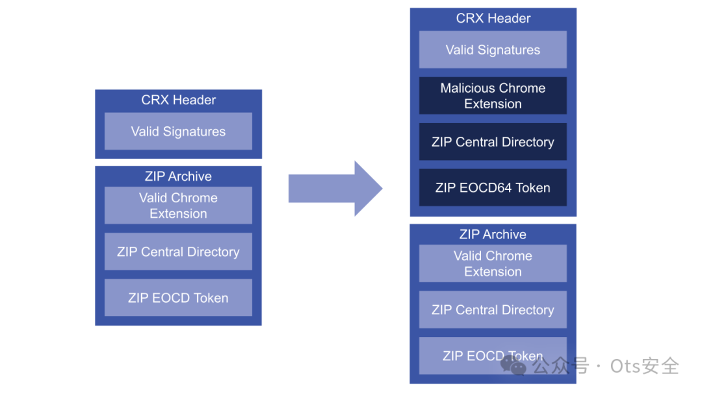

# Chrome CRX/Minizip 0333 ZIP64签名解析差异

## 条目说明

- 对象与具体问题：Chrome CRX/Minizip；0333 ZIP64签名解析差异
- 版本、配置及部署条件：小于64kB有效CRX；企业HTTP扩展更新；120.0.6099.216修复
- 认证与权限前提：能替换企业更新源/网络前提
- 核验边界：已完成原始 Markdown 的文本审阅；未执行 PoC、未访问目标、未视检截图。来源所述影响与复现结果不等于本库独立验证。

## 证据边界与更正

以下记录原始资料的证据边界。可以由原文确定的产品、编号及格式问题已在本条修订；没有原始证据的版本、响应和补丁信息仍待核实。

- 作者明确没实现本地提权，不能因Elevation Service背景标LPE
- Chrome商店和组件签名额外保护须保留，不推广所有扩展均可劫持
- 所称视频演练未附视频；代码脚本未收录，属于研究说明
- 32427/32972为作者往年研究引用；保留Synack主源去GIF

## 操作风险

现有材料未完整列明副作用；示例不保证只读或无状态变化。保留原示例供静态分析；仅可在明确授权的隔离测试环境验证，事先准备备份与回滚。

## 技术资料与来源记录

 Ots安全   2024-04-16 18:00  
  
  
  
编者注：在本期《漏洞解释》中，安全研究人员 Malcolm Stagg 讲述了他发现的 CVE-2024-0333，这是 Google Chrome 中的一个漏洞，可能会被利用来安装恶意扩展程序。请务必关注LinkedIn 上的自述文件，以跟上本系列的未来补充内容。  
  
  
Google Chrome 是世界上使用最广泛的浏览器。它经过精心设计，具有多层保护措施，可以缓解大多数漏洞，并且这些保护措施都经过仔细审查，以确保其有效性。  
  
  
其中一项保护措施包括要求浏览器组件更新中使用的任何互联网协议，即使存在强加密，也不应该绝对信任。否则，控制设备根证书的政府或雇主可能会在安装组件或扩展之前对其进行篡改，这将对浏览器用户构成重大威胁。  
  
  
Chromium 通过验证每个已安装文件的加密签名来防止此类攻击。所有扩展和大多数浏览器组件更新都使用 CRX 文件格式，它实际上是一个ZIP 文件，前面带有包含签名和其他元数据的标头，以保证文件完整性。  
  
  
在参与 Synack 特殊项目以查找虚拟机目标上的权限提升后，我开始研究 CRX 文件格式。去年，我在类似的目标上进行了二进制静态分析，在三个不同的后台服务上发现了三个零日漏洞，包括CVE-2022-32427和CVE-2022-32972。这些漏洞的原因和利用的复杂性各不相同，但它们都有一个共同点：当数据从低特权的可执行文件发送到高特权的服务时，输入验证不足，从而允许低特权的用户控制该服务。电脑。  
  
  
查看虚拟机上运行的服务，其中一项引起了我的注意：Google Chrome Elevation Service。该服务的名称意味着它旨在获取低特权的可执行文件并以较高的特权运行它，这可能是安装某些更新所必需的。尽管我意识到很难像 Chromium 那样仔细审查代码中的缺陷，但我很好奇该服务是如何设计的，以确保仅提升受信任的可执行文件。  
  
  
正如预期的那样，该服务遵循精心设计的过程来防止篡改：它首先将用户指定的 CRX 文件复制到受信任的位置，对文件执行签名验证，解压缩，然后最终运行提取的可执行文件。低权限用户无权将任何其他文件注入受信任位置，任何篡改压缩可执行文件的尝试都会使签名无效并阻止其运行。  
  
  
使用此服务来提升恶意可执行文件似乎是不可能的——除非可以以某种方式绕过CRX 签名验证。在研究了CRX 文件格式之后，我意识到向标头注入额外的数据是可能的。标头包含文件其余部分的签名，因此标头本身包含的大部分数据无需经过任何验证。  
  
  
我首先尝试将完整的 ZIP 存档注入到 CRX 标头中。什么也没发生——我注入的数据没有效果。为了找出原因，我开始研究ZIP 文件格式，特别是 ZIP 文件末尾的 EOCD（中央目录结尾）标记，有趣的是，它是 ZIP 文件跨越许多时代的残余。软盘。通过将此标记放在存档的末尾，可以将文件添加到存档中，而无需修改以前的软盘。由于 ZIP 文件格式要求从存档末尾开始搜索 EOCD 令牌并向后搜索，因此可以将 CRX 文件头添加到存档前面，而不会影响其内容。  
  
  
Chromium 使用 Minizip 库来解压缩 ZIP档案。我开始查看它的unzOpenInternal函数，该函数将首先打开 ZIP 存档并查找任何 EOCD 令牌。在查看此代码时，我注意到一些有趣的事情：Minizip 使用两个单独的函数unz64local_SearchCentralDir64和unz64local_SearchCentralDir来查找 EOCD 令牌。  
  
  
在我对 ZIP 文件格式的研究中，我发现 ZIP64 档案（它是 ZIP 格式的扩展，支持 4GB 以上的文件大小）使用不同的 EOCD 令牌（称为 EOCD64）。看起来 Minizip 会首先尝试查找 EOCD64 令牌，然后仅在失败时才查找 EOCD 令牌作为后备。  
  
  
这给了我一个想法：也许我可以将 EOCD64 令牌注入到 CRX 文件头中。当 Minizip 解压缩文件时，它可能首先找到我的恶意 EOCD64 令牌，而不是预期的 EOCD 令牌。不过，有一个限制，即 Minizip 仅在存档文件的最后 64kB 中搜索任一标记。我的攻击只能处理大小小于 64kB 的存档。  
  
  
  
图 1：恶意 Chrome 扩展程序可以注入到有效的 Chrome 扩展程序（左）中，以创建具有有效签名的恶意扩展程序（右）  
  
尽管如此，我现在有了一个计划。我创建了一个 Python 脚本，将包含有效 EOCD64 令牌的 ZIP 有效负载注入到 CRX 文件头中，并创建了一个小型 Chrome 扩展来进行攻击。此扩展仅在访问的任何页面上显示横幅。接下来，我创建了与显示不同横幅的恶意扩展相对应的 ZIP 负载。攻击成功了！我可以将有效负载嵌入到 CRX 文件中并更改横幅。  
  
  
尽管这看起来是一次有趣的攻击，但我需要弄清楚它的潜在影响。这仍然可以用于本地权限升级吗？攻击 Chrome Web Store 扩展程序怎么样？还是 Chrome 内部组件？  
  
  
对于本地权限升级，我需要一个有效的、签名的 CRX 文件，其中包含 64kB 以下的 ZIP 存档。我开始在互联网上搜索使用该特定密钥签名的任何文件。我能找到的最小的是73kB。千钧一发，但大约 7000 字节对于我的攻击来说太大了。看起来 Chrome 组件和 Chrome Web Store 扩展也受到了很好的保护。当 Chrome 组件更新时，客户端更新协议会对每个请求和响应进行签名。即使攻击者可以拦截 HTTPS 流量，他们也无法篡改这些签名的响应。  
  
  
我确实发现了一个基本上没有受到保护的区域。 Chrome 允许公司为其企业扩展定义策略。这些扩展可以从公司内部更新服务器自动安装和更新。我为这些涉及咖啡店的扩展设想了一个攻击场景。  
  
  
在这种情况下，一名员工带着笔记本电脑前往一家咖啡店。同样在这家咖啡店中的本地攻击者设置其 IP 或主机名以匹配公司的内部更新服务器。下次 Chrome 在员工的设备上运行扩展程序更新时，它将从攻击者的设备下载恶意修改的扩展程序。由于它仍然包含有效签名，因此员工的笔记本电脑将升级到恶意扩展。攻击者可以使用此扩展执行各种攻击，包括监视员工的网络活动和修改访问的页面以窃取密码和会话 cookie，从而可能获得对公司内部网络上的私人服务器和设备的访问权限。  
  
  
以下是展示该漏洞的视频演练：  
  
  
在证明可以使用本地 HTTP 更新服务器来利用此场景后，我完成了向 Google 描述该问题的报告。在 24 小时内，他们修补了 Chromium 源代码以修复该问题，并很快在 120.0.6099.216 浏览器版本中公开发布了修复程序。尽管我从未实现过特权升级，但它让我找到了一个非常有趣的 Chromium 漏洞，该漏洞已经被忽视了六年多。  
  
  
文章出自-Readme 作者：Malcolm Stagg  
  
文章地址：  
  
https://readme.synack.com/exploits-explained-zip-embedding-attack-on-google-chrome-extensions  
  
  
  
感谢您抽出  
  
  
  
.  
  
  
  
.  
  
  
  
来阅读本文  
  
  
  
**点它，分享点赞在看都在这里**  
  

---

> 来源：gelusus/wxvl（微信公众号漏洞文章自动归档，原文见文首链接）
