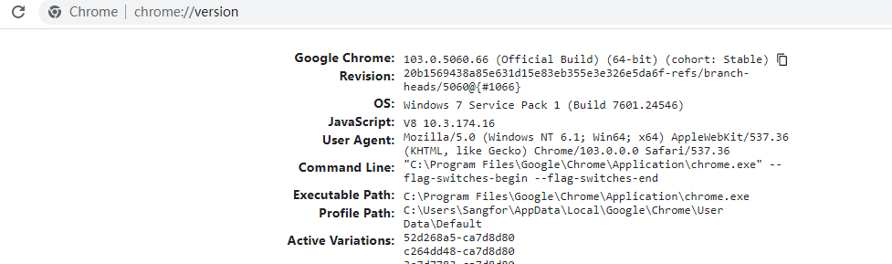
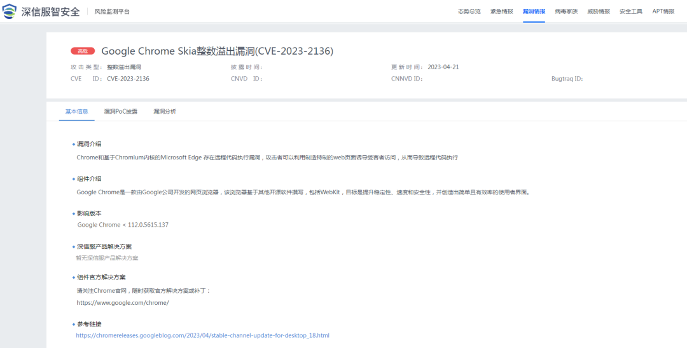

# Google Chrome Skia 2136整数溢出/沙箱逃逸通告

## 条目说明

- 对象与具体问题：Google Chrome Skia；2136整数溢出/沙箱逃逸通告
- 版本、配置及部署条件：<112.0.5615.137声明；需恶意网页
- 认证与权限前提：无认证但有用户交互
- 核验边界：已完成原始 Markdown 的文本审阅；未执行 PoC、未访问目标、未视检截图。来源所述影响与复现结果不等于本库独立验证。

## 证据边界与更正

以下记录原始资料的证据边界。可以由原文确定的产品、编号及格式问题已在本条修订；没有原始证据的版本、响应和补丁信息仍待核实。

- 浏览器客户端漏洞写最终服务器最高权限明显泛化串模板，删不被证据支持的提权结论
- 简介监测4月17与时间线4月18不一致，区分事件/公告日
- 原厂版本平台差异未列；保留Google公告，市场第一/安全宣传去除

## 操作风险

现有材料未完整列明副作用；示例不保证只读或无状态变化。保留原示例供静态分析；仅可在明确授权的隔离测试环境验证，事先准备备份与回滚。

## 技术资料与来源记录

深瞳漏洞实验室  深信服千里目安全技术中心   2023-04-21 19:26  
  
  
  
**漏洞名称：**  
  
Google Chrome Skia整数溢出漏洞 CVE-2023-2136  
  
**组件名称：**  
  
Google Chrome  
  
**影响范围：**  
  
Google Chrome < 112.0.5615.137  
  
**漏洞类型：**  
  
沙箱逃逸  
  
**利用条件：**  
  
1、用户认证：否  
  
2、前置条件：需要用户访问恶意网页  
  
3、触发方式：远程  
  
**综合评价：**  
  
<综合评定利用难度>：未知  
  
<综合评定威胁等级>：高危，能造成沙箱逃逸，配合其他漏洞可造成代码执行。  
  
**官方解决方案：**  
  
已发布  
  
  
  
  
**漏洞分析**  
  
  
  
**组件介绍**  
  
Google Chrome 是由 Google 开发的一款设计简单、高效的 Web 浏览工具，特点是简洁、快速。Google Chrome 支持多标签浏览，默认情况下，每个标签页面都在独立的“沙箱”内运行，在提高安全性的同时，一个标签页面的崩溃也不会导致其他标签页面被关闭。  
  
此外，Google Chrome 基于更强大的 JavaScript V8引擎，提升浏览器的处理速度。  
  
  
  
**漏洞简介**  
  
2023年4月17日，深信服安全团队监测到一则 Google Chrome 组件存在沙箱逃逸漏洞的信息，漏洞编号：CVE-2023-2136，漏洞威胁等级：高危。  
  
该漏洞是由于 Skia中存在整数溢出并可以破坏渲染器进程的代码环境，**攻击者可利用该漏洞在未授权的情况下，构造恶意数据执行沙箱逃逸，配合其他漏洞可以执行任意代码，最终获取服务器最高权限。**  
  
  
**影响范围**  
  
Google Chrome 几乎可以运行在所有计算机平台上，其由于跨平台和安全性被广泛使用，成为最流行的浏览器软件之一。Google Chrome 在中国浏览器市场占有率最高，拥有广泛的用户基础。  
  
  
目前受影响的 Google Chrome 版本：  
  
Google Chrome < 112.0.5615.137  
  
  
**解决方案**  
  
  
  
**如何检测组件版本**  
  
  
在浏览器的搜索栏输入  
  
chrome://version/  
  
即可查看当前浏览器版本信息。  
  
  
  
  
  
  
**官方修复建议**  
  
  
当前官方已发布最新版本，建议受影响的用户及时更新升级到最新版本。链接如下：https://chromereleases.googleblog.com/2023/04/stable-channel-update-for-desktop_18.html  
  
  
**参考链接**  
  
https://chromereleases.googleblog.com/2023/04/stable-channel-update-for-desktop_18.html  
  
  
**时间轴**  
  
  
  
**2023/4/18**  
  
深信服监测到Google 官方发布安全通告  
  
  
**2023/4/21**  
  
深信服千里目安全技术中心发布漏洞通告。  
  
  
点击**阅读原文**，及时关注并登录深信服**智安全平台**，可轻松查询漏洞相关解决方案。  
  
  
  
  
  
  
  
  
  

---

> 来源：gelusus/wxvl（微信公众号漏洞文章自动归档，原文见文首链接）
