# Questions for Confluence插件 26138硬编码用户密码

## 条目说明

- 对象与具体问题：Questions for Confluence插件；26138硬编码用户密码
- 版本、配置及部署条件：2.7.34/2.7.35/3.0.2插件；权限为confluence-users组
- 认证与权限前提：硬编码账户登录，非管理员默认权限
- 核验边界：已完成原始 Markdown 的文本审阅；未执行 PoC、未访问目标、未视检截图。来源所述影响与复现结果不等于本库独立验证。

## 证据边界与更正

以下记录原始资料的证据边界。可以由原文确定的产品、编号及格式问题已在本条修订；没有原始证据的版本、响应和补丁信息仍待核实。

- 标题应标插件而非Confluence Server普遍硬编码，范围与组可见页面限制保留
- 靶场26134为宿主再装插件，不作为同一漏洞
- 官方修复建议未给公告链接；需核残留账号是否随升级/卸载处理，不能默认只卸插件有效
- 去宣传及重复JAR说明

## 操作风险

现有材料未完整列明副作用；示例不保证只读或无状态变化。保留原示例供静态分析；仅可在明确授权的隔离测试环境验证，事先准备备份与回滚。

## 技术资料与来源记录

> 本文由 [简悦 SimpRead](http://ksria.com/simpread/) 转码， 原文地址 [mp.weixin.qq.com](https://mp.weixin.qq.com/s/dmeUPuZyeDvQKVT70XWSGQ)

**上方蓝色字体关注我们，一起学安全！**

**作者：bnlbnf****@Timeline Sec  
**

**本文字数：708**

**阅读时长：2～3min**

**声明：仅供学习参考使用，请勿用作违法用途，否则后果自负**

**0x01 简介**  

  

Atlassian Confluence Server 是澳大利亚 Atlassian 公司的一套具有企业知识管理功能，并支持用于构建企业 WiKi 的协同软件的服务器版本。

**0x02 漏洞概述**  

  

**漏洞编号：CVE-2022-26138**

当 Confluence Server 或 Data Center 上的 Questions for Confluence app 启用时，它会创建一个名为 disabledsystemuser 的 Confluence 用户帐户。  

此帐户旨在帮助将数据从应用程序迁移到 Confluence Cloud 的管理员账号中。  

该帐户通过使用硬编码密码创建并添加到 confluence-users 组中，在默认情况下允许查看和编辑 Confluence 中的所有非受限页面。未经身份验证攻击者可以利用所知的硬编码密码登录 Confluence 并访问该组有权限访问的所有页面。  

**0x03 影响版本**  

  

Questions for Confluence app == 2.7.34

Questions for Confluence app == 2.7.35

Questions for Confluence app == 3.0.2  

**0x04 环境搭建**  

  

靶场下载地址：  
https://github.com/vulhub/vulhub/archive/refs/heads/master.zip

上传靶场，解压

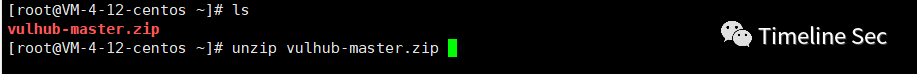

进入漏洞目录  
cd vulhub-master/confluence/CVE-2022-26134  

启动漏洞环境

docker-compose up -d

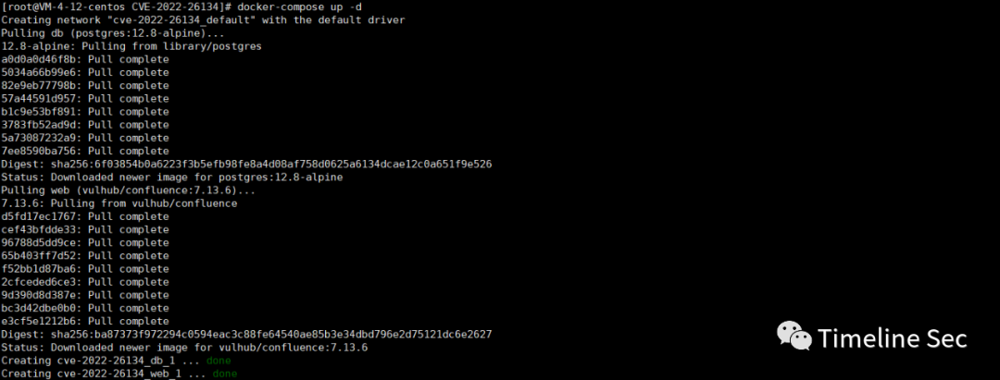

启动完成，浏览器打开 ip:8090, 需要获取一个 license

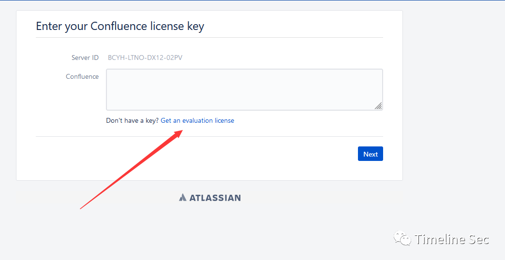

生成一个激活码

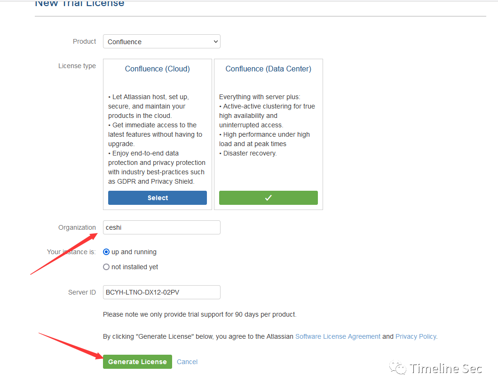

弹出一个窗口点 yes

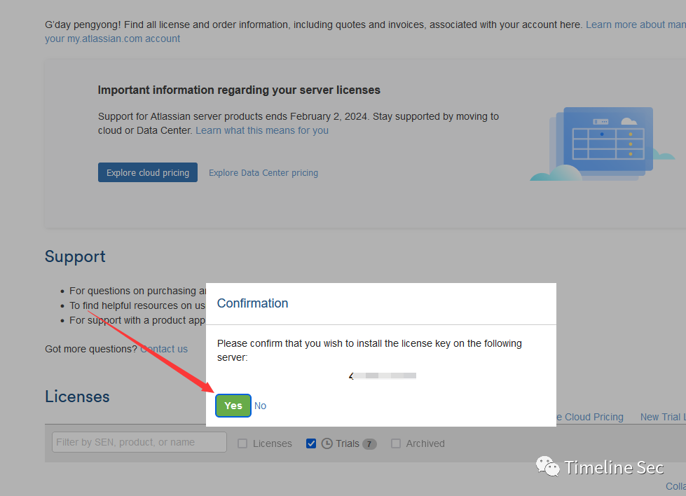

激活码自动生成到页面上，点击 next

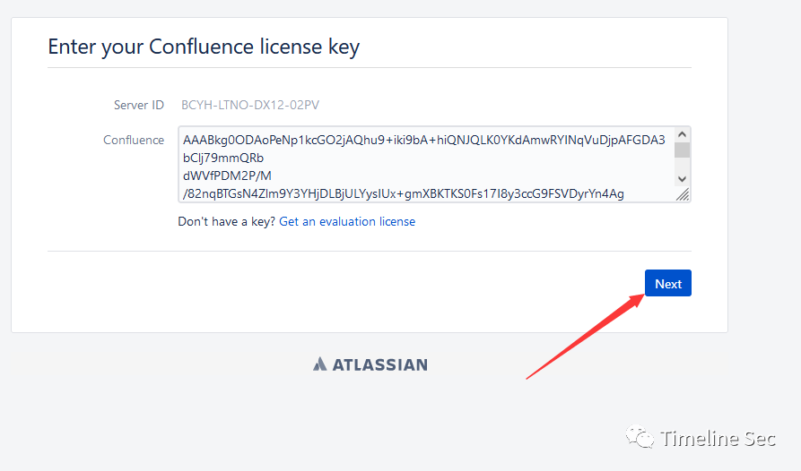

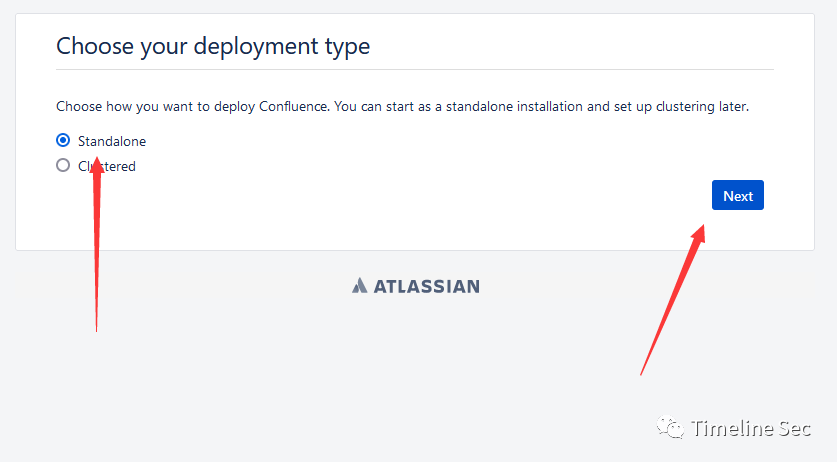

Database URL：  
jdbc:postgresql://db:5432/confluence  
username：postgres  
password：postgres  

```
https://packages.atlassian.com/maven-atlassian-external/com/atlassian/confluence/plugins/confluence-questions/3.0.2/confluence-questions-3.0.2.jar
```

环境搭建就完成了

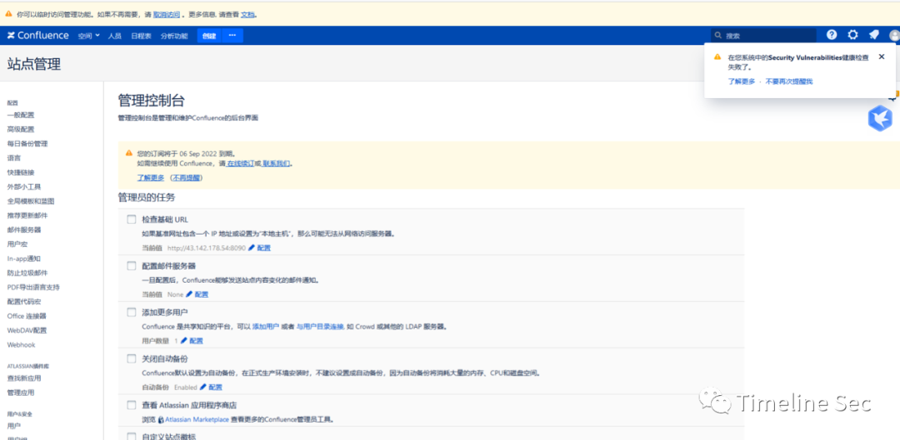  
然后安装产生漏洞的 jar 包  

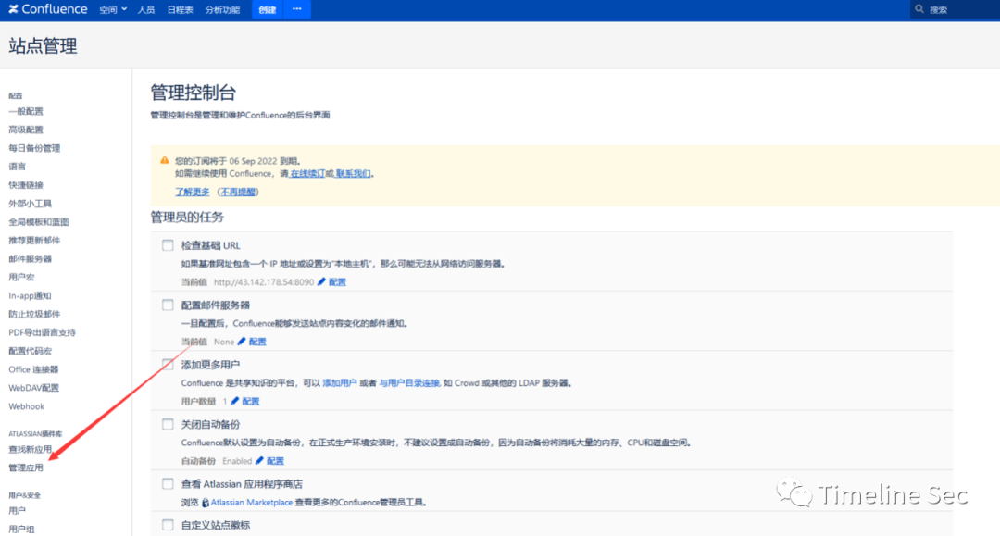  

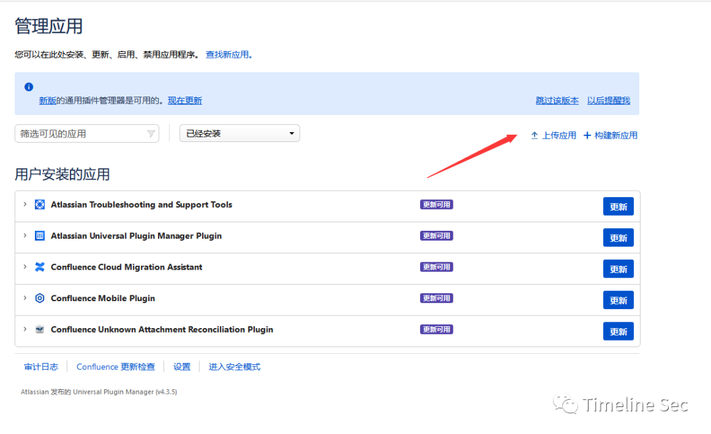

上传应用，应用下载地址

```
https://packages.atlassian.com/maven-atlassian-external/com/atlassian/confluence/plugins/confluence-questions/3.0.2/confluence-questions-3.0.2.jar
```

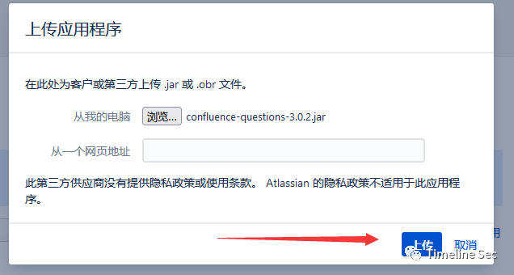

然后成功上传

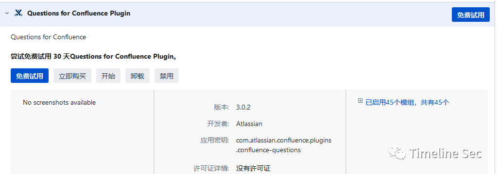  

**0x05 漏洞复现**  

  

根据这篇漏洞分析的文章，会创建一个用户

```
https://www.freebuf.com/vuls/341027.html
```

使用硬编码密码创建的账号进行登录

```
用户名：disabledsystemuser

密码：disabled1system1user6708
```

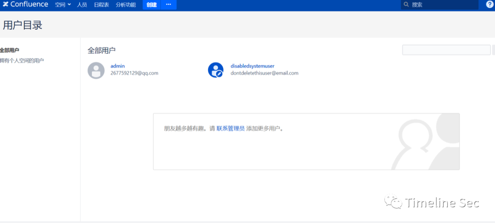

**0x06 修复方式**  

  

参考官方公告中的修复建议：

更新 Questions for Confluence 扩展至以下安全版本:

2.7.x >= 2.7.38 (Confluence 6.13.18 到 7.16.2)

Versions >= 3.0.5 (Confluence 7.16.3 之后的版本)


  


**阅读原文看更多复现文章**

Timeline Sec 团队  

安全路上，与你并肩前行

---

> 来源：MrWQ/vulnerability-paper（https://github.com/MrWQ/vulnerability-paper）
