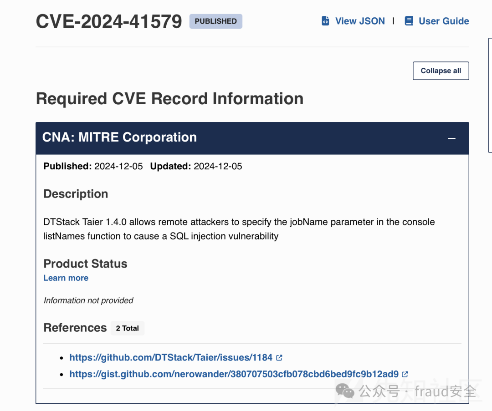
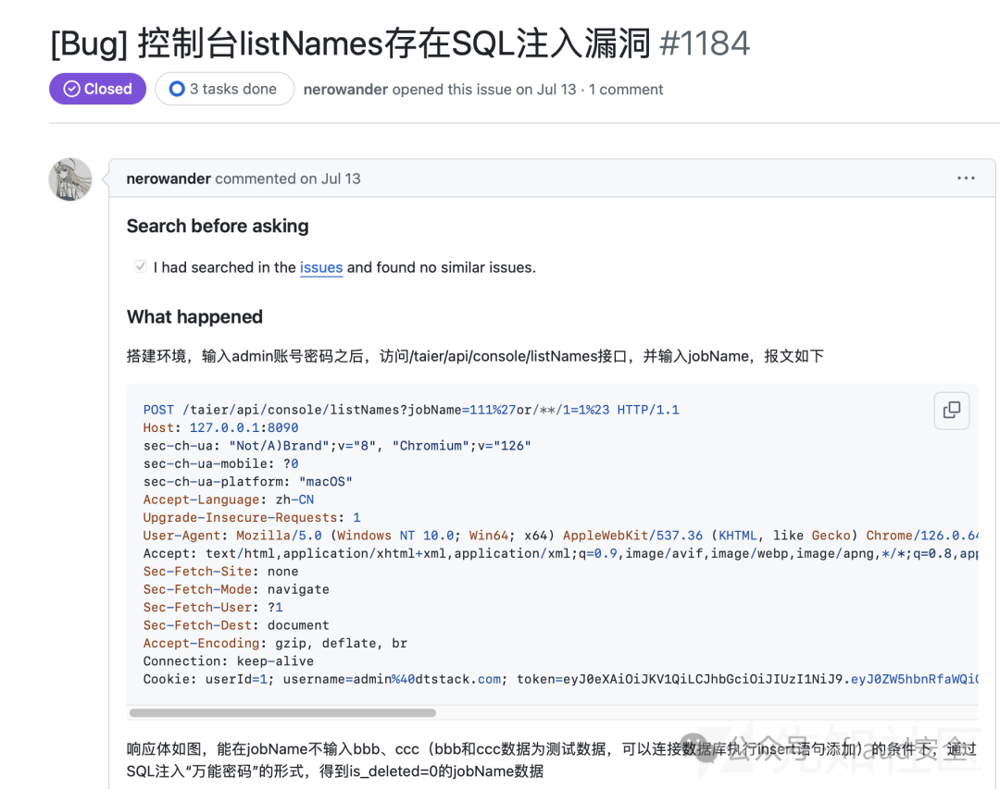
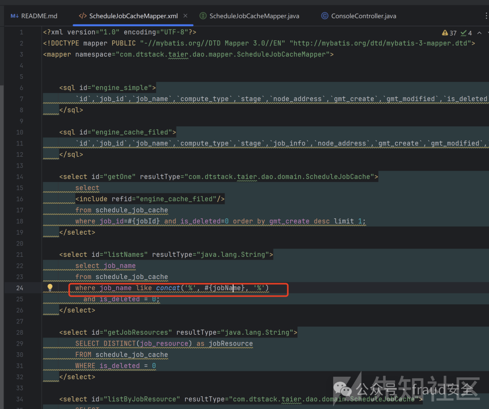
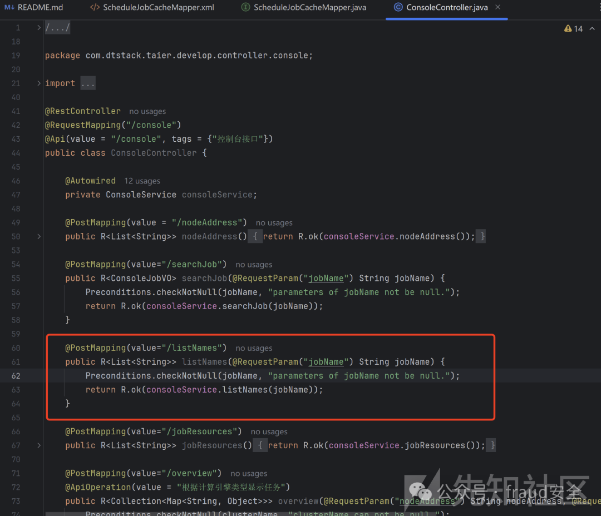
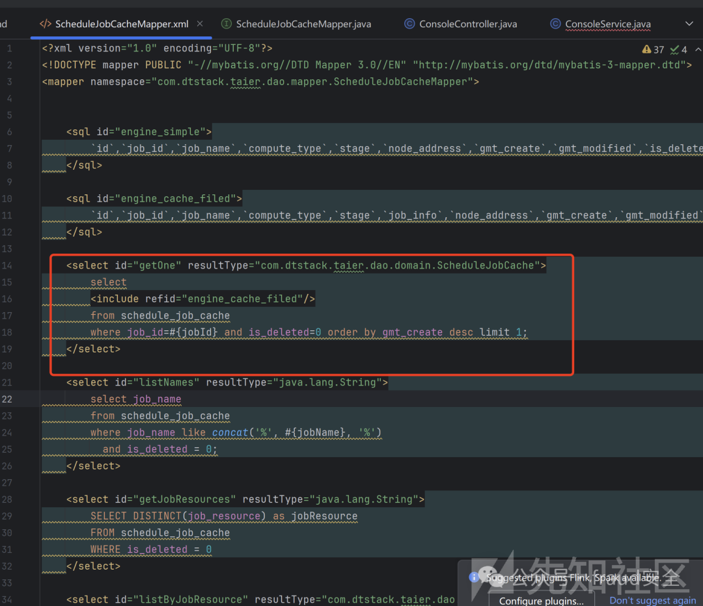
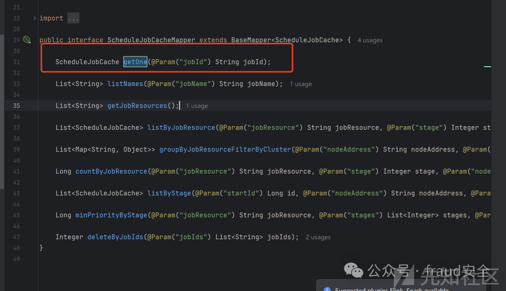
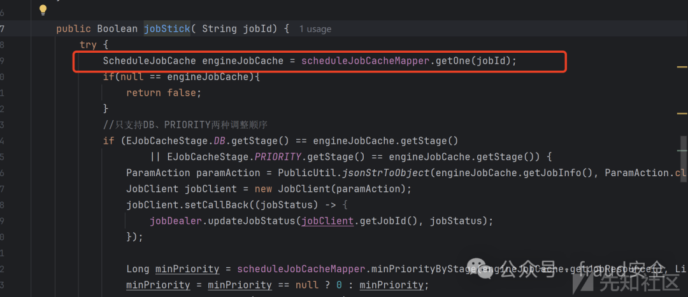
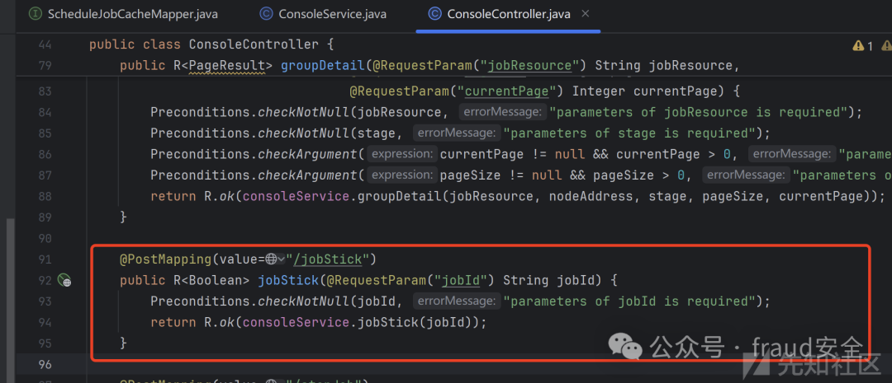

# DTStack Taier listNames jobName SQL 注入及jobStick推测

## 条目说明

- 对象与具体问题：DTStack Taier；listNames jobName SQLi及jobStick推测
- 版本、配置及部署条件：1.4.0；MyBatis映射与鉴权待核
- 认证与权限前提：未知
- 核验边界：已完成原始 Markdown 的文本审阅；未执行 PoC、未访问目标、未视检截图。来源所述影响与复现结果不等于本库独立验证。

## 证据边界与更正

以下记录原始资料的证据边界。可以由原文确定的产品、编号及格式问题已在本条修订；没有原始证据的版本、响应和补丁信息仍待核实。

- 文章把${}说预编译、#{}说直接拼接，关键原理写反
- 据getOne使用#号就判jobStick SQLi不成立，未有载荷/响应/拼接上下文
- 实际根因/请求全部图片未视检，参考文献缺链接；新候选不能挂41579已证编号
- 去碎行并补源码/官方修复

## 操作风险

现有材料未完整列明副作用；示例不保证只读或无状态变化。保留原示例供静态分析；仅可在明确授权的隔离测试环境验证，事先准备备份与回滚。

## 技术资料与来源记录

原创 韭菜  fraud安全   2024-12-17 01:00  
  
## 通告  
  
  
## 漏洞分析  
  
根据参考文献，很幸运发现了payload  
  
  
  
通过payload可以知道漏洞触发接口是listNames  
触发参数是jobName  
  
在项目的**Model**  
层和**xml文件**  
查询jobName  
  
  
  
在Java中sql拼接大致分为两种$  
和#  
  
$：预编译拼接sql语句  
## #：直接拼接sql语句  
  
项目判断是**Spring**  
框架，寻找接口到**Controller**  
层  
  
  
  
根据图上所示，**Controlle**  
层直接**post**  
获取jobName  
请求参数  
  
调用连ConsoleController.listNames->ConsoleService.listNames->ScheduleJobCacheMapper->listNames  
## 东施效颦-漏洞挖掘  
  
通过上述分析，寻找一个新的注入点  
  
ScheduleJobCacheMapper.xml发现getOne接口使用了#  
号作为占位符  
  
  
  
逆向追踪对应的**Model**  
层  
  
  
  
继续追踪发现jobId  
是通过**Controller**  
传递的  
  
  
  
继续分析**Controller**  
代码，发现jobId  
通过请求直接获取的  
  
  
  
那么挖掘的sql注入：  
  
请求方式：POST请求  
  
请求接口：/taier/api/console/jobStick  
  
注入参数：jobId  
  
  

---

> 来源：gelusus/wxvl（微信公众号漏洞文章自动归档，原文见文首链接）
