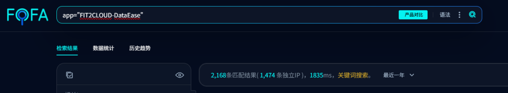
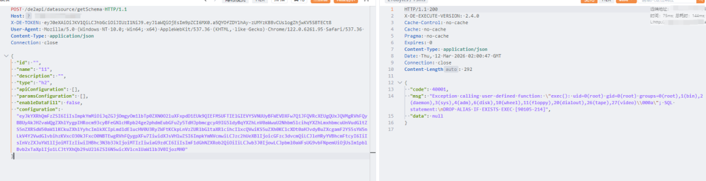
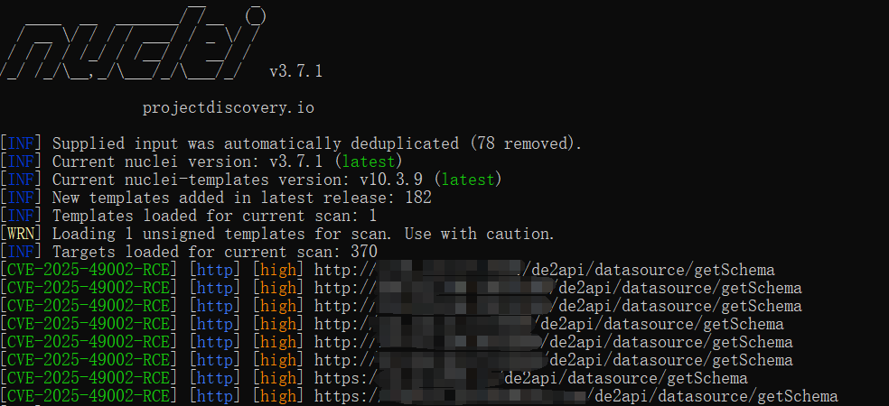
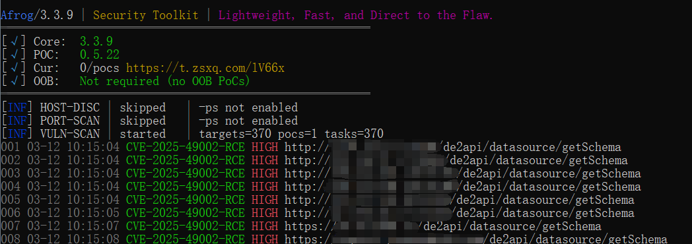
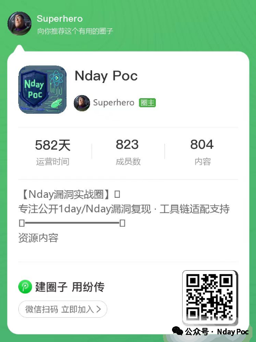

# DataEase 49002 H2 JDBC 远程代码执行通告

## 条目说明

- 对象与具体问题：DataEase；49002 H2 JDBC RCE通告
- 版本、配置及部署条件：2.10.10声明，依赖鉴权链不明
- 认证与权限前提：声称无需身份
- 核验边界：已完成原始 Markdown 的文本审阅；未执行 PoC、未访问目标、未视检截图。来源所述影响与复现结果不等于本库独立验证。

## 证据边界与更正

以下记录原始资料的证据边界。可以由原文确定的产品、编号及格式问题已在本条修订；没有原始证据的版本、响应和补丁信息仍待核实。

- 复现与工具全截图无请求/代码，匿名结论未支撑
- 缺修复版与上游通告，去付费圈购买/退款广告

## 操作风险

命令/代码执行示例可能改变主机状态。保留原示例供静态分析；仅可在明确授权的隔离测试环境验证，事先准备备份与回滚。

## 技术资料与来源记录

Superhero
                    Superhero  Nday Poc   2026-03-12 02:21  
  
  
  
  
  
  
  
内容仅用于学习交流自查使用，由于传播、利用本公众号所提供的  
POC  
信息及  
POC对应脚本  
而造成的任何直接或者间接的后果及损失，均由使用者本人负责，公众号Nday Poc及作者不为此承担任何责任，一旦造成后果请自行承担！  
  
  
**01**  
  
**漏洞概述**  
  
  
DataEase 2.10.10 H2 JDBC  接口存在远程命令执行漏洞,未经身份攻击者可通过该漏洞在服务器端任意执行代码,写入后门,获取服务器权限,进而控制整个 web 服务器。该漏洞利用难度较低，建议受影响的用户尽快修复。  
**02******  
  
**搜索引擎**  
  
  
fofa:  
```
app="FIT2CLOUD-DataEase"
```  
  
  
  
  
**03******  
  
**漏洞复现**  
  
  
  
  
**04**  
  
**自查工具**  
  
  
nuclei  
  
  
  
afrog  
  
  
  
  
**05******  
  
**修复建议**  
  
  
1、关闭互联网暴露面或接口设置访问权限  
  
2、升级至安全版本  
  
  
**06******  
  
**内部圈子介绍**  
  
#### 【Nday漏洞实战圈】🛠️  
  
专注公开1day/Nday漏洞复现 · 工具链适配支持  
  
✧━━━━━━━━━━━━━━━━✧  
  
🔍 **资源内容**  
  
▫️ 整合全网公开1day/Nday漏洞POC详情  
  
▫️ 适配Afrog/Nuclei检测脚本  
  
▫️ 支持内置与自定义POC目录混合扫描  
  
🔄 **更新计划**  
  
▫️ 每周新增7-10个实用POC（来源公开平台）  
  
▫️ 所有脚本经过基础测试，降低调试成本  
  
🎯 **适用场景**  
  
▫️ 企业漏洞自查 ▫️ 渗透测试 ▫️ 红蓝对抗 ▫️ 安全运维  
  
✧━━━━━━━━━━━━━━━━✧  
  
⚠️ **重要声明**  
  
▫️  
仅限合法授权测试，严禁违规使用  
  
**▫️虚拟资源服务，购买后不接受任何形式退款**  
  
▫️  
付款  
前请评估需求，慎重考虑  
  
  
  
  


---

> 来源：gelusus/wxvl（微信公众号漏洞文章自动归档，原文见文首链接）
