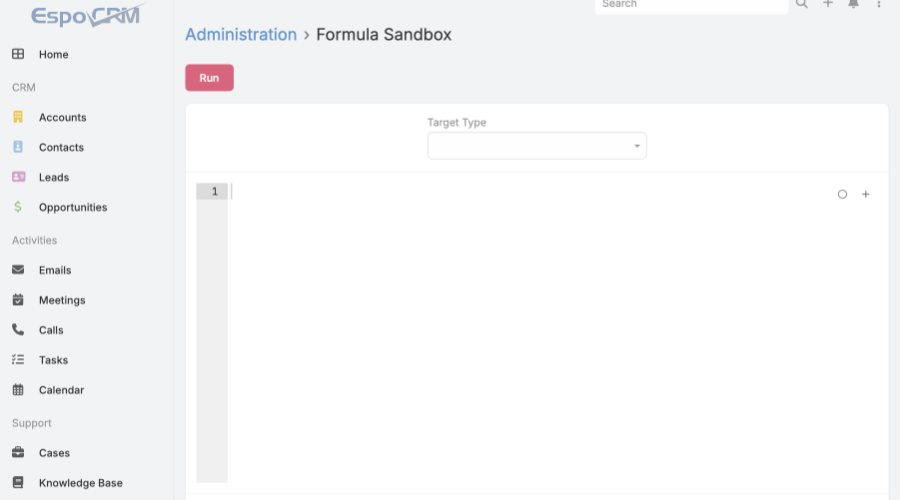
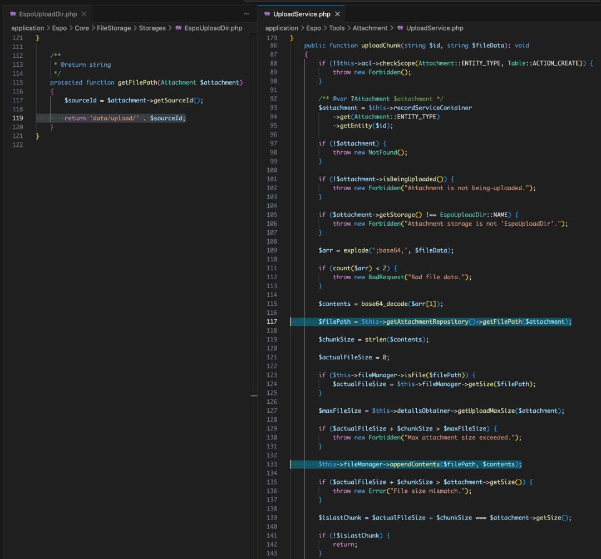
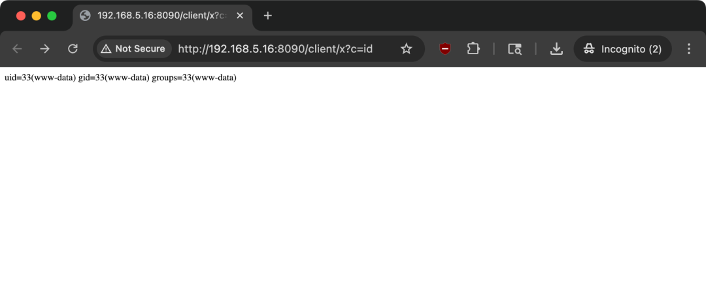

# EspoCRM 33656 sourceId路径写入至远程代码执行链

## 条目说明

- 对象与具体问题：EspoCRM；33656 sourceId路径写入至RCE链
- 版本、配置及部署条件：<9.3.4；管理员公式；Apache支持.htaccess/PHP处理
- 认证与权限前提：管理员令牌
- 核验边界：已完成原始 Markdown 的文本审阅；未执行 PoC、未访问目标、未视检截图。来源所述影响与复现结果不等于本库独立验证。

## 证据边界与更正

以下记录原始资料的证据边界。可以由原文确定的产品、编号及格式问题已在本条修订；没有原始证据的版本、响应和补丁信息仍待核实。

- 管理员公式绕ACL为维护者设计争议，CVE主修路径净化，保留争议不可将全部公式功能判新漏洞
- 称无特殊配置与Apache/.htaccess执行前提不一致；并非所有部署均RCE
- 称报告24小时内发布修复与3月21报告/24发布版本时间线不一致，可区分提交与发行
- 六请求总数与可选第二附件流程需解释；源码未围栏、sourceId</code残片
- CVSS9.1与7.2争议需链接原GHSA/commit而非只标号；账号hash令牌读取为附加设计风险

## 操作风险

命令/代码执行示例可能改变主机状态。保留原示例供静态分析；仅可在明确授权的隔离测试环境验证，事先准备备份与回滚。

## 技术资料与来源记录

 幻泉之洲   2026-03-28 08:01  
  
> 本文剖析了EspoCRM（v9.3.3及更早版本）中一个完整的安全漏洞链。该漏洞允许拥有管理员权限的攻击者，通过内部的公式脚本引擎绕过字段级访问控制，篡改文件附件的sourceId字段，结合文件存储层未净化的路径构造，实现任意文件读写，并最终利用.htaccess技巧达成远程代码执行（RCE）。CVE编号：CVE-2026-33656。文章详细分析了技术原理、影响范围、完整的攻击利用链，并提供了修复建议。  
  
### 漏洞概述  
  
漏洞根源在于EspoCRM内部两个安全机制的失效。首先，其内置的“公式脚本引擎”在执行record\update  
等函数时，未能应用实体元数据中定义的字段级访问控制列表（field-level ACL）。这使得管理员可以覆盖被标记为readOnly  
的字段，特别是附件（Attachment）实体的sourceId  
字段。  
  
其次，在读取或写入附件文件时，应用程序通过EspoUploadDir::getFilePath()  
方法构造文件路径，它直接拼接sourceId  
字段的值，未进行任何路径遍历净化（如basename()  
）。  
  
攻击者可以将sourceId  
设置为类似../../config.php  
的恶意值。控制读取路径导致任意文件读取（如数据库配置文件）；控制写入路径，结合分块上传功能，可向Web目录写入任意文件。利用这个能力，配合一个精心构造的.htaccess  
文件，最终能在Apache环境下获得www-data  
（或等效Web服务用户）权限的远程代码执行能力。  
  
该漏洞的利用需要管理员权限。根据CVSS v3.1标准，其基础评分为9.1（严重级），攻击范围（Scope）为“已更改”。  
### 技术原理分析  
#### 1. 访问控制缺口：公式引擎的盲区  
  
EspoCRM的访问控制主要定义在JSON元数据文件中。例如，附件实体的sourceId  
字段被标记为readOnly  
。  
  
{"fields":  
  
{  
  
"storage": {"readOnly": true},  
  
"source": {"readOnly": true},  
  
"sourceId": {"readOnly": true}  
  
}  
  
}  
  
正常的API更新流程（通过Record\Service::filterInput()  
）会调用getScopeForbiddenAttributeList()  
，剥离掉这些readOnly  
字段，确保它们不被用户输入修改。  
  
然而，公式引擎的record\update  
函数走了另一条路。其核心代码在UpdateType.php  
中：  
  
$entity->set($data);  
  
EntityUtil::checkUpdateAccess($entity);  
  
$this->entityManager->saveEntity($entity);  
  
EntityUtil::checkUpdateAccess()  
只检查了非常有限的权限（例如防止将普通用户类型改为超级管理员），**完全没有**  
参照实体的ACL元数据来过滤readOnly  
或forbidden  
字段。  
  
这就造成了访问控制的不对称：同一个readOnly  
字段，API路径保护它，公式引擎路径却敞开大门。  
> 注：维护者认为公式引擎不应用ACL是设计使然，并非漏洞。其观点是：公式引擎专为受信任的管理员设计，且管理员已有其他代码执行途径（如扩展上传）。因此，最终的修复方案并未改变公式引擎的行为，而是加固了文件路径构造。  
  
  
但这个设计决策的安全后果是实质性的：它引入了一条不受字段级ACL约束的、强大的数据操作通道。  
#### 2. 危险拼接：未净化的文件路径  
  
sourceId  
字段用于确定附件文件的磁盘存储路径。在EspoUploadDir::getFilePath()  
中，问题代码一览无余：  
  
protected function getFilePath(Attachment $attachment)  
  
{  
  
$sourceId = $attachment->getSourceId();  
  
return 'data/upload/' . $sourceId;  
  
}  
  
这里没有任何净化处理：没有basename()  
，没有realpath()  
检查，也**没有**  
拒绝../  
这类路径遍历序列。sourceId  
被直接拼接到基础路径后，这个完整的路径被用于后续所有的文件读写操作。  
  
所以，一旦攻击者通过公式引擎控制了  
sourceId</code，就等于控制了文件系统的访问目标。  
#### 3. 攻击链条串联  
  
漏洞链清晰呈现：  
1. **权限前提**  
：获取管理员凭证（或通过其他方式获得管理员会话）。  
  
1. **ACL绕过**  
：利用公式引擎的record\update  
函数，修改一个已存在附件的sourceId  
为恶意路径（如../../config.php  
）。  
  
1. **任意文件读取**  
：直接请求该附件的文件下载API，服务器会读取并返回目标路径的文件内容。  
  
1. **任意文件写入**  
：创建一个状态为“正在上传”（isBeingUploaded: true  
）的新附件。先通过公式引擎将其sourceId  
重定向到Web可访问目录（如../../client/shell.php  
），然后通过附件分块上传API（POST /api/v1/Attachment/chunk/{id}  
）向其写入任意内容。  
  
1. **升级至RCE**  
：在默认Apache部署中，client/  
目录可能不执行PHP。此时可再写入或修改.htaccess  
文件，添加处理器指令，强制Apache将特定文件（如shell.php  
）作为PHP解析。  
  
  
### 影响范围  
  
此漏洞直接影响所有运行EspoCRM **9.3.4之前版本**  
的实例。具体影响组件包括：  
- **核心功能**  
：公式脚本引擎（record\update  
, record\attribute  
函数）。  
  
- **文件存储组件**  
：基于EspoUploadDir  
存储的附件处理。  
  
- **相关实体**  
：Attachment实体及其sourceId  
字段。  
  
虽然利用链需要管理员权限，但考虑到以下情况，其实际风险依然很高：  
- 管理员账户可能因弱密码、凭证复用或社会工程学而遭窃。  
  
- 内部威胁。  
  
- 攻击者可能结合其他中危漏洞（如XSS）诱使管理员执行恶意操作，间接获得利用条件。  
  
此外，公式引擎的ACL盲点不仅影响sourceId  
。通过record\attribute  
函数，攻击者可以**读取**  
被标记为internal  
的敏感字段，例如：  
- User.password  
：所有用户的bcrypt哈希，可用于离线破解。  
  
- AuthToken.token  
：活跃用户的会话令牌，可用于直接会话劫持。  
  
- 存储在邮件账户实体中的SMTP凭据。  
  
这为攻击者提供了在不触碰文件系统的情况下进行横向移动的能力。  
  
  
### 漏洞复现与PoC说明  
  
完整的远程代码执行利用链涉及6个HTTP请求。以下为关键步骤概述，完整的自动化PoC脚本可在GitHub查看（JivaSecurity/ESPOCRM-RCE-POC-CVE-2026-33656）。  
#### 前置条件  
  
拥有有效的管理员Espo-Authorization  
令牌。  
#### 步骤简述  
1. **创建文件写入句柄**  
：发送POST /api/v1/Attachment  
，创建一个isBeingUploaded: true  
的附件，记下其id  
和sourceId  
（初始时二者相同）。  
  
1. **重定向sourceId**  
：使用公式引擎，将该附件的sourceId  
更新为指向web目录的路径，例如../../client/shell.php  
。  
  
1. **写入Webshell**  
：向POST /api/v1/Attachment/chunk/{ATTACH_ID}  
发送请求，将Base64编码的PHP Webshell（如<?php system($_GET["c"]); ?>  
）作为内容块上传。  
  
1. **配置PHP解析（可选）**  
：如果client/  
目录默认不执行PHP，则需要重复步骤1-3，但将第二个附件的sourceId  
指向../../.htaccess  
，并写入SetHandler application/x-httpd-php  
这样的指令，且只针对shell.php  
文件生效，避免破坏应用。  
  
1. **执行命令**  
：访问http://target/client/shell.php?c=id  
，即可看到命令执行结果。  
  
uid=33(www-data) gid=33(www-data) groups=33(www-data)  
  
整个过程不依赖任何第三方组件、特殊的PHP配置或服务器错误配置。  
  
  
### 修复建议与缓解措施  
#### 官方修复（EspoCRM 9.3.4）  
  
维护者迅速响应，在报告后24小时内发布了修复。核心修复是对sourceId  
进行净化处理。  
  
在EspoUploadDir::getFilePath()  
中，修复后的代码为：  
  
protected function getFilePath(Attachment $attachment): string  
  
{  
  
$sourceId = $attachment->getSourceId();  
  
$file = basename($sourceId);  
  
return 'data/upload/' . $file;  
  
}  
  
使用basename()  
函数剥离所有目录部分，只保留文件名，从根本上阻断了路径遍历的可能。此修复不仅应用于getFilePath()  
，还一次性清理了其他五个可能使用未信任ID构造路径的代码位置。  
  
**行动项**  
：所有EspoCRM用户应立即升级至**9.3.4或更高版本**  
。  
#### 缓解措施（对于无法立即升级的情况）  
- **审查和限制公式使用**  
：检查系统中所有通过公式引擎定义的业务逻辑，特别是包含record\update  
调用的部分，确保其没有对敏感字段（尤其是Attachment相关字段）进行操作。  
  
- **网络层防护**  
：部署Web应用防火墙（WAF），设置规则检测和阻断对/api/v1/Formula/action/run  
端点的异常请求，或包含路径遍历序列的sourceId  
值。  
  
- **权限最小化**  
：严格管理管理员账户，使用强密码并启用多因素认证（如果EspoCRM支持），减少管理员账户泄露的风险。  
  
#### 给开发者的启示  
- **内部引擎也需边界防护**  
：任何提供给用户（即使是管理员）执行数据操作的内部脚本引擎，都必须强制执行与应用外部API一致的访问控制策略。“仅管理员可用”不能替代精确的字段级ACL。  
  
- **净化所有从数据库到文件系统的路径**  
：不要信任存储在数据库中的、用于构造文件路径的任何字段。使用basename()  
或realpath()  
进行严格的验证和限制。  
  
- **审计只读和内部字段**  
：定期审查ACL元数据中标记为readOnly  
或internal  
的字段，并思考：“如果攻击者绕过了限制写入/读取了这个字段，会发生什么最坏的情况？”  
  
### 披露时间线  
<table><thead><tr><th><section>日期</section></th><th><section>事件</section></th></tr></thead><tbody><tr><td><section>2026-03-21</section></td><td><section>通过GitHub安全公告（GHSA-7922-x7cf-j54x）报告漏洞</section></td></tr><tr><td><section>2026-03-21</section></td><td><section>维护者响应，开始就公告框架进行协作讨论</section></td></tr><tr><td><section>2026-03-21</section></td><td><section>维护者接受报告，并提交基于<code style="background:#f2f2f2;color:#d4380d;padding:2px 6px;border-radius:3px;font-family:Consolas,monospace;font-size:14px;">basename()</code>的修复（commit 3fab34e）</section></td></tr><tr><td><section>2026-03-23</section></td><td><section>维护者申请CVE，被分配为CVE-2026-33656</section></td></tr><tr><td><section>2026-03-23</section></td><td><section>CVSS分数被维护者从9.1（严重）改为7.2（高危），未提前讨论</section></td></tr><tr><td><section>2026-03-24</section></td><td><section>研究者恢复原分数并给出“攻击范围已更改”的技术依据</section></td></tr><tr><td><section>2026-03-24</section></td><td><section>维护者锁定公告，阻止进一步评论，后恢复研究者协作权限</section></td></tr><tr><td><section>2026-03-24</section></td><td><section>维护者最终确认并恢复CVSS v3.1分数为9.1（严重）</section></td></tr><tr><td><section>2026-03-24</section></td><td><section>EspoCRM 9.3.4正式发布，包含修复补丁</section></td></tr><tr><td><section>2026-03-25</section></td><td><section>本技术分析文章发布</section></td></tr></tbody></table>

> 本文章发布时（2026年3月25日），EspoCRM 9.3.4修复版本已公开可用。尽管官方的安全公告可能仍处于草稿状态，但由于补丁已发布，用户可立即采取行动升级，因此决定公开完整技术细节，以帮助社区充分理解风险。  
  
  

---

> 来源：gelusus/wxvl（微信公众号漏洞文章自动归档，原文见文首链接）
