# JeeWMS 动态数据源JDBC反序列化链

> 指纹字段校订（2026-10-04）：按原归档正文的明确平台标签及完整表达式恢复当前查询，旧误填或截取字段逐字保存在 `previous_*`；后文对此旧字段的诊断按当前字段阅读。仅经过本库保守语法与原字面核对，未在线运行查询，不把指纹命中视为漏洞存在。

## 条目说明

- 对象与具体问题：JeeWMS；动态数据源JDBC反序列化链
- 版本、配置及部署条件：驱动5.1.27声明；可控URL/JDK/gadget/出网
- 认证与权限前提：依85权限绕过
- 核验边界：已完成原始 Markdown 的文本审阅；未执行 PoC、未访问目标、未视检截图。来源所述影响与复现结果不等于本库独立验证。

## 证据边界与更正

以下记录原始资料的证据边界。可以由原文确定的产品、编号及格式问题已在本条修订；没有原始证据的版本、响应和补丁信息仍待核实。

- mysql.version5.1.27更可能是Connector/J依赖而非数据库服务器版本，须核pom
- 仅收到DNS不能证明命令执行；可控JDBC URL本身不足证明反序列化RCE
- 实际请求/生成参数全部图，不能称无害已验证；全版本无证
- 章节误标题权限绕过且推广尾段过多，缺固定版本

## 操作风险

命令/代码执行示例可能改变主机状态。保留原示例供静态分析；仅可在明确授权的隔离测试环境验证，事先准备备份与回滚。

## 技术资料与来源记录

> 本文由 [简悦 SimpRead](http://ksria.com/simpread/) 转码， 原文地址 [mp.weixin.qq.com](https://mp.weixin.qq.com/s/xVIXGxMACM-n9iBu42KbMg)

**1、描述**

  

jeewms 是由灵鹿谷科技主导的开源项目，WMS 在经过多家公司上线运行后，为了降低物流仓储企业的信息化成本，决定全面开源，是基于 JAVA 的 web 后台。经过代码审计又发现了命令执行漏洞。

  

  

  

  

  

**2、影响范围**

  

JEEWMS 全版本  

  

  

  

  

  

**3、漏洞复现**

  

fofa 语句：body="plug-in/lhgDialog/lhgdialog.min.js?skin=metro" && body=" 仓 "

  

  

  

  

  

  

演示一下

一、权限绕过漏洞

1、漏洞代码位置

```
src/main/java/org/jeecgframework/web/system/pojo/base/DynamicDataSourceEntity.java
```

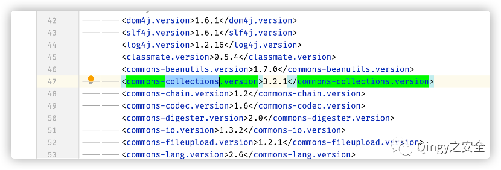

mysql 版本 <mysql.version>5.1.27</mysql.version>，可进行 jdbc 反序列化

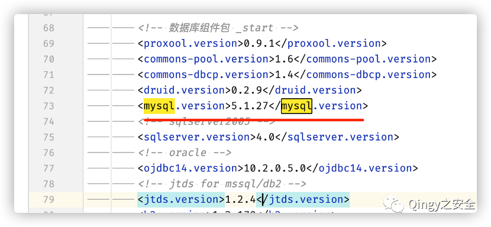

1.  漏洞代码分析
    

src/main/java/org/jeecgframework/web/system/controller/core/DynamicDataSourceController.java

此控制器可传入数据库 jdbc url、用户名、密码，因此存在 jdbc 反序列化漏洞

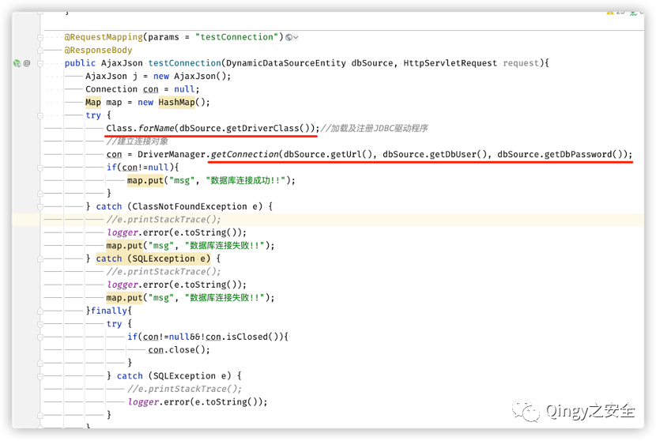

DynamicDataSourceEntity 内容：

```
src/main/java/org/jeecgframework/web/system/pojo/base/DynamicDataSourceEntity.java
```

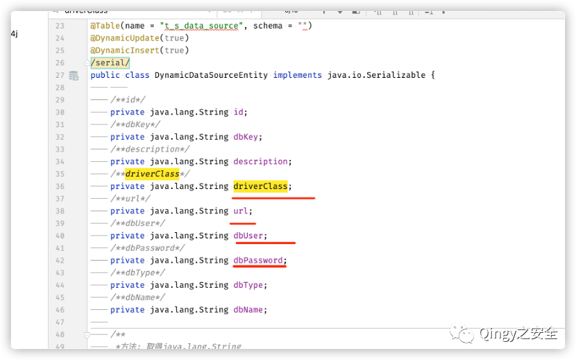

已知 jdbc url 可控，存在 jdbc 反序列化漏洞，无害验证如下

启动虚假 mysql 服务器

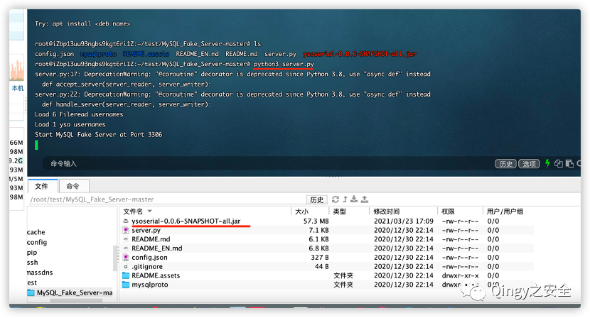

发送 payload：使用了前篇文章的未授权绕过漏洞

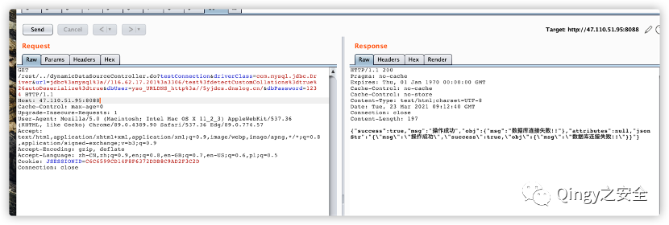

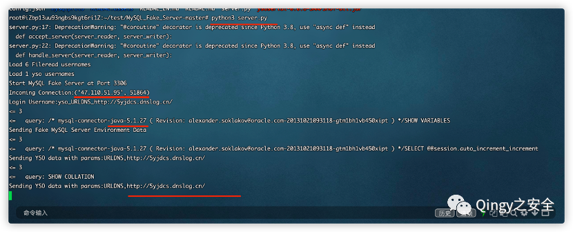

收到 dnslog 请求

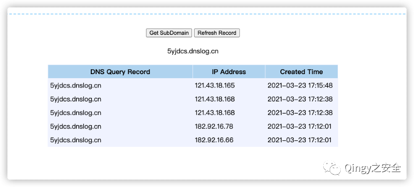

公众号

最后再给大家介绍一下漏洞库，地址：wiki.xypbk.com  

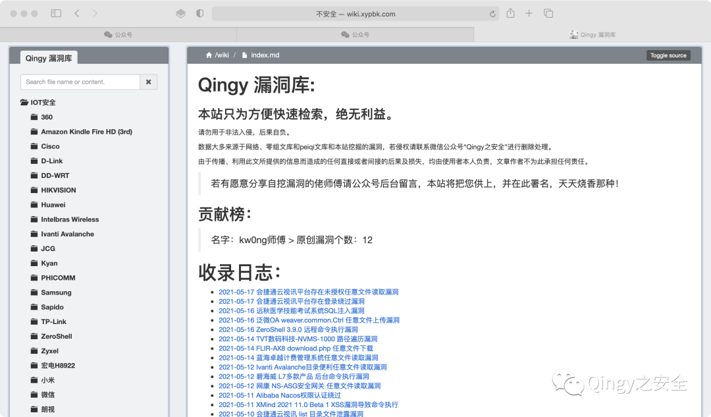

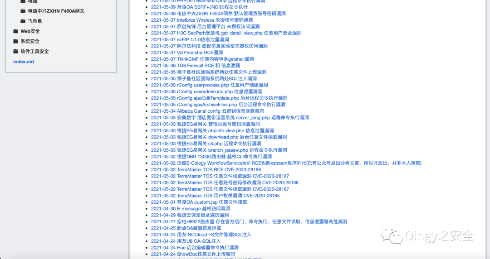

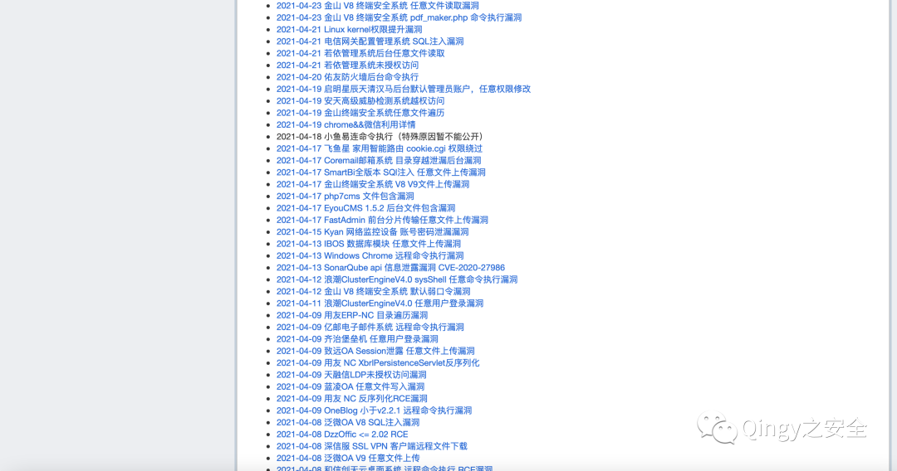

漏洞库内容来源于互联网 && 零组文库 &&peiqi 文库 && 自挖漏洞 && 乐于分享的师傅，供大家方便检索，绝无任何利益。

由于传播、利用此文所提供的信息而造成的任何直接或者间接的后果及损失，均由使用者本人负责，文章作者不为此承担任何责任。

若有愿意分享自挖漏洞的佬师傅请公众号后台留言，本站将把您供上，并在此署名，天天烧香那种！

---

> 来源：MrWQ/vulnerability-paper（https://github.com/MrWQ/vulnerability-paper）
