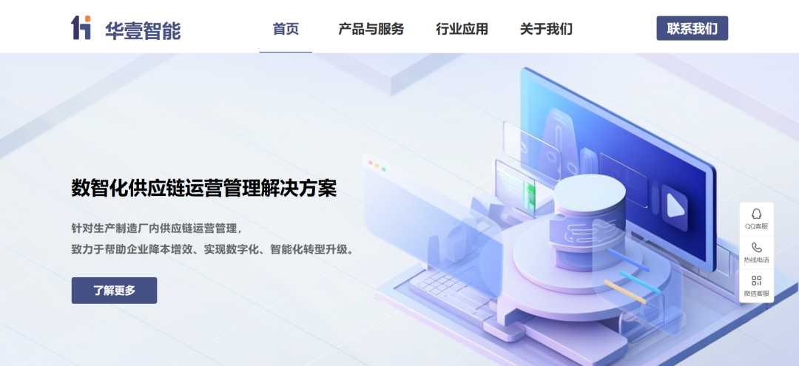

# JeeWMS 三处认证后SQL 注入通告

## 条目说明

- 对象与具体问题：JeeWMS；三处认证后SQLi通告
- 版本、配置及部署条件：版本只产品名
- 认证与权限前提：明确经认证
- 核验边界：已完成原始 Markdown 的文本审阅；未执行 PoC、未访问目标、未视检截图。来源所述影响与复现结果不等于本库独立验证。

## 证据边界与更正

以下记录原始资料的证据边界。可以由原文确定的产品、编号及格式问题已在本条修订；没有原始证据的版本、响应和补丁信息仍待核实。

- POC已公开却无链接或请求，无法内容复核
- 修复给huayi-tec首页，需核厂商/分支归属及确切补丁，不得借其他rest绕过消除认证条件

## 操作风险

现有材料未完整列明副作用；示例不保证只读或无状态变化。保留原示例供静态分析；仅可在明确授权的隔离测试环境验证，事先准备备份与回滚。

## 技术资料与来源记录

浅安  浅安安全   2025-06-04 00:00  
  
**0x00 漏洞编号**  
- # CVE-2025-5384  
  
- # CVE-2025-5386  
  
- # CVE-2025-5388  
  
**0x01 危险等级**  
- 高危  
  
**0x02 漏洞概述**  
  
JEEWMS基于JAVA的仓库管理系统，包含PDA端和WEB端，功能涵盖WMS、OMS、BMS、TMS。  
  
  
  
**0x03 漏洞详情**  
  
**CVE-2025-5384**  
  
**漏洞类型：**  
SQL注入  
  
**影响：**  
获取敏感信息  
  
**简述：**  
JEEWMS的/cgAutoListController.do?datagrid接口存在SQL注入漏洞，经身份验证的攻击者可以通过该漏洞获取数据库敏感信息。  
  
CVE-2025-5386  
  
**漏洞类型：**  
SQL注入  
  
**影响：**  
获取敏感信息  
  
**简述：**  
JEEWMS的/cgformTransController.do?transEditor接口存在SQL注入漏洞，经身份验证的攻击者可以通过该漏洞获取数据库敏感信息。  
  
CVE-2025-5388  
  
**漏洞类型：**  
SQL注入  
  
**影响：**  
获取敏感信息  
  
**简述：**  
JEEWMS的/generateController.do?dogenerate接口存在SQL注入漏洞，经身份验证的攻击者可以通过该漏洞获取数据库敏感信息。  
  
**0x04 影响版本**  
- JEEWMS  
  
**0x05****POC状态**  
- 已公开  
  
**0x06****修复建议**  
  
**目前官方已发布漏洞修复版本，建议用户升级到安全版本****：**  
  
http://www.huayi-tec.com/  
  
  
  

---

> 来源：gelusus/wxvl（微信公众号漏洞文章自动归档，原文见文首链接）
