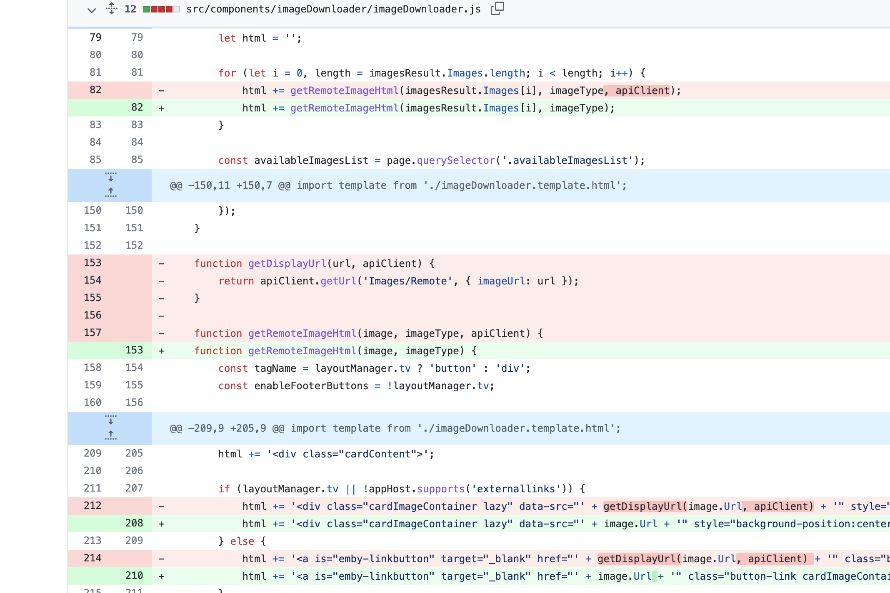
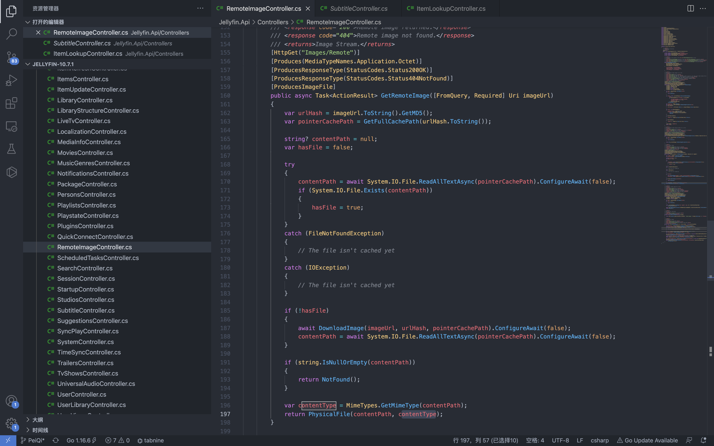
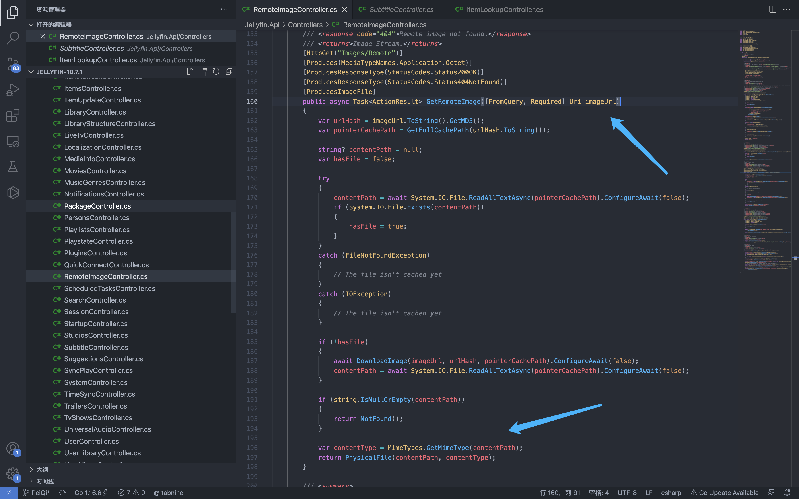
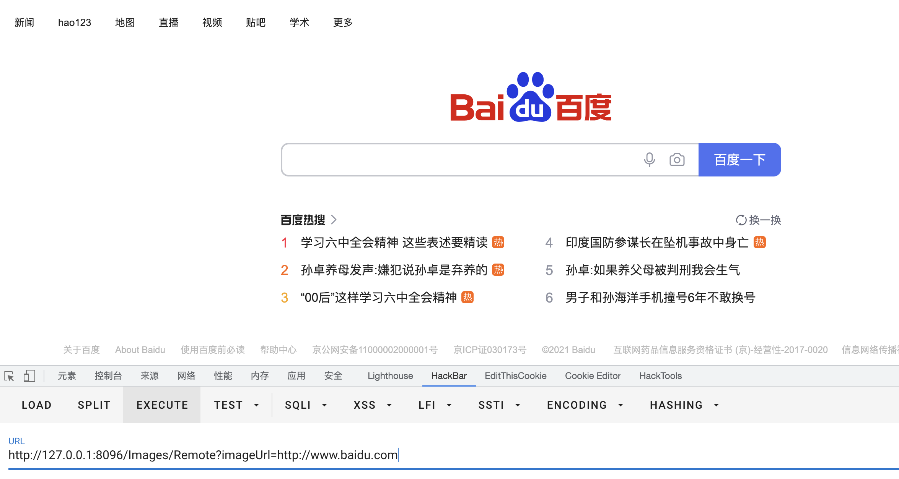

# Jellyfin RemoteImage imageUrl SSRF

## 条目说明

- 对象与具体问题：Jellyfin；RemoteImage imageUrl SSRF
- 版本、配置及部署条件：<10.7.2；出网/协议限制待核
- 认证与权限前提：未说明
- 核验边界：已完成原始 Markdown 的文本审阅；未执行 PoC、未访问目标、未视检截图。来源所述影响与复现结果不等于本库独立验证。

## 证据边界与更正

以下记录原始资料的证据边界。可以由原文确定的产品、编号及格式问题已在本条修订；没有原始证据的版本、响应和补丁信息仍待核实。

- version误抽C#文件路径；源码块为JS删除函数仅前端线索，不能直接当服务端修复充分证据
- 外网百度请求不证明内网读取范围，结果只截图
- 补官方commit/安全公告、鉴权与可用协议

## 操作风险

请求可能删除/覆盖数据、修改账号或持久改变业务状态。保留原示例供静态分析；仅可在明确授权的隔离测试环境验证，事先准备备份与回滚。凭据示例如含星号，仅保留首尾用于说明，不能直接使用。

## 技术资料与来源记录

### 漏洞描述

Jellyfin RemoteImageController.cs 文件中存在SSRF漏洞，通过构造特殊的请求，探测内网信息

### 漏洞影响

```
Jellyfin < 10.7.2
```

### 网络测绘

```
app="Jellyfin"
```

### 漏洞复现

在官方的更新文件中，查找到修改的文件




官方删除了某个方法

```
function getDisplayUrl(url, apiClient) {
        return apiClient.getUrl('Images/Remote', { imageUrl: url });
    }
```

下载漏洞版本源码，查找该接口对应的文件

```
Jellyfin.Api/Controllers/RemoteImageController.cs
```




其中接收的参数为 imageUrl ，后续的代码片段存在SSRF漏洞




构造请求POC

```
/Images/Remote?imageUrl=http://www.baidu.com
```




---

> 来源：Threekiii/Vulnerability-Wiki（https://github.com/Threekiii/Vulnerability-Wiki）
