# Microsoft Windows ShellWindows DCOM 38100跨会话本地提权

## 条目说明

- 对象与具体问题：Microsoft Windows ShellWindows DCOM；38100跨会话本地提权
- 版本、配置及部署条件：需要另一个高完整性Explorer交互会话；版本/KB未列
- 认证与权限前提：本地低权，特定管理员/UAC条件
- 核验边界：已完成原始 Markdown 的文本审阅；未执行 PoC、未访问目标、未视检截图。来源所述影响与复现结果不等于本库独立验证。

## 证据边界与更正

以下记录原始资料的证据边界。可以由原文确定的产品、编号及格式问题已在本条修订；没有原始证据的版本、响应和补丁信息仍待核实。

- 错放Ke商业软件，移Windows本地漏洞
- 保留普通会话被拒及HighIL前提，不能将所有管理员会话等同高完整性
- PoC依赖reverse.bat未给且不必要，ShellExecute只是效果层；图中安全描述无文本
- 2019-0566仅相似历史参考，缺MSRC补丁链接

## 操作风险

现有材料未完整列明副作用；示例不保证只读或无状态变化。保留原示例供静态分析；仅可在明确授权的隔离测试环境验证，事先准备备份与回滚。

## 技术资料与来源记录

 3072   2024-08-05 10:07  
  
在探索“SilverPotato”滥用的DCOM对象时，我偶然发现了“ShellWindows” DCOM应用程序。这个应用程序和“ShellBrowserWindows”一样，在进攻性安全社区中广为人知，可以通过远程实例化这些对象并具有管理员权限来进行横向移动。  
  
然而，我好奇是否普通用户可以在本地滥用它们。  
  
DCOM应用程序“ShellWindows”的应用程序ID为{9BA05972-F6A8-11CF-A442-00A0C90A8F39}，配置为以“Interactive”用户的身份运行：  
  
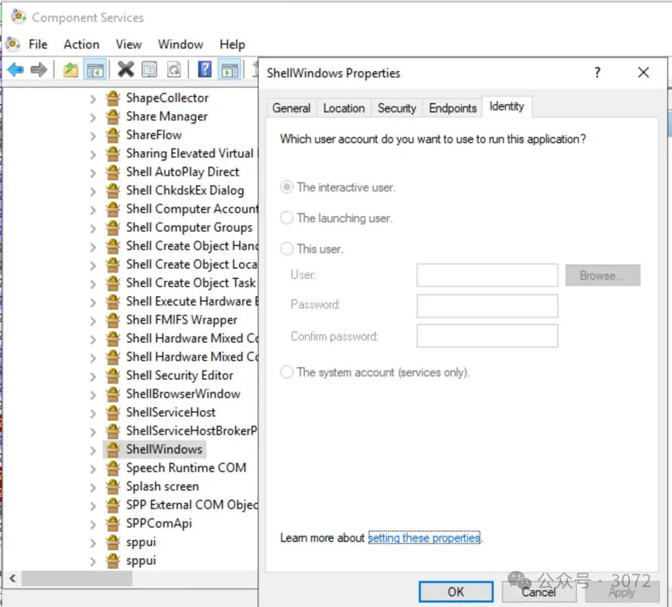  
  
图1  
  
该应用程序的权限设置为默认值，这意味着交互用户至少可以在本地启动和激活DCOM应用程序：  
  
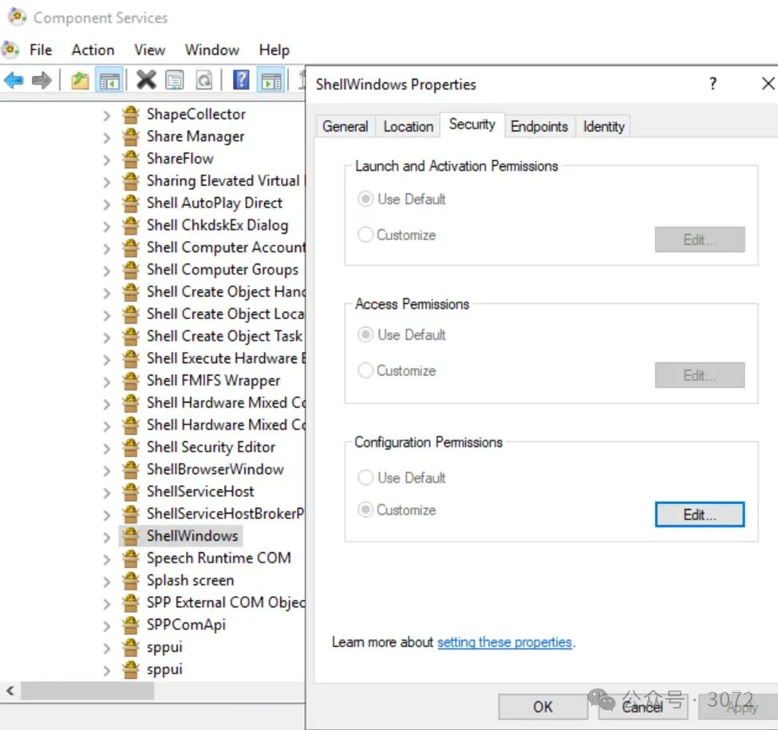  
  
图2  
  
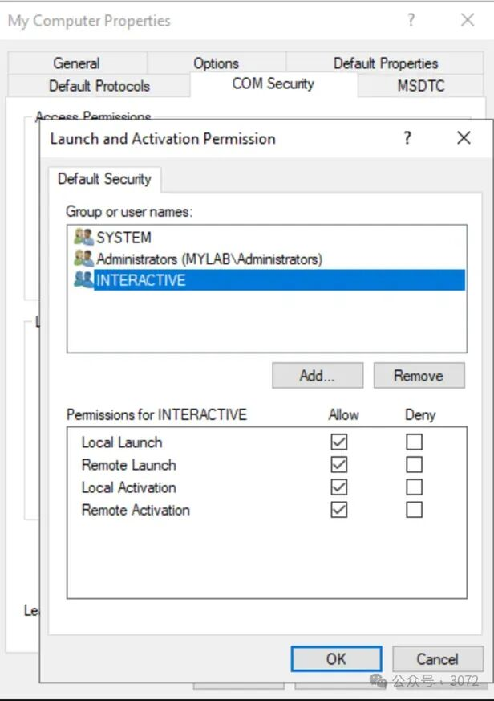  
  
图3  
  
让我们看看DCOM应用程序是如何配置的，多亏了类型库，我们可以获取很多有用的信息：  
  
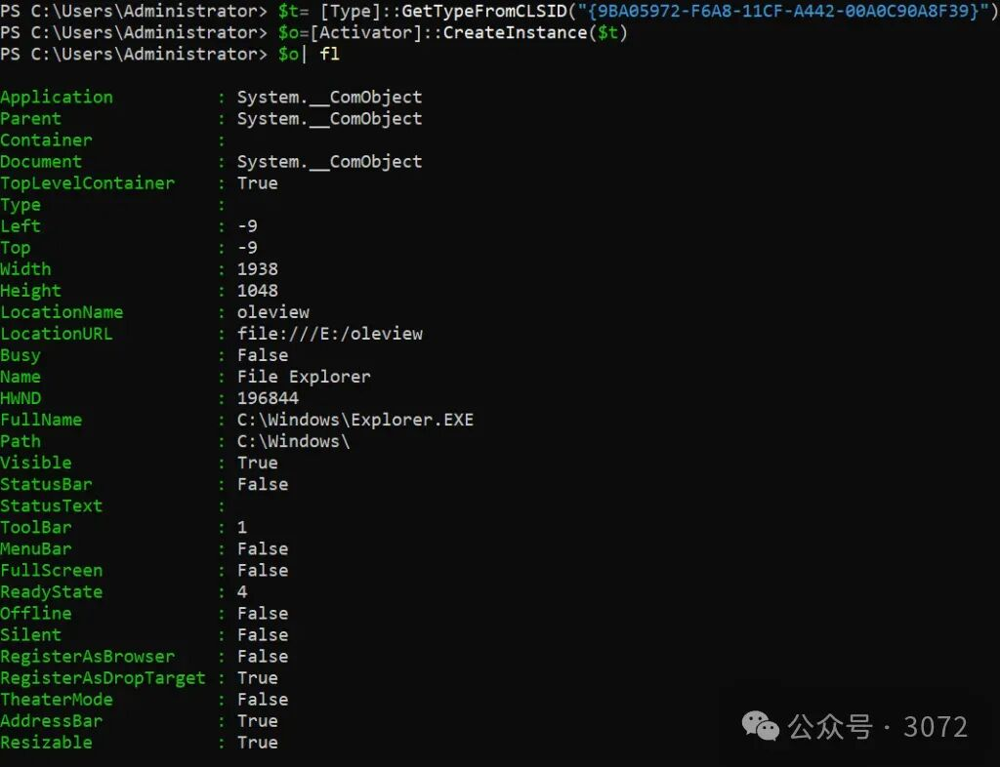  
  
图4  
  
该类由**explorer.exe**注册，激活器将使用这个。公开了几个方法：  
  
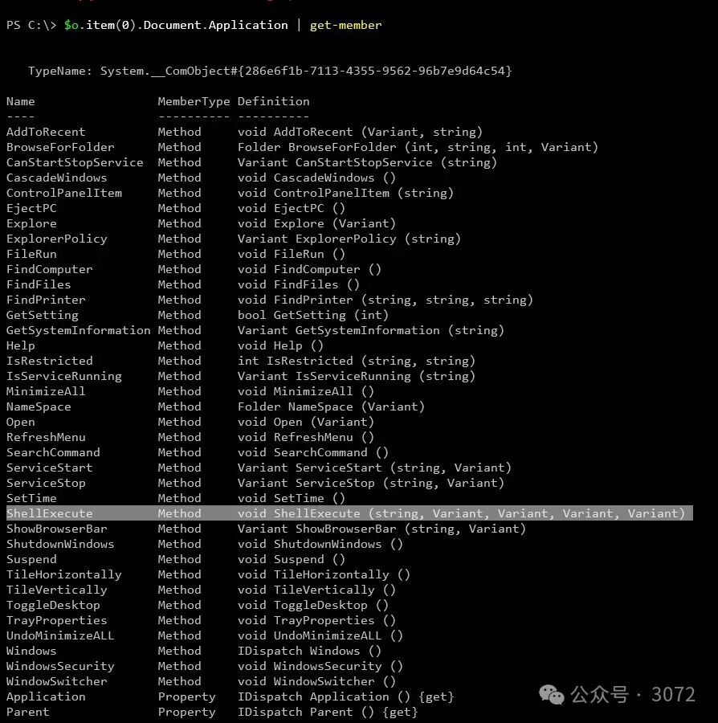  
  
图5  
  
我们要找的是*ShellExecute()*方法，因为它允许执行外部命令或应用程序。  
  
现在，借助Oleview工具，让我们看看**explorer.exe**进程中的访问安全性：  
  
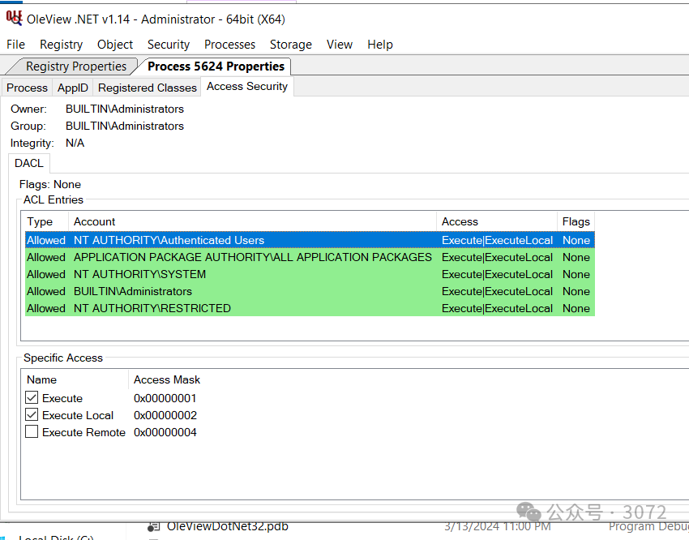  
  
图6  
  
看起来很有希望，经过身份验证的用户具有执行权限（！！！？？？）  
  
总结一下，我们有这个DCOM应用程序模拟交互用户。它由explorer进程托管，该进程授予经过身份验证的用户执行权限。  
  
现在，如果我们能执行跨会话激活，非特权用户可以代表连接到不同会话的另一个用户激活对象并调用**ShellExecute()**方法以执行任意操作？  
  
让我们在PowerShell中快速且脏地做一下 😉  
  
我们是user1，而administrator连接在会话2中。我们可以使用*BindToMoniker()调用在会话2中激活DCOM对象并执行ShellExecute()*方法，例如，从Administrator那里获取一个反向shell：  
  
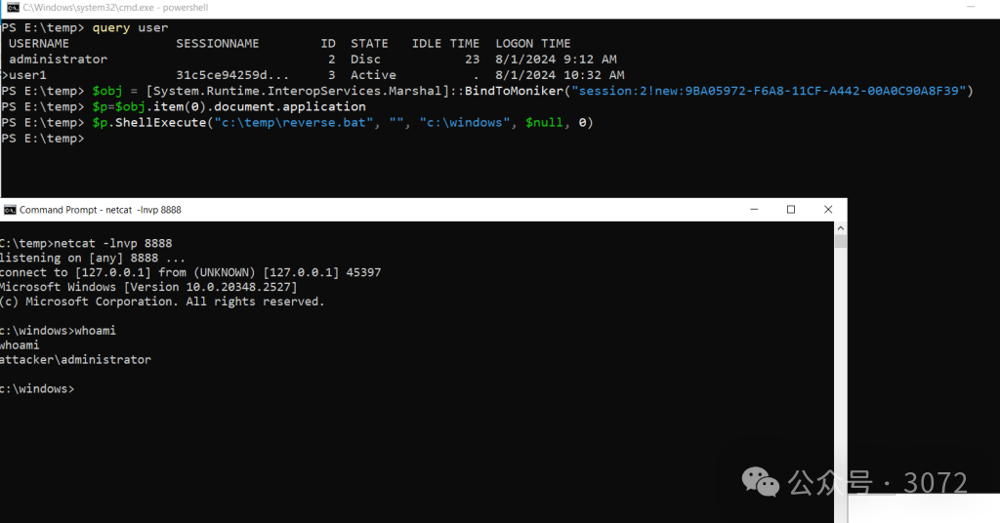  
  
图7  
  
成功了！🙂  
```
$obj = [System.Runtime.InteropServices.Marshal]::BindToMoniker("session:2!new:9BA05972-F6A8-11CF-A442-00A0C90A8F39")
$p=$obj.item(0).document.application
$p.ShellExecute("c:\temp\reverse.bat", "", "c:\windows", $null, 0)

```  
  
现在有趣的部分来了：我在另一个没有管理员权限的用户上尝试了这个方法……结果呢？  
  
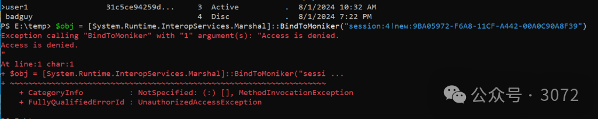  
  
图8  
  
访问被拒绝！这真的很奇怪，但对访问安全性进行快速检查解释了为什么我们会被拒绝访问：  
  
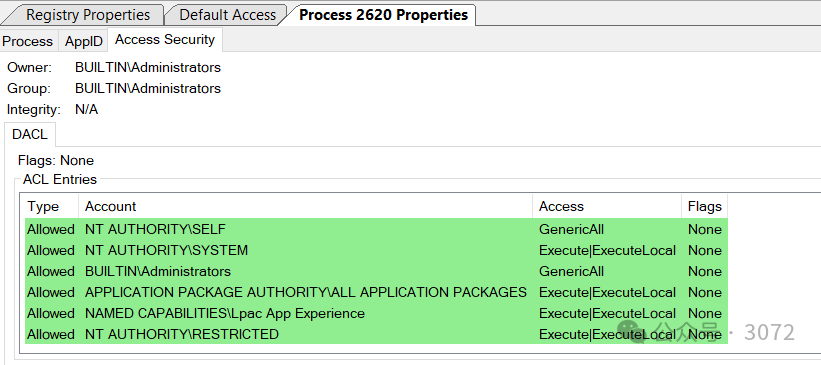  
  
图9  
  
在这种情况下，explorer进程上缺少经过身份验证的用户权限。如果进程在中等完整性级别运行，这是用户的标准行为——即使是管理员组的成员，因为启用了UAC——他们将缺少该组的权限。  
  
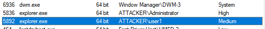  
  
图10  
  
然而，真正的管理员，禁用了UAC，所有进程都在高完整性级别（High IL）下运行，在这种情况下，这些权限被设置！  
  
这显然是一个错误。问题是，这个问题存在了多久？有可能没有人发现它吗？也许是由于高IL的限制？  
  
很难说……  
  
explorer.exe中还有其他注册的类，可能会被滥用：  
  
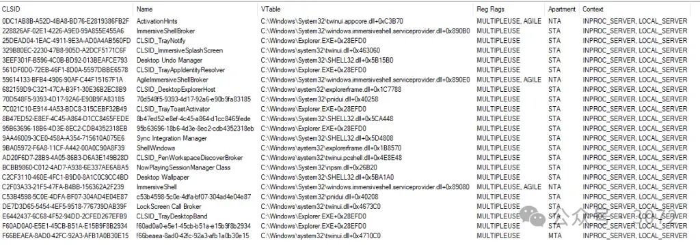  
  
图11  
  
我玩弄了Desktop Wallpaper，能够更改管理员的桌面背景图片🙂  
  
这个案例（显然）提交给了MSRC，并在2024年7月的补丁星期二中修复了这个安全漏洞，编号为CVE-2024-38100，标记为重要的本地权限提升漏洞（LPE）。  
  
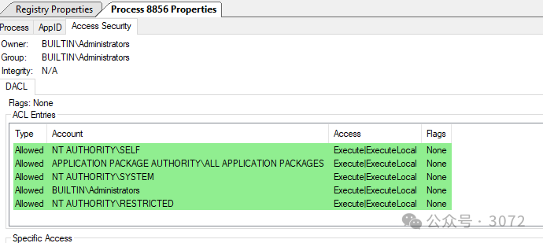  
  
图12  
  
现在，高IL下explorer.exe进程的正确设置也被应用。  
  
你可能想知道为什么我称之为“假”土豆。起初，我以为可以使用与*Potato系列相同的技术进行利用，但事实证明在这种情况下它不同且更简单🙂  
  
附带说明：这个漏洞类似于James Forshaw在2018年报告的漏洞，已在CVE-2019-0566中修复*  
  
就这些😉  
  
  


---

> 来源：gelusus/wxvl（微信公众号漏洞文章自动归档，原文见文首链接）
