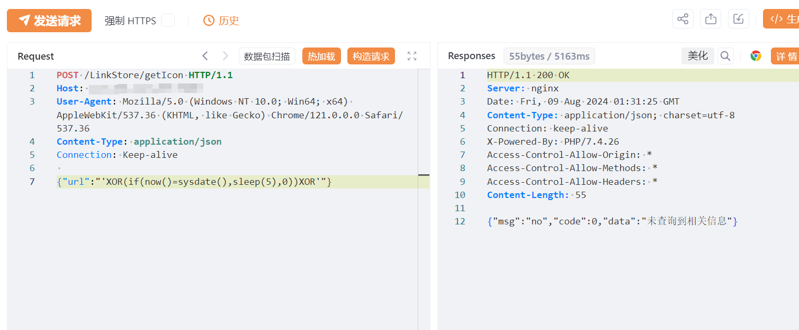
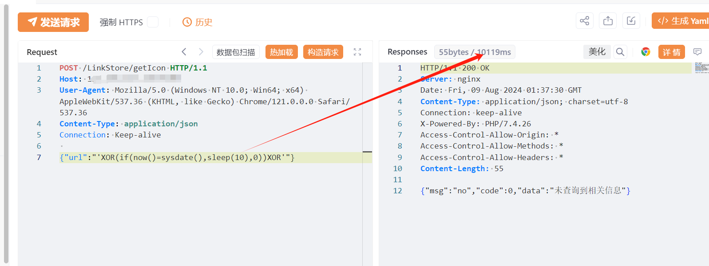
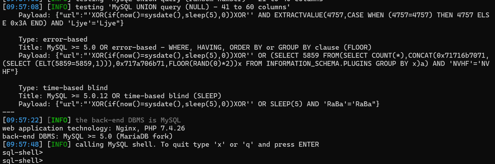

# Mtab书签 LinkStore/getIcon SQL 注入线索

## 条目说明

- 对象与具体问题：Mtab书签；LinkStore/getIcon SQLi线索
- 版本、配置及部署条件：版本未知
- 认证与权限前提：无Cookie示例
- 核验边界：已完成原始 Markdown 的文本审阅；未执行 PoC、未访问目标、未视检截图。来源所述影响与复现结果不等于本库独立验证。

## 证据边界与更正

以下记录原始资料的证据边界。可以由原文确定的产品、编号及格式问题已在本条修订；没有原始证据的版本、响应和补丁信息仍待核实。

- POST仅头无任何JSON正文，注入参数/载荷完全丢失
- 三图未视检不能代替可检索技术内容；在野/影响高无来源
- 项目主页有价值但缺具体补丁，标题应保留路径斜杠

## 操作风险

现有材料未完整列明副作用；示例不保证只读或无状态变化。保留原示例供静态分析；仅可在明确授权的隔离测试环境验证，事先准备备份与回滚。凭据示例如含星号，仅保留首尾用于说明，不能直接使用。

## 技术资料与来源记录

## 漏洞描述

Mtab书签导航程序 LinkStore/getIcon 接口存在SQL注入漏洞，未经身份验证的远程攻击者除了可以利用 SQL 注入漏洞获取数据库中的信息（例如，管理员后台密码、站点的用户个人信息）之外，甚至在高权限的情况可向服务器中写入木马，进一步获取服务器系统权限。

影响版本

Mtab书签

## **漏洞状态**

| 漏洞细节 | 漏洞POC | 漏洞EXP | 在野利用 |
|------|-------|-------|------|
| 原文提供部分细节 | 见技术资料 | 未独立核验 | 待来源核实 |

### 风险等级

| 维度 | 评价 |
|----|----|
| 威胁等级 | 高危 |
| 影响面 | 高 |
| 攻击者价值 | 高 |
| 利用难度 | 低 |

## 漏洞复现

FOFA：title="Mtab书签"

POC/EXP：

```http
POST /LinkStore/getIcon HTTP/1.1
Host: 127.0.0.1
User-Agent: Mozilla/5.0 (Windows NT 10.0; Win64; x64) AppleWebKit/537.36 (KHTML, like Gecko) Chrome/121.0.0.0 Safari/537.36
Content-Type: application/json
Connection: Keep-alive
```











## 修复方案

1. 关闭互联网暴露面或接口设置访问权限

   联系作者升级至安全版本
   
   https://github.com/tsxcw/mtab?tab=readme-ov-file


---

> 来源：SourByte05/Vulnerability-Wiki-PoC（https://github.com/SourByte05/Vulnerability-Wiki-PoC）
