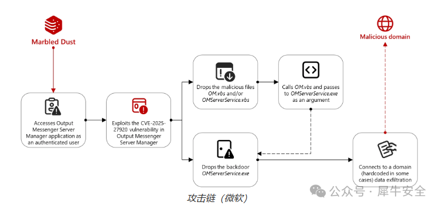

# Output Messenger 27920目录遍历攻击活动新闻

## 条目说明

- 对象与具体问题：Output Messenger；27920目录遍历攻击活动新闻
- 版本、配置及部署条件：文称2.0.63修复，12月未注明年份
- 认证与权限前提：需Server Manager认证；初始凭据取得仅推测
- 核验边界：已完成原始 Markdown 的文本审阅；未执行 PoC、未访问目标、未视检截图。来源所述影响与复现结果不等于本库独立验证。

## 证据边界与更正

以下记录原始资料的证据边界。可以由原文确定的产品、编号及格式问题已在本条修订；没有原始证据的版本、响应和补丁信息仍待核实。

- 微软评估DNS劫持/域名抢注应保留不确定措辞，勿当已证初始入口
- 六月日期中周一/去年/12月均需绝对日期；BleepingComputer仅名称无链接
- 读写路径、启动目录持久化与RCE分别说明；没有复现材料

## 操作风险

命令/代码执行示例可能改变主机状态。保留原示例供静态分析；仅可在明确授权的隔离测试环境验证，事先准备备份与回滚。

## 技术资料与来源记录

Rhinoer  犀牛安全   2025-06-16 16:00  
  
  
  
一个由土耳其支持的网络间谍组织利用零日漏洞攻击与伊拉克库尔德军队有关的 Output Messenger 用户。  
  
发现这些攻击的微软威胁情报分析师还发现了 LAN 消息传递应用程序中的安全漏洞 ( CVE-2025-27920 )，这是一个目录遍历漏洞，可以让经过身份验证的攻击者访问目标目录之外的敏感文件或在服务器的启动文件夹中部署恶意负载。  
  
应用程序开发商 Srimax 在 12 月发布的安全公告中解释道：“攻击者可以访问配置文件、敏感用户数据甚至源代码等文件，并且根据文件内容，这可能会导致进一步的攻击，包括远程代码执行。”当时该漏洞已在 Output Messenger V2.0.63 版本中得到修补。  
  
微软周一透露，该黑客组织（又名 Sea Turtle、SILICON 和 UNC1326）在获得 Output Messenger Server Manager 应用程序的访问权限后，将目标锁定在未更新系统的用户身上，并向他们感染恶意软件。  
  
在攻陷服务器后，Marbled Dust 黑客可以窃取敏感数据、访问所有用户通信、冒充用户、访问内部系统并导致运营中断。  
  
微软表示：“虽然我们目前无法了解 Marbled Dust 在每个实例中是如何获得身份验证的，但我们评估威胁行为者利用 DNS 劫持或域名抢注来拦截、记录和重复使用凭据，因为这些是 Marbled Dust 在之前观察到的恶意活动中利用的技术。 ”  
  
接下来，攻击者在受害者的设备上部署了一个后门（OMServerService.exe），该后门检查与攻击者控制的命令和控制域（api.wordinfos[.]com）的连接性，然后向攻击者提供其他信息以识别每个受害者。  
  
  
  
在一个例子中，在攻击者指示恶意软件收集文件并将其存档为 RAR 存档后不久，受害者设备上的 Output Messenger 客户端连接到与 Marbled Dust 威胁组织关联的 IP 地址，可能是为了窃取数据。  
  
Marbled Dust 以针对欧洲和中东而闻名，主要针对电信和 IT 公司以及反对土耳其政府的政府机构和组织。  
  
为了攻破基础设施提供商的网络，他们扫描互联网设备中的漏洞。他们还利用对受感染 DNS 注册中心的访问权限来更改政府机构的 DNS 服务器配置，从而拦截流量并在中间人攻击中窃取凭证。  
  
微软补充道：“此次新攻击标志着 Marbled Dust 的能力发生了显著转变，但其整体策略仍保持一致。成功利用零日漏洞表明其技术复杂程度有所提升，也可能表明 Marbled Dust 的目标优先级有所提升，或者其行动目标变得更加紧迫。”  
  
去年，Marbled Dust 还与2021 年至 2023 年期间针对荷兰组织的多起间谍活动有关，主要针对电信公司、互联网服务提供商 (ISP) 和库尔德网站。  
  
  
信息来源：B  
leepingComputer  
  

---

> 来源：gelusus/wxvl（微信公众号漏洞文章自动归档，原文见文首链接）
