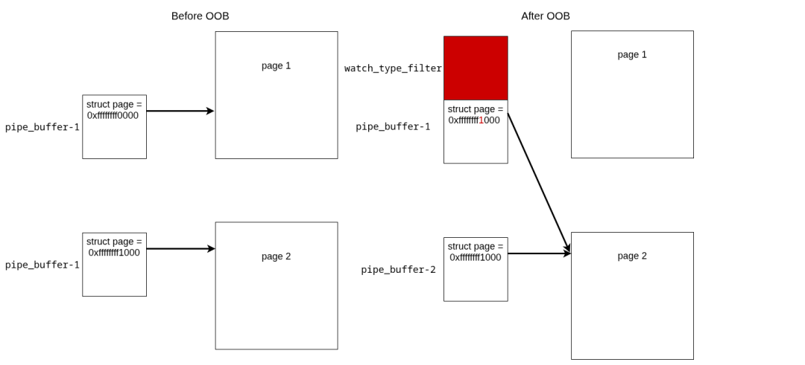
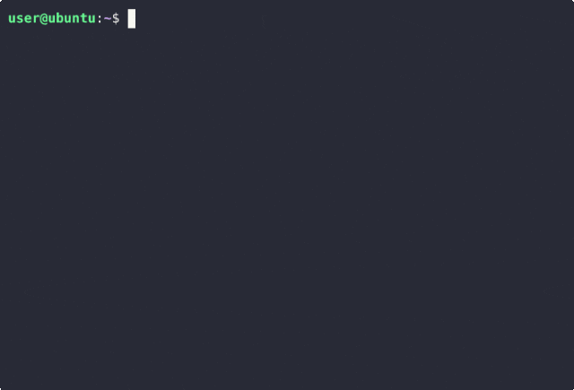

# Linux kernel watch_queue 0995越界写及PageJack利用研究

## 条目说明

- 对象与具体问题：Linux kernel watch_queue；0995越界写及PageJack利用研究
- 版本、配置及部署条件：开头称≥5.17，后实验5.13，内部矛盾；内核配置未列
- 认证与权限前提：本地执行及内核资源限制相关
- 核验边界：已完成原始 Markdown 的文本审阅；未执行 PoC、未访问目标、未视检截图。来源所述影响与复现结果不等于本库独立验证。

## 证据边界与更正

以下记录原始资料的证据边界。可以由原文确定的产品、编号及格式问题已在本条修订；没有原始证据的版本、响应和补丁信息仍待核实。

- 影响≥5.17与5.13实例直接矛盾，须核修复分支及CONFIG条件
- 类型第二边界条件>=1024会拒绝1024，正文128到1024含界表述不严谨
- 完整PoC链接只有此处[1]丢目标；代码挤单行，图/GIF未视检
- 保留堆喷非确定性及panic/冻结警告，不宜称可靠通用提权

## 操作风险

现有材料未完整列明副作用；示例不保证只读或无状态变化。保留原示例供静态分析；仅可在明确授权的隔离测试环境验证，事先准备备份与回滚。

## 技术资料与来源记录

原创 骨哥说事
                    骨哥说事  骨哥说事   2026-03-12 06:54  
  
<table><tbody><tr><td data-colwidth="557" width="557" valign="top" style="word-break: break-all;"><h1 data-selectable-paragraph="" style="white-space: normal;outline: 0px;max-width: 100%;font-family: -apple-system, system-ui, &#34;Helvetica Neue&#34;, &#34;PingFang SC&#34;, &#34;Hiragino Sans GB&#34;, &#34;Microsoft YaHei UI&#34;, &#34;Microsoft YaHei&#34;, Arial, sans-serif;letter-spacing: 0.544px;background-color: rgb(255, 255, 255);box-sizing: border-box !important;overflow-wrap: break-word !important;"><strong style="outline: 0px;max-width: 100%;box-sizing: border-box !important;overflow-wrap: break-word !important;"><span style="outline: 0px;max-width: 100%;font-size: 18px;box-sizing: border-box !important;overflow-wrap: break-word !important;"><span style="color: rgb(255, 0, 0);"><strong><span style="font-size: 15px;"><span leaf="">声明：</span></span></strong></span><span style="font-size: 15px;"></span></span></strong><span style="outline: 0px;max-width: 100%;font-size: 18px;box-sizing: border-box !important;overflow-wrap: break-word !important;"><span style="font-size: 15px;"><span leaf="">文章中涉及的程序(方法)可能带有攻击性，仅供安全研究与教学之用，读者将其信息做其他用途，由用户承担全部法律及连带责任，文章作者不承担任何法律及连带责任。</span></span></span></h1></td></tr></tbody></table>

#   
  
##   
  
****# 防走失：https://gugesay.com/archives/5417  
  
******不想错过任何消息？设置星标****↓ ↓ ↓**  
****  
##   
  
  
  
  
PageJack 是一种 Linux 内核利用技术，可用于在页分配器中制造释放后使用 (UAF) 漏洞。在本文中，我们将提供一个详细的示例，展示如何利用此技术来利用 2022 年的一个 Linux 内核漏洞。  
### 引言  
  
在本文中，我们将探讨如何使用 **PageJack**  
 来利用一个相对较旧的CVE，这是一种由 Zhiyun Qian 在 2024 年 Black Hat USA 大会上引入的现代内核利用技术。  
  
本文末尾附有完整利用代码的链接。  
### 漏洞分析 (CVE-2022-0995)  
  
CVE-2022-0995 是一个越界写入漏洞，由 Linux 内核中 **watch_queue**  
 事件通知机制的边界检查不正确导致。它影响内核版本 5.17 及更高版本，可能导致权限提升。  
### 根本原因分析  
  
在 Linux 系统中，内核需要一种机制来通知用户空间各种事件。为此，它实现了一个内部基于管道的环形缓冲区，用于存储内核生成的消息。然后，用户空间可以使用 read()  
 系统调用检索这些消息。  
  
进程可以通过 ioctl  
 指定要监视的事件源。还可以应用过滤器，以便仅传递选定的源类型和子事件，从而忽略某些类型的通知。  
  
当进程添加过滤器时，内核会调用 watch_queue_set_filter()  
 函数。然而，在内核版本 5.17 及以上版本中，此函数中的一个缺陷可能导致内核堆中发生越界写入。  
#### watch_queue_set_filter() 实现  
  
如果用户想为内核消息设置过滤器，必须提供内核将使用的过滤器列表。为此，用户需要提供两个结构体：  
```
struct watch_notification_filter {    __u32   nr_filters;    __u32   __reserved;    struct watch_notification_type_filter filters[];};struct watch_notification_type_filter {    __u32   type;    __u32   info_filter;    __u32   info_mask;    __u32   subtype_filter[8];};
```  
  
用户可以指定要应用的过滤器数量，以及每个过滤器的类型，这些过滤器通过 ioctlIOC_WATCH_QUEUE_SET_FILTER  
 传递给内核。  
  
此 ioctl  
 的内核端处理程序是 watch_queue_set_filter()  
 函数。它接受两个参数：  
- 一个 pipe_inode_info  
 结构体（代表内核中的管道）  
  
- 用户提供的过滤器列表  
  
此函数的目的是将用户空间中设置的所有过滤器复制到内核中。为此，内核首先从用户空间复制过滤器，计算用户提供的有效过滤器数量，然后将这些过滤器复制到内核堆中。  
  
这是通过两个 for  
 循环完成的。第一个循环用于**统计有效过滤器数量**  
。在此循环中，使用以下代码检查过滤器类型的有效性：if (tf[i].type >= sizeof(wfilter->type_filter) * 8)  
  
统计完有效过滤器后，该函数会分配足够的内存来存储它们。这里 kzalloc()  
 根据 nr_filter  
 的值分配一个内核对象。由于过滤器来自用户空间，我们可以控制过滤器的数量，从而控制分配的大小。  
  
在第二个 for  
 循环中，过滤器值被复制到内核堆内存中。该函数检查用户提供的过滤器类型是否有效，使用：if (tf[i].type >= sizeof(wfilter->type_filter) * BITS_PER_LONG)  
#### 越界漏洞  
  
这段代码是导致越界写入漏洞的根本原因。问题在于 sizeof(wfilter->type_filter) * BITS_PER_LONG**不等于**sizeof(wfilter->type_filter) * 8  
。具体来说，在第一个循环中，类型被检查是否小于 128，而在第二个循环中，类型被检查是否小于 1024。  
  
由于此漏洞，第二个循环可以接受一个在第一个循环中未被计入分配空间的过滤器类型。  
  
这里我们有两个越界问题：  
1. 第二个循环可以越界写入分配的对象（复制四个 __u32  
 字段），并且每次复制后 q++  
 会使指针递增。  
  
1. 第二个越界不太明显，发生在 __set_bit(q->type, wfilter->type_filter)  
 中。对应汇编指令 bts  
 将在 wfilter->type_filter  
 中位置为 q->type  
 的比特位设为 1。 q->type  
 可能取值在 128  
 到 1024  
 之间，这意味着我们可以设置超出 wfilter->type_filter  
 对象边界的一个比特位。  
  
总之，由于此越界漏洞，我们可以：  
- 在 watch_type_filter  
 结构体之外的内存中写入 0x00  
。  
  
- 将 128  
 到 1024  
 范围内的一个比特位设置为 1。  
  
### 利用方案 —— PageJack  
  
第一个漏洞允许我们将 watch_type_filter  
 结构体之后的一个字节设置为 0x00  
。这本身并不有趣。然而，第二个漏洞允许我们将一个比特位设置为 1。我们将使用 PageJack 技术来利用它。  
  
PageJack 技术通过滥用 **struct pipe_buffer**  
 在一个页（page）上制造释放后使用漏洞。  
  
为了开始利用，我们仅使用两种类型的结构：  
- watch_type_filter  
，用于触发越界条件  
  
- pipe_buffer  
，用于创建 UAF  
  
#### 创建 UAF  
  
我们将创建一个场景，其中两个不同的 pipe_buffer  
 结构指向同一个页 page  
。通过第二个漏洞，我们可以在第一个 pipe_buffer.page  
 指针中设置一个比特位，使其地址与第二个 pipe_buffer.page  
 相同（例如，将 0xffffffff0000  
 翻转为 0xffffffff1000  
），结果是两个 pipe_buffer  
 结构引用同一个页。  
  
  
  
  
图示：两个 pipe_buffer 指向同一页  
  
接着，我们需要弄清楚如何将一个 pipe_buffer  
 结构放置在 watch_type_filter  
 结构旁边。  
  
为简化利用，我们将使用 Linux 内核版本 5.13。  
### SLUB 分配器  
  
在 Linux 内核中，SLUB 分配器通过将相同大小的对象分组到缓存（kmem_cache  
）中来管理内存。每个缓存由一个或多个 slab 支持，slab 是连续的内存块（一个或多个页），分为多个固定大小的对象。  
  
当分配对象时，分配器在相应的缓存中搜索包含空闲对象的 slab，并返回其中一个对象。例如，如果我们调用 kmalloc(80, flags)  
，内核将从 kmalloc-96  
 缓存中分配内存。  
### 针对 pipe_buffer 的越界写入  
#### watch_type_filter 分配  
  
我们需要找到一种方法，使用 watch_type_filter  
 结构触发对 pipe_buffer  
 结构的越界写入。为此，两个结构必须位于同一个 slab 中，这意味着它们必须属于同一个 kmem_cache  
。换句话说，它们必须从相同的大小类别中分配。  
  
watch_type_filter  
 结构在 watch_queue_set_filter()  
 中分配：wfilter = kzalloc(struct_size(wfilter, filters, nr_filter), GFP_KERNEL);kzalloc()  
 的大小取决于 nr_filter  
 的值。由于用户可以指定 1 到 15 个有效过滤器，分配大小范围从 0x18 到 0x118。这意味着生成的对象可能落在从 kmalloc-32  
 到 kmalloc-512  
 的 slab 缓存中。  
#### pipe_buffer 分配  
  
创建管道时，内核会分配一个 pipe_inode_info  
 结构，它代表管道。此结构包含一个名为 bufs  
 的字段，它是 pipe_buffer  
 结构的数组。默认情况下，该数组包含 16 个 pipe_buffer  
 结构。然而，有一个函数 pipe_resize_ring()  
 允许我们调整一个 pipe_inode_info  
 中 pipe_buffer  
 项的数量。我们可以使用一个小程序来调整 pipe_buffer  
 数组的大小。  
  
我们的 pipe_buffer  
 和 watch_type_filter  
 结构可能  
在同一个缓存中，但这并不保证。  
### 堆喷射  
  
我们知道目标结构可能在同一缓存中，但仍需找到一种方法将它们相邻放置。更准确地说，我们需要一个 watch_type_filter  
 结构分配在 pipe_buffer  
 结构之前，才能有效地利用我们的越界写入。  
  
由于空闲列表随机化  
，我们不知道堆的确切状态以及对象分配的顺序，甚至无法保证两个对象最终会在同一缓存的同一 slab 中。  
  
为了提高成功率，我们用大量的 pipe_buffer  
 数组对象喷射内核堆。然后当我们分配 watch_type_filter  
 时，内存中的下一个对象很可能是：  
- 一个空闲对象  
  
- 一个 pipe_buffer  
 数组对象  
  
但即使进行了堆喷射，我们仍然无法保证越界写入确实会命中 pipe_buffer  
，可能需要多次运行利用程序，直到越界写入成功破坏目标结构。  
### 利用页上的 UAF  
  
现在我们需要确定攻击是否成功：即我们的某个 pipe_buffer.page  
 是否恰好在触发了越界的 watch_type_filter  
 之后，目标位原来是 0，并且新地址匹配我们打开的另一个管道。  
  
在堆喷射阶段，我们用大量管道喷射了堆。如果内存破坏成功，两个不同的管道现在可能引用同一个页。为了识别它们，我们在触发越界之前向每个管道写入了一个唯一标识符。破坏发生后，如果两个管道包含相同的标识符，我们就知道它们共享同一个页，这意味着我们找到了目标管道。  
  
一旦识别出这两个管道，我们就可以关闭其中一个，导致其 pipe_buffer  
 引用的页被释放并返回伙伴分配器。第二个管道仍然持有对该页的引用，从而为我们提供了对该页的 UAF 原语。  
  
我们的下一个目标是让伙伴分配器将这个已释放的页重新分配给一个敏感的内核对象，这样我们就可以通过悬挂的管道引用覆盖其内容。  
  
本利用程序可以针对 struct cred  
（包含进程 UID/GID 等的结构），但我们选择了 struct file  
 来探索另一种方法。如果我们在已释放的 UAF 页中放置一个 struct file  
 对象，就可以通过以只读模式打开一个敏感文件（例如 /etc/passwd  
），然后覆盖其 f_mode  
 字段以授予读/写权限并修改其内容。  
  
为了实现这一点，我们需要存储 struct file  
 对象的 slab 缓存从伙伴分配器回收我们已释放的页。方法是：通过喷射大量 struct file  
 对象（重复打开同一个文件），强制相应的 slab 缓存消耗所有可用于保存此结构的 slab。  
  
当写入 pipe_buffer.page  
 时，我们实际写入 *(page + offset)  
。不幸的是，这个偏移量不一定与 struct file  
 内的 f_mode  
 字段对齐，直接写入会破坏不相关的字段。  
  
为了解决这个问题，在触发 UAF 之前，我们仔细准备管道，写入特定数量的数据（在内核 5.13 上是 68 字节）。这确保了管道中的下一次写入恰好落在与 f_mode  
 对应的偏移量处，从而只覆盖预期的字段。  
### 结论  
  
在 Linux 内核中，即使是一个细微的漏洞结合一个约束很强的写入原语，最终也可能被用来完全控制系统。  
  
在本文中，我们探讨了名为 PageJack 的新技术如何触发页上的释放后使用漏洞。在此利用中，主要挑战在于将我们的对象放入同一个缓存。一旦达成这个条件，获得对系统的完全控制就变得相对简单了。  
  
在其他研究中，通常会使用多种结构（如 msg_msg  
 和 sk_buff  
）来获取任意读写原语，最终他们通常会创建一个 ROP/JOP 链来获取 root 权限。但正如你所见，仅使用我们的 pipe_buffer  
 结构，我们就能在不需太多步骤的情况下获得 root 权限。  
### POC 验证  
  
下面的视频演示了漏洞利用过程：  
漏洞利用程序运行中  
  
  
  
  
完整的概念验证漏洞利用代码可在  
此处[1]  
获得。  
  
**警告**  
：我们的漏洞利用程序在内核堆中设置了一个比特位为 1，但我们不确定是否翻转了正确的位。这可能导致内核恐慌或系统冻结。你的体验可能有所不同。  
  
  
原文：https://blog.quarkslab.com/pagejack-in-action-cve-2022-0995-exploit.html  
  
  
**感谢阅读，如果觉得还不错的话，动动手指给个三连吧～**  
  


---

> 来源：gelusus/wxvl（微信公众号漏洞文章自动归档，原文见文首链接）
