# PaperCut NG/MF 27350认证绕过到打印脚本执行

## 条目说明

- 对象与具体问题：PaperCut NG/MF；27350认证绕过到打印脚本执行
- 版本、配置及部署条件：实验NG17.4.4 Windows Server2016；≤22.0.9笼统范围
- 认证与权限前提：SetupCompleted绕过后管理员配置
- 核验边界：已完成原始 Markdown 的文本审阅；未执行 PoC、未访问目标、未视检截图。来源所述影响与复现结果不等于本库独立验证。

## 证据边界与更正

以下记录原始资料的证据边界。可以由原文确定的产品、编号及格式问题已在本条修订；没有原始证据的版本、响应和补丁信息仍待核实。

- CVE-20230=-27350排版错误；需补分支修复版本而非所有旧版本一概而论
- 关键HTTP请求/脚本在图片，正文无可核对请求及响应
- 启用脚本和打印机编号依赖部署，SYSTEM是测试服务身份
- 暴露850实例称850打印机混淆；在野Clop/Microsoft和Juniper研究应给直接来源
- 删书籍广告，補修复章节

## 操作风险

现有材料未完整列明副作用；示例不保证只读或无状态变化。保留原示例供静态分析；仅可在明确授权的隔离测试环境验证，事先准备备份与回滚。

## 技术资料与来源记录

> 本文由 [简悦 SimpRead](http://ksria.com/simpread/) 转码， 原文地址 [mp.weixin.qq.com](https://mp.weixin.qq.com/s/EUNCjUTlMRYrruWXpGUsXg)

PaperCut 是一款企业打印管理软件，有 PaperCut NG 与 PaperCut MF 两款软件。除了管理打印之外，也可以通过硬件集成来管理扫描、复印与传真。

PaperCut MF 与 PaperCut NG 中发现了远程执行代码漏洞，影响 22.0.9 以及更早版本。该漏洞被确定为 CVE-2023-27350，CVSS 评分为 9.8。

漏洞详情
----

PaperCut 是使用 Java 开发的，专门为多服务器与跨平台而设计。典型使用场景中，一个主 PaperCut 服务器结合其他几台辅助服务器。辅助服务器上只运行轻量级监视组件，开启 9191 端口通过基于 HTTP 的 Web 服务于主服务器进行通信。

研究人员发现该软件存在 CVE-2023-27350 漏洞，该漏洞由于 SetupCompleted 类中的访问控制不当造成。

在野利用
----

几乎每个组织都有网络打印机，但只有极少的打印机直接暴露在互联网上。通过 Shodan 搜索，大概有 850 个 PaperCut 管理的打印机暴露在互联网上。

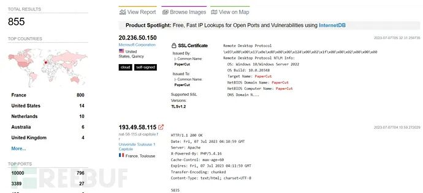全球分布情况

下图显示了在野的攻击利用尝试情况：

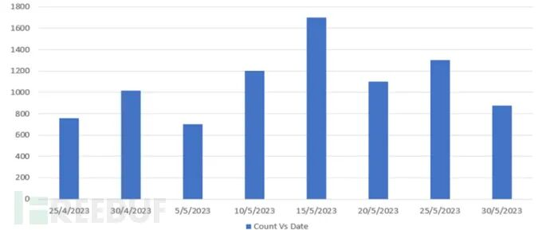在野攻击情况

微软也发现 Lace Tempest 开始使用 PaperCut 的漏洞传播 Clop 勒索软件。

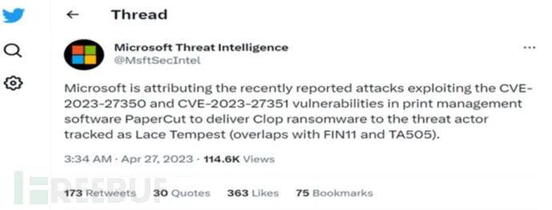微软披露信息

漏洞利用分析
------

为了更好地了解 PaperCut 的漏洞，针对 SetupCompleted.java 进行了反编译。可以看到，代码使用管理员权限调用了 performLogin 方法，但并没有提供任何管理员权限凭据。

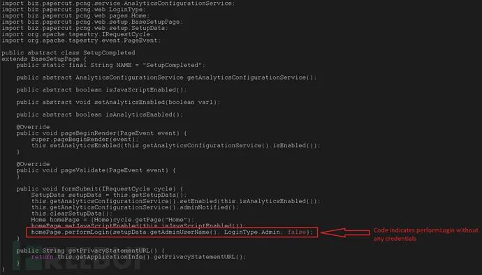登录功能代码

对文件进一步分析可知，performLogin 函数允许在没有任何凭据的情况下以管理员权限进行访问，从而使攻击者可以绕过身份验证。

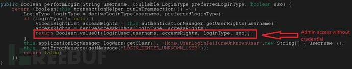凭据绕过

为了证实分析结果，检查了 PerformLogin 函数。确认只要用户尝试登就会调用 loginUser 函数，即可通过凭据绕过获取管理员权限。

漏洞利用步骤
------

研究人员部署了测试环境进行分析，在 Windows Server 2016 上运行的 Papercut NG 17.4.4。

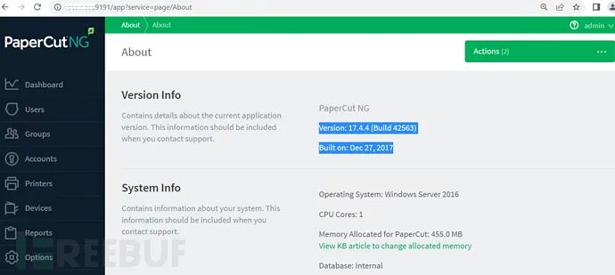测试环境部署

#### 步骤 1

攻击者执行 POC 时，首先利用 CVE-20230=-27350 绕过身份验证并登录 PaperCut。网络请求如下所示，此时即为准备阶段已经完成。

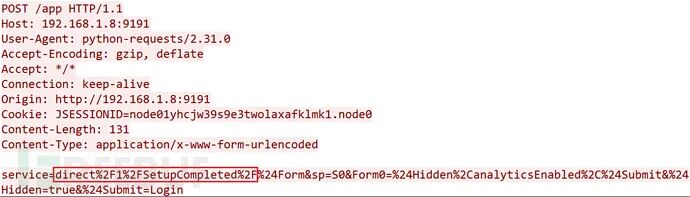攻击准备阶段

应用程序会将攻击者重定向到 /app?service=page/Dashboard 的页面，如下所示。

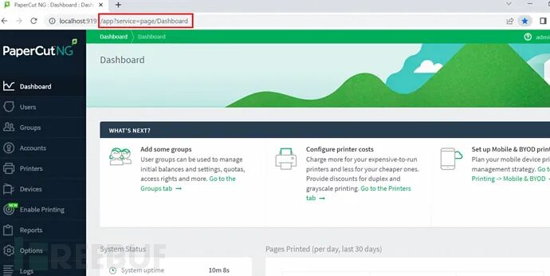跳转页面

网络请求如下所示：

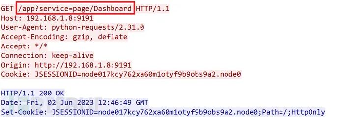网络请求

#### 步骤 2

攻击者继续发送 HTTP POST 请求更新设置并启用脚本：

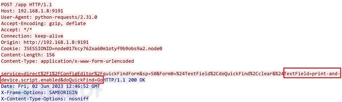启用脚本

#### 步骤 3

启用脚本后，POC 会搜索所有打印机。如下所示，发现了 ID 为 l1001 的打印机：

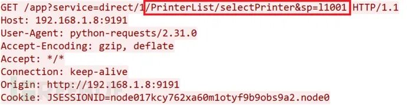可用打印机列表

#### 步骤 4

找到打印机的详细信息后，攻击者就可以执行远程代码了。如下所示，执行 calc.exe 作为示例：

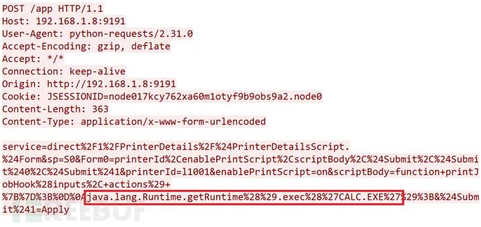恶意代码执行

脚本执行后，可以看到 calc.exe 会被调用打开。

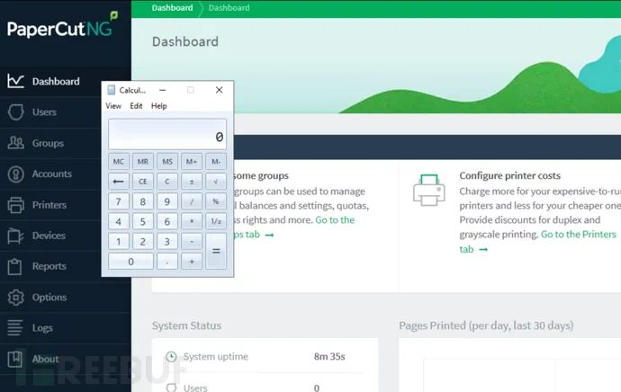远程代码执行成功

在 Process Explorer 中也能够看到该进程成功执行：

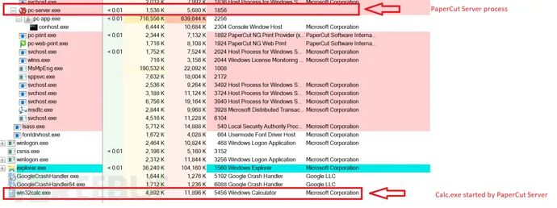Process Explorer

pc-server.exe 与 win32calc.exe 都是由用户 NT AUTHORITY\SYSTEM 执行的，两个可执行文件都是从同一目录下运行的：

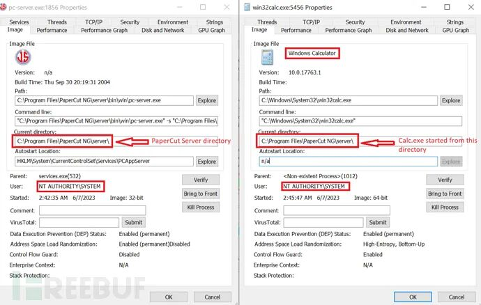子进程计算器

尽管研究人员只是执行了计算器，但攻击者会执行更多其他的恶意攻击。例如执行 PowerShell 脚本建立反向 Shell，或者像微软发现的部署勒索软件。

该漏洞是由于对名为 SetupCompleted 的 Java 类的访问控制不当导致的，理论上只有管理员与本地用户才能访问该类。由于缺少访问控制检查，网络上的任何用户都可以远程访问该文件，从而导致远程代码执行。

参考来源
----

> Juniper

本文作者：Avenger， 转载请注明来自 FreeBuf.COM

**关 注 有 礼**

  

  

欢迎关注公众号：网络安全者

1、[送书规则](https://mp.weixin.qq.com/s?__biz=MzI4MDQ5MjY1Mg==&mid=2247507566&idx=2&sn=34a347f9cb0dffb48a610ff408b67aa2&chksm=ebb5316ddcc2b87b602fd3c6770b05d5978380903584884c34ac2e3072c560d340619a87a9f6&scene=21#wechat_redirect)

2、今日送书《Python 全栈开发——数据分析》

本文内容来自网络，如有侵权请联系删除

---

> 来源：MrWQ/vulnerability-paper（https://github.com/MrWQ/vulnerability-paper）
