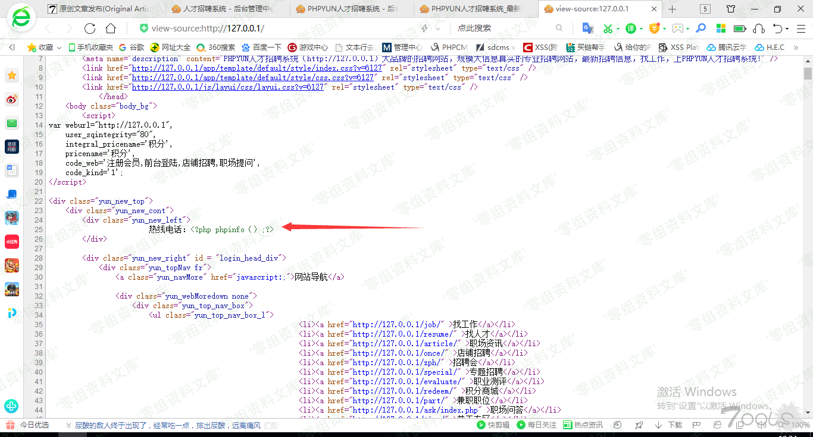
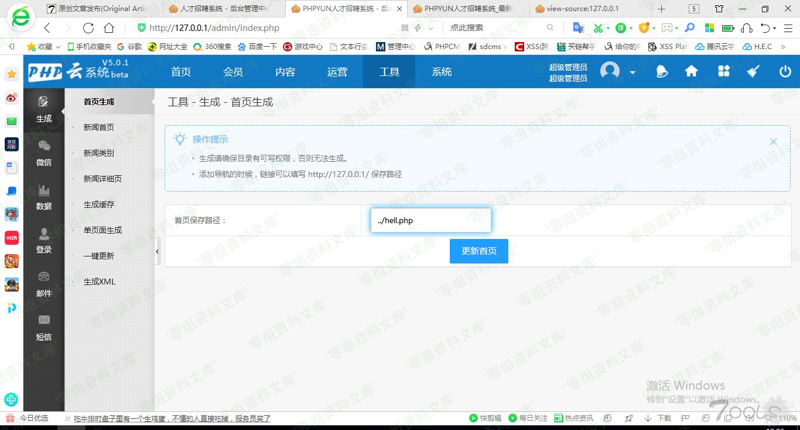
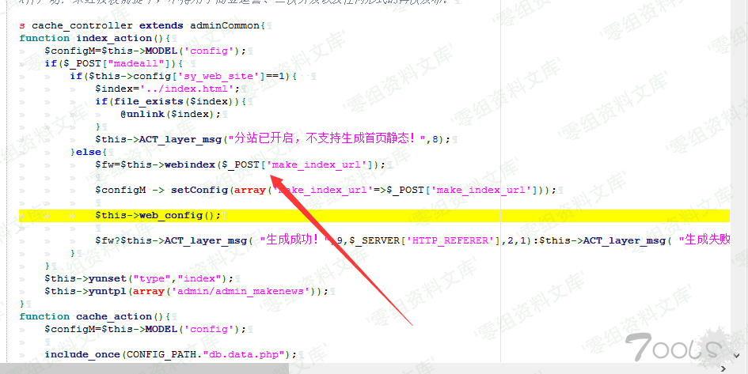
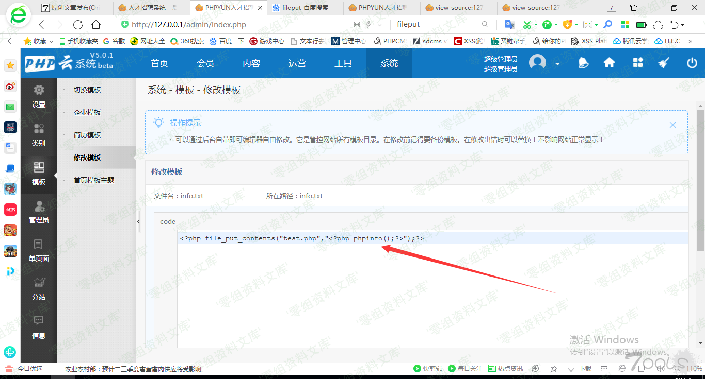
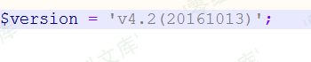
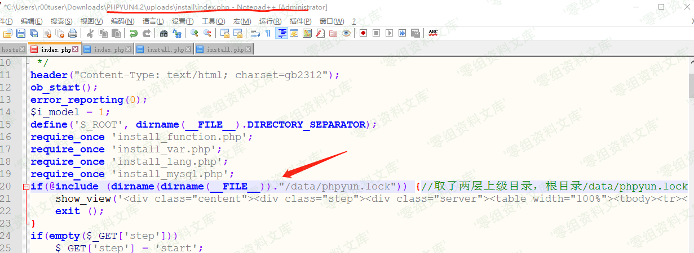
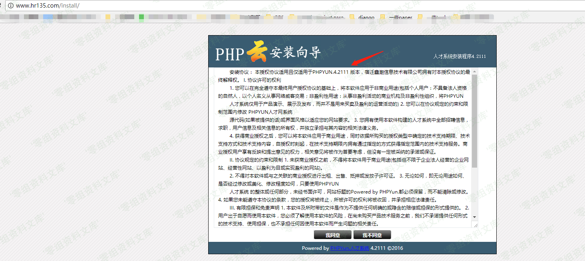
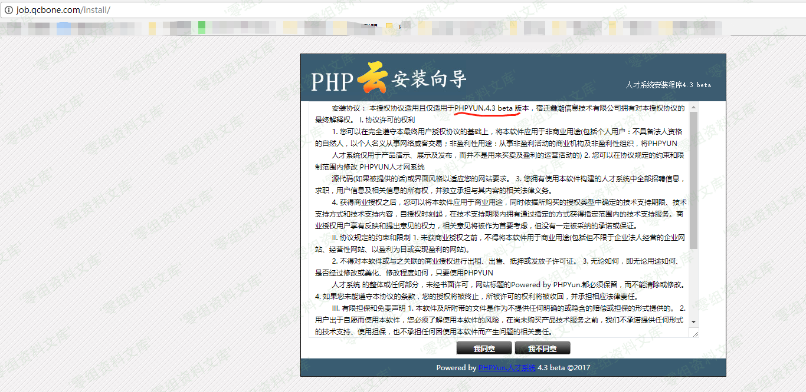

# PHPYun 安装锁路径错误允许重装

## 条目说明

- 对象与具体问题：PHPYun；安装锁路径错误允许重装
- 版本、配置及部署条件：部分4.2/4.3/4.5；以PHP5分析，PHP7未证
- 认证与权限前提：安装端点匿名声称
- 核验边界：已完成原始 Markdown 的文本审阅；未执行 PoC、未访问目标、未视检截图。来源所述影响与复现结果不等于本库独立验证。

## 证据边界与更正

以下记录原始资料的证据边界。可以由原文确定的产品、编号及格式问题已在本条修订；没有原始证据的版本、响应和补丁信息仍待核实。

- 创建data/phpyun.lock与检查install/data/phpyun.lock差异清晰，但关键源代码仅图片
- 多处图片指向5.0.1/3.1其他文章资源且尾巴重复路径，需核图内容不能当缺图
- 4.2最终版/4.2111等版本描述含混，保留已测构建号而非全部范围
- 重装覆盖数据副作用需警示；简介空白

## 操作风险

请求可能删除/覆盖数据、修改账号或持久改变业务状态。保留原示例供静态分析；仅可在明确授权的隔离测试环境验证，事先准备备份与回滚。凭据示例如含星号，仅保留首尾用于说明，不能直接使用。

## 技术资料与来源记录

一、漏洞简介
------------

二、漏洞影响
------------

经测试该漏洞影响从4.3到 4.5
所有版本，4.2部分版本受影响，4.2最终版本不受影响。具体情况请自行测试。

三、复现过程
------------

#### 漏洞分析

看到install 文件夹里的index.php，这里分php5,php7两种情况进行调用安装。

以php5为例。

文件 根目录/install/php5/install.php 代码中：

先判断了是否存在lock文件，存在即退出安装。

4.34.5系统重装漏洞/media/rId25.png)

其中S\_ROOT这个常量是在前面index.php文件中定义的。

4.34.5系统重装漏洞/media/rId26.png)

取得是当前文件的绝对路径。拼接起来，检测的lock文件位置应该是
根目录/install/data/phpyun.lock。

这里没什么问题。

按照正常安装走完，看到最后一步

4.34.5系统重装漏洞/media/rId27.png)

创建lock文件，这里用的是相对路径。install.php是被index.php
用require的模式调用的。

取得路径应该是 根目录/install/，按照上图的路径创造的lock文件应该是放至于
根目录/data/phpyun.lock。

**创建的lock文件路径是 根目录/data/phpyun.lock，检测的路径却是
根目录/install/data/phpyun.lock**

那么一个重装的安全隐患就埋下了。

当用户安装完成之后，是可以被无限重装的，因为这个路径错误问题。

以本地phpyun4.3 已经安装完成系统为例，是可以被重装的。

4.34.5系统重装漏洞/media/rId28.png)

最新版phpyun 4.5这里的代码和4.3是一样的。

4.34.5系统重装漏洞/media/rId29.png)

phpyun 4.2 版本处理逻辑不一样，这个版本不受影响。

4.34.5系统重装漏洞/media/rId30.png)

4.34.5系统重装漏洞/media/rId31.png)

**经测试phpyun 4.2某些版本依旧是受影响的。**

#### 版本测试

网上一些系统：

##### 官方测试站，版本phpyun 4.2111：

4.34.5系统重装漏洞/media/rId34.png)

##### 某招聘网，版本phpyun 4.3

4.34.5系统重装漏洞/media/rId36.png)

参考链接
--------

> <https://www.cnblogs.com/r00tuser/p/8533517.html>
